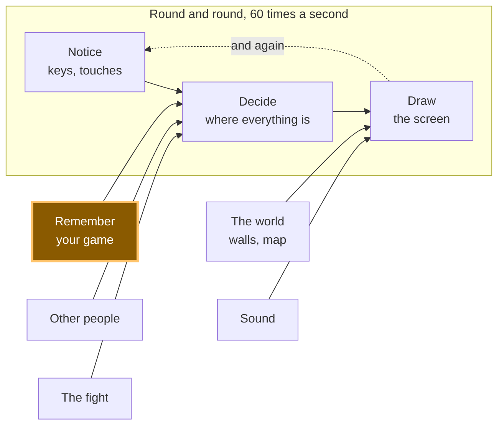

# A11: ゲームをセーブする

今のところ、タブを閉じるとゲームはすべてを忘れてしまいます。このステップを終えるまでに、ゲームはあなたの四角がどこにあったか、そしてあなたの名前を覚えるようになります — そして、あなたのゲームの古いバージョンによって書かれたセーブファイルにも対応できるようになります。
{: .lesson-intro }

**必要なもの:** [A10](a10.html)。 **得られるもの:** 前回置いた場所に戻ってくる四角（その上にあなたの名前が表示される）。

## ゲーム全体と今日の要素



今日は、側面に「**ゲームを記憶する**」という箱を作ります。これは中央に情報を供給します。ページが起動すると、「決定」に開始位置を渡します。

## ブロックに分割する

「ゲームをセーブする」は一つのことのように聞こえますが、実際には三つの要素から成ります。

1. **書き込み** — ページが閉じても残る場所に位置と名前を保存する
2. **読み込み** — ページが再び起動したときにそれらを取り戻す
3. **対処** — 読み戻したデータが古い、壊れている、または存在しない場合に対処する

**なぜ分割するのか？** これら三つは完全に異なる方法で失敗し、異なるタイミングで失敗するからです。書き込みは今、あなたが見ているときに失敗します。読み込みはページが起動するときに失敗します。対処は、誰かのコンピューターで、いつか、彼らがずっと前にプレイしたゲームを開いたときに失敗します。

もしそれが一つの塊で問題が発生した場合、どの部分が間違っているのかを特定できません。何も書き込まれていないのか？書き込まれたが一度も読み込まれていないのか？読み込まれたが捨てられたのか？三つのブロック、三つの異なる問題です。

ブロック3は、ほとんどの人が飛ばす部分です。それがこのステップの全体的なポイントです。

## ブロック1：書き込み

ブラウザは、すべてのウェブサイトにテキストを保存できる小さな引き出しを提供します。それは**localStorage**と呼ばれ、タブを閉じてもそこに保存したものは残ります。テキストしか保存できないため、まずオブジェクトをテキストに変換します。

```
const KEY = 'kakkoi-save';   // one name in the drawer, one save
const VERSION = 2;           // stamped on everything we write

function save() {
  const data = { version: VERSION, name: player.name, x: player.x, y: player.y };
  localStorage.setItem(KEY, JSON.stringify(data));
}
setInterval(save, 500);
```

`JSON.stringify`はオブジェクトをテキストに変換します。**JSON**は、オブジェクトを文字として書き下す方法であり、どこかに保存したり送信したりできるようにするためのものです。

`setInterval(save, 500)`は`save`を**1秒間に2回**実行します。すべてのフレームではありません。

> **なぜ毎フレームではないのか？** あなたの四角は1秒間に60回動きます。1秒間に60回タブを閉じる人はいません。毎フレーム保存するということは、全く同じ結果（前回置いた場所に戻るゲーム）に対して60倍の作業を行うことになります。1秒間に2回であれば、最大で0.5秒の移動しか失われません — そして0.5秒の移動は取るに足らないことです。

保存されたオブジェクトに含まれる`version`番号に注目してください。まだ何も使っていませんが、ブロック3で使われます。

## ブロック2：読み込み

```
function read() {
  const text = localStorage.getItem(KEY);
  if (text === null) return null;
  return JSON.parse(text);
}
```

`getItem`は、保存したテキストを返します。その名前で何も保存されていなければ`null`を返します。`JSON.parse`は`JSON.stringify`の逆で、テキストをオブジェクトに戻します。

このブロックは一つのことだけを行い、それ以外は何もしません。見つけたものについてどうすべきかを決定することはありません。

## ブロック3：対処

このブロックが必要になる事実をここに示します。

**セーブデータは、それを書いたコードよりも長生きします。** あなたはゲームを変更するでしょう。誰かのブラウザに残っているセーブデータは、あなたのゲームの*古い*バージョンによって書かれたものです。名前を後で追加したため、名前が含まれていないかもしれません。書き込みの途中でコンピューターが閉じられたため、途中で書かれたものかもしれません。それはもはやあなたの管理下にはありません。

したがって、すべての悪いケースは同じ方法で終わります。クラッシュする代わりに、最初からやり直すのです。

```
function fresh() {
  return { x: 100, y: 100, name: '' };
}

function load() {
  let data;
  try {
    data = read();
  } catch (err) {
    console.warn('save is not readable, starting fresh:', err.message);
    return fresh();
  }
  if (data === null) return fresh();
  if (data.version !== VERSION) {
    console.warn('save is version', data.version, 'and we speak', VERSION, '- starting fresh');
    return fresh();
  }
  if (typeof data.x !== 'number' || typeof data.y !== 'number') {
    return fresh();
  }
  return { x: data.x, y: data.y, name: String(data.name || '') };
}

const player = load();
```

`try`は「これを試みる」を意味します。`catch`は「そして、もしそれが爆発したら、ページ全体を停止させる代わりにこれを実行する」を意味します。`JSON.parse`は、テキストが適切なJSONでない瞬間にスロー（爆発）し、`catch`がなければ、あなたのゲーム全体は一度もフレームを描画する前に停止してしまいます。

四つのことが間違っている可能性があり、それぞれが一行で処理されます。読めないテキスト、全く保存されていない場合、古いバージョンからのセーブデータ、位置情報が含まれていないセーブデータ。

これは、書いているときは退屈に感じる部分です。しかし、実際の人がゲームを失うのを防ぐ部分なのです。

## なぜこの方法をとったのか

バージョン番号は強制的な制約です。それがないと、古いセーブデータは*静かに*間違ったものとなります。正常にパースされ、数値が含まれているため、新しいコードはそこから静かに壊れたプレイヤーを構築してしまいます — そして、すべてが正常に見えるため、そのバグを何時間も追いかけることになるでしょう。すべてのセーブデータに番号が刻印されていれば、「これは古いゲームからのものだ」ということをコードが簡単に認識し、対処できるようになります。後のステップで保存する内容を変更するときは、`VERSION`を1つ増やし、すべての古いセーブデータは丁寧にお役御免となります。

## 代わりにできたこと

| これの代わりに | 代償 |
|---|---|
| 毎フレーム保存する | 誰も区別できない結果のために、1秒間に2回ではなく60回の書き込み。ストレージは無料ではなく、ブラウザはその都度実際の作業を行います。 |
| ページを閉じる時だけ保存する | ブラウザは警告なしにタブを強制終了する可能性があります — クラッシュ、低バッテリー、アプリをスワイプして閉じるなど。場合によっては、終了コードが実行されず、セッション全体が失われます。 |
| バージョン番号がない | 古いセーブデータは正常にパースされ、誤ったプレイヤーを生成します。バグはセーブデータの問題ではなく移動の問題のように見え、誤った場所を探すことになります。 |
| xとyを別々のキーで保存する | 1回ではなく2回の書き込み。コンピューターがそれらの間に停止すると、半分が古く半分が新しいセーブデータとなり — 四角はこれまで一度もなかった場所にジャンプします。 |

## プロンプト

```
I have a canvas game in plain JavaScript. The player is an object with x, y and
name. Add saving to localStorage under one key, as one JSON object, written
twice a second with setInterval. On startup, load it. Put a version number in
the saved object and handle three bad cases separately: nothing saved yet,
text that is not valid JSON, and a save whose version is not the current one.
In every bad case start from default values and never throw. Keep write, read
and cope as three separate functions.
```

**出力の確認点:** 実際に`JSON.parse`を`try`/`catch`で囲んでいるか、それとも`null`のチェックだけか？これらは異なる失敗であり、`null`チェックで捕捉されるのはそのうちの一つだけです。バージョンチェックは`!==`で比較しているか、それとも*古い*バージョンだけを処理し、まだ存在しないバージョンからのセーブデータを忘れていないか？そして、タイマーではなくゲームループの毎フレームで保存しているか — アシスタントは一行短くなるため、そうすることがよくあります。

## 動作を確認する


Live Serverでページを開き、以下を実行します。

1. ボックスに名前を入力します。それが四角の上に表示されます。
2. **まずキャンバスをクリックし**、それから矢印キーを押し続けます。（名前ボックスがキーボードを占有している間は、矢印キーがゲームではなくボックスに入力されます。これは意図的なものです。）
3. ページをリロードします。四角は同じ場所にあり、名前もボックスに残っています。私たちは四角を`{x: 253.98, y: 177}`に移動させ、リロードすると、`Mika`という名前で`{x: 253.98, y: 177}`に戻ってきました。
4. ブラウザのコンソールを開き、`localStorage.setItem('kakkoi-save', '{{{')`を実行し、リロードします。ページは引き続き動作します。四角は`{x: 100, y: 100}`から新しく開始され、コンソールには*save is not readable, starting fresh: Expected property name or '}' in JSON at position 1*と表示されます。
5. 次に、`localStorage.setItem('kakkoi-save', JSON.stringify({ version: 1, name: 'Old Mika', x: 300, y: 40 }))`を実行してリロードします。再び四角は新しく開始され、コンソールには*save is version 1 and we speak 2*と表示されます。これはブロック3がその役割を果たしているのです — そのセーブデータ内の位置`300, 40`は意図的に破棄されました。
6. いずれかの後で再度移動してみてください。まだ動きます。壊れたセーブデータによって何も壊れていません。

ステップ4と5が本当のテストです。乱用しないセーブファイルは、テストされていないセーブファイルです。

## ゲームに組み込む

[A10](a10.html)からゲームを取り出します。三つの関数を追加し、`const player = { x: 100, y: 100 }`を`const player = load()`に置き換え、キャンバスの下に`<input id="name">`を一つ追加します。`draw`に一行追加して名前が四角の上に描画されるようにし、キーハンドラにガードを追加して名前入力が操作に影響しないようにします。

```
addEventListener('keydown', (e) => { if (e.target !== nameBox) held.add(e.key); });
```

<div class="takeaways">
<h2>重要なポイント</h2>
<ul>
<li>セーブは一つの仕事ではなく、三つの仕事です：書き込む、読み戻す、読み戻したデータに対処する</li>
<li>毎フレームではなく、タイマーで保存する — 毎秒58回の余分な書き込みは何ももたらさない</li>
<li>すべてのセーブデータにバージョン番号を入れる。なぜなら、セーブデータはそれを書いたコードよりも長生きするから</li>
<li>すべての壊れたセーブデータは同じ方法で終わる：最初からやり直し、決してクラッシュさせない</li>
<li><code>try</code>と<code>catch</code>は「これを試み、もしそれが爆発したら代わりにそれを行う」を意味する — <code>JSON.parse</code>は無効なデータで爆発する</li>
</ul>
</div>

## あなたの番です

ページをリロードせずに、セーブデータをクリアし、四角を開始位置に戻す「**私を忘れる**」ボタンを追加してください。考慮すべき点が二つあります。`localStorage.removeItem`は引き出しを空にしますが、タイマーが0.5秒後に新しいセーブデータを書き込むため、プレイヤーも自分で戻す必要があります。そして、名前も消すべきか、それとも残すべきか？決定し、その理由を説明できるようにしてください。

次に、私たちが最初に間違えて修正しなければならなかった、より難しい質問です。これを適切に構築したとき、**引き出しの中のすべてがキャラクターに属するわけではない**ことに気づきました。あなたが立っている場所は属します。あなたの名前は属します。しかし、「この人は安全に関する通知を読んだか？」や「この人はすでに操作方法を知っているか？」は、*コンピューターに座っている人*に関する事実であり、彼らがたまたまプレイしているキャラクターに関するものではありません — そして、これらをクリアするということは、新しい動物を始めた子供に安全に関する通知が再び表示され、すでに知っている操作方法が再度教えられることを意味しました。

したがって、それらは独自の引き出しに保存され、最初からやり直しても影響を受けません。

あなたが何を保存しているかを見て、**このキャラクター**と**この人**の二つの山に分類してください。そして、ボタンが最初の山だけをクリアするようにしてください。*熟練のプログラマーは、この二種類のデータはライフタイムが異なる、と言うでしょう。これであなたもそのフレーズを知ったわけです。*
