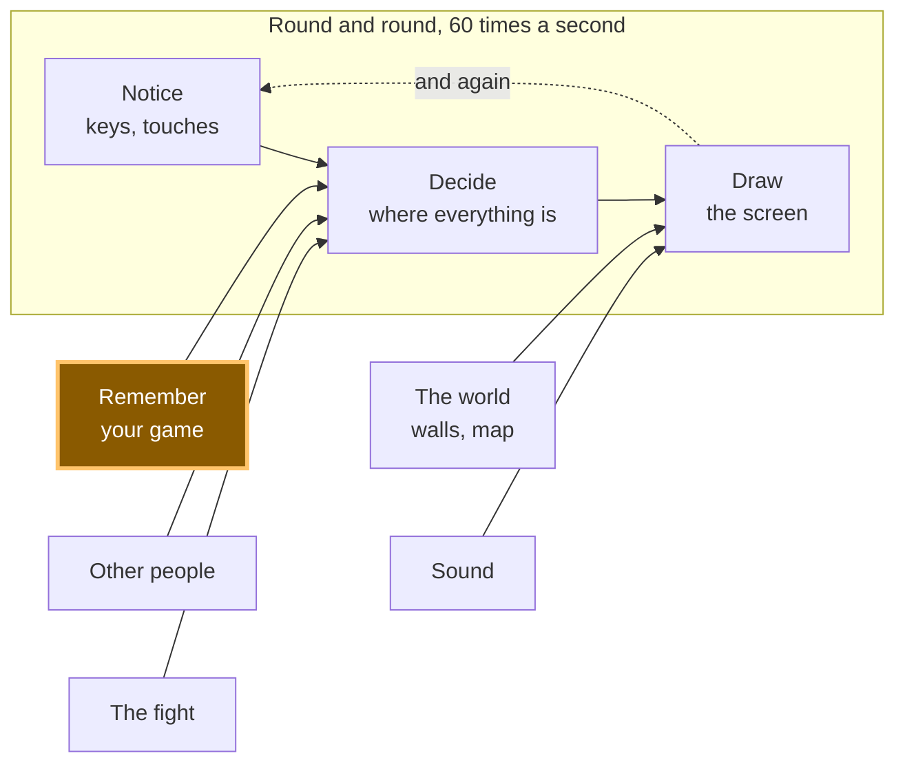

# A11: Save the Game

Right now your game forgets everything the moment you close the tab. By the end of this step it remembers where your square was and what you are called — and it survives a save file written by an older version of your own game.
{: .lesson-intro }

**Needs:** [A10](a10.html). **Gives you:** a square that comes back where you left it, with your name above it.

## The whole game, and today's piece



Today you build the box on the side: **Remember your game**. It feeds the middle. When the page starts, it hands "Decide" a position to start from.

## Cutting it into blocks

"Save the game" sounds like one thing. It is three:

1. **Write** — put the position and the name somewhere that outlives the page
2. **Read** — get them back when the page starts again
3. **Cope** — deal with what you read back being old, or broken, or missing

**Why bother splitting it?** Because these three fail in completely different ways, and they fail at different times. Writing fails now, while you watch. Reading fails when the page starts. Coping fails on somebody else's computer, one day, when they open a game they last played a long time ago.

If it were one lump and it went wrong, you could not tell which part was wrong. Is nothing being written? Is it written but never read? Is it read but thrown away? Three blocks, three separate questions.

Block 3 is the one almost everybody skips. It is the whole point of this step.

## Block 1: Write

The browser gives every website a small drawer it can keep text in. It is called **localStorage**, and what you put in it stays there after the tab closes. It only holds text, so we turn our object into text first.

```
const KEY = 'kakkoi-save';   // one name in the drawer, one save
const VERSION = 2;           // stamped on everything we write

function save() {
  const data = { version: VERSION, name: player.name, x: player.x, y: player.y };
  localStorage.setItem(KEY, JSON.stringify(data));
}
setInterval(save, 500);
```

`JSON.stringify` turns an object into text. **JSON** is just a way of writing an object down as characters, so it can be stored or sent somewhere.

`setInterval(save, 500)` runs `save` **twice a second**. Not every frame.

> **Why not every frame?** Your square moves 60 times a second. Nobody closes a tab 60 times a second. Saving every frame means 60 times the work for exactly the same result: a game that comes back where you left it. Twice a second, you can lose at most half a second of walking — and half a second of walking is nothing.

Notice the `version` number sitting in the saved object. Nothing uses it yet. Block 3 does.

## Block 2: Read

```
function read() {
  const text = localStorage.getItem(KEY);
  if (text === null) return null;
  return JSON.parse(text);
}
```

`getItem` gives back the text you stored, or `null` if nothing was ever stored under that name. `JSON.parse` is the opposite of `JSON.stringify`: text back into an object.

This block does one job and nothing else. It does not decide what to do about what it found.

## Block 3: Cope

Here is the fact that makes this block necessary:

**A save outlives the code that wrote it.** You will change your game. The save sitting in somebody's browser was written by the *old* version of your game. It might have no name in it, because you added names later. It might be half-written, because the computer was closed in the middle of writing. It is not under your control any more.

So every bad case ends the same way: start fresh instead of crashing.

```
function fresh() {
  return { x: 100, y: 100, name: '' };
}

function load() {
  let data;
  try {
    data = read();
  } catch (err) {
    console.warn('save is not readable, starting fresh:', err.message);
    return fresh();
  }
  if (data === null) return fresh();
  if (data.version !== VERSION) {
    console.warn('save is version', data.version, 'and we speak', VERSION, '- starting fresh');
    return fresh();
  }
  if (typeof data.x !== 'number' || typeof data.y !== 'number') {
    return fresh();
  }
  return { x: data.x, y: data.y, name: String(data.name || '') };
}

const player = load();
```

`try` means "attempt this". `catch` means "and if it explodes, do this instead of stopping the whole page". `JSON.parse` throws — explodes — the moment the text is not proper JSON, and without the `catch` your whole game would stop before it ever drew a frame.

Four things can be wrong, and each gets one line: unreadable text, nothing saved at all, a save from an older version, a save with no position in it.

This is the part that feels boring while you write it. It is the part that stops a real person losing a game.

## Why we did it this way

The version number is the forcing constraint. Without it, an old save is *silently* wrong: it parses fine, it has numbers in it, and your new code quietly builds a broken player out of it — and you will chase that bug for hours because everything looks normal. With one number stamped on every save, "this is from an older game" becomes a thing your code can simply see and answer. When you change what you save in a later step, you raise `VERSION` by one, and every old save politely steps aside.

## What we could have done instead

| Instead of this | What it would cost |
|---|---|
| Saving on every frame | 60 writes a second instead of 2, for a result nobody can tell apart. Storage is not free and the browser does real work each time |
| Saving only when the page closes | The browser is allowed to kill a tab without warning — crash, low battery, phone swiping the app away. Sometimes your goodbye code never runs, and the whole session is gone |
| No version number | Old saves parse fine and produce a wrong player. The bug looks like a movement bug, not a save bug, and you look in the wrong place |
| Storing x and y under separate keys | Two writes instead of one. If the computer stops between them you get a save that is half old and half new — the square jumps to a place it has never been |

## The prompt

```
I have a canvas game in plain JavaScript. The player is an object with x, y and
name. Add saving to localStorage under one key, as one JSON object, written
twice a second with setInterval. On startup, load it. Put a version number in
the saved object and handle three bad cases separately: nothing saved yet,
text that is not valid JSON, and a save whose version is not the current one.
In every bad case start from default values and never throw. Keep write, read
and cope as three separate functions.
```

**Check the output for:** did it actually wrap `JSON.parse` in `try`/`catch`, or did it only check for `null`? Those are different failures and only one of them is caught by a null check. Does the version check compare with `!==`, or did it only handle *older* versions and forget a save from a version that does not exist yet? And did it save on every frame in the game loop instead of on a timer — assistants do that often, because it is one line shorter.

## See it work


Open the page with Live Server and:

1. Type a name into the box. It appears above the square.
2. **Click on the canvas first**, then hold an arrow key. (While the name box has the keyboard, the arrows go into the box, not into the game. That is on purpose.)
3. Reload the page. The square is at the same place and the name is still in the box. We drove ours to `{x: 253.98, y: 177}`, reloaded, and it came back at `{x: 253.98, y: 177}` with the name `Mika`.
4. Open the browser console and run `localStorage.setItem('kakkoi-save', '{{{')`, then reload. The page still works. The square starts fresh at `{x: 100, y: 100}` and the console says *save is not readable, starting fresh: Expected property name or '}' in JSON at position 1*.
5. Now run `localStorage.setItem('kakkoi-save', JSON.stringify({ version: 1, name: 'Old Mika', x: 300, y: 40 }))` and reload. Again the square starts fresh, and the console says *save is version 1 and we speak 2*. That is Block 3 doing its job — the position `300, 40` in that save was thrown away on purpose.
6. Move again after either of those. It still moves. Nothing was broken by the broken save.

Steps 4 and 5 are the real test. A save file you never abuse is a save file you have not tested.

## Put it in the game

Take the game from [A10](a10.html). Add the three functions, replace `const player = { x: 100, y: 100 }` with `const player = load()`, and add one `<input id="name">` under the canvas. Add one line to `draw` so the name is painted above the square, and one guard in the key handler so typing your name does not steer:

```
addEventListener('keydown', (e) => { if (e.target !== nameBox) held.add(e.key); });
```

<div class="takeaways">
<h2>Key Takeaways</h2>
<ul>
<li>Saving is three jobs, not one: write it down, read it back, cope with what you read</li>
<li>Save on a timer, not every frame — the extra 58 writes a second buy you nothing</li>
<li>Put a version number in every save, because a save outlives the code that wrote it</li>
<li>Every bad save ends the same way: start fresh, never crash</li>
<li><code>try</code> and <code>catch</code> mean "attempt this, and if it explodes do that instead" — <code>JSON.parse</code> explodes on rubbish</li>
</ul>
</div>

## Your turn

Add a **Forget me** button that clears the save and puts the square back at the start, without reloading the page. Two things to think about: `localStorage.removeItem` empties the drawer, but the timer will write a new save half a second later, so you also have to move the player back yourself. And should the name go too, or should it stay? Decide, and be able to say why.

Then a harder question, which we got wrong first and had to fix. When we built this properly, we found that **not everything in the drawer belongs to the character.** Where you are standing does. Your name does. But "has this person read the safety notice?" and "does this person already know the controls?" are facts about the *person sitting at the computer*, not about the character they happen to be playing — and clearing them meant a child who started a new animal was shown the safety notice again, and re-taught the controls they already knew.

So those live in their own drawer, and starting over does not touch them.

Look at what you are saving and sort it into two piles: **this character**, and **this person**. Then make your button clear only the first. *Grown-up programmers would say the two kinds of data have different lifetimes, so now you know that phrase too.*
