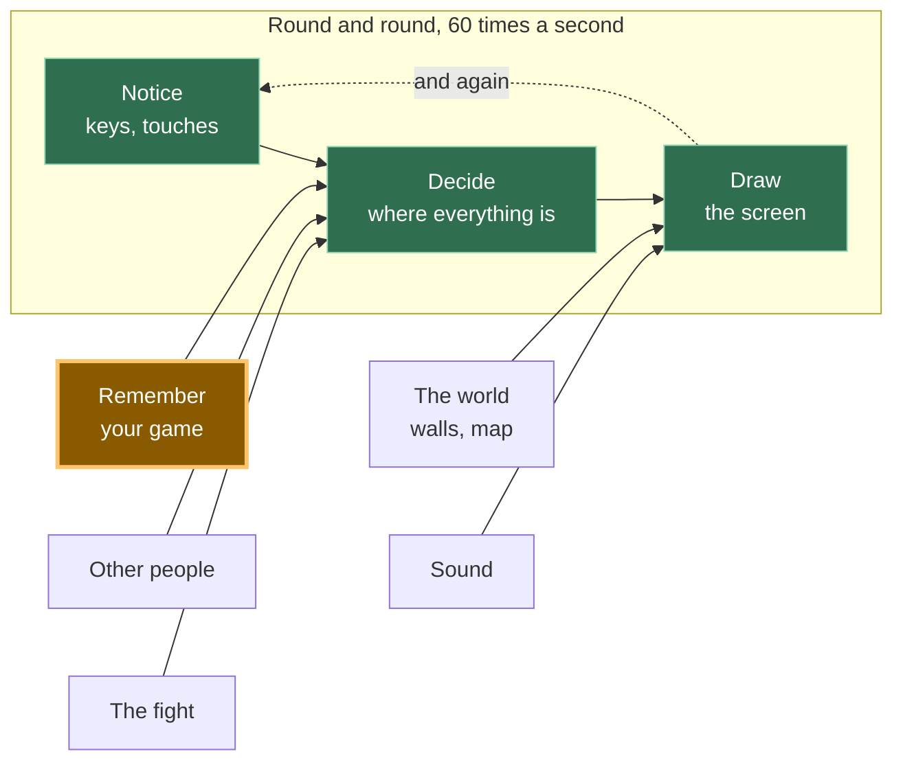

# A11: Salvar o Jogo

Neste momento, seu jogo esquece tudo no instante em que você fecha a aba. Ao final desta etapa, ele se lembrará onde seu quadrado estava e qual é o seu nome — e sobreviverá a um arquivo de salvamento escrito por uma versão mais antiga do seu próprio jogo.
{: .lesson-intro }

**Pré-requisitos:** [A10](a10.html). **O que você ganha:** um quadrado que volta para onde você o deixou, com seu nome acima dele.

## O jogo completo e a peça de hoje



Hoje você constrói a caixa lateral: **Lembra-se do seu jogo**. Ela alimenta o meio. Quando a página inicia, ela entrega ao "Decidir" uma posição para começar.

## Dividindo em blocos

"Salvar o jogo" soa como uma coisa só. São três:

1.  **Gravar** — colocar a posição e o nome em algum lugar que sobreviva à página
2.  **Ler** — recuperá-los quando a página iniciar novamente
3.  **Lidar** — gerenciar o que você lê de volta, caso esteja antigo, quebrado ou faltando

**Por que se preocupar em dividir?** Porque essas três falham de maneiras completamente diferentes e em momentos diferentes. A gravação falha agora, enquanto você assiste. A leitura falha quando a página inicia. O gerenciamento falha no computador de outra pessoa, um dia, quando ela abre um jogo que jogou há muito tempo.

Se fosse um bloco único e algo desse errado, você não saberia qual parte estava errada. Nada está sendo gravado? Está gravado, mas nunca lido? É lido, mas descartado? Três blocos, três perguntas separadas.

O Bloco 3 é o que quase todo mundo pula. É o objetivo principal desta etapa.

## Bloco 1: Gravar

O navegador oferece a cada site uma pequena "gaveta" onde ele pode guardar texto. Chama-se **localStorage**, e o que você coloca lá permanece mesmo depois que a aba é fechada. Ele só armazena texto, então primeiro transformamos nosso objeto em texto.

```
const KEY = 'kakkoi-save';   // one name in the drawer, one save
const VERSION = 2;           // stamped on everything we write

function save() {
  const data = { version: VERSION, name: player.name, x: player.x, y: player.y };
  localStorage.setItem(KEY, JSON.stringify(data));
}
setInterval(save, 500);
```

`JSON.stringify` transforma um objeto em texto. **JSON** é apenas uma maneira de escrever um objeto em caracteres, para que possa ser armazenado ou enviado para algum lugar.

`setInterval(save, 500)` executa `save` **duas vezes por segundo**. Não a cada frame.

> **Por que não a cada frame?** Seu quadrado se move 60 vezes por segundo. Ninguém fecha uma aba 60 vezes por segundo. Salvar a cada frame significa 60 vezes o trabalho para exatamente o mesmo resultado: um jogo que volta para onde você o deixou. Duas vezes por segundo, você pode perder no máximo meio segundo de caminhada — e meio segundo de caminhada não é nada.

Observe o número `version` presente no objeto salvo. Nada o usa ainda. O Bloco 3 o faz.

## Bloco 2: Ler

```
function read() {
  const text = localStorage.getItem(KEY);
  if (text === null) return null;
  return JSON.parse(text);
}
```

`getItem` retorna o texto que você armazenou, ou `null` se nada foi armazenado sob esse nome. `JSON.parse` é o oposto de `JSON.stringify`: texto de volta para um objeto.

Este bloco faz um trabalho e nada mais. Ele não decide o que fazer com o que encontrou.

## Bloco 3: Lidar

Aqui está o fato que torna este bloco necessário:

**Um salvamento sobrevive ao código que o escreveu.** Você mudará seu jogo. O salvamento que está no navegador de alguém foi escrito pela versão *antiga* do seu jogo. Ele pode não ter um nome, porque você adicionou nomes mais tarde. Pode estar semi-escrito, porque o computador foi desligado no meio da gravação. Não está mais sob seu controle.

Assim, cada caso problemático termina da mesma forma: comece do zero em vez de travar.

```
function fresh() {
  return { x: 100, y: 100, name: '' };
}

function load() {
  let data;
  try {
    data = read();
  } catch (err) {
    console.warn('save is not readable, starting fresh:', err.message);
    return fresh();
  }
  if (data === null) return fresh();
  if (data.version !== VERSION) {
    console.warn('save is version', data.version, 'and we speak', VERSION, '- starting fresh');
    return fresh();
  }
  if (typeof data.x !== 'number' || typeof data.y !== 'number') {
    return fresh();
  }
  return { x: data.x, y: data.y, name: String(data.name || '') };
}

const player = load();
```

`try` significa "tentar isso". `catch` significa "e se explodir, faça isso em vez de parar a página inteira". `JSON.parse` lança — explode — no momento em que o texto não é JSON adequado, e sem o `catch` seu jogo inteiro pararia antes mesmo de desenhar um frame.

Quatro coisas podem estar erradas, e cada uma recebe uma linha: texto ilegível, nada salvo, um salvamento de uma versão antiga, um salvamento sem posição.

Esta é a parte que parece chata enquanto você a escreve. É a parte que impede uma pessoa real de perder um jogo.

## Por que fizemos desta forma

O número da versão é a restrição. Sem ele, um salvamento antigo está *silenciosamente* errado: ele é analisado corretamente, tem números, e seu novo código constrói um jogador quebrado a partir dele — e você perseguirá esse bug por horas porque tudo parece normal. Com um número estampado em cada salvamento, "isso é de um jogo mais antigo" se torna algo que seu código pode simplesmente ver e responder. Quando você muda o que salva em uma etapa posterior, você aumenta a `VERSION` em um, e cada salvamento antigo educadamente se afasta.

## O que poderíamos ter feito diferente

| Em vez disso | Qual seria o custo |
|---|---|
| Salvar a cada frame | 60 gravações por segundo em vez de 2, para um resultado que ninguém consegue diferenciar. O armazenamento não é gratuito e o navegador realiza trabalho real a cada vez |
| Salvar apenas quando a página fecha | O navegador pode encerrar uma aba sem aviso — travamento, bateria fraca, o telefone deslizando o aplicativo. Às vezes, seu código de despedida nunca é executado, e toda a sessão é perdida |
| Sem número de versão | Salvamentos antigos são analisados corretamente e produzem um jogador errado. O bug parece um bug de movimento, não um bug de salvamento, e você procura no lugar errado |
| Armazenar x e y em chaves separadas | Duas gravações em vez de uma. Se o computador parar entre elas, você obtém um salvamento que é metade antigo e metade novo — o quadrado pula para um lugar onde nunca esteve |

## O prompt

```
I have a canvas game in plain JavaScript. The player is an object with x, y and
name. Add saving to localStorage under one key, as one JSON object, written
twice a second with setInterval. On startup, load it. Put a version number in
the saved object and handle three bad cases separately: nothing saved yet,
text that is not valid JSON, and a save whose version is not the current one.
In every bad case start from default values and never throw. Keep write, read
and cope as three separate functions.
```

**Verifique a saída para:** ele realmente envolveu `JSON.parse` em `try`/`catch`, ou apenas verificou `null`? São falhas diferentes e apenas uma delas é capturada por uma verificação de nulo. A verificação de versão compara com `!==`, ou lidou apenas com versões *antigas* e esqueceu um salvamento de uma versão que ainda não existe? E salvou a cada frame no loop do jogo em vez de em um temporizador — assistentes fazem isso frequentemente, porque é uma linha mais curta.

## Veja funcionar


Abra a página com Live Server e:

1.  Digite um nome na caixa. Ele aparecerá acima do quadrado.
2.  **Primeiro clique no canvas**, depois segure uma tecla de seta. (Enquanto a caixa de nome tem o teclado, as setas vão para a caixa, não para o jogo. Isso é intencional.)
3.  Recarregue a página. O quadrado estará no mesmo lugar e o nome ainda estará na caixa. Dirigimos o nosso para `{x: 253.98, y: 177}`, recarregamos, e ele voltou para `{x: 253.98, y: 177}` com o nome `Mika`.
4.  Abra o console do navegador e execute `localStorage.setItem('kakkoi-save', '{{{')`, depois recarregue. A página ainda funciona. O quadrado começa do zero em `{x: 100, y: 100}` e o console diz *salvamento não é legível, começando do zero: Nome de propriedade ou '}' esperado em JSON na posição 1*.
5.  Agora execute `localStorage.setItem('kakkoi-save', JSON.stringify({ version: 1, name: 'Old Mika', x: 300, y: 40 }))` e recarregue. Novamente o quadrado começa do zero, e o console diz *salvamento é versão 1 e nós usamos a versão 2*. Isso é o Bloco 3 fazendo seu trabalho — a posição `300, 40` nesse salvamento foi descartada de propósito.
6.  Mova-se novamente após qualquer uma dessas ações. Ele ainda se move. Nada foi quebrado pelo salvamento corrompido.

As etapas 4 e 5 são o verdadeiro teste. Um arquivo de salvamento que você nunca abusa é um arquivo de salvamento que você não testou.

## Coloque no jogo

Pegue o jogo de [A10](a10.html). Adicione as três funções, substitua `const player = { x: 100, y: 100 }` por `const player = load()`, e adicione um `<input id="name">` abaixo do canvas. Adicione uma linha a `draw` para que o nome seja pintado acima do quadrado, e uma proteção no manipulador de teclas para que digitar seu nome não direcione o movimento:

```
addEventListener('keydown', (e) => { if (e.target !== nameBox) held.add(e.key); });
```

<div class="takeaways">
<h2>Principais Pontos</h2>
<ul>
<li>Salvar é três tarefas, não uma: escrevê-lo, lê-lo de volta, lidar com o que você leu</li>
<li>Salve com um temporizador, não a cada frame — as 58 gravações extras por segundo não lhe trazem nada</li>
<li>Coloque um número de versão em cada salvamento, porque um salvamento sobrevive ao código que o escreveu</li>
<li>Todo salvamento corrompido termina da mesma forma: comece do zero, nunca trave</li>
<li><code>try</code> e <code>catch</code> significam "tente isso, e se explodir, faça aquilo em vez disso" — <code>JSON.parse</code> explode com lixo</li>
</ul>
</div>

## Sua vez

Adicione um botão **Esqueça-me** que apaga o salvamento e coloca o quadrado de volta ao início, sem recarregar a página. Duas coisas para pensar: `localStorage.removeItem` esvazia a "gaveta", mas o temporizador escreverá um novo salvamento meio segundo depois, então você também precisa mover o jogador de volta manualmente. E o nome também deve ir, ou deve ficar? Decida, e seja capaz de dizer por quê.

Então, uma pergunta mais difícil, que erramos no início e tivemos que corrigir. Quando construímos isso corretamente, descobrimos que **nem tudo na "gaveta" pertence ao personagem.** Onde você está sim. Seu nome sim. Mas "esta pessoa leu o aviso de segurança?" e "esta pessoa já conhece os controles?" são fatos sobre a *pessoa sentada no computador*, não sobre o personagem que ela está jogando — e limpá-los significava que uma criança que começasse um novo animal recebia o aviso de segurança novamente e era ensinada os controles que já conhecia.

Então, esses vivem em sua própria "gaveta", e começar de novo não os afeta.

Olhe para o que você está salvando e separe em duas pilhas: **este personagem** e **esta pessoa**. Então, faça com que seu botão limpe apenas o primeiro. *Programadores experientes diriam que os dois tipos de dados têm diferentes tempos de vida, então agora você conhece essa frase também.*
