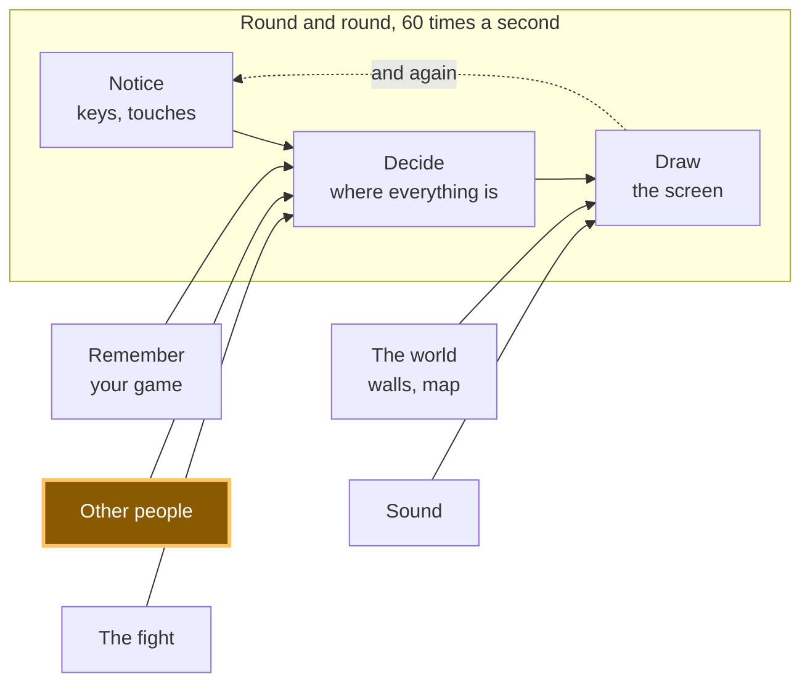

# A12: 他のプレイヤー

誰かが自分のコンピューターであなたのゲームを開きます。彼らの正方形があなたの画面に表示され、彼らが動くと一緒に動きます。これこそが、このトラック全体が目指してきたステップです。
{: .lesson-intro }

**必要なもの:** [A11](a11.html)。 **得られるもの:** 他のすべてのプレイヤーの正方形が、キャンバス上でライブで動きます。

## ゲーム全体と今日のピース



今日、あなたは「他のプレイヤー」のボックスを構築します。その矢印がどこを指しているかに注目してください：**決定**へと向かっており、あなたのキーボードと全く同じです。ゲームの他の部分にとって、別のプレイヤーは単に変化した別の数値のセットに過ぎません。

## サーバーはありません、そしてそれは半分真実です

**サーバー**とは、常に稼働しており、全員のゲームが通信するコンピューターです。ほとんどのオンラインゲームにはこれがあります。世界を保持し、停止するとゲームも停止します。

あなたのゲームにはサーバーがありません。あなたのブラウザは相手のブラウザと直接通信します。あなたの画面上の画像は、途中のどのコンピューターも通過しません。

正直な部分をお話しします。2つのブラウザは何もないところからお互いを見つけることはできません。『私はここにいます、これが私に連絡する方法です』というメモを残す場所が必要です。そこであなたのゲームは**掲示板**を利用します。これは他の人々が運営する公開メッセージサービスで、誰でも小さなメモを投稿できます。両方のブラウザがメモを投稿し、お互いのメモを読み、その後直接接続します。その後、掲示板は関与しません。

したがって、「サーバーレス」というのは半分しか真実ではありません。あなたのゲームを保持するサーバーはありません。しかし、導入のために使われる**掲示板**はあります。人々がゲームをサーバーレスだと言うとき、これはほとんどの場合彼らが意味することであり、今あなたは尋ねるべきことを知っています。

**もう一つ本当のこと、そしてそれが起こってもあなたのせいではありません。**一部の家庭用ネットワークや多くの学校のネットワークでは、2台のコンピューターが直接通信することを許可していません。導入は機能しますが、接続が確立されず、2番目の正方形が表示されません。もしあなたのネットワークがそうであるなら、このステップの何も壊れておらず、あなたは間違いを犯していません。[A14](a14.html)以降のすべてはこのステップがなくても機能するので、作業を進め、別のネットワークで戻ってきてください。

## ブロックに分割する

「他のプレイヤーの出現」は3つのことです。

1.  **接続** — 部屋に参加し、誰かが到着または退出したときに通知を受ける
2.  **送信** — 自分の正方形がどこにあるかを、毎秒10回全員に伝える
3.  **描画** — 他の全員の正方形を描画する

**なぜわざわざ分割するのか？** もしそれが一つの塊で、うまくいかなかった場合、どの部分が悪いのか判断できないからです。部屋に誰もいないというのは接続の問題を意味します。部屋に誰かはいるが正方形が動かないというのは送信の問題を意味します。数値は届いているが画面に何も表示されないというのは描画の問題を意味します。3つのブロック、3つの別々の問題 — そして、他の2つに触れることなく、コンソールからそれぞれに答えることができます。

ほとんどの人はこれを最初から動作させることはできません。このトラックの他のどの部分よりも、ここではそれが普通です。

## ブロック1: 接続

接続は、**trystero**というライブラリによって行われます。**ライブラリ**とは、あなたが自分で書く代わりに利用する、誰かが書いたコードのことです。これは掲示板と直接接続を処理します。

```
import { joinRoom, selfId } from '../../vendor/trystero/nostr.js';

const RELAYS = ['wss://relay.snort.social', 'wss://nostr.sathoarder.com',
                'wss://nos.lol', 'wss://nostr.vulpem.com'];

const room = joinRoom({ appId: 'kakkoi-online', relayUrls: RELAYS }, 'demo');
const [sendMove, onMove] = room.makeAction('move');

const others = {};

room.onPeerJoin((id) => sendMove({ x: player.x, y: player.y }, id));
room.onPeerLeave((id) => { delete others[id]; });

onMove((where, id) => { others[id] = { x: where.x, y: where.y } });
```

`RELAYS`は掲示板のリストです。4つあるのは、どれか一つが混雑していたり、メモを拒否したり、単にオフになっていたりする可能性があるためです — そして、そうなった場合でも残りの3つが仕事を果たします。

> **リレーに関する赤いエラーが表示されることがありますが、ゲームはそれでも動作する場合があります。** これらの掲示板は見知らぬ人によって無料で運営されており、消えたり現れたりします。このステップを書いている間、私たちは機能する4つを選びましたが、再び確認したときにはそのうちの1つが応答しなくなっていました — そのため、ゲームは完璧に動作していましたが、コンソールには数秒ごとに`WebSocket connection to ... failed`と表示されました。もしそれを見たら、機能しなくなったものを別のものと交換して続けてください。**コンソール内のエラーは壊れたゲームと同じではありません**。その違いを見分けるのは真のスキルです。これは、なぜ一つではなく四つあるのかも説明しています。

`'demo'`はルーム名です。同じルーム名を使用している全員がお互いに会うことができます。

`selfId`はあなたのタブのランダムな名前で、ページがロードされるたびに新しく作成されます。**他のプレイヤーはあなたが誰であるかを知ることはありません。** 彼らは20文字のランダムな文字を受け取ります。

`others`はこのブロックが保持する唯一のものです。他の全員がどこにいるかのリストで、プレイヤーごとに1つのエントリがあります。`onPeerLeave`はそれらを削除するので、誰かがタブを閉じると、その正方形は永遠にそこに留まるのではなく消えます。

`onPeerJoin`内の行は、新しい参加者へあなたの位置をすぐに送信するので、彼らは待つことなくすぐにあなたを見ることができます。

## ブロック2: 送信

```
setInterval(() => sendMove({ x: player.x, y: player.y }), 100);
```

`setInterval(f, 100)`は、100ミリ秒ごとに`f`を実行します — **毎秒10回**、指でタップできるのと同じくらいの頻度です。

あなたの正方形は毎秒60回動きます。毎秒60回送信することもできます。しかし、そうしないでください。すべてのメッセージがすべてのプレイヤーに送られるため、6人部屋では、同じように見える正方形を描画するために、あなたのコンピューターから毎秒60メッセージではなく360メッセージが送信されることになります。毎秒10回で十分に生きているように見えます。

これは、[A11](a11.html)で毎秒2回セーブするのと同じ考え方です。高価な処理は、できるだけ少ない頻度で行うべきです。

## ブロック3: 描画

```
function draw() {
  ctx.fillStyle = '#1b1b22';
  ctx.fillRect(0, 0, canvas.width, canvas.height);

  ctx.font = '12px system-ui, sans-serif';
  for (const id in others) {
    ctx.fillStyle = '#6bb8ff';
    ctx.fillRect(others[id].x, others[id].y, SIZE, SIZE);
    ctx.fillText(id.slice(0, 4), others[id].x, others[id].y - 4);
  }

  ctx.fillStyle = '#7ee081';
  ctx.fillRect(player.x, player.y, SIZE, SIZE);
}
```

他のプレイヤーは青、あなたは緑で、各プレイヤーのIDの4文字が彼らの正方形の上に表示されるので、2人を区別できます。

このブロックが**しない**ことを見てください。誰かにどこにいるか尋ねません。`player`を読むのと全く同じ方法で`others`リストを読みます。これが[A10](a10.html)で通知と決定、描画を分離した理由です。あなたの描画コードは数字がどこから来たかに関心がなかったため、別のプレイヤーの正方形を描くのに3行追加するだけです。

## このようにした理由

全体的な構造は一つの決定から来ています：サーバーなし。なぜなら、サーバーは毎月費用がかかり、誰かが稼働させ続ける必要があるからです。12歳の子どもがこのゲームを公開し、友達にリンクを送り、誰にもお金を払うことなく1年後も動作するべきです。そのため、ゲームを保持するサーバーは除外されます — したがって、ブラウザ同士が通信し、無料の公開掲示板が紹介の役割を果たします。

## 代わりにできたこと

| これの代わりに | 費用 |
|---|---|
| 世界を保持する実際のサーバー | 厳格な学校ネットワークでも常に動作し、チートを防ぐことができます。しかし、毎月費用がかかり、稼働させ続ける必要があり、ダウンするとすべてのプレイヤーのゲームもダウンします |
| 毎フレーム自分の位置を送信する | 誰も区別できない絵のためにメッセージが6倍になります。携帯電話では、無駄にバッテリーを消費します |
| 「私はx, yにいる」ではなく「右を押した」と送信する | メッセージは少なくなります。しかし、すべてのコンピューターが全員がどこにたどり着いたかを計算する必要があり、1つのメッセージが欠落すると2人のプレイヤーが永遠に異なる世界を見ることになります |
| 自分で接続コードを書く | 多くのことを学ぶでしょう。しかし、それは何百行もの見つけるのが非常に困難な方法で失敗する難しいコードでもあり、それこそがライブラリの目的です |

## プロンプト

```
I have a canvas game in plain JavaScript. main.js keeps the player in
{x, y}, moves it in update(dt), and paints it in draw(). I have trystero
vendored at ../../vendor/trystero/nostr.js. Add multiplayer in three
separate blocks with a comment above each: CONNECT (joinRoom, an action
called 'move', a peers object, remove a peer when they leave), SEND (a
setInterval at 10 per second), DRAW (paint the other squares). Do not
change update(). Plain JavaScript, no build step, no npm.
```

**出力の確認事項:** 送信処理をタイマーではなく`requestAnimationFrame`内に記述していないか？ これは最も一般的な回答ですが、要求した量の6倍ものデータを送信します。`onPeerLeave`を処理しているか、それとも誰かが去った後も正方形が画面に残り続けるか？ そして、ベンダーファイルからインポートしているか、それとも密かに`import ... from 'https://...'`を追加していないか？ それは偽装されたビルドステップです。

## 動作を確認する


ページを2回、2つのブラウザタブで開き、数秒待ちます。

1.  各タブに青い正方形が表示され、その上に4文字が表示されます。それがもう一方のタブです。
2.  片方のタブで緑の正方形を矢印キーで動かします。もう一方のタブの青い正方形も同じように動きます。
3.  2番目のタブでコンソールを開き、`others`と入力します。`{6phtXPzeOsFqgp95188x: {x: 411.696, y: 288}}`のようなオブジェクトが表示されます — そして、これら2つの数値は1番目のタブの`player`と同じ数値です。これが証拠です。画像は偶然かもしれませんが、小数点以下3桁まで一致する数値は偶然ではありえません。
4.  1番目のタブを閉じます。数秒以内に2番目のタブの青い正方形が消え、`others`は`{}`になります。
5.  3番目のタブを開きます。2番目の青い正方形が現れます — 上の写真は3人のプレイヤーが部屋にいる状態で撮影されました。

ステップ1が一度も発生しない場合は、コードを変更する前に上記のネットワークに関する注意書きを読んでください。

## これを行ったときに何が問題だったか

このセクションは、3つのブロックをあなたのゲームに組み込んだ**後**に読んでください。なぜなら、そのときに問題が発生するからです。

このステップをテストするには2つのタブを使用し、上記のデモでは完全に機能します。その後、[A11](a11.html)で名前と位置を保存する実際のゲームに追加し、2つのタブを開きました。

**二人の自分が出現しました。** 同じ名前、同じモンスターが両方歩き回り、両方とも本物でした。2番目のタブを閉じても解決しませんでした。なぜなら、1番目のタブがまだ稼働していたからです。

何も壊れていませんでした。両方のタブが同じセーブデータを読み込んでいたのです。なぜなら、セーブデータはタブではなく**ブラウザ**に属しているからです。そのため、両方のタブは正しく、正直にあなた自身でした。ゲームは単に、同時にプレイすべきなのは一人だけだということを知らなかっただけです。

解決策は、**最新のウィンドウが優先される**と決めることです。

1.  開いたウィンドウは、同じゲームの他のすべてのウィンドウに自分自身を通知します。
2.  これを聞いた古いウィンドウは、現在の実際の位置を保存し、それを渡し、**部屋から退出**し、ゲームを取り戻すためのボタン付きの静かなメッセージを表示します。
3.  新しいウィンドウは、その引き渡しを少し待ち（400ミリ秒を許容します）、受け取った位置から開始します。何も応答がない場合は、他のウィンドウは存在せず、通常通りセーブデータを読み込みます。

そこには間違いやすい2つの詳細があり、どちらも時間を費やしました。

**古いウィンドウは実際に退出する**必要があり、描画を停止するだけではいけません。一時停止するだけではまだ接続されているため、他の全員にはまだ2人のあなたが見え、バグが未修正に見えます。

**新しいウィンドウは、セーブされた位置ではなく、引き渡された位置を使用する必要があります。** ゲームは毎フレームではなく、時々セーブします。セーブされたコピーを使用すると、最後にセーブされた場所にジャンプしてしまい、ゲームがあなたの場所を見失ったように感じられます。

*同じサイトのウィンドウは直接互いに通信できます — 熟練したプログラマーはそれを`BroadcastChannel`と呼びます。これであなたもその名前を知ったことになります。これは同じサイトのウィンドウ間でのみ機能し、まさにここでの問題に合致します。*

## ゲームに組み込む

[A11](a11.html)からゲームを取り出し、3つのブロックを追加します。既存のものは何も変更しません。`update`とループは全く同じままです — 最初の数値ソースを書き換えるのではなく、2番目の数値ソースを追加するのです。

<div class="takeaways">
<h2>重要なポイント</h2>
<ul>
<li>「サーバーレス」は通常、ゲームを保持するサーバーがないことを意味しますが、プレイヤー同士を紹介する何らかの仕組みは依然として存在します。</li>
<li>他のプレイヤーは、あなたのキーボードと同じく、単に変化する数値に過ぎません — だからこそ、A10の分割がここで報われます。</li>
<li>送信は毎フレームではなく、タイマーを使って稀に行うこと。画像は同じでも、コストははるかに低くなります。</li>
<li>プレイヤーが去ったら削除すること。そうしないと、彼らの正方形が永遠にあなたの画面に残り続けます。</li>
<li>一部のネットワークでは、2台のコンピューターが直接通信することを許可しませんが、それはあなたのコードのバグではありません。</li>
<li>セーブデータはタブではなくブラウザに属します — したがって、どちらがプレイしているかを決定するまでは、2つのタブは2人のあなたです。</li>
</ul>
</div>

## あなたの番

現在、フリーズしたプレイヤー（ラップトップの蓋を閉じた、接続が切れたなど）は、部屋がそのプレイヤーが去ったことに気づくまで、あなたの画面に静止した正方形を残します。このステップを構築中に、私たちにもこれが起こりました。閉じられずに強制終了されたタブが、数分間`{x: 100, y: 100}`に青い正方形を停滞させたままにしました。なぜなら、「さようなら」が送信されなかったからです。各メッセージが到着した時間を保存し、3秒間応答のない正方形はフェードアウトさせるか、非表示にしてください。*熟練したプログラマーは、そのようなメッセージをハートビートと呼びます。これであなたもその言葉を知ったことになりますね。*
