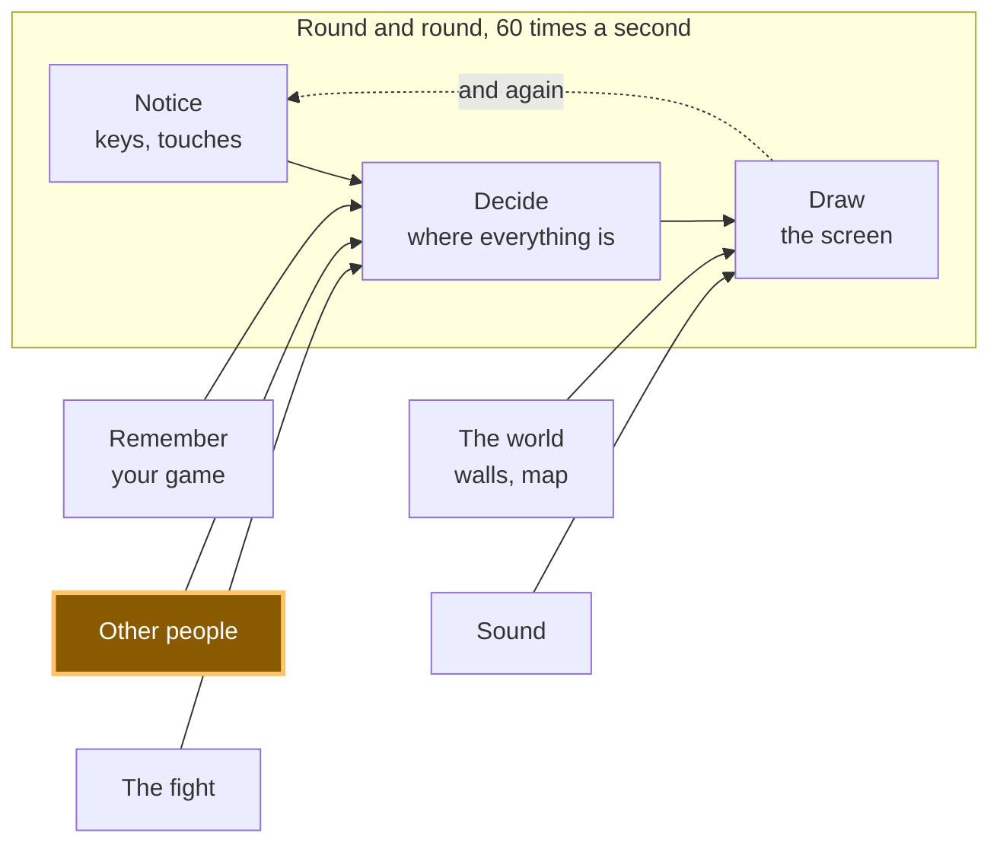

# A12: Other People

Somebody else opens your game on their computer. Their square appears on your screen and moves when they move. This is the step the whole track has been walking towards.
{: .lesson-intro }

**Needs:** [A11](a11.html). **Gives you:** every other player's square, moving live on your canvas.

## The whole game, and today's piece



Today you build the "other people" box. Notice where its arrow points: into **decide**, exactly like your keyboard. To the rest of your game, another player is just another set of numbers that changed.

## There is no server, and that is a half-truth

A **server** is a computer that is always on, that everybody's game talks to. Most online games have one. It holds the world, and if it stops, the game stops.

Your game does not have one. Your browser talks straight to the other person's browser. The pictures on your screen never pass through anybody's computer in the middle.

Here is the honest part. Two browsers cannot find each other out of nothing. They need somewhere to leave a note saying *"I am here, this is how to reach me"*. So your game uses a **noticeboard** — a public message service, run by other people, that anyone can post small notes to. Both browsers post a note, read each other's, and then connect directly. After that the noticeboard is not involved.

So "serverless" is only half true. There is no server holding your game. There *is* a noticeboard used for the introduction. When people say a game is serverless, this is almost always what they mean, and now you know to ask.

**One more true thing, and it is not your fault when it happens.** On some home networks, and on a lot of school networks, two computers are not allowed to reach each other directly. The introduction works, the connection never forms, and no second square appears. If that is your network, nothing in this step is broken and you have not made a mistake. Everything from [A14](a14.html) onwards works without this step, so carry on and come back with a different network.

## Cutting it into blocks

"Other people appear" is three things:

1. **Connect** — join a room, and be told when somebody arrives or leaves
2. **Send** — tell everyone where your square is, ten times a second
3. **Draw** — paint everyone else's squares

**Why bother splitting it?** Because if it were one lump and it went wrong, you could not tell which part was wrong. Nobody in the room means connect. Somebody in the room but no square moving means send. Numbers arriving but nothing on screen means draw. Three blocks, three separate questions — and you can answer each one from the console without touching the other two.

Almost nobody gets this working the first time. That is normal here, more than anywhere else in the track.

## Block 1: Connect

The connecting is done by a library called **trystero**. A **library** is code somebody else wrote that you use instead of writing your own. This one handles the noticeboard and the direct connection.

```
import { joinRoom, selfId } from '../../vendor/trystero/nostr.js';

const RELAYS = ['wss://relay.snort.social', 'wss://nostr.sathoarder.com',
                'wss://nos.lol', 'wss://nostr.vulpem.com'];

const room = joinRoom({ appId: 'kakkoi-online', relayUrls: RELAYS }, 'demo');
const [sendMove, onMove] = room.makeAction('move');

const others = {};

room.onPeerJoin((id) => sendMove({ x: player.x, y: player.y }, id));
room.onPeerLeave((id) => { delete others[id]; });

onMove((where, id) => { others[id] = { x: where.x, y: where.y } });
```

`RELAYS` is the list of noticeboards. There are four because any one of them can be busy, can refuse your note, or can simply be switched off — and if that happens the other three still do the job.

> **You may see red errors about relays, and your game may work anyway.** These noticeboards are run by strangers, for free, and they come and go. While writing this step we picked four that worked, and by the time we checked again one of them had stopped answering — so the console showed `WebSocket connection to ... failed` every few seconds while the game ran perfectly. If you see that, swap the dead one for another and carry on. **An error in the console is not the same as a broken game**, and telling the difference is a real skill. It also explains why there are four and not one.

`'demo'` is the room name. Everybody using the same room name meets each other.

`selfId` is a random name for your tab, made fresh every time the page loads. **The other players never learn who you are.** They get twenty random letters.

`others` is the only thing this block keeps: a list of where everybody else is, one entry per player. `onPeerLeave` deletes them, so when somebody closes their tab their square goes away instead of standing there forever.

The line inside `onPeerJoin` sends your position to the new arrival straight away, so they see you immediately instead of waiting.

## Block 2: Send

```
setInterval(() => sendMove({ x: player.x, y: player.y }), 100);
```

`setInterval(f, 100)` runs `f` every 100 milliseconds — **ten times a second**, about as often as you can tap a finger.

Your square moves 60 times a second. You could send 60 times a second too. Do not. Every message goes to every player, so in a room of six people that is 360 messages a second leaving your computer instead of 60, to draw squares that would look the same. Ten times a second is enough to look alive.

This is the same idea as saving twice a second in [A11](a11.html): do the expensive thing as rarely as you can get away with.

## Block 3: Draw

```
function draw() {
  ctx.fillStyle = '#1b1b22';
  ctx.fillRect(0, 0, canvas.width, canvas.height);

  ctx.font = '12px system-ui, sans-serif';
  for (const id in others) {
    ctx.fillStyle = '#6bb8ff';
    ctx.fillRect(others[id].x, others[id].y, SIZE, SIZE);
    ctx.fillText(id.slice(0, 4), others[id].x, others[id].y - 4);
  }

  ctx.fillStyle = '#7ee081';
  ctx.fillRect(player.x, player.y, SIZE, SIZE);
}
```

Other players are blue, you are green, and four letters of each player's id go above their square so you can tell two of them apart.

Look at what this block does *not* do. It does not ask anybody where they are. It reads the `others` list, exactly the way it reads `player`. That is why [A10](a10.html) split notice from decide from draw: your drawing code never cared where the numbers came from, so another person's square costs three extra lines.

## Why we did it this way

The whole shape follows from one decision: no server, because a server costs money every month and somebody has to keep it running. A 12-year-old should be able to publish this game, send the link to a friend, and have it still work in a year without paying anyone. That rules out a server holding the game — so the browsers talk to each other, and a free public noticeboard does the introductions.

## What we could have done instead

| Instead of this | What it would cost |
|---|---|
| A real server holding the world | It always works, even on strict school networks, and it can stop cheating. But it costs money every month, it must be kept running, and when it goes down every player's game goes down |
| Sending your position every frame | Six times the messages for a picture nobody can tell apart. On a phone that is battery you spent for nothing |
| Sending "I pressed right" instead of "I am at x, y" | Fewer messages. But every computer would have to work out where everybody ended up, and one dropped message means two players see different worlds forever |
| Writing the connection code yourself | You would learn a lot. It is also several hundred lines of hard code that fails in ways that are very hard to see, which is exactly what a library is for |

## The prompt

```
I have a canvas game in plain JavaScript. main.js keeps the player in
{x, y}, moves it in update(dt), and paints it in draw(). I have trystero
vendored at ../../vendor/trystero/nostr.js. Add multiplayer in three
separate blocks with a comment above each: CONNECT (joinRoom, an action
called 'move', a peers object, remove a peer when they leave), SEND (a
setInterval at 10 per second), DRAW (paint the other squares). Do not
change update(). Plain JavaScript, no build step, no npm.
```

**Check the output for:** did it put the sending inside `requestAnimationFrame` instead of a timer? That is the most common answer and it sends six times more than you asked for. Did it handle `onPeerLeave`, or do squares stay on screen forever after someone leaves? And does it import from the vendored file, or did it quietly add `import ... from 'https://...'`, which is a build step in disguise?

## See it work


Open the page twice, in two browser tabs, and wait a few seconds:

1. A blue square appears in each tab, with four letters above it. That is the other tab.
2. Drive the green square in one tab with the arrow keys. The blue square in the other tab moves the same way.
3. Open the console in the second tab and type `others`. You get an object like `{6phtXPzeOsFqgp95188x: {x: 411.696, y: 288}}` — and those two numbers are the same numbers as `player` in the first tab. That is the proof. The picture could be a coincidence; matching numbers to three decimal places cannot be.
4. Close the first tab. Within a few seconds the blue square in the second tab disappears and `others` becomes `{}`.
5. Open a third tab. A second blue square appears — the picture above was taken with three players in the room.

If step 1 never happens, read the note about networks above before you change any code.

## What went wrong when we did this

Read this **after** you have folded the three blocks into your game, because that is when it happens.

Two tabs is how you test this step, and for the demo above it works perfectly. Then we added it to the real game — the one that saves your name and your position from [A11](a11.html) — and opened two tabs.

**There were two of us.** Same name, same monster, both walking around, both real. Closing the second tab did not help, because the first one was still going.

Nothing was broken. Both tabs read the same save, because a save belongs to the *browser*, not to the tab. So both tabs were correctly, honestly, you. The game simply had no idea that only one of you should be playing at a time.

The fix is to decide that **the newest window wins**:

1. A window that opens announces itself to any other window of the same game.
2. An older window that hears this saves where it actually is right now, hands that over, **leaves the room**, and shows a quiet message with a button to take the game back.
3. The new window starts from the handed-over position.

Two details in there are easy to get wrong, and both cost us time:

**The old window has to genuinely leave**, not just stop drawing. If it only pauses, it is still connected, so everyone else still sees two of you and the bug looks unfixed.

**The new window must use the handed-over position, not the saved one.** A game saves every so often, not every frame. Use the saved copy and you jump back to wherever the last save happened to land, which feels like the game losing your place.

*Windows of the same site can talk to each other directly — grown-up programmers call it a `BroadcastChannel`, so now you know that name too. It only works between windows of the same site, which is exactly the problem here.*

## Put it in the game

Take your game from [A11](a11.html) and add the three blocks. Nothing already there changes. `update` and the loop stay exactly as they were — you are adding a second source of numbers, not rewriting the first one.

<div class="takeaways">
<h2>Key Takeaways</h2>
<ul>
<li>"Serverless" usually means no server holds the game, but something still introduces the players</li>
<li>Other players are just numbers that change, the same as your keyboard — that is why A10's split pays off here</li>
<li>Send rarely and on a timer, not every frame; the picture is the same and the cost is far lower</li>
<li>Remove a player when they leave, or their square haunts your screen forever</li>
<li>Some networks will not let two computers talk directly, and that is not a bug in your code</li>
<li>A save belongs to the browser, not the tab — so two tabs are two of you until you decide which one is playing</li>
</ul>
</div>

## Your turn

Right now a player who freezes — laptop lid closed, connection dropped — leaves a square standing still on your screen until the room notices they are gone. This happened to us while building the step: a tab that was killed rather than closed left a blue square parked at `{x: 100, y: 100}` for minutes, because "goodbye" was never sent. Store the time each message arrived, and fade or hide any square you have not heard from for three seconds. *Grown-up programmers call a message like that a heartbeat, so now you know that word too.*
