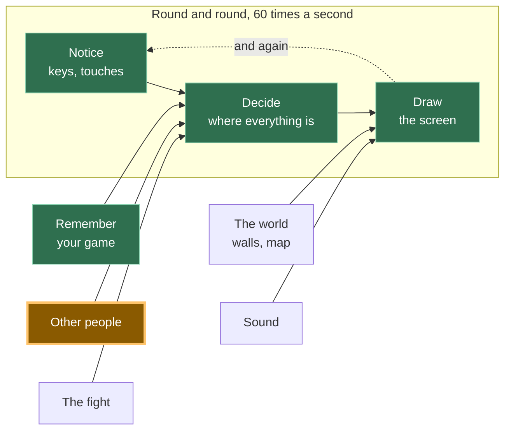

# A12: Outras Pessoas

Alguém abre seu jogo no computador deles. O quadrado deles aparece na sua tela e se move quando eles se movem. Este é o passo para o qual todo o percurso tem caminhado.
{: .lesson-intro }

**Precisa de:** [A11](a11.html). **Oferece:** o quadrado de cada outro jogador, movendo-se ao vivo na sua tela.

## O jogo inteiro e a parte de hoje



Hoje você constrói a caixa de "outras pessoas". Observe para onde a seta aponta: para **decidir**, exatamente como seu teclado. Para o resto do seu jogo, outro jogador é apenas outro conjunto de números que mudou.

## Não há servidor, e isso é uma meia-verdade

Um **servidor** é um computador que está sempre ligado, com o qual o jogo de todos se comunica. A maioria dos jogos online tem um. Ele mantém o mundo, e se ele parar, o jogo para.

Seu jogo não tem um. Seu navegador se comunica diretamente com o navegador da outra pessoa. As imagens na sua tela nunca passam pelo computador de ninguém no meio.

Aqui está a parte honesta. Dois navegadores não conseguem se encontrar do nada. Eles precisam de um lugar para deixar um recado dizendo *"Estou aqui, é assim que você me encontra"*. Então seu jogo usa um **quadro de avisos** — um serviço de mensagens público, administrado por outras pessoas, onde qualquer um pode postar pequenas notas. Ambos os navegadores postam uma nota, leem a do outro e então se conectam diretamente. Depois disso, o quadro de avisos não está envolvido.

Então "sem servidor" é apenas uma meia-verdade. Não há um servidor que mantenha seu jogo. Há um *quadro de avisos* usado para a introdução. Quando as pessoas dizem que um jogo é sem servidor, é quase sempre isso que elas querem dizer, e agora você sabe perguntar.

**Mais uma coisa verdadeira, e não é sua culpa quando acontece.** Em algumas redes domésticas, e em muitas redes escolares, dois computadores não têm permissão para se comunicar diretamente. A introdução funciona, a conexão nunca se estabelece e nenhum segundo quadrado aparece. Se essa for sua rede, nada nesta etapa está quebrado e você não cometeu um erro. Tudo de [A14](a14.html) em diante funciona sem esta etapa, então continue e volte com uma rede diferente.

## Dividindo em blocos

“Outras pessoas aparecem” são três coisas:

1. **Conectar** — entrar em uma sala e ser avisado quando alguém chega ou sai
2. **Enviar** — dizer a todos onde seu quadrado está, dez vezes por segundo
3. **Desenhar** — pintar os quadrados de todos os outros

**Por que se preocupar em dividir?** Porque se fosse um bloco só e desse errado, você não conseguiria saber qual parte estava errada. Ninguém na sala significa conectar. Alguém na sala, mas nenhum quadrado se movendo, significa enviar. Números chegando, mas nada na tela, significa desenhar. Três blocos, três perguntas separadas — e você pode responder a cada uma pelo console sem tocar nas outras duas.

Quase ninguém consegue fazer isso funcionar na primeira vez. Isso é normal aqui, mais do que em qualquer outro lugar no percurso.

## Bloco 1: Conectar

A conexão é feita por uma biblioteca chamada **trystero**. Uma **biblioteca** é um código que outra pessoa escreveu e que você usa em vez de escrever o seu próprio. Esta lida com o quadro de avisos e a conexão direta.

```
import { joinRoom, selfId } from '../../vendor/trystero/nostr.js';

const RELAYS = ['wss://relay.snort.social', 'wss://nostr.sathoarder.com',
                'wss://nos.lol', 'wss://nostr.vulpem.com'];

const room = joinRoom({ appId: 'kakkoi-online', relayUrls: RELAYS }, 'demo');
const [sendMove, onMove] = room.makeAction('move');

const others = {};

room.onPeerJoin((id) => sendMove({ x: player.x, y: player.y }, id));
room.onPeerLeave((id) => { delete others[id]; });

onMove((where, id) => { others[id] = { x: where.x, y: where.y } });
```

`RELAYS` é a lista de quadros de avisos. Há quatro porque qualquer um deles pode estar ocupado, pode recusar sua nota ou pode simplesmente ser desligado — e se isso acontecer, os outros três ainda fazem o trabalho.

> **Você pode ver erros vermelhos sobre relays, e seu jogo pode funcionar mesmo assim.** Esses quadros de avisos são operados por estranhos, gratuitamente, e eles vêm e vão. Ao escrever esta etapa, escolhemos quatro que funcionavam, e quando verificamos novamente, um deles havia parado de responder — então o console mostrava `WebSocket connection to ... failed` a cada poucos segundos enquanto o jogo rodava perfeitamente. Se você vir isso, troque o que não funciona por outro e continue. **Um erro no console não é o mesmo que um jogo quebrado**, e saber diferenciar é uma habilidade real. Isso também explica por que existem quatro e não apenas um.

`'demo'` é o nome da sala. Todos que usam o mesmo nome de sala se encontram.

`selfId` é um nome aleatório para sua aba, gerado a cada vez que a página carrega. **Os outros jogadores nunca descobrem quem você é.** Eles recebem vinte letras aleatórias.

`others` é a única coisa que este bloco mantém: uma lista de onde todos os outros estão, uma entrada por jogador. `onPeerLeave` os exclui, então quando alguém fecha sua aba, o quadrado deles desaparece em vez de ficar lá para sempre.

A linha dentro de `onPeerJoin` envia sua posição para o novo participante imediatamente, para que ele o veja na hora, em vez de esperar.

## Bloco 2: Enviar

```
setInterval(() => sendMove({ x: player.x, y: player.y }), 100);
```

`setInterval(f, 100)` executa `f` a cada 100 milissegundos — **dez vezes por segundo**, com a mesma frequência com que você pode tocar um dedo.

Seu quadrado se move 60 vezes por segundo. Você também poderia enviar 60 vezes por segundo. Não faça isso. Cada mensagem vai para cada jogador, então em uma sala com seis pessoas, são 360 mensagens por segundo saindo do seu computador em vez de 60, para desenhar quadrados que pareceriam os mesmos. Dez vezes por segundo é suficiente para parecer vivo.

Esta é a mesma ideia de salvar duas vezes por segundo em [A11](a11.html): faça a coisa cara com a menor frequência possível.

## Bloco 3: Desenhar

```
function draw() {
  ctx.fillStyle = '#1b1b22';
  ctx.fillRect(0, 0, canvas.width, canvas.height);

  ctx.font = '12px system-ui, sans-serif';
  for (const id in others) {
    ctx.fillStyle = '#6bb8ff';
    ctx.fillRect(others[id].x, others[id].y, SIZE, SIZE);
    ctx.fillText(id.slice(0, 4), others[id].x, others[id].y - 4);
  }

  ctx.fillStyle = '#7ee081';
  ctx.fillRect(player.x, player.y, SIZE, SIZE);
}
```

Outros jogadores são azuis, você é verde, e quatro letras do ID de cada jogador vão acima do seu quadrado para que você possa distinguir dois deles.

Olhe o que este bloco *não* faz. Ele não pergunta a ninguém onde eles estão. Ele lê a lista `others`, exatamente da mesma forma que lê `player`. É por isso que [A10](a10.html) separou "perceber" de "decidir" de "desenhar": seu código de desenho nunca se importou de onde os números vieram, então o quadrado de outra pessoa custa três linhas extras.

## Por que fizemos assim

Toda a estrutura decorre de uma decisão: sem servidor, porque um servidor custa dinheiro todo mês e alguém tem que mantê-lo funcionando. Um garoto de 12 anos deveria ser capaz de publicar este jogo, enviar o link para um amigo e tê-lo funcionando daqui a um ano sem pagar a ninguém. Isso descarta um servidor que hospede o jogo — então os navegadores conversam entre si, e um quadro de avisos público gratuito faz as introduções.

## O que poderíamos ter feito em vez disso

| Em vez disso | O que custaria |
|---|---|
| Um servidor real hospedando o mundo | Sempre funciona, mesmo em redes escolares restritas, e pode impedir trapaças. Mas custa dinheiro todo mês, deve ser mantido funcionando, e quando cai, o jogo de todos os jogadores cai |
| Enviar sua posição a cada quadro | Seis vezes mais mensagens para uma imagem que ninguém consegue distinguir. Em um celular, isso é bateria gasta à toa |
| Enviar "Pressionei direita" em vez de "Estou em x, y" | Menos mensagens. Mas cada computador teria que descobrir onde todos acabaram, e uma mensagem perdida significa que dois jogadores veem mundos diferentes para sempre |
| Escrever o código de conexão você mesmo | Você aprenderia muito. São também várias centenas de linhas de código difícil que falha de maneiras muito difíceis de ver, o que é exatamente para o que serve uma biblioteca |

## O prompt

```
I have a canvas game in plain JavaScript. main.js keeps the player in
{x, y}, moves it in update(dt), and paints it in draw(). I have trystero
vendored at ../../vendor/trystero/nostr.js. Add multiplayer in three
separate blocks with a comment above each: CONNECT (joinRoom, an action
called 'move', a peers object, remove a peer when they leave), SEND (a
setInterval at 10 per second), DRAW (paint the other squares). Do not
change update(). Plain JavaScript, no build step, no npm.
```

**Verifique a saída para:** ele colocou o envio dentro de `requestAnimationFrame` em vez de um timer? Essa é a resposta mais comum e envia seis vezes mais do que você pediu. Ele lidou com `onPeerLeave`, ou os quadrados permanecem na tela para sempre depois que alguém sai? E ele importa do arquivo `vendored`, ou adicionou silenciosamente `import ... from 'https://...'`, que é uma etapa de compilação disfarçada?

## Veja funcionar


Abra a página duas vezes, em duas abas do navegador, e espere alguns segundos:

1. Um quadrado azul aparece em cada aba, com quatro letras acima dele. Essa é a outra aba.
2. Dirija o quadrado verde em uma aba com as setas do teclado. O quadrado azul na outra aba se move da mesma forma.
3. Abra o console na segunda aba e digite `others`. Você obterá um objeto como `{6phtXPzeOsFqgp95188x: {x: 411.696, y: 288}}` — e esses dois números são os mesmos números que `player` na primeira aba. Essa é a prova. A imagem poderia ser uma coincidência; números coincidentes com três casas decimais não podem ser.
4. Feche a primeira aba. Em poucos segundos, o quadrado azul na segunda aba desaparece e `others` se torna `{}`.
5. Abra uma terceira aba. Um segundo quadrado azul aparece — a imagem acima foi tirada com três jogadores na sala.

Se o passo 1 nunca acontecer, leia a nota sobre redes acima antes de mudar qualquer código.

## O que deu errado quando fizemos isso

Leia isso **depois** de ter incorporado os três blocos ao seu jogo, porque é quando isso acontece.

Duas abas é como você testa esta etapa, e para a demonstração acima, funciona perfeitamente. Então nós a adicionamos ao jogo real — aquele que salva seu nome e sua posição de [A11](a11.html) — e abrimos duas abas.

**Havia dois de nós.** Mesmo nome, mesmo monstro, ambos andando, ambos reais. Fechar a segunda aba não ajudou, porque a primeira ainda estava ativa.

Nada estava quebrado. Ambas as abas liam o mesmo save, porque um save pertence ao *navegador*, não à aba. Então ambas as abas eram corretamente, honestamente, você. O jogo simplesmente não tinha ideia de que apenas um de vocês deveria estar jogando por vez.

A solução é decidir que **a janela mais recente vence**:

1. Uma janela que se abre anuncia-se a qualquer outra janela do mesmo jogo.
2. Uma janela mais antiga que ouve isso salva onde ela realmente está no momento, entrega essa posição, **sai da sala**, e mostra uma mensagem discreta com um botão para retomar o jogo.
3. A nova janela espera um momento por essa entrega — permitimos quatrocentos milissegundos — e começa da posição que recebe. Se nada responder, não havia outra janela, e ela apenas lê o save como de costume.

Dois detalhes são fáceis de errar, e ambos nos custaram tempo:

**A janela antiga tem que sair de verdade**, não apenas parar de desenhar. Se ela apenas pausar, ainda estará conectada, então todos os outros ainda verão dois de você e o bug parecerá não corrigido.

**A nova janela deve usar a posição transferida, não a salva.** Um jogo salva de tempos em tempos, não a cada quadro. Use a cópia salva e você voltará para onde o último save aconteceu, o que parece que o jogo perdeu seu lugar.

*Janelas do mesmo site podem se comunicar diretamente — programadores adultos chamam isso de `BroadcastChannel`, então agora você também conhece esse nome. Funciona apenas entre janelas do mesmo site, o que é exatamente o problema aqui.*

## Coloque no jogo

Pegue seu jogo de [A11](a11.html) e adicione os três blocos. Nada do que já existe muda. `update` e o loop permanecem exatamente como estavam — você está adicionando uma segunda fonte de números, não reescrevendo a primeira.

<div class="takeaways">
<h2>Principais Pontos</h2>
<ul>
<li>"Sem servidor" geralmente significa que nenhum servidor hospeda o jogo, mas algo ainda apresenta os jogadores</li>
<li>Outros jogadores são apenas números que mudam, o mesmo que seu teclado — é por isso que a divisão do A10 compensa aqui</li>
<li>Envie raramente e em um temporizador, não a cada quadro; a imagem é a mesma e o custo é muito menor</li>
<li>Remova um jogador quando ele sair, ou o quadrado dele assombrará sua tela para sempre</li>
<li>Algumas redes não permitirão que dois computadores se comuniquem diretamente, e isso não é um bug no seu código</li>
<li>Um save pertence ao navegador, não à aba — então duas abas são dois de você até você decidir qual está jogando</li>
</ul>
</div>

## Sua vez

No momento, um jogador que trava — tampa do laptop fechada, conexão perdida — deixa um quadrado parado na sua tela até que a sala perceba que ele se foi. Isso aconteceu conosco ao construir a etapa: uma aba que foi encerrada em vez de fechada deixou um quadrado azul estacionado em `{x: 100, y: 100}` por minutos, porque o "adeus" nunca foi enviado. Armazene o tempo em que cada mensagem chegou e faça um fade ou oculte qualquer quadrado do qual você não tenha recebido notícias por três segundos. *Programadores adultos chamam uma mensagem como essa de heartbeat (batimento cardíaco), então agora você também conhece essa palavra.*
