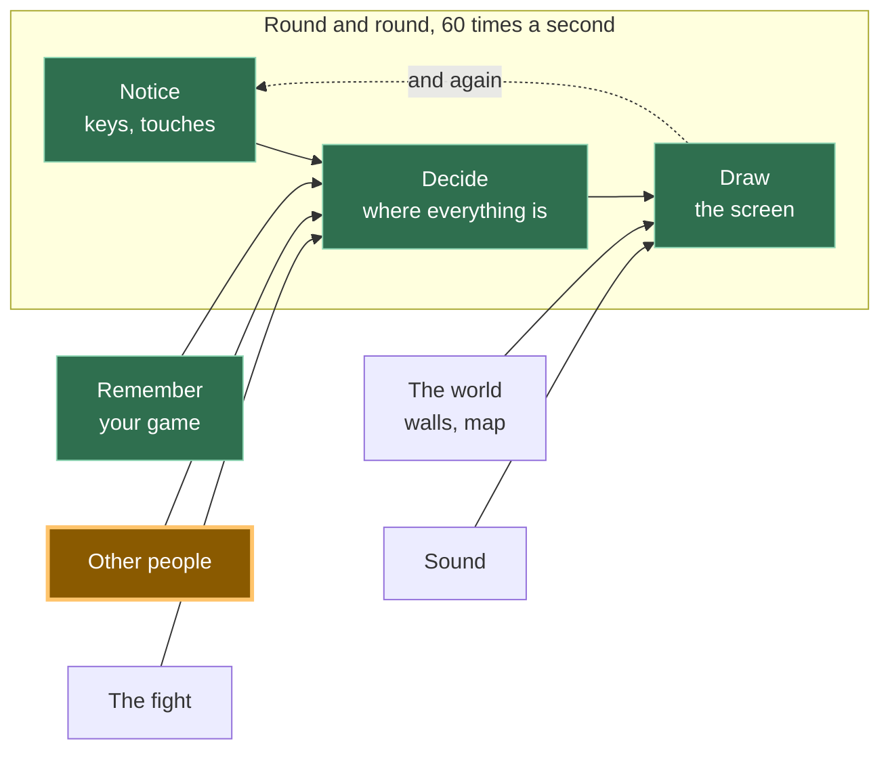

# A12: 他のプレイヤー

他の誰かが自分のコンピューターであなたのゲームを開きます。彼らの四角があなたの画面に表示され、彼らが動くと移動します。これがこのトラック全体が目指してきたステップです。
{: .lesson-intro }

**必要なもの:** [A11](a11.html)。 **得られるもの:** 他のすべてのプレイヤーの四角が、キャンバス上でリアルタイムに動く。

## ゲーム全体と今日の部分



今日は「他のプレイヤー」の箱を構築します。その矢印がどこを指しているかに注目してください。あなたのキーボードと全く同じように、**決定**の中に入っています。あなたのゲームの残りの部分にとって、他のプレイヤーは単に変化した数字の別のセットに過ぎません。

## サーバーは存在しない、そしてそれは半分真実である

**サーバー**とは、常に稼働しているコンピューターで、すべてのゲームがこれと通信します。ほとんどのオンラインゲームにはサーバーがあります。サーバーはワールドを保持しており、停止するとゲームも停止します。

あなたのゲームにはサーバーがありません。あなたのブラウザは、他の人のブラウザと直接通信します。画面上の画像が、途中で誰かのコンピューターを経由することはありません。

正直な部分です。2つのブラウザは何もないところからお互いを見つけることはできません。彼らは「*私はここにいます、これが私に連絡する方法です*」と書かれたメモを残す場所が必要です。そこであなたのゲームは**掲示板**を使用します。これは、他の人々が運営する公開メッセージサービスで、誰でも小さなメモを投稿できます。両方のブラウザがメモを投稿し、お互いのメモを読み、その後直接接続します。その後、掲示板は関与しません。

したがって、「サーバーレス」は半分しか真実ではありません。あなたのゲームを保持するサーバーはありません。導入のために使用される掲示板は*あります*。ゲームがサーバーレスだと言われるとき、ほとんどの場合これが意味することであり、これであなたは尋ねるべきことを知りました。

**もう一つの真実。**一部の家庭、モバイル、オフィス、学校のネットワークでは、2つのブラウザが直接WebRTC接続を行うことを許可していません。このレッスンでは**p2p-core**を使用します。これは、その公開リレーが応答しているかどうかを教えてくれるため、推測する代わりに問題を調査できます。リレーが応答しているにもかかわらず、2つの異なるネットワークがまだ接続できない場合、不足しているピースはゲームのバグではなくTURNリレーである可能性があります。[A14](a14.html)以降のすべてはリモートマルチプレイヤーなしで動作するため、p2p-coreが同じブラウザのタブを直接接続するため、A12は2つのタブでテストできます。

## ブロックに分割する

「他のプレイヤーが登場する」は3つの要素から成ります。

1.  **接続** — ルームに参加し、誰かが到着または退出したときに通知を受ける
2.  **送信** — 1秒間に10回、自分の四角がどこにあるかを全員に伝える
3.  **描画** — 他のすべてのプレイヤーの四角を描く

**なぜ分割するのか？** もしそれが一つの塊で、うまくいかなかった場合、どの部分が間違っているのかを特定できないからです。ルームに誰もいないというのは接続の問題です。ルームに誰かがいるのに四角が動かないのは送信の問題です。数字が届いているのに画面に何も表示されないのは描画の問題です。3つのブロック、3つの別々の質問 — そして他の2つに触れることなく、コンソールからそれぞれに答えることができます。

初回でこれを動作させる人はほとんどいません。これはこのトラックの他のどの部分よりも、ここでは普通のことであり、よくあることです。

## ブロック1: 接続

接続は、このコースで使用される唯一のマルチプレイヤーライブラリである**[p2p-core](https://github.com/KakkoiDev/p2p-core)**によって行われます。**ライブラリ**とは、あなたが自分で書く代わりに利用する、他の誰かが書いたコードです。p2p-coreは、ピアの検索、共有公開掲示板の選択、WebRTCリンクの開設、同一ブラウザでのテスト、接続診断といった厄介な部分を処理するため、あなたはこのレッスンをあなたのゲームに属する3つのアイデアに集中できます。

以下の正確に指定されたバージョンを使用してください。リレーリストを作成したり、自分で`RTCPeerConnection`を作成したり、アシスタントがたまたま知っているからといって別のマルチプレイヤーパッケージに入れ替えたり**しないでください**。

```
import { joinRoom, selfId } from 'https://cdn.jsdelivr.net/gh/KakkoiDev/p2p-core@v0.1.0/p2p-core.js';

const room = joinRoom({
  app: 'kakkoi-online',
  room: 'demo',
  kinds: ['move'],
});

const others = {};

room.onMessage('move', (where, id) => {
  if (!Number.isFinite(where?.x) || !Number.isFinite(where?.y)) return;
  others[id] = { x: where.x, y: where.y };
});

room.onPeerJoin((id) => {
  room.send('move', { x: player.x, y: player.y }, id);
});

room.onPeerLeave((id) => {
  delete others[id];
});

window.room = room;
```

`app` はどのゲームをプレイしているかを示します。`room` はそのゲーム内のどのルームかを示します。同じペアを使用している全員が互いに出会います。`kinds: ['move']` は、このページがどのような種類のメッセージを期待しているかを p2p-core に事前に伝えます。メッセージの種類を早期に登録することで、ハンドラーが存在する前に最初のネットワークメッセージが到着する競合状態を回避できます。

`selfId` はこのページのためのランダムな名前で、ロードされるたびに新しく生成されます。他のプレイヤーはあなたの実際のIDではなく、そのランダムなIDを受け取ります。

`others` は、このブロックが保持する唯一のゲーム状態です。他のプレイヤーごとに1つの位置情報です。`onPeerLeave` はプレイヤーを削除するため、タブを閉じると、幽霊を残す代わりに彼らの四角も削除されます。

`onPeerJoin` の内部にある行は、現在の位置をすぐに新しく参加した人に送信します。その後、ブロック2のタイマーが全員を最新の状態に保ちます。

### 接続がうまくいかない場合

アシスタントにネットワーキングを書き直すよう依頼しないでください。まずコンソールに以下を入力してください。

```
room.status()
```

`transports.relays` を見てください。`open` が `0` の場合、現在のネットワークが公開掲示板をブロックしています。1つ以上のリレーが開いているのに他のコンピューターがまだ表示されない場合、2つのネットワークが直接WebRTCパスをブロックしている可能性があります。その場合、TURNが必要になるかもしれません。p2p-coreはこの情報を公開しているので、次のステップは推測のネットワーキングコードの新しい山ではなく、証拠に基づいています。

インポートは、jsDelivr を介して**バージョン管理された** GitHub リリースから直接行われます。バンドラーもビルドステップもありません。ブラウザは通常の ES モジュールをロードします。`v0.1.0` を固定することで、すべての学生とすべてのアシスタントが同じ API で作業することになります。

## ブロック2: 送信

```
setInterval(() => room.send('move', { x: player.x, y: player.y }), 100);
```

`setInterval(f, 100)` は100ミリ秒ごとに `f` を実行します — つまり**1秒間に10回**、指をタップするのとほぼ同じ頻度です。

あなたの四角は1秒間に60回動きます。1秒間に60回送信することもできます。しかし、そうしないでください。すべてのメッセージはすべてのプレイヤーに送られるため、6人部屋の場合、同じように見える四角を描画するために、あなたのコンピューターから1秒間に60メッセージではなく360メッセージが送信されることになります。1秒間に10回で十分に生き生きと見えます。

これは[A11](a11.html)で1秒間に2回保存するのと同じ考え方です。費用のかかることは、できるだけ稀に行いましょう。

## ブロック3: 描画

```
function draw() {
  ctx.fillStyle = '#1b1b22';
  ctx.fillRect(0, 0, canvas.width, canvas.height);

  ctx.font = '12px system-ui, sans-serif';
  for (const id in others) {
    ctx.fillStyle = '#6bb8ff';
    ctx.fillRect(others[id].x, others[id].y, SIZE, SIZE);
    ctx.fillText(id.slice(0, 4), others[id].x, others[id].y - 4);
  }

  ctx.fillStyle = '#7ee081';
  ctx.fillRect(player.x, player.y, SIZE, SIZE);
}
```

他のプレイヤーは青、あなたは緑で、各プレイヤーのIDの最初の4文字がそれぞれの四角の上に表示されるので、2人を区別できます。

このブロックが*行わない*ことに注目してください。誰がどこにいるのかを尋ねません。`others` リストを、`player` を読み取るのと全く同じ方法で読み取ります。だからこそ[A10](a10.html)は、通知、決定、描画を分離したのです。あなたの描画コードは数字がどこから来たのかを気にしていないため、他の人の四角を描画するために余分な3行しかかかりません。

## なぜこの方法を採用したのか

全体的な構造は一つの決定に基づいています。サーバーを置かないということです。サーバーは毎月費用がかかり、誰かがそれを稼働させ続ける必要があります。12歳の子供がこのゲームを公開し、友達にリンクを送って、誰にも支払うことなく1年後も動作するようにすべきです。それがゲームを保持するサーバーを排除する理由です。だからブラウザ同士が通信し、無料の公開掲示板が紹介の役割を果たします。

## 代わりにできたこと

| これの代わりに | その費用 |
|---|---|
| ワールドを保持する実際のサーバー | 厳格な学校ネットワークでも常に動作し、チートを防ぐことができます。しかし、毎月費用がかかり、稼働させ続ける必要があり、ダウンするとすべてのプレイヤーのゲームもダウンします |
| 毎フレーム自分の位置を送信する | 誰も区別できない絵のために、6倍のメッセージが送られることになります。携帯電話では、無駄にバッテリーを消費することになります |
| "私はx, yにいます" の代わりに "右を押しました" を送信する | メッセージ数は減ります。しかし、すべてのコンピューターが全員がどこにたどり着いたかを計算する必要があり、1つのメッセージが失われると2人のプレイヤーが永遠に異なる世界を見ることになります |
| 生のWebRTC、生のTrystero、または別のマルチプレイヤーパッケージ | 再び発見、リレー選択、ブラウザ接続の詳細を解決することになります。p2p-coreはすでにこのコースのその役割を担っているため、ライブラリを変更すると、今日のアイデアを教えることなく失敗モードを追加することになります |

## プロンプト

このプロンプトを正確にコピーしてください。ライブラリ名、バージョン、インポートURL、APIはタスクの一部であり、アシスタントが独自のネットワーキングスタックを考案しないようにするためです。

```
I have a canvas game in plain JavaScript. main.js keeps the player in
{x, y}, moves it in update(dt), and paints it in draw().

Use KakkoiDev/p2p-core v0.1.0 directly for multiplayer. Import EXACTLY:
import { joinRoom, selfId } from 'https://cdn.jsdelivr.net/gh/KakkoiDev/p2p-core@v0.1.0/p2p-core.js';

Do not use raw WebRTC, raw Trystero, PeerJS, Socket.IO, Firebase, or a
hand-written relay list. Do not add npm, a build step, or a server.

Create exactly one room:
const room = joinRoom({
  app: 'kakkoi-online',
  room: 'demo',
  kinds: ['move'],
});

Add multiplayer in three separate blocks with a comment above each:
CONNECT (an others object, room.onMessage('move'), room.onPeerJoin,
room.onPeerLeave, and expose window.room = room for room.status()),
SEND (room.send('move', {x, y}) on a setInterval at 10 per second),
DRAW (paint the other squares).

Reject a move unless x and y are finite numbers. Do not change update().
Plain JavaScript, no build step.
```

**出力で5つのことを確認してください:** インポートURLが上記の固定されたp2p-core URLと完全に一致していること。`joinRoom` が1つだけであること。リレーリストや手書きのWebRTCコードがないこと。送信が`requestAnimationFrame`ではなく100ミリ秒のタイマーで行われること。そして`onPeerLeave`が四角を削除すること。もしアシスタントがライブラリを変更したり、ネットワーク機能を考案したりした場合は、そこで作業を中断し、その考案をデバッグするのではなく、正確なプロンプトに戻るように指示してください。

## 動作を確認する


ページを2回、2つのブラウザタブで開き、数秒待ってください。

1.  各タブに青い四角が表示され、その上に4文字が表示されます。それがもう一方のタブです。
2.  一方のタブで矢印キーを使って緑の四角を動かします。もう一方のタブの青い四角も同じように動きます。
3.  2番目のタブでコンソールを開き、`others` と入力します。`{6phtXPzeOsFqgp95188x: {x: 411.696, y: 288}}` のようなオブジェクトが表示されます。これらの2つの数字は、1番目のタブの `player` と同じ数字です。これが証拠です。画像は偶然かもしれませんが、小数点以下3桁まで一致する数字は偶然ではありません。
4.  最初のタブを閉じます。数秒以内に2番目のタブの青い四角が消え、`others` が `{}` になります。
5.  3番目のタブを開きます。2つ目の青い四角が表示されます — 上の画像は3人のプレイヤーがルームにいる状態で撮影されたものです。

ステップ1が2つのタブで発生しない場合、コードを変更する前に `room.status()` と入力してください。p2p-coreを使用すると、2つのタブはブラウザ自体を介して通信できるため、このテストは公開リレーに依存しません。後で2つの異なるコンピューターでテストするときも、同じステータスオブジェクトがリレーディスカバリが利用可能かどうかを教えてくれます。

## これを実行したときに何がうまくいかなかったか

これを読むのは、3つのブロックをゲームに組み込んだ**後**にしてください。そうしないと、何が起こったのか理解できないからです。

このステップをテストする方法は2つのタブを使用することであり、上記のデモでは完璧に機能します。その後、[A11](a11.html)から名前と位置を保存する実際のゲームに追加し、2つのタブを開きました。

**私たちが2人いました。**同じ名前、同じモンスター、両方が歩き回り、両方が本物でした。2番目のタブを閉じても解決しませんでした。なぜなら最初のタブはまだ動作していたからです。

何も壊れていませんでした。両方のタブが同じセーブを読み込んでいました。なぜならセーブはタブではなく、*ブラウザ*に属しているからです。そのため、両方のタブは正しく、正直に「あなた」でした。ゲームは単純に、一度に1人だけがプレイすべきだということを知りませんでした。

解決策は、**最新のウィンドウが優先される**と決定することです。

1.  開いたウィンドウは、同じゲームの他のウィンドウに自身の存在を知らせます。
2.  これを聞いた古いウィンドウは、現在の実際の位置を保存し、それを新しいウィンドウに渡し、**ルームを退出し**、ゲームを取り戻すためのボタン付きの控えめなメッセージを表示します。
3.  新しいウィンドウはその引き渡しをしばらく待ち（400ミリ秒を許容）、受け取った位置から開始します。何も応答がない場合、他のウィンドウはなかったということで、通常通りセーブを読み込みます。

そこには間違いやすい詳細が2つあり、どちらも時間を費やしました。

**古いウィンドウは実際に退出しなければなりません**。ただ描画を停止するだけではいけません。一時停止するだけではまだ接続されたままであり、他の全員には「あなた」が2人いるように見え、バグが修正されていないように見えます。

**新しいウィンドウは、セーブされた位置ではなく、引き渡された位置を使用する必要があります。** ゲームは頻繁に保存されますが、毎フレームではありません。保存されたコピーを使用すると、最後のセーブが行われた場所にジャンプすることになり、ゲームがあなたの場所を見失ったように感じられます。

*同じサイトのウィンドウは直接通信できます — 成熟したプログラマーはこれを`BroadcastChannel`と呼びます。これであなたもその名前を知りました。これは同じサイトのウィンドウ間でのみ機能し、まさにここでの問題に合致します。*

## ゲームに組み込む

[A11](a11.html)のゲームに、上記と全く同じようにp2p-coreを使った3つのブロックを追加してください。既存のものは何も変更しません。`update` とループはそのまま維持されます — あなたは2番目の数字のソースを追加しているのであって、最初のものを書き換えているわけではありません。

<div class="takeaways">
<h2>主なポイント</h2>
<ul>
<li>p2p-coreをコースのネットワーキング境界として使用する: あなたのゲームがメッセージを送信し、ライブラリが発見とブラウザ間接続を処理する</li>
<li>他のプレイヤーは、あなたのキーボードと同じく、単に変化する数字に過ぎない — だからA10での分離がここで報われる</li>
<li>送信は毎フレームではなく、タイマーを使って稀に行う。画像は同じで、コストははるかに低い</li>
<li>プレイヤーが退出したら削除する。そうしないと彼らの四角が画面に永遠に残り続ける</li>
<li>リモート接続が失敗した場合は、コードを変更する前に <code>room.status()</code> を確認する。厳格なネットワークでは、ゲームが正しくてもTURNが必要になる場合がある</li>
<li>セーブはタブではなくブラウザに属する — そのため、どちらのタブがプレイしているかを決めるまでは、2つのタブが2人の「あなた」となる</li>
</ul>
</div>

## あなたの番です

現在、フリーズしたプレイヤー（ラップトップの蓋を閉じた、接続が切断されたなど）は、ルームが彼らが去ったことに気づくまで、あなたの画面に四角が静止したまま残ります。このステップを構築中に私たちにも起こりました。閉じるのではなく終了させられたタブが、数分間 `{x: 100, y: 100}` に青い四角を置き去りにしました。なぜなら、「さようなら」が一度も送信されなかったからです。各メッセージが到着した時間を保存し、3秒間応答がなかった四角をフェードアウトまたは非表示にしてください。*熟練したプログラマーは、そのようなメッセージをハートビートと呼びます。これであなたもその言葉を知りましたね。*