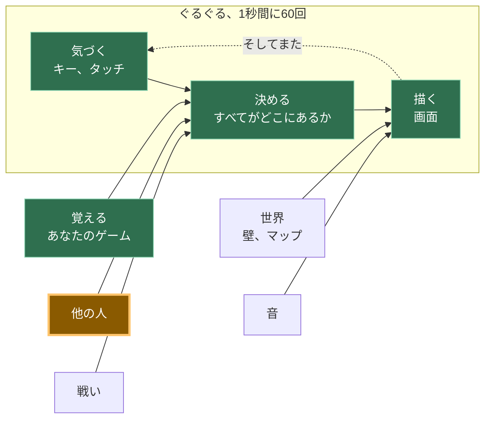

# A12: 他の人

誰かが自分のコンピューターであなたのゲームを開きます。彼らの四角形があなたの画面に表示され、彼らが動くと一緒に動きます。これこそが、このトラック全体が目指してきたステップです。
{: .lesson-intro }

**必要:** [A11](a11.html)。**得られるもの:** 他の全プレイヤーの四角形が、あなたのキャンバス上でリアルタイムに動きます。

## ゲーム全体と、今日の作業



今日は、「他の人」のボックスを構築します。矢印がどこを指しているかに注目してください。あなたのキーボードとまったく同じように、**決定**の方向を指しています。ゲームの他の部分にとって、別のプレイヤーは、単に変化した別の数値のセットにすぎません。

## サーバーは存在せず、それは半分真実です

**サーバー**とは、常に稼働しており、全員のゲームが通信するコンピューターです。ほとんどのオンラインゲームにはサーバーがあります。サーバーは世界を保持し、停止するとゲームも停止します。

あなたのゲームにはそれ（サーバー）がありません。あなたのブラウザは、他の人のブラウザと直接通信します。画面上の画像は、途中で誰かのコンピューターを経由することはありません。

正直な部分を説明します。2つのブラウザは何もないところからお互いを見つけることはできません。彼らは「*私はここにいます。これが私に連絡する方法です*」と書かれたメモを残す場所が必要です。そこであなたのゲームは**掲示板**を利用します。これは他の人々によって運営される公開メッセージサービスで、誰でも小さなメモを投稿できます。両方のブラウザがメモを投稿し、お互いのメモを読み取り、その後直接接続します。その後、掲示板は関与しません。

したがって、「サーバーレス」は半分しか真実ではありません。あなたのゲームを保持するサーバーはありません。紹介のために使用される掲示板は*存在します*。人々がゲームはサーバーレスだと言うとき、これはほとんどの場合彼らが意味することであり、これであなたは尋ねるべきことを知りました。

**もう一つの真実。**一部の家庭、モバイル、オフィス、学校のネットワークでは、2つのブラウザが直接WebRTC接続を行うことを許可していません。このレッスンでは、**p2p-core**を使用します。これは、その公開リレーが応答しているかどうかを教えてくれるため、推測する代わりに問題を調査できます。もしリレーが応答しているのに2つの異なるネットワークがまだ接続できない場合、不足しているのはゲームのバグではなく、TURNリレーである可能性があります。[A14](a14.html)以降のすべてはリモートマルチプレイヤーなしで動作するため、p2p-coreが同じブラウザのタブを直接接続するため、A12は2つのタブでテストできます。

## ブロックに分割する

"他の人が現れる"ことは、次の3つのことです。

1. **接続** — ルームに参加し、誰かが到着または退出したときに通知を受ける
2. **送信** — 1秒間に10回、全員に自分の四角形がどこにあるかを伝える
3. **描画** — 他の全員の四角形を描く

**なぜわざわざ分割するのか？** もしそれが一つの塊で、うまくいかなかった場合、どの部分が間違っているのかを特定できないからです。ルームに誰もいない場合は接続の問題です。ルームに誰かがいるのに四角形が動かない場合は送信の問題です。数値は届いているのに画面に何も表示されない場合は描画の問題です。3つのブロック、3つの別々の質問 — そして、他の2つに触れることなく、コンソールからそれぞれに答えることができます。

ほとんど誰もこれを初回で動作させることはできません。これはこのトラックの他のどの部分よりも、ここでは通常のことであり、当たり前です。

## ブロック1：接続

接続は、このコースで使用される唯一のマルチプレイヤーライブラリである**[p2p-core](https://github.com/KakkoiDev/p2p-core)**によって行われます。**ライブラリ**とは、あなたが自分で書く代わりに利用する、誰かが書いたコードのことです。p2p-coreは、ピアの発見、共有公開掲示板の選択、WebRTCリンクの開設、同一ブラウザでのテスト、接続診断といった厄介な部分を処理するため、あなたはこのレッスンでゲームに属する3つのアイデアに集中できます。

以下の正確に固定されたバージョンを使用してください。リレーリストを作成したり、自分で`RTCPeerConnection`を作成したり、アシスタントがたまたま知っているからといって別のマルチプレイヤーパッケージに交換したり**しないでください**。

```
import { joinRoom, selfId } from 'https://cdn.jsdelivr.net/gh/KakkoiDev/p2p-core@v0.1.0/p2p-core.js';

const room = joinRoom({
  app: 'kakkoi-online',
  room: 'demo',
  kinds: ['move'],
});

const others = {};

room.onMessage('move', (where, id) => {
  if (!Number.isFinite(where?.x) || !Number.isFinite(where?.y)) return;
  others[id] = { x: where.x, y: where.y };
});

room.onPeerJoin((id) => {
  room.send('move', { x: player.x, y: player.y }, id);
});

room.onPeerLeave((id) => {
  delete others[id];
});

window.room = room;
```

`app`はあなたがプレイしているゲームを示します。`room`はそのゲーム内のどの部屋かを示します。同じペアを使用する全員がお互いに出会います。`kinds: ['move']`は、このページがどのような種類のメッセージを期待しているかをp2p-coreに事前に伝えます。メッセージの種類を早期に登録することで、ハンドラーが存在する前に最初のネットワークメッセージが到着するという競合状態を回避します。

`selfId`は、このページに与えられるランダムな名前で、読み込むたびに新しく生成されます。他のプレイヤーはそのランダムなIDを受け取り、あなたの本当のIDではありません。

`others`は、このブロックが保持する唯一のゲーム状態です。他のプレイヤーごとに1つの位置を保持します。`onPeerLeave`はプレイヤーを削除するため、タブを閉じると幽霊を残すのではなく、その四角形が削除されます。

`onPeerJoin`内の行は、あなたの現在の位置をすぐに新規参加者に送信します。その後、ブロック2のタイマーが全員を最新の状態に保ちます。

### 接続が機能しない場合

アシスタントにネットワークを書き換えさせないでください。まず、コンソールに次のように入力します。

```
room.status()
```

`transports.relays`を見てください。もし`open`が`0`であれば、現在のネットワークは公開掲示板をブロックしています。1つ以上のリレーが開いているのに別のコンピューターがまだ表示されない場合、2つのネットワークが直接WebRTCパスをブロックしている可能性があります。その場合、TURNが必要になるかもしれません。p2p-coreはこの情報を公開しているため、次のステップは推測による新しいネットワークコードの山ではなく、証拠に基づいています。

インポートは、jsDelivrを介して**バージョン管理された**GitHubリリースから直接行われます。バンドラーもビルドステップもありません。ブラウザは通常のESモジュールを読み込みます。`v0.1.0`に固定することで、すべての学生とすべてのアシスタントが同じAPIで作業することになります。

## ブロック2：送信

```
setInterval(() => room.send('move', { x: player.x, y: player.y }), 100);
```

`setInterval(f, 100)`は、100ミリ秒ごとに`f`を実行します。これは**1秒間に10回**、指をタップするのと同じくらいの頻度です。

あなたの四角形は1秒間に60回動きます。1秒間に60回送信することもできます。しかし、そうしないでください。すべてのメッセージはすべてのプレイヤーに送られるため、6人部屋では、同じように見える四角形を描画するために、あなたのコンピューターから1秒間に60メッセージではなく360メッセージが送信されることになります。1秒間に10回で十分に生き生きと見えます。

これは、[A11](a11.html)で1秒間に2回セーブするのと同じ考え方です。高価な処理は、可能な限りまれに行うようにします。

## ブロック3：描画

```
function draw() {
  ctx.fillStyle = '#1b1b22';
  ctx.fillRect(0, 0, canvas.width, canvas.height);

  ctx.font = '12px system-ui, sans-serif';
  for (const id in others) {
    ctx.fillStyle = '#6bb8ff';
    ctx.fillRect(others[id].x, others[id].y, SIZE, SIZE);
    ctx.fillText(id.slice(0, 4), others[id].x, others[id].y - 4);
  }

  ctx.fillStyle = '#7ee081';
  ctx.fillRect(player.x, player.y, SIZE, SIZE);
}
```

他のプレイヤーは青、あなたは緑で、各プレイヤーのIDの4文字が彼らの四角形の上に表示され、2つの四角形を区別できるようにします。

このブロックが*しない*ことを見てください。誰かに彼らがどこにいるか尋ねません。`player`を読み取るのとまったく同じ方法で、`others`リストを読み取ります。これが[A10](a10.html)が「通知」と「決定」と「描画」を分割した理由です。あなたの描画コードは数値がどこから来たかに関心がなかったため、他の人の四角形を描くのに3行余分なコードが必要になるだけです。

## なぜこの方法を採用したのか

全体の構成は、一つの決定から来ています。サーバーなし。なぜなら、サーバーは毎月お金がかかり、誰かがそれを維持し続けなければならないからです。12歳の子どもがこのゲームを公開し、友人にリンクを送り、誰にも支払うことなく1年後も動作するべきです。そのため、ゲームを保持するサーバーは除外され、ブラウザ同士が通信し、無料の公開掲示板が紹介の役割を果たします。

## 代わりにできたこと

| 代わりにできたこと | それにかかるコスト |
|---|---|
| 世界を保持する実際のサーバー | 厳格な学校ネットワークでも常に動作し、チートを防ぐことができます。しかし、毎月お金がかかり、稼働させ続ける必要があり、ダウンするとすべてのプレイヤーのゲームもダウンします |
| 毎フレーム自分の位置を送信する | 誰も区別できない絵のためにメッセージが6倍になります。電話では、無駄にバッテリーを消費することになります |
| "私はx, yにいます" の代わりに "右を押しました" を送信する | メッセージが少なくなります。しかし、すべてのコンピューターが全員がどこにいるかを計算する必要があり、1つのメッセージが失われると、2人のプレイヤーは永遠に異なる世界を見ることになります |
| 生のWebRTC、生のTrystero、または別のマルチプレイヤーパッケージ | 発見、リレー選択、ブラウザ接続の詳細を再度解決することになります。p2p-coreはこのコースのために既にその役割を担っているため、ライブラリを変更すると今日のアイデアを教えることなく失敗モードが増加します |

## プロンプト

このプロンプトを正確にコピーしてください。ライブラリ名、バージョン、インポートURL、APIはタスクの一部であるため、アシスタントが独自のネットワークスタックを考案することはありません。

```
I have a canvas game in plain JavaScript. main.js keeps the player in
{x, y}, moves it in update(dt), and paints it in draw().

Use KakkoiDev/p2p-core v0.1.0 directly for multiplayer. Import EXACTLY:
import { joinRoom, selfId } from 'https://cdn.jsdelivr.net/gh/KakkoiDev/p2p-core@v0.1.0/p2p-core.js';

Do not use raw WebRTC, raw Trystero, PeerJS, Socket.IO, Firebase, or a
hand-written relay list. Do not add npm, a build step, or a server.

Create exactly one room:
const room = joinRoom({
  app: 'kakkoi-online',
  room: 'demo',
  kinds: ['move'],
});

Add multiplayer in three separate blocks with a comment above each:
CONNECT (an others object, room.onMessage('move'), room.onPeerJoin,
room.onPeerLeave, and expose window.room = room for room.status()),
SEND (room.send('move', {x, y}) on a setInterval at 10 per second),
DRAW (paint the other squares).

Reject a move unless x and y are finite numbers. Do not change update().
Plain JavaScript, no build step.
```

**出力で5つのことを確認してください。**インポートURLが上記の固定されたp2p-core URLと完全に一致していること。`joinRoom`が1つだけであること。リレーリストや手書きのWebRTCコードがないこと。送信が`requestAnimationFrame`ではなく100ミリ秒のタイマーで行われていること。そして、`onPeerLeave`が四角形を削除すること。アシスタントがライブラリを変更したり、ネットワークを考案したりした場合は、そこで作業を中止し、その発明をデバッグするのではなく、正確なプロンプトに戻るように指示してください。

## 動作を確認する


ページを2つのブラウザタブで2回開き、数秒待ちます。

1. 各タブに青い四角形が現れ、その上に4文字のIDが表示されます。それがもう一方のタブです。
2. 片方のタブで緑の四角形を矢印キーで動かします。もう一方のタブの青い四角形も同じように動きます。
3. 2番目のタブでコンソールを開き、`others`と入力します。`{6phtXPzeOsFqgp95188x: {x: 411.696, y: 288}}`のようなオブジェクトが表示されます。これらの2つの数値は、1番目のタブの`player`と同じ数値です。これが証拠です。画像は偶然かもしれませんが、小数点以下3桁まで一致する数値は偶然ではありえません。
4. 1番目のタブを閉じます。数秒以内に、2番目のタブの青い四角形が消え、`others`は`{}`になります。
5. 3番目のタブを開きます。2つ目の青い四角形が現れます。上記の写真は、ルームに3人のプレイヤーがいたときに撮影されたものです。

もしステップ1が2つのタブで全く発生しない場合、コードを変更する前に`room.status()`と入力してください。p2p-coreを使用すると、2つのタブはブラウザ自体を介して通信できるため、このテストは公開リレーに依存しません。後で2つの異なるコンピューターでテストする際には、同じステータスオブジェクトがリレー検出が利用可能かどうかを教えてくれます。

## これを実行したときに何が問題だったか

3つのブロックをゲームに組み込んだ**後で**これを読んでください。なぜなら、その時に問題が発生するからです。

このステップをテストする方法は2つのタブを使用することであり、上記のデモでは完璧に機能しました。その後、[A11](a11.html)から名前と位置を保存する実際のゲームにそれを追加し、2つのタブを開きました。

### 私たちは二人いた。

同じ名前、同じモンスター、両方が歩き回り、両方が本物でした。2番目のタブを閉じても解決しませんでした。なぜなら、1番目のタブがまだ動作していたからです。

何も壊れていませんでした。両方のタブが同じセーブデータを読み込んでいました。なぜなら、セーブデータはタブではなく、*ブラウザ*に属しているからです。そのため、両方のタブは正しく、正直に、あなた自身でした。ゲームは、一度に1人だけがプレイすべきだということを単純に知りませんでした。

解決策は、**最新のウィンドウが勝利する**と決定することです。

1. 開かれたウィンドウは、同じゲームの他のすべてのウィンドウに自身を知らせます。
2. これを聞いた古いウィンドウは、現在の実際の位置を保存し、それを渡し、**ルームを退出し**、ゲームを取り戻すボタン付きの控えめなメッセージを表示します。
3. 新しいウィンドウは、その引き継ぎをしばらく待ち（400ミリ秒を許容します）、受け取った位置から開始します。何も応答がない場合、他のウィンドウは存在せず、通常通りセーブデータを読み込みます。

そこに2つの細部があり、どちらも間違いやすく、どちらも時間を要しました。

**古いウィンドウは、描画を停止するだけでなく、本当に退出する**必要があります。一時停止するだけだと、まだ接続されているため、他の全員にはまだ2人のあなたが見え、バグが未修正のように見えます。

**新しいウィンドウは、セーブされた位置ではなく、引き渡された位置を使用する**必要があります。ゲームは毎フレームではなく、時々セーブされます。セーブされたコピーを使用すると、最後のセーブが行われた場所に飛び戻ることになり、ゲームがあなたの場所を忘れたように感じられます。

*同じサイトのウィンドウ同士は直接通信できます — 経験豊富なプログラマーはこれを`BroadcastChannel`と呼びます。これであなたもその名前を知りました。これは同じサイトのウィンドウ間でのみ機能し、まさにここでの問題に合致します。*

## ゲームに組み込む

[A11](a11.html)からゲームを取り出し、上記の通り正確にp2p-coreを使用して3つのブロックを追加します。既存のものは何も変更されません。`update`とループはまったくそのまま維持されます。あなたは2番目の数値のソースを追加するのであって、最初のソースを書き換えるのではありません。

<div class="takeaways">
<h2>主なポイント</h2>
<ul>
<li>p2p-coreをコースのネットワーク境界として使用する。あなたのゲームはメッセージを送信し、ライブラリが検出とブラウザ間の接続を処理します。</li>
<li>他のプレイヤーは、あなたのキーボードと同じく、単に変化する数値にすぎません。これがA10の分割がここで報われる理由です。</li>
<li>毎フレームではなく、タイマーで稀に送信する。絵は同じで、コストははるかに低くなります。</li>
<li>プレイヤーが退出したら削除する。さもなければ、彼らの四角形は永遠にあなたの画面をさまよい続けます。</li>
<li>リモート接続が失敗した場合、コードを変更する前に`room.status()`を検査する。あなたのゲームが正しくても、厳格なネットワークではTURNが必要になる場合があります。</li>
<li>セーブデータはタブではなくブラウザに属します。そのため、どちらがプレイしているかを決めるまでは、2つのタブは2人のあなたになります。</li>
</ul>
</div>

## あなたの番

現在、フリーズしたプレイヤー（ラップトップの蓋を閉じた、接続が切れたなど）は、ルームが彼らが去ったことに気づくまで、あなたの画面に四角形が静止したまま残ります。これは、このステップを構築中に私たちに起こりました。閉じられたのではなく強制終了されたタブが、「さようなら」が送信されなかったため、青い四角形を`{x: 100, y: 100}`に何分も駐車したままにしました。各メッセージが到着した時間を保存し、3秒間何も聞こえてこない四角形はフェードアウトまたは非表示にしてください。*経験豊富なプログラマーは、そのようなメッセージをハートビートと呼びます。これであなたもその言葉を知りました。*