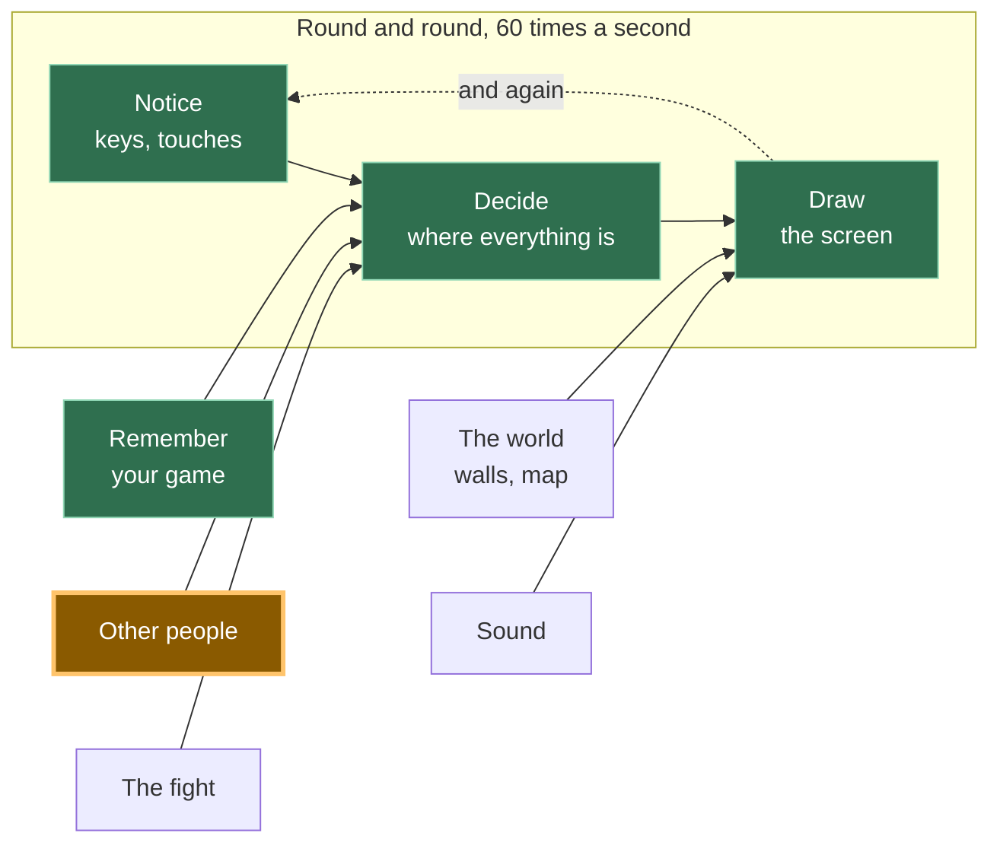

# A13: 安全な会話

他の人が画面に表示されるようになったので、何か話しかけたくなりますよね。意地悪な使い方ができない会話方法と、到着した奇妙なものをすべて捨てるチェック機能を作成します。
{: .lesson-intro }

**必要なもの:** [A12](a12.html)。**得られるもの:** タップできる6つのフレーズで、全員の画面であなたのマスの上に表示されます。

## ゲーム全体と今日の部分



[A12](a12.html)と同じボックスの後半です。他のプレイヤーはすでにあなたの位置を送信してきていますが、今度は言葉も送信してきます。

## 意図的にテキストボックスはありません

あなたのゲームには6つのボタンがあります。入力する場所はありません。これは意図的な決定であり、それについて議論できるように、その理由を説明します。

企業が運営するゲームでは、誰かが見張っています。もしプレイヤーが意地悪な行為をした場合、報告され、警告され、または追放される可能性があり、報告書は人が読みます。あなたのゲームにはサーバーがないため、話された内容の記録がなく、責任者もおらず、報告する相手もいません。後で何も確認できません。なぜなら「後で」が存在しないからです。言葉はブラウザからブラウザへ直接送られ、どこにもコピーが残りません。

したがって、選択肢は、意地悪なことをする手段を作り、それに対処する方法がないままにするか、あるいは作らないかです。私たちは作らないことを選びました。*見ることができないものを管理することはできないため、管理できないものを作ってはいけません。*

6つのフレーズで一緒に遊ぶには十分です。「ついてきて」や「戦おう！」は、ゲームの実際の役割を果たします。

### 他の人が見ることができるもの

これは重要であり、簡潔です。あなたのゲームから、他のプレイヤーが見ることができるのは次のとおりです。

- あなたが選んだ、あなたのマスに表示される名前（本名である必要はありません）
- キャンバス上のあなたのマスの位置
- あなたがタップした6つのフレーズのうちどれか

他のプレイヤーは、あなたの本名、居住地、学校、顔、あるいはあなたのコンピューター上の何一つ見ることはできません。あなたのゲームはそれらを一切求めないため、渡すものも何もありません。

さらに2つのことをはっきりとお伝えします。**ここに責任者はいません。** 報告ボタンはありません。なぜなら、報告する相手がいないからです。そして、もし誰かがあなたに意地悪なことをした場合（丁寧な6つのフレーズであっても、人は方法を見つけます）、タブを閉じてください。何も失うものはありません。そして、信頼できる大人に話してください。これは些細なことでも、恥ずかしいことでもありません。まさに正しい行動であり、効果的です。

## ブロックに分割する

「会話」は3つのことです。

1. **選択** — 存在するフレーズの1つを選ぶ
2. **送信** — 選んだものを送信する
3. **表示** — 到着したフレーズを、チェック後に送信者のマスの上に表示する

「なぜわざわざ分割するのか？」一つの塊でうまくいかなかった場合、どの部分が間違っているのか分からなくなるからです。タップしても何も起こらない場合、それは「選択」の問題を意味します。自分のフレーズは表示されるのに相手のフレーズは表示されない場合、それは「送信」の問題を意味します。そして**表示**が最も重要です。これは他人のコンピューターからのデータを扱う唯一のブロックであり、与えられたものを信用しないといけない唯一のブロックだからです。これを分離しておくことで、意図的にごみを送ってそれが破棄されるのを見ることでテストできます。

## ブロック1: 選択

```
const PHRASES = ["Hi!", "Nice one!", "Let's fight!", "Follow me", "Good game", "Bye"];

for (let i = 0; i < PHRASES.length; i++) {
  const button = document.createElement('button');
  button.textContent = PHRASES[i];
  button.addEventListener('click', () => say(i));
  document.querySelector('#phrases').append(button);
}
```

1つのリストから6つのボタンが作られます。リストを変更すると、ボタンもそれに合わせて変更されます。

各ボタンは`i`（**インデックス**、つまりリスト内の位置）を記憶しています。「"Hi!"」はインデックス0、「"Nice one!"」はインデックス1といった具合です。1からではなく0から数えるのは、しばらくの間は奇妙に見えるかもしれませんが、やがて慣れる習慣です。

## ブロック2: 送信

```
function say(i) {
  sendSay(i);
  player.said = PHRASES[i];
  player.until = performance.now() + SHOW_FOR;
}
```

**言葉ではなく、番号を送信します。** `2`を送信するだけで十分です。なぜなら、他のプレイヤーのゲームも同じリストを持っていて、自分で`PHRASES[2]`を検索するからです。

これはスペースを節約するためではありません。6つの短いフレーズはごくわずかです。番号は文章を含むことができないからです。もし言葉が送られるとしたら、改造されたゲームはどんな言葉でも送ることができてしまいます。番号はリスト上の6つの事柄のいずれか一つしか意味できず、もしそうでなければ、ブロック3がそれを破棄します。

`until`は、このフレーズの描画を停止する時間です。`SHOW_FOR`は3000ミリ秒、つまり3秒です。読むには十分な長さで、古いチャットで画面がいっぱいにならない程度の短さです。

## ブロック3: 表示

```
onSay((i, id) => {
  if (!Number.isInteger(i) || i < 0 || i >= PHRASES.length) {
    window.dropped = (window.dropped || 0) + 1;   // so you can check it worked
    return;
  }
  others[id] = { ...others[id], said: PHRASES[i], until: performance.now() + SHOW_FOR };
});
```

このチェックを声に出して読んでください: *到着したものが整数でない、または0未満である、またはリストの末尾を超えている場合、停止 — 何もするな。*

`Number.isInteger`は「これは整数ですか？」と尋ねます。「"Hi!"」にはNo、「`1.5`」にはNo、何も入力されなければNoと答えます。その後の2つの比較は、「この番号は私たちが実際に持っているフレーズを指していますか？」と尋ねます。

**他のコンピューターが送ってくるものを決して信用してはいけません。** あなたのコードはあなたのマシンで実行されていますが、メッセージは他の誰かのマシンから来たものであり、彼らのゲームのコピーが何をするかあなたは知りません。彼らが変更したのかもしれません。彼らの接続が何かをスクランブルしたのかもしれません。彼らが意図的に賢いことをしているのかもしれません。チェックがなければ、`PHRASES[99]`は`undefined`となり、あなたのゲームは彼らのマスの上に「undefined」という単語を描画します。他の不正な値はさらに悪いことを引き起こします。チェックがあれば、何も起こりません。まさにそれが起こるべきことです。

次に、それが属するマスの隣に描画します。

```
if (who.until > performance.now()) {
  ctx.fillStyle = '#fff';
  ctx.fillText(who.said, who.x, who.y - 20);
}
```

メッセージのリストも、スクロールする履歴もありません。フレーズはマスの上に浮かび、そして消えます。

## なぜこの方法にしたのか

強制的な制約は、[A12](a12.html)をP2Pにしたのと同じものです: サーバーがないこと。サーバーがないということは、ログがなく、モデレーターもおらず、BANもできず、何も元に戻す方法がないということです。下品な言葉のフィルタリング、報告、ミュートなど、他のすべての安全対策は誰かの監視を必要としますが、誰も監視していません。唯一生き残るアプローチは、そもそも不親切なことを表現できないようにすることです。6つのフレーズという制限は、私たちが後悔するものではありません。このゲームがあなたを何から守れるかについて正直な唯一のデザインです。

## 代わりにできたこと

| この代わりに | その代償 |
|---|---|
| 下品な言葉フィルター付きのテキストボックス | フィルターは簡単に回避でき、無害な言葉もブロックしてしまいます。さらに悪いことに、フィルターは保護されているように見えるため、人々は安心しますが、やはり報告する相手はいません。 |
| 報告ボタン付きのテキストボックス | そのボタンは何もしません。報告を受け取るサーバーも、それを読む人もいません。嘘のボタンは、ボタンがないよりも悪いものです。 |
| 番号の代わりに言葉を送信する | 変更されたゲームのコピーは、あなたの画面にどんなものでも送信できてしまい、あなたの側でそれを区別するチェック機能はありません。 |
| チェックせずに番号を信用する | 最初の奇妙なメッセージが来るまでは完璧に動作しますが、その後誰かの頭の上に「undefined」と表示されるか、全員の描画ループが壊れてしまいます。 |

## プロンプト

```
My canvas game already has multiplayer with trystero: a room, a 'move'
action, and an `others` object of peer positions. Add preset-phrase chat
in three blocks with a comment above each: PICK (make one button per
entry in a PHRASES array of 6 strings), SEND (a 'say' action that sends
the array INDEX, not the text), SHOW (on receive, reject the value unless
it is a whole number inside the array, then display the phrase above that
peer's square for 3 seconds). No text input anywhere. Plain JavaScript.
```

出力で確認すること: とにかくテキスト入力が追加されていませんか？アシスタントは、これまで見たほとんどすべてのチャットにテキスト入力があったため、非常によく追加します。もし現れたら、「いいえ、もう一度お願いします」と伝えてください。インデックスを送信していますか、それとも文字列を送信していますか？そして、チェックは`Number.isInteger`を使用していますか、それとも`-1`や`2.5`を喜んで受け入れる`i < PHRASES.length`だけを使用していますか？

## 動作を確認する


ページを2つのタブで開き、もう一方のマスが表示されるのを待ちます。

1. 最初のタブで**「戦おう！」**をタップします。フレーズはあなたの緑のマスの上に、そしてもう一方のタブの青いマスの上に表示されます。3秒後に両方から消えます。
2. 両方のタブでフレーズをタップします。各フレーズは、それが送られたマスの上に表示され、隅のどこかには表示されません。
3. 今度は意図的に壊してみましょう。最初のタブのコンソールで、手動でごみを送信します: `sendSay(99)`、`sendSay("Hi!")`、`sendSay(1.5)`、`sendSay(-1)`。1つはリストの末尾を超えており、1つは数字の代わりに言葉であり、1つは整数ではなく、1つは開始位置より下です。
4. 2番目のタブを見てください。何も描画されませんでした。何も変わっていません — 他のプレイヤーのエントリは、以前とまったく同じままです。そのコンソールで`dropped`と入力すると`4`が返されます。4つすべてが到着し、4つすべてが破棄されました。その後、あなたのマスを動かしてフレーズをタップします。メッセージを拒否することはクラッシュとは異なるため、すべてがまだ機能します。

ステップ4は、このステップの真のテストです。何も拒否したことがないチェックは、テストされていないチェックです。

## ゲームに組み込む

[A12](a12.html)からあなたのゲームに3つのブロックを追加し、キャンバスの下に空の`<div id="phrases">`を1つ追加します。`others`オブジェクトはすでに存在しており、各エントリには`said`と`until`という2つの追加フィールドが加わります。動きに関しては何も変更されません。

<div class="takeaways">
<h2>主なポイント</h2>
<ul>
<li>誰も監視していない状況では、唯一機能する安全対策は、有害なことを言えないようにすることです。</li>
<li>言葉そのものではなく、両者が持つリスト内の項目を指す番号を送信します。</li>
<li>他のコンピューターが送ってくるものを決して信用してはいけません — 使用する前に毎回チェックしてください。</li>
<li>他のプレイヤーが見るのは、あなたが選んだ名前、あなたのマス、そしてあなたのフレーズだけです。あなた自身やあなたのコンピューターに関する情報は何もありません。</li>
<li>もし誰かが不親切な場合: 立ち去り、信頼できる大人に話してください。ここに報告する相手はいません。</li>
</ul>
</div>

## あなたの番です

与えられたプロンプトでは生成されないルールを追加してください: 1秒間に1つ以上のフレーズを送信してはならない。誰かが「バイバイ」と40回連続でタップしても、何も言っていることにはなりませんし、6つの丁寧なフレーズでも許されてしまう唯一の意地悪な行為です。最後に送信したフレーズの時間を覚えておき、`say`内で、それが1秒以内であった場合は早めに`return`してください。次に、より難しい後半を決定してください: *到着する*フレーズが速すぎる場合も無視すべきか、それとも自分のものだけを制限すべきか？*ベテランプログラマーはこれをレートリミットと呼びます。これであなたもそのフレーズを知ったことになりますね。*
