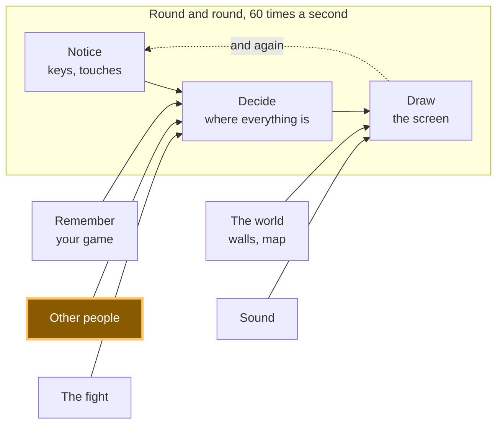

# A13: Talking, Safely

Now that other people are on your screen, you want to say something to them. You will build a way to talk that cannot be used to be cruel, and a check that throws away anything strange that arrives.
{: .lesson-intro }

**Needs:** [A12](a12.html). **Gives you:** six phrases you can tap, appearing above your square on everybody's screen.

## The whole game, and today's piece



Same box as [A12](a12.html), second half. Other people already send you their position; now they send you words too.

## There is no text box, on purpose

Your game has six buttons. It has nowhere to type. That is a decision, and here is the reasoning behind it, because you should be able to argue with it.

In a game with a company behind it, somebody is watching. If a player is cruel, they can be reported, warned, or banned, and a person reads the report. Your game has no server, so it has no records of what was said, nobody in charge, and nobody to report anyone to. Nothing can be checked afterwards, because there is no afterwards — the words went straight from one browser to another and no copy exists anywhere.

So the choice is: build a way to be cruel and have no way to deal with it, or do not build it. We chose not to build it. *You cannot moderate what you cannot see, so do not create what you cannot moderate.*

Six phrases is enough to play together. "Follow me" and "Let's fight!" do the actual work of a game.

### What other people can see

This matters and it is short. From your game, other players can see:

- The name your square shows, which you chose, and which does not have to be your real name
- Where your square is on the canvas
- Which of the six phrases you tapped

They cannot see your real name, where you live, your school, your face, or anything at all on your computer. Your game never asks for any of it, so it has none of it to give away.

Two more things, said plainly. **Nobody is in charge here.** There is no report button, because there is nobody to report to. And if somebody is unkind to you — even with six polite phrases, people find ways — close the tab. You lose nothing. Then tell an adult you trust. That is not a small or embarrassing thing to do; it is exactly the right move, and it works.

## Cutting it into blocks

"Talking" is three things:

1. **Pick** — choose one of the phrases that exist
2. **Send** — send which one you picked
3. **Show** — put an arriving phrase above the sender's square, after checking it

**Why bother splitting it?** Because if it were one lump and it went wrong, you could not tell which part was wrong. Nothing happens when you tap means pick. Your own phrase shows but theirs does not means send. And **show** is the one that matters most: it is the only block that deals with data from somebody else's computer, so it is the only block that has to distrust what it is given. Keeping it separate is what lets you test it by sending deliberate rubbish and watching it get thrown away.

## Block 1: Pick

```
const PHRASES = ["Hi!", "Nice one!", "Let's fight!", "Follow me", "Good game", "Bye"];

for (let i = 0; i < PHRASES.length; i++) {
  const button = document.createElement('button');
  button.textContent = PHRASES[i];
  button.addEventListener('click', () => say(i));
  document.querySelector('#phrases').append(button);
}
```

One list, six buttons made from it. Change the list and the buttons change with it.

Each button remembers `i` — its **index**, which means its position in the list. `"Hi!"` is index 0, `"Nice one!"` is index 1, and so on. Counting from 0 rather than 1 is a habit that will look odd for a while and then stop.

## Block 2: Send

```
function say(i) {
  sendSay(i);
  player.said = PHRASES[i];
  player.until = performance.now() + SHOW_FOR;
}
```

**You send the number, never the words.** Sending `2` is enough, because the other player's game has the same list, and looks up `PHRASES[2]` themselves.

That is not to save space. Six short phrases are tiny. It is because a number cannot contain a sentence. If words travelled, a modified game could send any words at all. A number can only ever mean one of the six things on the list — and if it does not, Block 3 throws it away.

`until` is the time this phrase should stop being drawn. `SHOW_FOR` is 3000 milliseconds, three seconds — long enough to read, short enough that the screen does not fill with old chatter.

## Block 3: Show

```
onSay((i, id) => {
  if (!Number.isInteger(i) || i < 0 || i >= PHRASES.length) {
    window.dropped = (window.dropped || 0) + 1;   // so you can check it worked
    return;
  }
  others[id] = { ...others[id], said: PHRASES[i], until: performance.now() + SHOW_FOR };
});
```

Read the check out loud: *if what arrived is not a whole number, or is below zero, or is past the end of the list, stop — do nothing at all.*

`Number.isInteger` asks "is this a whole number?" It says no to `"Hi!"`, no to `1.5`, no to nothing at all. The two comparisons then ask "does this number point at a phrase we really have?"

**Never believe what another computer sends you.** Your code is running on your machine, but the message came from somebody else's, and you have no idea what their copy of the game does. Perhaps they changed it. Perhaps their connection scrambled something. Perhaps they are being clever on purpose. Without the check, `PHRASES[99]` is `undefined` and your game draws the word "undefined" above their square; other bad values do worse. With the check, nothing happens at all — which is precisely what should happen.

Then draw it, next to the square it belongs to:

```
if (who.until > performance.now()) {
  ctx.fillStyle = '#fff';
  ctx.fillText(who.said, who.x, who.y - 20);
}
```

No list of messages, no scrolling history. The phrase floats above the square, then goes.

## Why we did it this way

The forcing constraint is the same one that made [A12](a12.html) peer-to-peer: no server. No server means no logs, no moderators, no bans and no way to undo anything. Every other safety idea — filtering rude words, reporting, muting — needs somebody watching, and nobody is watching. Only one approach survives that: make the unkind thing impossible to express in the first place. Six phrases is not a limitation we regret. It is the only design that is honest about what this game can protect you from.

## What we could have done instead

| Instead of this | What it would cost |
|---|---|
| A text box with a rude-word filter | Filters are easy to get around and they block innocent words. Worse, a filter looks like protection, so people relax — and there is still nobody to report anything to |
| A text box with a report button | The button would do nothing. There is no server to receive the report and no person to read it. A button that lies is worse than no button |
| Sending the words instead of the number | A changed copy of the game could then send anything at all onto your screen, and no check on your side could tell the difference |
| Trusting the number without checking it | Works perfectly right up to the first strange message, then draws "undefined" above someone's head or breaks the drawing loop for everyone |

## The prompt

```
My canvas game already has multiplayer with trystero: a room, a 'move'
action, and an `others` object of peer positions. Add preset-phrase chat
in three blocks with a comment above each: PICK (make one button per
entry in a PHRASES array of 6 strings), SEND (a 'say' action that sends
the array INDEX, not the text), SHOW (on receive, reject the value unless
it is a whole number inside the array, then display the phrase above that
peer's square for 3 seconds). No text input anywhere. Plain JavaScript.
```

**Check the output for:** did it add a text input anyway? Assistants add one very often, because almost every chat they have ever seen has one — if it appears, say no and ask again. Does it send the index or the string? And does the check use `Number.isInteger`, or only `i < PHRASES.length`, which happily accepts `-1` and `2.5`?

## See it work


Open the page in two tabs and wait for the other square to appear:

1. Tap **Let's fight!** in the first tab. The phrase appears above your green square, and above the blue square in the other tab. After three seconds it fades from both.
2. Tap phrases in both tabs. Each phrase appears above the square that sent it, not somewhere in a corner.
3. Now break it on purpose. In the first tab's console, send rubbish by hand: `sendSay(99)`, `sendSay("Hi!")`, `sendSay(1.5)`, `sendSay(-1)`. One is past the end of the list, one is words instead of a number, one is not a whole number, one is below the start.
4. Look at the second tab. Nothing was drawn. Nothing changed — the other player's entry still says exactly what it said before. Type `dropped` in its console and you get `4`: all four arrived and all four were thrown away. Then move your square and tap a phrase. Everything still works, because refusing a message is not the same as crashing.

Step 4 is the real test of this step. A check you have never seen refuse anything is a check you have not tested.

## Put it in the game

Add the three blocks to your game from [A12](a12.html), plus one empty `<div id="phrases">` under the canvas. The `others` object is already there; each entry gains two extra fields, `said` and `until`. Nothing about movement changes.

<div class="takeaways">
<h2>Key Takeaways</h2>
<ul>
<li>With nobody watching, the only working safety is making the harmful thing impossible to say</li>
<li>Send a number that points into a list you both have, never the words themselves</li>
<li>Never believe what another computer sends you — check it before you use it, every time</li>
<li>Other players see your chosen name, your square, and your phrase; nothing about you or your computer</li>
<li>If somebody is unkind: leave, and tell an adult you trust. There is nobody here to report them to</li>
</ul>
</div>

## Your turn

Add a rule the given prompt does not produce: nobody may send more than one phrase per second. Someone tapping "Bye" forty times in a row is not saying anything, and it is the one unkind thing six polite phrases still allow. Remember the time of the last phrase you sent, and in `say`, return early if it was less than a second ago. Then decide the harder half: should you also ignore phrases that *arrive* too fast, or only limit your own? *Grown-up programmers call this rate limiting, so now you know that phrase too.*
