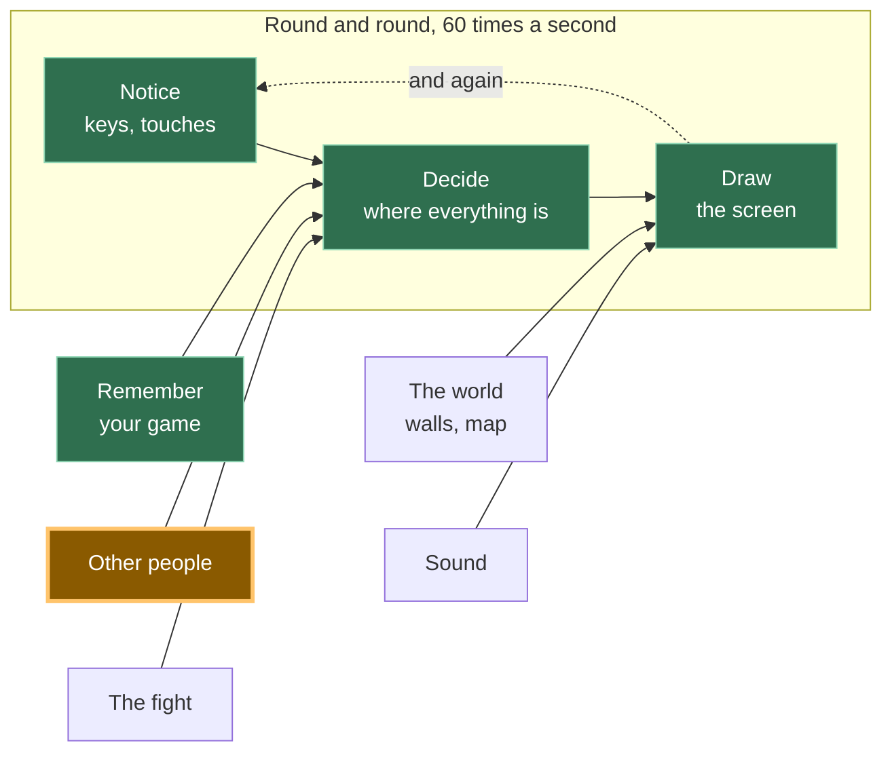

# A13: Conversando, com Segurança

Agora que outras pessoas estão na sua tela, você quer dizer algo a elas. Você construirá uma maneira de conversar que não possa ser usada para ser cruel, e uma verificação que descarta qualquer coisa estranha que chegue.
{: .lesson-intro }

**Necessita:** [A12](a12.html). **Oferece:** seis frases que você pode tocar, aparecendo acima do seu quadrado na tela de todos.

## O jogo completo e a parte de hoje



Mesma caixa de [A12](a12.html), segunda metade. Outras pessoas já enviam sua posição; agora elas também enviam palavras.

## Não há caixa de texto, de propósito

Seu jogo tem seis botões. Não há onde digitar. Essa é uma decisão, e aqui está o raciocínio por trás dela, porque você deve ser capaz de argumentar contra ela.

Em um jogo com uma empresa por trás, alguém está observando. Se um jogador for cruel, ele pode ser denunciado, avisado ou banido, e uma pessoa lê o relatório. Seu jogo não tem servidor, então não tem registros do que foi dito, ninguém encarregado e ninguém a quem denunciar. Nada pode ser verificado depois, porque não há depois — as palavras foram diretamente de um navegador para outro e nenhuma cópia existe em lugar nenhum.

Então a escolha é: construir uma maneira de ser cruel e não ter como lidar com isso, ou não construí-la. Nós escolhemos não construí-la. *Você não pode moderar o que não pode ver, então não crie o que você não pode moderar.*

Seis frases são suficientes para jogar juntos. "Siga-me" e "Vamos lutar!" fazem o trabalho real de um jogo.

### O que outras pessoas podem ver

Isso importa e é breve. Do seu jogo, outros jogadores podem ver:

- O nome que seu quadrado exibe, que você escolheu, e que não precisa ser seu nome real
- Onde seu quadrado está na tela
- Qual das seis frases você tocou

Eles não podem ver seu nome real, onde você mora, sua escola, seu rosto ou qualquer coisa em seu computador. Seu jogo nunca pede nada disso, então não tem nada disso para entregar.

Mais duas coisas, ditas claramente. **Ninguém está no comando aqui.** Não há botão de denúncia, porque não há ninguém para denunciar. E se alguém for indelicado com você — mesmo com seis frases educadas, as pessoas encontram maneiras — feche a aba. Você não perde nada. Depois, conte a um adulto de sua confiança. Isso não é algo pequeno ou embaraçoso de fazer; é exatamente a atitude correta, e funciona.

## Dividindo em blocos

"Conversar" são três coisas:

1. **Escolher** — selecione uma das frases existentes
2. **Enviar** — envie qual você escolheu
3. **Exibir** — coloque uma frase recebida acima do quadrado do remetente, após verificá-la

**Por que se dar ao trabalho de dividir?** Porque se fosse um bloco único e algo desse errado, você não saberia qual parte estava errada. Nada acontece quando você toca significa escolher. Sua própria frase aparece, mas a deles não significa enviar. E **exibir** é o que mais importa: é o único bloco que lida com dados do computador de outra pessoa, então é o único bloco que tem que desconfiar do que lhe é dado. Mantê-lo separado é o que permite testá-lo enviando lixo intencionalmente e observando-o ser descartado.

## Bloco 1: Escolher

```
const PHRASES = ["Hi!", "Nice one!", "Let's fight!", "Follow me", "Good game", "Bye"];

for (let i = 0; i < PHRASES.length; i++) {
  const button = document.createElement('button');
  button.textContent = PHRASES[i];
  button.addEventListener('click', () => say(i));
  document.querySelector('#phrases').append(button);
}
```

Uma lista, seis botões feitos a partir dela. Mude a lista e os botões mudarão com ela.

Cada botão lembra `i` — seu **índice**, o que significa sua posição na lista. `"Hi!"` é o índice 0, `"Nice one!"` é o índice 1, e assim por diante. Contar a partir de 0 em vez de 1 é um hábito que parecerá estranho por um tempo e depois deixará de parecer.

## Bloco 2: Enviar

```
function say(i) {
  sendSay(i);
  player.said = PHRASES[i];
  player.until = performance.now() + SHOW_FOR;
}
```

**Você envia o número, nunca as palavras.** Enviar `2` é suficiente, porque o jogo do outro jogador tem a mesma lista e procura `PHRASES[2]` por conta própria.

Isso não é para economizar espaço. Seis frases curtas são minúsculas. É porque um número não pode conter uma frase. Se as palavras viajassem, um jogo modificado poderia enviar qualquer palavra. Um número só pode significar uma das seis coisas na lista — e se não significar, o Bloco 3 o descarta.

`until` é o tempo em que esta frase deve parar de ser desenhada. `SHOW_FOR` são 3000 milissegundos, três segundos — tempo suficiente para ler, curto o suficiente para que a tela não se encha de conversas antigas.

## Bloco 3: Exibir

```
onSay((i, id) => {
  if (!Number.isInteger(i) || i < 0 || i >= PHRASES.length) {
    window.dropped = (window.dropped || 0) + 1;   // so you can check it worked
    return;
  }
  others[id] = { ...others[id], said: PHRASES[i], until: performance.now() + SHOW_FOR };
});
```

Leia a verificação em voz alta: *se o que chegou não for um número inteiro, ou for menor que zero, ou passar do fim da lista, pare — não faça absolutamente nada.*

`Number.isInteger` pergunta "isso é um número inteiro?". Ele diz não para `"Hi!"`, não para `1.5`, não para nada. As duas comparações então perguntam "este número aponta para uma frase que realmente temos?"

**Nunca acredite no que outro computador lhe envia.** Seu código está sendo executado em sua máquina, mas a mensagem veio de outro computador, e você não tem ideia do que a cópia do jogo deles faz. Talvez eles a tenham mudado. Talvez a conexão deles tenha embaralhado algo. Talvez eles estejam sendo espertos de propósito. Sem a verificação, `PHRASES[99]` é `undefined` e seu jogo desenha a palavra "undefined" acima do quadrado deles; outros valores ruins fazem pior. Com a verificação, nada acontece — o que é precisamente o que deveria acontecer.

Então desenhe, ao lado do quadrado a que pertence:

```
if (who.until > performance.now()) {
  ctx.fillStyle = '#fff';
  ctx.fillText(who.said, who.x, who.y - 20);
}
```

Sem lista de mensagens, sem histórico de rolagem. A frase flutua acima do quadrado, depois desaparece.

## Por que fizemos isso dessa forma

A restrição imposta é a mesma que tornou [A12](a12.html) peer-to-peer: nenhum servidor. Nenhum servidor significa nenhum registro, nenhum moderador, nenhum banimento e nenhuma maneira de desfazer qualquer coisa. Todas as outras ideias de segurança — filtrar palavras rudes, denunciar, silenciar — precisam de alguém observando, e ninguém está observando. Apenas uma abordagem sobrevive a isso: tornar a coisa indelicada impossível de expressar em primeiro lugar. Seis frases não é uma limitação da qual nos arrependemos. É o único design que é honesto sobre o que este jogo pode protegê-lo.

## O que poderíamos ter feito em vez disso

| Em vez disso | O que custaria |
|---|---|
| Uma caixa de texto com filtro de palavras ofensivas | Filtros são fáceis de contornar e bloqueiam palavras inocentes. Pior, um filtro parece proteção, então as pessoas relaxam — e ainda não há ninguém para denunciar nada |
| Uma caixa de texto com botão de denúncia | O botão não faria nada. Não há servidor para receber a denúncia e nenhuma pessoa para lê-la. Um botão que mente é pior do que não ter botão |
| Enviar as palavras em vez do número | Uma cópia modificada do jogo poderia então enviar qualquer coisa para sua tela, e nenhuma verificação do seu lado poderia dizer a diferença |
| Confiar no número sem verificá-lo | Funciona perfeitamente até a primeira mensagem estranha, então desenha "undefined" acima da cabeça de alguém ou quebra o loop de desenho para todos |

## O prompt

```
My canvas game already has multiplayer with trystero: a room, a 'move'
action, and an `others` object of peer positions. Add preset-phrase chat
in three blocks with a comment above each: PICK (make one button per
entry in a PHRASES array of 6 strings), SEND (a 'say' action that sends
the array INDEX, not the text), SHOW (on receive, reject the value unless
it is a whole number inside the array, then display the phrase above that
peer's square for 3 seconds). No text input anywhere. Plain JavaScript.
```

**Verifique a saída para:** adicionou uma entrada de texto de qualquer maneira? Assistentes adicionam uma com muita frequência, porque quase todo chat que eles já viram tem uma — se aparecer, diga não e peça novamente. Ele envia o índice ou a string? E a verificação usa `Number.isInteger`, ou apenas `i < PHRASES.length`, que aceita alegremente `-1` e `2.5`?

## Veja funcionando


Abra a página em duas abas e espere o outro quadrado aparecer:

1. Toque em **Vamos lutar!** na primeira aba. A frase aparece acima do seu quadrado verde e acima do quadrado azul na outra aba. Após três segundos, ela desaparece de ambos.
2. Toque nas frases em ambas as abas. Cada frase aparece acima do quadrado que a enviou, não em algum canto.
3. Agora, quebre-o de propósito. No console da primeira aba, envie lixo manualmente: `sendSay(99)`, `sendSay("Hi!")`, `sendSay(1.5)`, `sendSay(-1)`. Um está além do fim da lista, um são palavras em vez de um número, um não é um número inteiro, um está abaixo do início.
4. Olhe para a segunda aba. Nada foi desenhado. Nada mudou — a entrada do outro jogador ainda diz exatamente o que dizia antes. Digite `dropped` no console e você obterá `4`: todos os quatro chegaram e todos os quatro foram descartados. Em seguida, mova seu quadrado e toque em uma frase. Tudo ainda funciona, porque recusar uma mensagem não é o mesmo que causar um crash.

O passo 4 é o verdadeiro teste desta etapa. Uma verificação que você nunca viu recusar nada é uma verificação que você não testou.

## Coloque no jogo

Adicione os três blocos ao seu jogo de [A12](a12.html), mais uma `div` vazia `<div id="phrases">` abaixo do canvas. O objeto `others` já está lá; cada entrada ganha dois campos extras, `said` e `until`. Nada sobre o movimento muda.

<div class="takeaways">
<h2>Principais Pontos</h2>
<ul>
<li>Sem ninguém observando, a única segurança que funciona é tornar a coisa prejudicial impossível de ser dita</li>
<li>Envie um número que aponte para uma lista que ambos possuem, nunca as palavras em si</li>
<li>Nunca acredite no que outro computador lhe envia — verifique antes de usar, sempre</li>
<li>Outros jogadores veem seu nome escolhido, seu quadrado e sua frase; nada sobre você ou seu computador</li>
<li>Se alguém for indelicado: saia e conte a um adulto de sua confiança. Não há ninguém aqui para denunciá-los</li>
</ul>
</div>

## Sua vez

Adicione uma regra que o prompt dado não produz: ninguém pode enviar mais de uma frase por segundo. Alguém tocando "Tchau" quarenta vezes seguidas não está dizendo nada, e é a única coisa indelicada que seis frases educadas ainda permitem. Lembre-se do tempo da última frase que você enviou, e em `say`, retorne cedo se foi há menos de um segundo. Então decida a parte mais difícil: você também deve ignorar frases que *chegam* muito rápido, ou apenas limitar as suas próprias? *Programadores adultos chamam isso de limitação de taxa (rate limiting), então agora você também conhece essa frase.*
