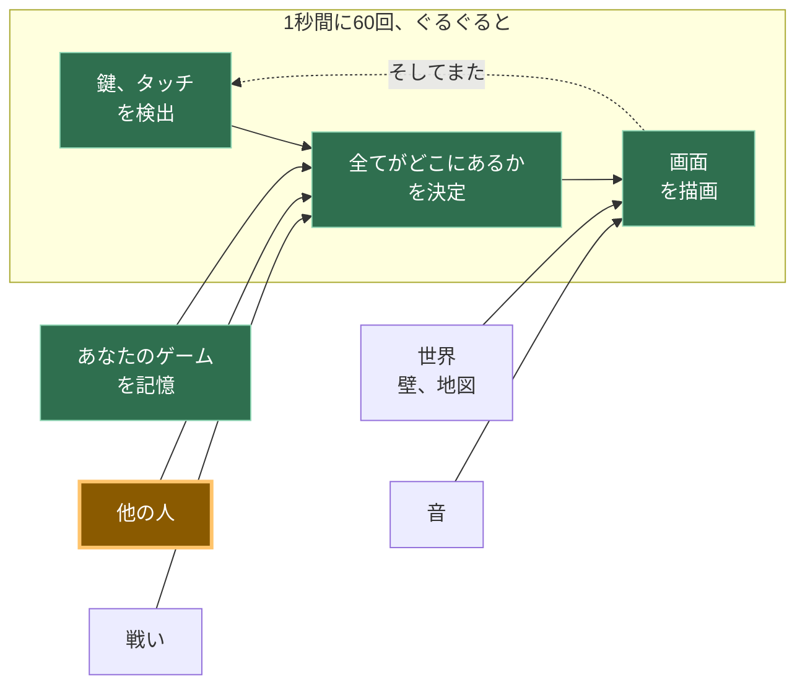

# A13: 安全に話す

他の人が画面に表示されるようになったので、彼らに何かを伝えたいと思うでしょう。残酷な目的で使えない会話方法と、届いた奇妙なものをすべて破棄するチェック機能を構築します。
{: .lesson-intro }

**必要条件:** [A12](a12.html)。**得られるもの:** タップできる6つのフレーズで、全員の画面で自分の四角の上に表示されます。

## ゲーム全体と今日の部分



[A12](a12.html)の後半と同じボックスです。他の人はすでにあなたの位置を送ってきていますが、今度は言葉も送ってきます。

## 意図的にテキストボックスがない

あなたのゲームには6つのボタンがあります。入力する場所はありません。これは決定であり、その背後にある理由がここにあります。これに異議を唱えることができるはずだからです。

企業が関わるゲームでは、誰かが見張っています。プレイヤーが残酷な行為をした場合、報告され、警告され、または禁止される可能性があり、担当者が報告書を読みます。あなたのゲームにはサーバーがないため、何を言われたかの記録がなく、責任者もおらず、誰も報告する相手がいません。後で何も確認できません。なぜなら「後で」というものが存在しないからです — 言葉はブラウザからブラウザへ直接送られ、どこにもコピーは残りません。

したがって、選択肢は：残酷な行為ができる方法を構築し、それに対処する方法がないか、あるいは構築しないかです。私たちは構築しないことを選びました。*見えないものを監視できないのであれば、監視できないものを作成すべきではありません。*

6つのフレーズで一緒に遊ぶには十分です。「ついてきて」や「戦おう！」はゲームの実際の役割を果たします。

### 他の人が見ることができるもの

これは重要であり、簡潔です。あなたのゲームから、他のプレイヤーは以下を見ることができます：

- あなたの四角が表示する名前。これはあなたが選び、本名である必要はありません
- あなたの四角がキャンバス上のどこにあるか
- あなたがタップした6つのフレーズのうちどれか

彼らはあなたの本名、住んでいる場所、学校、顔、またはあなたのコンピューター上の何も見ることができません。あなたのゲームはそれらの情報を一切要求しないため、何も提供するものがありません。

あと2つ、はっきりと言っておきます。**ここには誰も責任者はいません。** 報告ボタンはありません。なぜなら、報告する相手がいないからです。そして、もし誰かがあなたに不親切な行為をした場合 — 6つの丁寧なフレーズでも、人は方法を見つけます — タブを閉じてください。何も失うものはありません。そして、信頼できる大人に話してください。それは些細なことでも恥ずかしいことでもありません。それはまさに正しい行動であり、効果的です。

## ブロックに分割する

「話す」ことは3つのことです：

1.  **選ぶ** — 既存のフレーズの1つを選択する
2.  **送る** — 選んだものを送る
3.  **表示する** — 到着したフレーズを、チェック後に送信者の四角の上に置く

**なぜわざわざ分割するのか？** もしそれが一つの塊で問題が発生した場合、どの部分が間違っているのかを特定できないからです。タップしても何も起こらない場合、それは「選択」の問題を意味します。自分のフレーズは表示されるが相手のは表示されない場合、それは「送信」の問題を意味します。そして**表示**が最も重要です。これは他人のコンピューターからのデータを扱う唯一のブロックであり、与えられたものを信用しない必要がある唯一のブロックだからです。これを分離しておくことで、意図的にごみを送信し、それが破棄されるのを見てテストすることができます。

## ブロック1：選択

```
const PHRASES = ["Hi!", "Nice one!", "Let's fight!", "Follow me", "Good game", "Bye"];

for (let i = 0; i < PHRASES.length; i++) {
  const button = document.createElement('button');
  button.textContent = PHRASES[i];
  button.addEventListener('click', () => say(i));
  document.querySelector('#phrases').append(button);
}
```

1つのリストから6つのボタンが作られます。リストを変更すると、ボタンもそれに合わせて変わります。

各ボタンは`i` — その**インデックス**、つまりリスト内での位置を記憶しています。「"Hi!"」はインデックス0、「"Nice one!"」はインデックス1といった具合です。1からではなく0から数えるのは、しばらくの間奇妙に見えるかもしれませんが、やがて気にならなくなります。

## ブロック2：送信

```
const sendSay = (i) => room.send('say', i);

function say(i) {
  sendSay(i);
  player.said = PHRASES[i];
  player.until = performance.now() + SHOW_FOR;
}
```

**言葉ではなく、番号を送信します。** `2`を送るだけで十分です。なぜなら、他のプレイヤーのゲームも同じリストを持っており、自分で`PHRASES[2]`を検索するからです。

これはスペースを節約するためではありません。6つの短いフレーズはごくわずかです。数値は文を含むことができないからです。もし言葉が送られた場合、改造されたゲームはどんな言葉でも送ることができてしまいます。数値はリスト上の6つの事柄のいずれか一つしか意味できず — そうでなければ、ブロック3がそれを破棄します。

`until`は、このフレーズの描画を停止すべき時間です。`SHOW_FOR`は3000ミリ秒、つまり3秒です — 読むのに十分な長さで、古いおしゃべりで画面がいっぱいにならない程度の短さです。

## ブロック3：表示

```
room.onMessage('say', (i, id) => {
  if (!Number.isInteger(i) || i < 0 || i >= PHRASES.length) {
    window.dropped = (window.dropped || 0) + 1;   // 動作を確認できるように
    return;
  }
  others[id] = { ...others[id], said: PHRASES[i], until: performance.now() + SHOW_FOR };
});
```

チェックを声に出して読んでみてください：*もし到着したものが整数でないか、ゼロ未満であるか、またはリストの末尾を超えている場合、停止 — 何も行いません。*

`Number.isInteger`は「これは整数ですか？」と尋ねます。「"Hi!"」には「いいえ」と答え、「1.5」にも「いいえ」と答え、何もなければ「いいえ」と答えます。その後、2つの比較は「この数値は、私たちが実際に持っているフレーズを指していますか？」と尋ねます。

**他のコンピューターが送ってくるものを決して信用してはいけません。** あなたのコードはあなたのマシンで実行されていますが、メッセージは他人のマシンから来たものであり、彼らのゲームのコピーが何をするか全くわかりません。彼らがそれを変更したかもしれません。彼らの接続が何かをスクランブルしたかもしれません。彼らが意図的に賢く振る舞っているかもしれません。チェックがなければ、`PHRASES[99]`は`undefined`となり、あなたのゲームは彼らの四角の上に「undefined」という単語を描画します。他の不正な値はさらに悪いことを引き起こします。チェックがあれば、何も起こりません — それこそがまさに起こるべきことです。

その後、それが属する四角の隣に描画します。

```
if (who.until > performance.now()) {
  ctx.fillStyle = '#fff';
  ctx.fillText(who.said, who.x, who.y - 20);
}
```

メッセージリストも、スクロール履歴もありません。フレーズは四角の上に浮かび、その後消えます。

## この方法を採用した理由

この方法を採用した制約は、[A12](a12.html)がP2Pになったのと同じものです：サーバーがないこと。サーバーがないということは、ログがなく、モデレーターがおらず、禁止措置もなく、何も元に戻す方法がないことを意味します。他のあらゆる安全対策のアイデア — 暴言のフィルタリング、報告、ミュート — は誰かが見張っていることを必要としますが、誰も見張っていません。それに耐えうる唯一のアプローチは、そもそも不親切なことを表現できないようにすることです。6つのフレーズは私たちが後悔するような制限ではありません。このゲームがあなたを何から守れるかについて正直な唯一のデザインです。

## 代わりにできたこと

| 代わりにこれを行う | それにかかるコスト |
|---|---|
| 暴言フィルター付きのテキストボックス | フィルターは簡単に回避でき、無害な言葉もブロックします。さらに悪いことに、フィルターは保護のように見えるため人々は安心しますが、結局何も報告する相手はいません |
| 報告ボタン付きのテキストボックス | そのボタンは何も機能しません。報告を受け取るサーバーも、それを読む人もいません。嘘をつくボタンは、ボタンがないよりも悪いです |
| 番号の代わりに言葉を送信する | 変更されたゲームのコピーがあなたの画面にどんなものでも送信できるようになり、あなたの側で違いを判断するチェック機能では識別できません |
| チェックせずに番号を信用する | 最初の奇妙なメッセージが届くまでは完璧に機能しますが、その後誰かの頭の上に「undefined」と表示したり、全員の描画ループを壊したりします |

## プロンプト

A12はすでにネットワーキングライブラリを選択しています。チャットが新機能のように聞こえるからといって、アシスタントにそれを置き換えさせないでください。

```
My canvas game already has multiplayer through KakkoiDev/p2p-core
v0.1.0. There is ONE existing room object from A12, with 'move'
registered and an `others` object of peer positions.

Keep that same p2p-core room. Do not create a second room and do not
switch to Trystero, WebRTC, PeerJS, Socket.IO, Firebase, or a server.

Add preset-phrase chat in three blocks with a comment above each:
PICK (make one button per entry in a PHRASES array of 6 strings),
SEND (register/use the message kind 'say' and send the array INDEX,
not the text, with room.send('say', i)),
SHOW (use room.onMessage('say', ...) and reject the value unless it is
a whole number inside the array, then display the phrase above that
peer's square for 3 seconds).

No text input anywhere. Plain JavaScript. Keep the existing multiplayer
connection from A12 unchanged.
```

**出力の確認点:** A12からの単一のp2p-coreルームを維持したか？別のネットワーキングAPIを発明する代わりに`room.send('say', i)`と`room.onMessage('say', ...)`を使用したか？結局テキスト入力が追加されたか？インデックスを送っているか、それとも文字列を送っているか？そして、チェックには`Number.isInteger`を使用しているか、それとも`-1`や`2.5`も喜んで受け入れる`i < PHRASES.length`のみを使用しているか？

## 動作を確認する


ページを2つのタブで開き、もう一方の四角が現れるのを待ちます：

1.  最初のタブで**「戦おう！」**をタップします。フレーズはあなたの緑の四角の上に、そしてもう一方のタブでは青い四角の上に表示されます。3秒後に両方から消えます。
2.  両方のタブでフレーズをタップします。各フレーズは、画面の隅ではなく、それを送信した四角の上に表示されます。
3.  さて、意図的に壊してみましょう。最初のタブのコンソールで、手動でごみを送信します：`sendSay(99)`、`sendSay("Hi!")`、`sendSay(1.5)`、`sendSay(-1)`。一つはリストの終わりを超え、一つは数値ではなく単語、一つは整数ではなく、一つは開始より下です。
4.  2番目のタブを見てください。何も描画されませんでした。何も変更されていません — 他のプレイヤーのエントリは以前とまったく同じままです。そのコンソールで`dropped`と入力すると`4`と表示されます。これは、4つすべてが到着し、4つすべてが破棄されたことを意味します。その後、自分の四角を動かし、フレーズをタップします。すべて正常に機能します。メッセージを拒否することはクラッシュとは異なるためです。

ステップ4がこのステップの本当のテストです。何も拒否するのを見たことがないチェックは、テストされていないチェックです。

## ゲームに組み込む

[A12](a12.html)からゲームに3つのブロックを追加し、キャンバスの下に空の`<div id="phrases">`を1つ追加します。`others`オブジェクトはすでにそこにあり、各エントリに`said`と`until`という2つの追加フィールドが加わります。動きに関する変更はありません。

<div class="takeaways">
<h2>重要なポイント</h2>
<ul>
<li>誰も見ていない状況では、有害なことを言えないようにすることが唯一機能する安全対策です</li>
<li>言葉そのものではなく、両者が持つリスト内の項目を指す数値を送信する</li>
<li>他のコンピューターが送ってくるものを決して信用しない — 使う前に必ずチェックする</li>
<li>他のプレイヤーは、あなたが選んだ名前、あなたの四角、そしてあなたのフレーズを見ます。あなたやあなたのコンピューターに関する情報は一切ありません</li>
<li>もし誰かが不親切な行動をとったら：そこを離れ、信頼できる大人に話しましょう。ここには報告する相手がいません</li>
</ul>
</div>

## あなたの番

与えられたプロンプトでは生成されないルールを追加してください：1秒間に1つを超えるフレーズを送信できないようにすることです。「バイ」を40回連続でタップする人は何も言っていませんし、それは6つの丁寧なフレーズがまだ許してしまう唯一の不親切な行為です。最後に送信したフレーズの時刻を記憶し、`say`内で、1秒未満であれば早期にリターンするようにします。次に、より難しい半分を決定します：*到着が速すぎる*フレーズも無視すべきか、それとも自分の送信だけを制限すべきか？*大人のプログラマーはこれをレートリミティングと呼びます。これであなたもそのフレーズを知ったわけです。*
