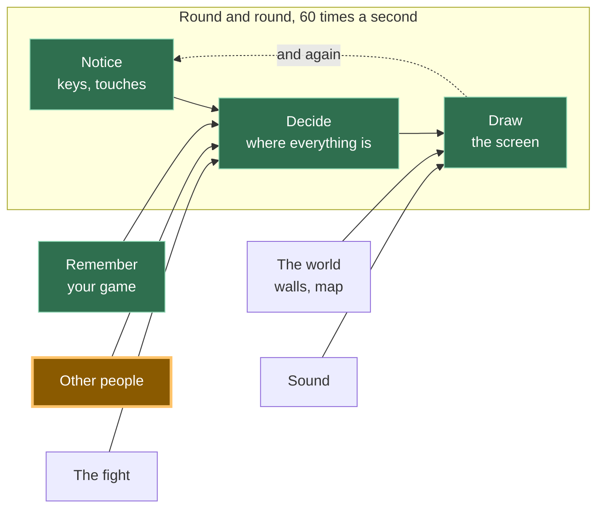

# A13: 安全に話す

他の人が画面に表示されるようになったので、彼らに何かを言いたくなるでしょう。意地悪な目的で使えない会話方法と、到着した奇妙なものをすべて捨てるチェックを作成します。
{: .lesson-intro }

**必要なもの:** [A12](a12.html)。**得られるもの:** タップできる6つのフレーズで、全員の画面上の自分のマスの上に表示されます。

## ゲーム全体と今日の部分



[A12](a12.html)と同じボックスで、後半部分です。他の人はすでに自分の位置を送信していますが、今度は言葉も送信します。

## 意図的にテキストボックスはありません

あなたのゲームには6つのボタンがあります。入力する場所はありません。それは決定であり、あなたがそれに異議を唱えられるように、その理由をここに示します。

会社が運営するゲームでは、誰かが見ています。もしプレイヤーが意地悪な行動をすれば、報告され、警告され、または禁止される可能性があり、担当者が報告書を読みます。あなたのゲームにはサーバーがないため、言われたことの記録がなく、責任者もおらず、報告する相手もいません。後で何もチェックすることはできません。なぜなら「後で」というものがないからです — 言葉はブラウザからブラウザへ直接送られ、どこにもコピーは存在しません。

したがって選択肢は、意地悪な方法を構築してそれに対処する方法がないようにするか、構築しないかのどちらかです。私たちは構築しないことを選択しました。*見えないものを管理することはできないため、管理できないものを作成してはいけません。*

6つのフレーズで一緒に遊ぶには十分です。「ついてきて」や「戦おう！」がゲームの実際の役割を果たします。

### 他の人が見られるもの

これは重要であり、簡潔です。あなたのゲームから、他のプレイヤーが見られるもの：

- あなたのマスに表示される名前（あなたが選んだもので、本名である必要はありません）
- あなたのマスがキャンバスのどこにあるか
- あなたがタップした6つのフレーズのどれか

彼らはあなたの本名、住んでいる場所、学校、顔、またはあなたのコンピューター上の何も一切見ることはできません。あなたのゲームはそれらを一切尋ねることはないので、渡すものも何もありません。

もう2つ、はっきりと言っておきます。**ここには責任者はいません。** 報告ボタンはありません。なぜなら報告する相手がいないからです。そして、もし誰かがあなたに不親切な態度をとった場合 — たとえ6つの丁寧なフレーズしかなくても、人は方法を見つけるものですが — タブを閉じてください。何も失うものはありません。そして信頼できる大人に話してください。それは取るに足らないことでも、恥ずかしいことでもありません。まさに正しい行動であり、効果があります。

## ブロックに分割する

「会話」は3つのことです：

1. **選択** — 存在するフレーズの1つを選ぶ
2. **送信** — 選んだものを送信する
3. **表示** — 届いたフレーズを、確認後に送信者のマスの上に表示する

**なぜわざわざ分割するのか？** なぜなら、もしそれが一つの塊で、何かがうまくいかなかった場合、どの部分が間違っているのかを特定できないからです。タップしても何も起こらない場合、それは選択（pick）が問題です。自分のフレーズは表示されるが、相手のフレーズは表示されない場合、それは送信（send）が問題です。そして、最も重要なのは**表示（show）**です。これは、他人のコンピューターからのデータを扱う唯一のブロックであり、与えられたものを信用しない唯一のブロックだからです。これを分離しておくことで、意図的にごみを送信してそれが破棄されるのを見ることでテストできます。

## ブロック1：選択

```
const PHRASES = ["Hi!", "Nice one!", "Let's fight!", "Follow me", "Good game", "Bye"];

for (let i = 0; i < PHRASES.length; i++) {
  const button = document.createElement('button');
  button.textContent = PHRASES[i];
  button.addEventListener('click', () => say(i));
  document.querySelector('#phrases').append(button);
}
```

1つのリスト、そこから作られた6つのボタン。リストを変更するとボタンもそれに合わせて変わります。

各ボタンは `i` を記憶しています — その**インデックス**、つまりリスト内の位置です。「"Hi!"」はインデックス0、「"Nice one!"」はインデックス1といった具合です。1ではなく0から数えるのは、しばらくは奇妙に見えるかもしれませんが、やがて慣れる習慣です。

## ブロック2：送信

```
const sendSay = (i) => room.send('say', i);

function say(i) {
  sendSay(i);
  player.said = PHRASES[i];
  player.until = performance.now() + SHOW_FOR;
}
```

**あなたは言葉ではなく、番号を送信します。** `2` を送信するだけで十分です。なぜなら、他のプレイヤーのゲームも同じリストを持っており、`PHRASES[2]` を自分で検索するからです。

これはスペースを節約するためではありません。6つの短いフレーズはごくわずかです。これは、番号が文を含まないためです。もし言葉が伝達されると、改造されたゲームはどんな言葉でも送信できてしまいます。番号はリスト上の6つのもののうちの1つだけを意味するものであり — もしそうでなければ、ブロック3がそれを破棄します。

`until` はこのフレーズの描画を停止する時間です。`SHOW_FOR` は3000ミリ秒、つまり3秒です — 読むのに十分な長さで、古いチャットで画面がいっぱいにならない程度の短さです。

## ブロック3：表示

```
room.onMessage('say', (i, id) => {
  if (!Number.isInteger(i) || i < 0 || i >= PHRASES.length) {
    window.dropped = (window.dropped || 0) + 1;   // so you can check it worked
    return;
  }
  others[id] = { ...others[id], said: PHRASES[i], until: performance.now() + SHOW_FOR };
});
```

チェックを声に出して読んでください: *もし届いたものが整数でないか、ゼロ未満であるか、リストの終わりを超えている場合、停止する — 何も行わない。*

`Number.isInteger` は「これは整数ですか？」と尋ねます。「"Hi!"」にはノー、「1.5」にはノー、何もなければノーと答えます。その後の2つの比較は、「この番号は本当に持っているフレーズを指していますか？」と尋ねます。

**他のコンピューターが送ってくるものを決して信用しないでください。** あなたのコードはあなたのマシンで実行されていますが、メッセージは他の誰かのコンピューターから来ており、彼らのゲームのコピーが何をするのか全く分かりません。もしかしたら彼らはそれを変更したかもしれません。もしかしたら彼らの接続が何かを混乱させたかもしれません。もしかしたら彼らは意図的に賢く振る舞っているかもしれません。チェックがなければ、`PHRASES[99]` は `undefined` となり、あなたのゲームは彼らのマスの**上に「undefined」という単語を描画します**。他の不正な値はさらに悪いことを引き起こします。チェックがあれば、何も起こりません — これがまさに起こるべきことです。

そして、それが属するマスの隣に描画します：

```
if (who.until > performance.now()) {
  ctx.fillStyle = '#fff';
  ctx.fillText(who.said, who.x, who.y - 20);
}
```

メッセージのリストも、スクロールする履歴もありません。フレーズはマスの**上に浮遊し、そして消えます。

## なぜこの方法を選んだのか

強制的な制約は、[A12](a12.html)をP2Pにしたものと同じです: サーバーがないこと。サーバーがないということは、ログがなく、モデレーターもおらず、BANもできず、何も元に戻す方法がないことを意味します。他のすべての安全対策 — 乱暴な言葉のフィルタリング、報告、ミュート — は誰かが見ていることを必要としますが、誰も見ていません。それに耐えうるアプローチは1つしかありません: そもそも不親切な表現を不可能にすることです。6つのフレーズという制限は、私たちが後悔するものではありません。このゲームがあなたを何から守れるかについて正直である唯一のデザインです。

## 代わりにできたこと

| これの代わりに | 費用 |
|---|---|
| 乱暴な言葉フィルター付きのテキストボックス | フィルターは回避が簡単で、無害な言葉もブロックしてしまいます。さらに悪いことに、フィルターは保護のように見えるため、人々は安心しきってしまいます — そして、報告する相手はやはりいません |
| 報告ボタン付きのテキストボックス | そのボタンは何も機能しません。報告を受け取るサーバーも、それを読む人もいません。嘘をつくボタンは、ボタンがないよりも悪いものです |
| 数字の代わりに言葉を送信する | 改造されたゲームのコピーは、あなたの画面にどんなものでも送信できるようになり、あなたの側のチェックではその違いを判別できません |
| チェックせずに数字を信頼する | 最初の奇妙なメッセージが届くまでは完璧に機能しますが、その後誰かの頭の上に「undefined」を描画したり、全員の描画ループを破壊したりします |

## プロンプト

A12では既にネットワークライブラリが選択されています。チャットが新機能のように聞こえるからといって、アシスタントがそれを置き換えないようにしてください。

```
My canvas game already has multiplayer through KakkoiDev/p2p-core
v0.1.0. There is ONE existing room object from A12, with 'move'
registered and an `others` object of peer positions.

Keep that same p2p-core room. Do not create a second room and do not
switch to Trystero, WebRTC, PeerJS, Socket.IO, Firebase, or a server.

Add preset-phrase chat in three blocks with a comment above each:
PICK (make one button per entry in a PHRASES array of 6 strings),
SEND (register/use the message kind 'say' and send the array INDEX,
not the text, with room.send('say', i)),
SHOW (use room.onMessage('say', ...) and reject the value unless it is
a whole number inside the array, then display the phrase above that
peer's square for 3 seconds).

No text input anywhere. Plain JavaScript. Keep the existing multiplayer
connection from A12 unchanged.
```

**出力の確認点:** A12からの既存のp2p-coreルームを維持しているか？別のネットワークAPIを発明する代わりに `room.send('say', i)` と `room.onMessage('say', ...)` を使用しているか？テキスト入力は追加されていないか？インデックスを送信しているか、それとも文字列を送信しているか？そして、チェックに `Number.isInteger` を使用しているか、それとも `-1` や `2.5` を喜んで受け入れてしまう `i < PHRASES.length` だけを使用しているか？

## 動作を見る


ページを2つのタブで開き、もう一方のマスが表示されるのを待ちます：

1. 最初のタブで**「戦おう！」**をタップします。フレーズはあなたの緑のマスの上に、そしてもう一方のタブでは青いマスの上に表示されます。3秒後に両方から消えます。
2. 両方のタブでフレーズをタップします。それぞれのフレーズは、それを送信したマスの**上に**表示され、隅のどこかに表示されるわけではありません。
3. 次に意図的に壊してみましょう。最初のタブのコンソールで、手動でごみを送信します: `sendSay(99)`、`sendSay("Hi!")`、`sendSay(1.5)`、`sendSay(-1)`。1つはリストの終わりを超えており、1つは数字の代わりに言葉であり、1つは整数ではなく、1つは開始位置より下です。
4. 2番目のタブを見てください。何も描画されませんでした。何も変わりません — 他のプレイヤーのエントリは以前と全く同じままです。そのコンソールで `dropped` と入力すると `4` が表示されます: 4つすべてが到着しましたが、4つすべてが破棄されました。その後、あなたのマスを動かしてフレーズをタップしてください。メッセージを拒否することはクラッシュすることと同じではないため、すべてがまだ機能しています。

ステップ4がこのステップの本当のテストです。何も拒否するのを見たことがないチェックは、テストされていないチェックです。

## ゲームに組み込む

[A12](a12.html)からあなたのゲームに3つのブロックを追加し、キャンバスの下に空の `<div id="phrases">` を1つ追加します。`others` オブジェクトは既に存在しており、各エントリは `said` と `until` の2つの追加フィールドを持ちます。動きに関する変更はありません。

<div class="takeaways">
<h2>主なポイント</h2>
<ul>
<li>誰も見ていない状況では、唯一機能する安全策は、有害なことを言えないようにすることです</li>
<li>お互いが持っているリストを指す番号を送信し、決して言葉そのものは送信しないこと</li>
<li>他のコンピューターが送ってくるものを決して信用しないこと — 使用する前に毎回確認すること</li>
<li>他のプレイヤーはあなたの選んだ名前、あなたのマス、そしてあなたのフレーズを見ます。あなた自身やあなたのコンピューターに関するものは何も見ません</li>
<li>もし誰かが不親切な場合: 立ち去り、信頼できる大人に話してください。ここに彼らを報告する相手はいません</li>
</ul>
</div>

## あなたの番

与えられたプロンプトでは生成されないルールを追加してください: 誰も1秒に1つ以上のフレーズを送信できないようにすることです。「バイ」を40回連続でタップする人は何も言っておらず、それは6つの丁寧なフレーズでもまだ許してしまう唯一の不親切な行為です。最後に送信したフレーズの時間を覚えておき、`say` 関数内で、それが1秒以内であった場合は早くreturnするようにしてください。次に、より難しい半分を決定します: *到着した*フレーズが速すぎる場合も無視すべきか、それとも自分自身の制限だけを行うべきか？*大人のプログラマーはこれをレートリミッティングと呼ぶので、あなたもそのフレーズを知ったことになります。*
