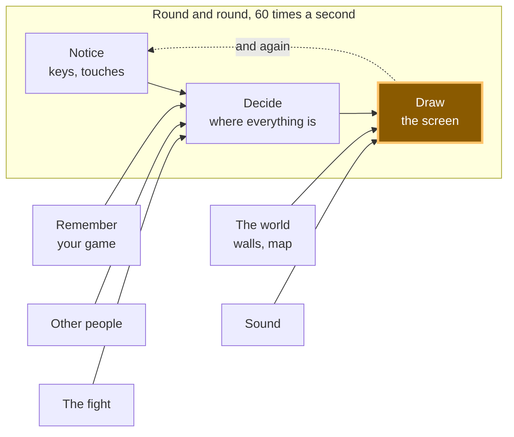

# A14: あなたのモンスター

[A10](a10.html)から、あなたのプレイヤーはずっと色のついた四角形でした。このステップが終わると、それはモンスターになります。歩かせると足が動き、止まると足も止まります。
{: .lesson-intro }

**必要なもの:** [A10](a10.html)。**得られるもの:** 1枚の画像ファイルから切り出したキャラクター。歩いている間はアニメーションします。

## ゲーム全体と今日の部分



変わるのは**描画**だけです。「感知」と「決定」はそのままです。モンスターが動く理由は、四角形が動いていた理由とまったく同じです。

## ブロックに分割する

「足が動くモンスター」は1つのことのように聞こえますが、中身は2つです。

1. **切り出す** — 大きな画像ファイルから小さな絵を1枚取り出す
2. **切り替える** — 時間がたつにつれて別の小さな絵を選ぶ

**なぜわざわざ分けるのでしょう。** もし1つのかたまりにしてしまうと、うまく動かないときにどこが悪いのか分からなくなるからです。画面に何も出ないなら、それは切り出しの問題です。ファイル名か、切り取る四角形がまちがっています。モンスターは出るのに足が動かないなら、それは切り替えの問題です。タイマーか、絵のリストがまちがっています。この2つはまったく別のバグですが、外から見るとどちらも「モンスターが壊れている」としか見えません。

## 画像ファイル

モンスターに必要なものは、すべて**1つのファイル**に入っています。`vendor/kenney/pixel-platformer-characters.png` です。幅216ピクセル、高さ72ピクセルで、その中に小さな絵が27枚、横9枚・縦3枚に並んでいます。1枚は24×24ピクセルです。

最初の2枚は、同じ緑のモンスターです。0番の絵では足がそろっていて、1番の絵では足が開いています。歩くアニメーションに必要なのは、これだけです。

**1つだけ正直に言っておきます。** このキャラクターは24ピクセルの絵で描かれていますが、[A16](a16.html)で使う壁や床は、別の作者が16ピクセルの絵で描いたものです。並べてみると、ぴったりとは合いません。モンスターのドットのほうが、世界のドットより少し大きいのです。これは分かっていて選びました。合う世界と、歩けるキャラクターの両方がそろった素材集が見つからなかったからです。小さな実際のプロジェクトでも、こうやって素材集を混ぜることはよくあります。あとで気になったら、直す方法は、どちらかのスタイルにそろえてもう片方を描き直すことです。それは1行のコードではなく、まる半日の作業です。

## ブロック1: 切り出す

```
const sheet = new Image();
sheet.src = '../../vendor/kenney/pixel-platformer-characters.png';

const CELL = 24;          // one picture in the sheet, in pixels
const COLS = 9;           // pictures across the sheet
const ZOOM = 3;           // draw it three times as big
const SIZE = CELL * ZOOM; // 72 pixels on screen

function drawPicture(n, x, y) {
  const sx = (n % COLS) * CELL;
  const sy = Math.floor(n / COLS) * CELL;
  ctx.drawImage(sheet, sx, sy, CELL, CELL, x, y, SIZE, SIZE);
}
```

うしろに9個も数字が並ぶ`drawImage`は、こわそうに見えます。でも中身は、四角形2つと質問1つだけです。

- 1つめはファイルです。
- 次の4つ（`sx, sy, CELL, CELL`）は、**大きな画像のどの小さな四角形をコピーするか**です。左から何ピクセル、上から何ピクセル、幅はいくつ、高さはいくつ。
- 最後の4つ（`x, y, SIZE, SIZE`）は、**キャンバスのどこに貼るか、そしてどれくらいの大きさにするか**です。

*あそこ*からコピーして、*ここ*に貼る。9個の数字は、それだけのことです。

`sx`と`sy`を求めるのは、わり算です。0番の絵は左上のはじめにあります。9番の絵は1段下です。横に9枚並んでいるからです。だから`n % COLS`は「その段の何番目か」、`Math.floor(n / COLS)`は「何段目か」になります。それぞれに24をかければ、その絵の左上の角が分かります。

もう2行、大事なところがあります。

```
ctx.imageSmoothingEnabled = false;
```

24ピクセルは今の画面ではとても小さいので、3倍の大きさで描いています。ブラウザは絵を大きくするとき、ふつうは*ぼかし*ます。写真をなめらかに見せるためです。でもドット絵にそれをすると、かっちりした四角がぐにゃぐにゃになります。ぼかしをオフにすると、ブラウザは1ドットを3×3のはっきりした四角に広げてくれます。一度、両方ためしてみてください。この違いが、ゲームの見た目そのものです。

## ブロック2: 切り替える

```
const STAND = 0;
const WALK = [0, 1];
const STEP = 0.14;        // seconds each picture stays up

let walked = 0;           // seconds spent walking
let frame = STAND;        // which picture to draw right now

function animate(dt, moving) {
  if (!moving) {
    walked = 0;
    frame = STAND;
    return;
  }
  walked += dt;
  frame = WALK[Math.floor(walked / STEP) % WALK.length];
}
```

**フレーム**とは、アニメーションの絵1枚のことです。`WALK`は、歩くアニメーションを作っているフレームを、順番に並べたリストです。

大事な1行は、うしろから読んでみましょう。`walked`は、方向キーを押しているあいだ、秒数を足していきます。それを`STEP`でわると、「歩き始めてから何枚の絵が過ぎたか」が出ます。0.28秒たったら2枚です。`Math.floor`は、小数点より下を捨てます。`% WALK.length`は、その数をリストの先頭に戻します。だから0, 1, 2, 3, 4は0, 1, 0, 1, 0になります。

つまり、目に見える絵は**時計から**計算されています。アニメーションに「次に進め」と命令するのではなく、「今はどんな見た目？」とたずねるのです。*フレームはデータで、その番号は時間で決まります。* どこにも、手でフレームを数えているところはありません。だから、ずれることもありません。

そして動いていないときは、`walked`は0に戻り、フレームは`STAND`になります。足が止まります。この`if`が1つあるかないかが、モンスターと、けいれんしているモンスターの違いです。

あとは`update`の最後に、この1行を足すだけです。

```
animate(dt, dx !== 0 || dy !== 0);
```

「動いている」とは、方向が押されているという意味です。`update`はもうそれを知っているので、新しく感知するものは何もありません。

## なぜこの方法にしたのか

決め手になった制約は、[A12](a12.html)で他の人が画面に出てくることです。他のプレイヤーのモンスターも同じシートから描かれますが、歩くタイミングはあなたとちがいます。`drawPicture`は絵の番号と場所だけを受け取り、`animate`は数えるのをただの数字でやっているので、2体めのモンスターに必要なのは2つめの`walked`だけです。切り出しにも切り替えにも、「プレイヤー」という言葉は出てきません。

## 代わりにできたこと

| この代わりに | その代償 |
|---|---|
| 1コマごとに画像ファイルを1つ | ブラウザはファイルを1つずつサーバーに取りに行き、届く順番はばらばらです。待っているあいだ、モンスターは穴あきのままアニメーションします。キャラクター20体なら、ファイル100個です |
| 時計を使わず、ループ1回ごとにコマを進める | モンスターの足は、画面の書きかえ速さのままで動きます。1秒に144回書きかえる画面ではぶれて見え、遅い画面ではのろのろになります。A10で`dt`を忘れたときと同じバグです |
| HTMLの``をCSSで動かす | モンスター1体ならうまくいきます。でも50体にすると、1秒に60回ページ全体のレイアウトをやり直せとブラウザに頼むことになります。ページのレイアウトは、そういう用途のものではありません |
| 拡大せず、そのままの24ピクセルで描く | モンスターは、たいていの画面でこの文字の*o*より小さくなります。ぼかしをオフにしないまま拡大するのは、もっと悪いです。小さくてぼやけたモンスターになります |

## プロンプト

```
I have a plain JavaScript canvas game. main.js has a Set of held keys, an
update(dt) that changes player.x and player.y, and a draw() that paints a
rectangle for the player. Replace the rectangle with a sprite from a single
sprite sheet at ../../vendor/kenney/pixel-platformer-characters.png, which is
216x72 with 24x24 cells, 9 per row, no gaps. Cell 0 is the character with legs
together and cell 1 with legs apart. Draw it at 3x with smoothing off. Add a
two-frame walk animation that advances on a timer measured in seconds and
holds a single standing frame when no direction is held. Keep the cutting code
and the animation code in separate functions.
```

**出力を確認すること:** コマは`dt`から進んでいますか。それとも時計を使わず、呼ばれるたびに1つ進んでいますか。アシスタントはとてもよく、ループの中に`frame++`と書きます。自分の画面では完ぺきに見えて、あなたの画面ではまちがった速さで動くコードです。キーをはなしたら立ちフレームに戻りますか。それとも足は動きっぱなしですか。そして`imageSmoothingEnabled`をオフにしましたか。ドット絵のコードでいちばん忘れられる1行です。忘れてもエラーは出ません。ただ、なんとなくぼやけた画面になるだけで、絵を描いた人のせいだと思ってしまうかもしれません。

## 動作を確認する


Live Serverでページを開いて、次をやってみましょう。

1. モンスターがすぐに出てきます。何も出ないときは、ファイルのパスがまちがっています。コードをさわる前に、ブラウザのネットワーク一覧を見てください。
2. 右矢印を押しっぱなしにします。歩いているあいだにフレーム番号を14回読み取ったら、`0,0,0,1,1,0,0,0,1,1,0,0,0,1`でした。本当に絵が入れかわっていて、だいたい1秒に7回です。
3. キーをはなします。もう6回読み取ったら`0,0,0,0,0,0`でした。足は止まっていて、そのまま止まったままです。
4. 歩いているあいだ、位置は`x: 200`から`x: 312`に変わりました。動くこととアニメーションすることは、同時に起きている別々のことで、それぞれ別に確認できます。
5. モンスターのふちをよく見てください。ドットが、ぼやけずにかっちりした四角になっています。それが、ぼかしがオフになっているしるしです。

## ゲームに組み込む

[A10](a10.html)のゲームを用意します。`sheet`の画像、`drawPicture`、`animate`を足します。そして`update`の最後に1行足します。

```
animate(dt, dx !== 0 || dy !== 0);
```

次に`draw`の中の、この部分を

```
ctx.fillStyle = '#7ee081';
ctx.fillRect(player.x, player.y, SIZE, SIZE);
```

こう置きかえます。

```
drawPicture(frame, Math.round(player.x), Math.round(player.y));
```

`Math.round`があるのは、`player.x`がふつう`216.656`のような数になるからです。ドット絵を0.5ピクセルの位置に描くと、動くときにふちがちらちらします。

<div class="takeaways">
<h2>主なポイント</h2>
<ul>
<li>1つの画像ファイルに何百枚もの絵を入れられます。ほしい1枚は、四角形で切り出します</li>
<li><code>drawImage</code>の9つの数字は、「この四角からコピー」と「この四角に貼る」だけのことです</li>
<li>アニメーションは絵のリストで、今どの絵かを決めるのは時計です</li>
<li>プレイヤーが止まったらアニメーションも止める。それが、生きているように見せるか、壊れて見えるかの分かれ目です</li>
<li>ぼかしをオフにして、位置を整数に丸めましょう。そうしないとドット絵はぼやけて、ちらちらします</li>
</ul>
</div>

ファイル1つ、サーバーへのお願い1回、絵は27枚。だからこういうシートが使われています。*大人のプログラマーはこれをスプライトアトラスと呼びます。アトラスは地図をまとめた本のこと。これは絵をまとめた本です。これであなたも、この言葉を知りました。*

## あなたの番

あなたのモンスターは、左に歩くときも右に歩くときとまったく同じ見た目です。進む向きを向くようにしてみましょう。

最後に横に動いた向きを覚えておいて、描くときに絵を左右反転させます。`ctx.scale(-1, 1)`と`ctx.save()` / `ctx.restore()`を調べてみてください。反転は、一度やるまでは無理そうに感じて、一度やったらそのあとはずっと4行で書けるようになるものの1つです。
