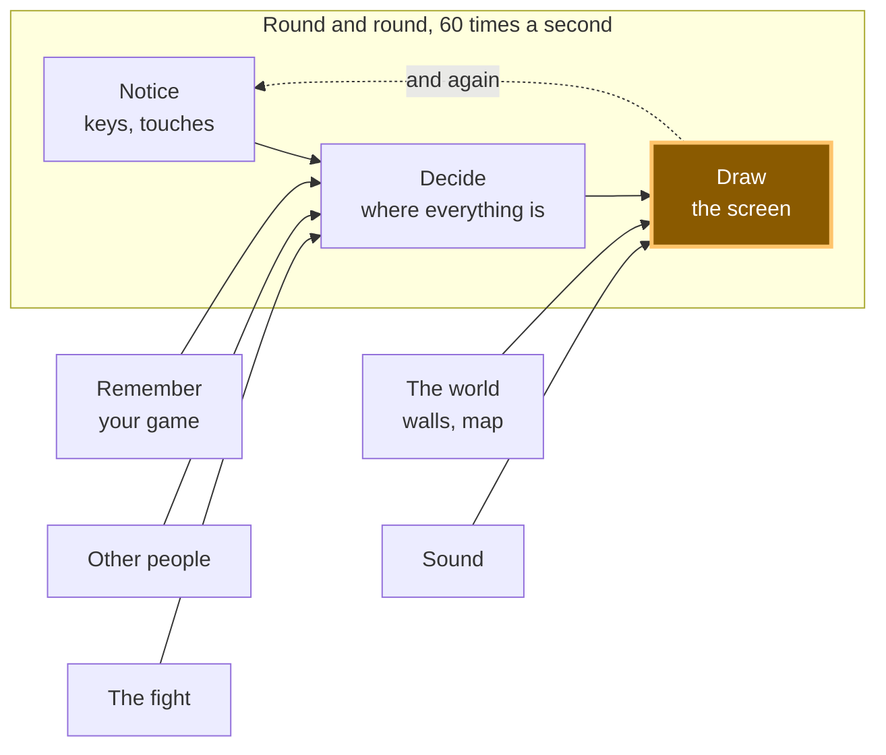

# A14: Your Monster

Your player has been a coloured square since [A10](a10.html). By the end of this step it is a monster, and when you walk it the legs move. When you stop, they stop.
{: .lesson-intro }

**Needs:** [A10](a10.html). **Gives you:** a drawn character, cut out of one picture file, that animates while it walks.

## The whole game, and today's piece



Only **Draw** changes. "Notice" and "Decide" are untouched — the monster moves for exactly the same reason the square did.

## Cutting it into blocks

"A monster whose legs move" sounds like one thing. It is two:

1. **Cut** — take one small picture out of one big picture file
2. **Change** — pick a different small picture as time passes

**Why bother splitting it?** Because if it were one lump and it went wrong, you could not tell which part was wrong. Nothing on screen at all is a cutting problem — wrong file, wrong rectangle. A monster that appears but never animates is a changing problem — the timer, or the list of pictures. Those are two different bugs, and from the outside both of them just look like "the monster is broken".

## The picture file

Everything the monster needs is in **one file**: `vendor/kenney/pixel-platformer-characters.png`. It is 216 pixels wide and 72 tall, and inside it are 27 small pictures in a grid — 9 across, 3 down, each one 24 by 24 pixels.

The first two pictures are the same green monster twice. In picture 0 its legs are together. In picture 1 they are apart. That is all a walk needs.

**One honest warning.** This character is drawn in a 24-pixel style, and the walls and floors you will use in [A16](a16.html) are drawn in a 16-pixel style by a different artist. Side by side they do not quite match — the monster's pixels are slightly bigger than the world's pixels. We chose that on purpose, because no pack we could find had both a matching world *and* a character that walks. Small real projects end up mixing packs like this all the time. If it bothers you later, the fix is to pick one style and redraw the other, and that is a real afternoon of work, not a line of code.

## Block 1: Cut

```
const sheet = new Image();
sheet.src = '../../vendor/kenney/pixel-platformer-characters.png';

const CELL = 24;          // one picture in the sheet, in pixels
const COLS = 9;           // pictures across the sheet
const ZOOM = 3;           // draw it three times as big
const SIZE = CELL * ZOOM; // 72 pixels on screen

function drawPicture(n, x, y) {
  const sx = (n % COLS) * CELL;
  const sy = Math.floor(n / COLS) * CELL;
  ctx.drawImage(sheet, sx, sy, CELL, CELL, x, y, SIZE, SIZE);
}
```

`drawImage` with nine things after it looks frightening. It is really two rectangles and a question.

- The first is the file.
- The next four — `sx, sy, CELL, CELL` — are **which little square to copy out of the big picture**: how far from its left, how far from its top, how wide, how tall.
- The last four — `x, y, SIZE, SIZE` — are **where to paste it on the canvas, and how big to make it there**.

Copy from *there*, paste to *here*. That is the whole nine.

Finding `sx` and `sy` is division. Picture 0 is at the start. Picture 9 is one row down, because there are 9 across. So `n % COLS` is how far along the row you are, and `Math.floor(n / COLS)` is which row. Multiply each by 24 and you have the corner of the picture.

Two more lines matter:

```
ctx.imageSmoothingEnabled = false;
```

24 pixels is tiny on a modern screen, so we draw at 3 times the size. When a browser makes a picture bigger it normally *blurs* it, to make photographs look smooth. On pixel art that turns crisp squares into mush. Turning smoothing off tells the browser to make each pixel into a solid 3-by-3 block instead. Try it both ways once — the difference is the whole look of the game.

## Block 2: Change

```
const STAND = 0;
const WALK = [0, 1];
const STEP = 0.14;        // seconds each picture stays up

let walked = 0;           // seconds spent walking
let frame = STAND;        // which picture to draw right now

function animate(dt, moving) {
  if (!moving) {
    walked = 0;
    frame = STAND;
    return;
  }
  walked += dt;
  frame = WALK[Math.floor(walked / STEP) % WALK.length];
}
```

A **frame** is one picture of an animation. `WALK` is the list of frames the walk is made of, in order.

Read the important line backwards. `walked` counts up in seconds while you hold a direction. Divide by `STEP` and you get "how many pictures have gone by since you started walking" — after 0.28 seconds, two. `Math.floor` throws away the part after the dot. `% WALK.length` wraps that number back to the start of the list, so 0, 1, 2, 3, 4 becomes 0, 1, 0, 1, 0.

So the picture you see is worked out **from the clock**. You do not tell the animation to advance; you ask it what it looks like right now. *Frames are data with time as the index.* Nothing anywhere counts frames by hand, which means nothing can drift out of step.

And when you are not moving, `walked` goes back to zero and the frame is `STAND`. Legs stop. That one `if` is the difference between a monster and a monster having a fit.

Then `update` ends with one line:

```
animate(dt, dx !== 0 || dy !== 0);
```

"Moving" simply means a direction was pressed. `update` already knows that, so nothing new has to be noticed.

## Why we did it this way

The forcing constraint is that [A12](a12.html) puts other people on your screen. Another player's monster is drawn from the same sheet, but it walks at different moments to yours. Because `drawPicture` takes a picture number and a place, and `animate` keeps its counting in plain numbers, a second monster needs a second `walked` and nothing else. Nothing about cutting or changing knows the word "player".

## What we could have done instead

| Instead of this | What it would cost |
|---|---|
| One image file per frame | The browser asks the server for every single file, one at a time, and they arrive whenever they arrive. Your monster can animate with holes in it while it waits. Twenty characters would be a hundred files |
| Advancing the frame once per loop, with no clock | Your monster's legs would move at whatever speed the screen refreshes. On a 144-times-a-second screen they blur; on a slow one they crawl. Same bug as forgetting `dt` in A10 |
| HTML `` elements moved around with CSS | It works for one monster. Then you add fifty and ask the browser to lay out a whole page sixty times a second, which is not what page layout is for |
| Drawing at the real 24 pixels, with no zoom | Your monster would be smaller than this letter *o* on most screens. Zooming without turning smoothing off is worse: a blurry small monster |

## The prompt

```
I have a plain JavaScript canvas game. main.js has a Set of held keys, an
update(dt) that changes player.x and player.y, and a draw() that paints a
rectangle for the player. Replace the rectangle with a sprite from a single
sprite sheet at ../../vendor/kenney/pixel-platformer-characters.png, which is
216x72 with 24x24 cells, 9 per row, no gaps. Cell 0 is the character with legs
together and cell 1 with legs apart. Draw it at 3x with smoothing off. Add a
two-frame walk animation that advances on a timer measured in seconds and
holds a single standing frame when no direction is held. Keep the cutting code
and the animation code in separate functions.
```

**Check the output for:** does the frame advance from `dt`, or does it advance once per call with no clock? Assistants very often write `frame++` inside the loop, which looks perfect on their screen and runs at the wrong speed on yours. Does it reset to the standing frame when you let go, or keep the legs moving forever? And did it turn `imageSmoothingEnabled` off — this is the single most forgotten line in pixel-art code, and the result is not an error message, just a soft blurry mess you might blame on the artist.

## See it work


Open the page with Live Server and:

1. The monster appears straight away. If you get nothing, the file path is wrong — check the browser's network list before you touch any code.
2. Hold the right arrow. We read the frame number back fourteen times while it walked and got `0,0,0,1,1,0,0,0,1,1,0,0,0,1`. It really is swapping pictures, roughly seven times a second.
3. Let go. We read it six more times and got `0,0,0,0,0,0`. The legs are still, and they stay still.
4. While it walked, its position went from `x: 200` to `x: 312`. Moving and animating are two separate things happening at once, and each one can be checked on its own.
5. Look closely at the edges of the monster. The pixels are hard squares, not soft edges. That is smoothing being off.

## Put it in the game

Take the game from [A10](a10.html). Add the `sheet` image, `drawPicture` and `animate`. Add one line to the end of `update`:

```
animate(dt, dx !== 0 || dy !== 0);
```

Then in `draw`, replace this:

```
ctx.fillStyle = '#7ee081';
ctx.fillRect(player.x, player.y, SIZE, SIZE);
```

with this:

```
drawPicture(frame, Math.round(player.x), Math.round(player.y));
```

`Math.round` is there because `player.x` is usually something like `216.656`. Drawing pixel art at half a pixel makes its edges shimmer as it moves.

<div class="takeaways">
<h2>Key Takeaways</h2>
<ul>
<li>One image file can hold hundreds of pictures; you cut out the one you want with a rectangle</li>
<li><code>drawImage</code>'s nine numbers are just "copy from this square" and "paste to this square"</li>
<li>An animation is a list of pictures, and the clock decides which one you are on</li>
<li>Stopping the animation when the player stops is what makes it look alive instead of broken</li>
<li>Turn smoothing off and round your positions, or pixel art goes soft and shimmery</li>
</ul>
</div>

One file, one request from the server, twenty-seven pictures. That is why sheets like this exist. *Grown-up programmers call this a sprite atlas — an atlas is a book of maps, and this is a book of pictures. Now you know that word too.*

## Your turn

Your monster walks to the left looking exactly the same as when it walks to the right. Make it face the way it is going.

You need to remember the last sideways direction, and then flip the picture when you draw it. Look up `ctx.scale(-1, 1)` and `ctx.save()` / `ctx.restore()`. Flipping is one of those things that feels impossible until you have done it once, and then takes four lines forever after.
