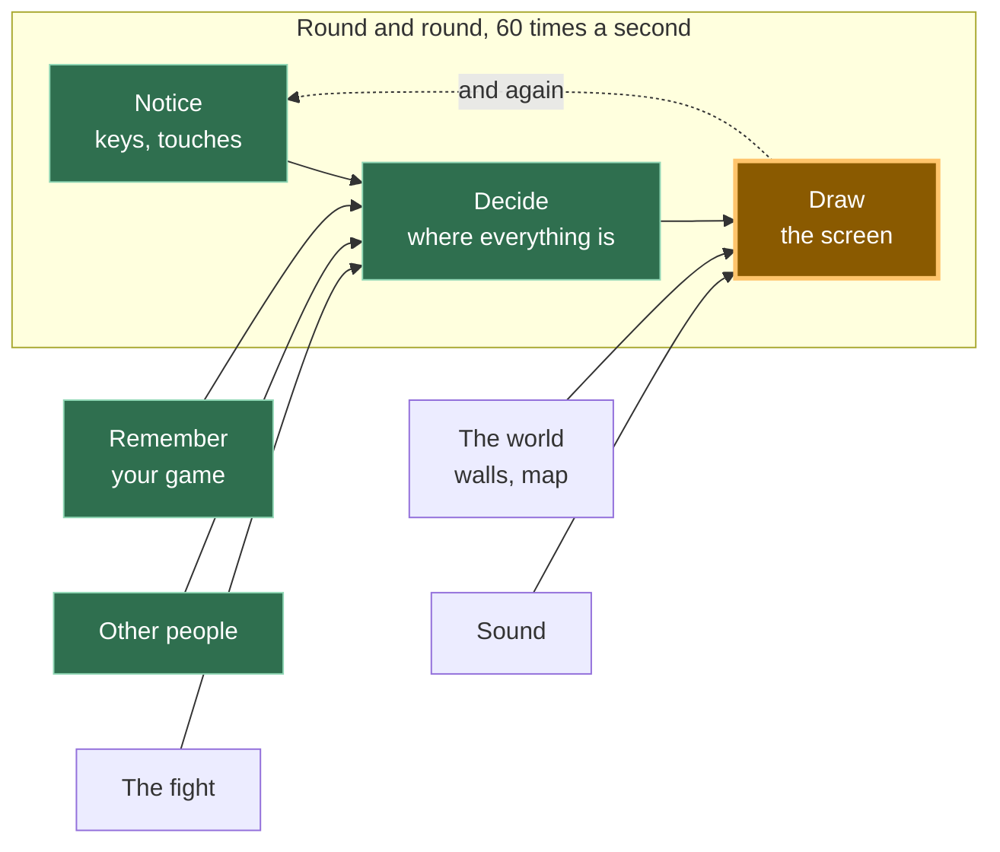

# A14: Seu Monstro

Seu jogador tem sido um quadrado colorido desde [A10](a10.html). Ao final deste passo, ele é um monstro, e quando você o move, as pernas se movem. Quando você para, elas param.
{: .lesson-intro }

**Necessita de:** [A10](a10.html). **Oferece:** um personagem desenhado, recortado de um único arquivo de imagem, que anima enquanto anda.

## O jogo completo, e a parte de hoje



Apenas **Desenhar** muda. "Perceber" e "Decidir" permanecem intocados — o monstro se move exatamente pela mesma razão que o quadrado se movia.

## Dividindo em blocos

"Um monstro cujas pernas se movem" parece uma coisa só. São duas:

1. **Recortar** — pegar uma pequena imagem de um grande arquivo de imagem
2. **Mudar** — escolher uma imagem pequena diferente conforme o tempo passa

**Por que se dar ao trabalho de dividir?** Porque se fosse uma única "coisa" e desse errado, você não saberia qual parte estava errada. Nada na tela é um problema de recorte — arquivo errado, retângulo errado. Um monstro que aparece mas nunca anima é um problema de mudança — o temporizador, ou a lista de imagens. Esses são dois bugs diferentes, e de fora, ambos parecem apenas "o monstro está quebrado".

## O arquivo de imagem

Tudo que o monstro precisa está em **um arquivo**: `vendor/kenney/pixel-platformer-characters.png`. Ele tem 216 pixels de largura e 72 de altura, e dentro dele há 27 pequenas imagens em uma grade — 9 na horizontal, 3 na vertical, cada uma com 24 por 24 pixels.

As duas primeiras imagens são do mesmo monstro verde duas vezes. Na imagem 0, suas pernas estão juntas. Na imagem 1, elas estão separadas. Isso é tudo que uma caminhada precisa.

**Um aviso honesto.** Este personagem é desenhado em um estilo de 24 pixels, e as paredes e pisos que você usará em [A16](a16.html) são desenhados em um estilo de 16 pixels por um artista diferente. Lado a lado, eles não combinam perfeitamente — os pixels do monstro são ligeiramente maiores que os pixels do mundo. Escolhemos isso de propósito, porque nenhum pacote que pudéssemos encontrar tinha um mundo que combinasse *e* um personagem que andasse. Pequenos projetos reais acabam misturando pacotes como este o tempo todo. Se isso te incomodar mais tarde, a solução é escolher um estilo e redesenhar o outro, e isso é uma tarde inteira de trabalho, não uma linha de código.

## Bloco 1: Recorte

```javascript
const sheet = new Image();
sheet.src = '../../vendor/kenney/pixel-platformer-characters.png';

const CELL = 24;          // one picture in the sheet, in pixels
const COLS = 9;           // pictures across the sheet
const ZOOM = 3;           // draw it three times as big
const SIZE = CELL * ZOOM; // 72 pixels on screen

function drawPicture(n, x, y) {
  const sx = (n % COLS) * CELL;
  const sy = Math.floor(n / COLS) * CELL;
  ctx.drawImage(sheet, sx, sy, CELL, CELL, x, y, SIZE, SIZE);
}
```

`drawImage` com nove argumentos depois dela parece assustador. Na verdade, são dois retângulos e uma pergunta.

- O primeiro é o arquivo.
- Os próximos quatro — `sx, sy, CELL, CELL` — são **qual pequeno quadrado copiar da imagem grande**: a que distância de sua esquerda, a que distância de seu topo, quão largo, quão alto.
- Os últimos quatro — `x, y, SIZE, SIZE` — são **onde colar no canvas, e quão grande fazer lá**.

Copiar de *lá*, colar *aqui*. Isso é tudo.

Encontrar `sx` e `sy` é divisão. A imagem 0 está no início. A imagem 9 está uma linha abaixo, porque há 9 na horizontal. Então `n % COLS` é quão longe você está na linha, e `Math.floor(n / COLS)` é qual linha. Multiplique cada um por 24 e você terá o canto da imagem.

Duas linhas a mais importam:

```javascript
ctx.imageSmoothingEnabled = false;
```

24 pixels é minúsculo em uma tela moderna, então desenhamos 3 vezes maior. Quando um navegador aumenta uma imagem, ele normalmente a *borra*, para fazer as fotografias parecerem suaves. Em pixel art, isso transforma quadrados nítidos em uma pasta. Desligar o suavização diz ao navegador para transformar cada pixel em um bloco sólido de 3 por 3. Experimente de ambas as formas uma vez — a diferença é o visual completo do jogo.

## Bloco 2: Mudança

```javascript
const STAND = 0;
const WALK = [0, 1];
const STEP = 0.14;        // seconds each picture stays up

let walked = 0;           // seconds spent walking
let frame = STAND;        // which picture to draw right now

function animate(dt, moving) {
  if (!moving) {
    walked = 0;
    frame = STAND;
    return;
  }
  walked += dt;
  frame = WALK[Math.floor(walked / STEP) % WALK.length];
}
```

Um **quadro** é uma imagem de uma animação. `WALK` é a lista de quadros que compõem a caminhada, em ordem.

Leia a linha importante de trás para frente. `walked` conta em segundos enquanto você mantém uma direção. Divida por `STEP` e você obtém "quantas imagens se passaram desde que você começou a andar" — após 0,28 segundos, duas. `Math.floor` descarta a parte após o ponto. `% WALK.length` retorna esse número para o início da lista, então 0, 1, 2, 3, 4 se torna 0, 1, 0, 1, 0.

Então a imagem que você vê é calculada **a partir do relógio**. Você não diz à animação para avançar; você pergunta a ela como ela se parece agora. *Quadros são dados com o tempo como índice.* Nada em lugar nenhum conta os quadros manualmente, o que significa que nada pode sair de sincronia.

E quando você não está se movendo, `walked` volta a zero e o quadro é `STAND`. As pernas param. Aquele `if` é a diferença entre um monstro e um monstro tendo um ataque.

Então `update` termina com uma linha:

```javascript
animate(dt, dx !== 0 || dy !== 0);
```

"Movendo" significa simplesmente que uma direção foi pressionada. `update` já sabe disso, então nada de novo precisa ser percebido.

## Por que fizemos isso desta forma

A restrição obrigatória é que [A12](a12.html) coloca outras pessoas na sua tela. O monstro de outro jogador é desenhado da mesma folha, mas ele anda em momentos diferentes do seu. Porque `drawPicture` pega um número de imagem e um lugar, e `animate` mantém sua contagem em números simples, um segundo monstro precisa de um segundo `walked` e nada mais. Nada sobre recortar ou mudar conhece a palavra "jogador".

## O que poderíamos ter feito em vez disso

| Em vez disso | Qual seria o custo |
|---|---|
| Um arquivo de imagem por quadro | O navegador pede ao servidor cada arquivo individualmente, um por um, e eles chegam quando chegam. Seu monstro pode animar com buracos enquanto espera. Vinte personagens seriam cem arquivos |
| Avançar o quadro uma vez por loop, sem relógio | As pernas do seu monstro se moveriam na velocidade em que a tela atualiza. Em uma tela de 144 vezes por segundo, elas borram; em uma lenta, elas rastejam. Mesmo bug de esquecer `dt` em A10 |
| Elementos `` HTML movidos com CSS | Funciona para um monstro. Então você adiciona cinquenta e pede ao navegador para organizar uma página inteira sessenta vezes por segundo, o que não é para o que o layout de página serve |
| Desenhar com os reais 24 pixels, sem zoom | Seu monstro seria menor que esta letra *o* na maioria das telas. Ampliar sem desligar o suavização é pior: um monstro pequeno e borrado |

## O enunciado

```
I have a plain JavaScript canvas game. main.js has a Set of held keys, an
update(dt) that changes player.x and player.y, and a draw() that paints a
rectangle for the player. Replace the rectangle with a sprite from a single
sprite sheet at ../../vendor/kenney/pixel-platformer-characters.png, which is
216x72 with 24x24 cells, 9 per row, no gaps. Cell 0 is the character with legs
together and cell 1 with legs apart. Draw it at 3x with smoothing off. Add a
two-frame walk animation that advances on a timer measured in seconds and
holds a single standing frame when no direction is held. Keep the cutting code
and the animation code in separate functions.
```

**Verifique a saída para:** o quadro avança a partir de `dt`, ou avança uma vez por chamada sem relógio? Assistentes com muita frequência escrevem `frame++` dentro do loop, o que parece perfeito na tela deles e roda na velocidade errada na sua. Ele redefine para o quadro parado quando você solta, ou mantém as pernas se movendo para sempre? E ele desligou `imageSmoothingEnabled` — esta é a linha mais esquecida no código de pixel-art, e o resultado não é uma mensagem de erro, apenas uma bagunça suave e embaçada que você pode culpar o artista.

## Veja funcionar


Abra a página com Live Server e:

1. O monstro aparece imediatamente. Se você não vir nada, o caminho do arquivo está errado — verifique a lista de rede do navegador antes de tocar em qualquer código.
2. Segure a seta para a direita. Lemos o número do quadro catorze vezes enquanto ele andava e obtivemos `0,0,0,1,1,0,0,0,1,1,0,0,0,1`. Ele realmente está trocando imagens, aproximadamente sete vezes por segundo.
3. Solte. Lemos mais seis vezes e obtivemos `0,0,0,0,0,0`. As pernas estão paradas, e elas permanecem paradas.
4. Enquanto ele andava, sua posição foi de `x: 200` para `x: 312`. Mover e animar são duas coisas separadas acontecendo ao mesmo tempo, e cada uma pode ser verificada por conta própria.
5. Olhe atentamente para as bordas do monstro. Os pixels são quadrados duros, não bordas suaves. Isso é o suavização desativado.

## Coloque no jogo

Pegue o jogo de [A10](a10.html). Adicione a imagem `sheet`, `drawPicture` e `animate`. Adicione uma linha ao final de `update`:

```javascript
animate(dt, dx !== 0 || dy !== 0);
```

Então em `draw`, substitua isto:

```javascript
ctx.fillStyle = '#7ee081';
ctx.fillRect(player.x, player.y, SIZE, SIZE);
```

por isto:

```javascript
drawPicture(frame, Math.round(player.x), Math.round(player.y));
```

`Math.round` está lá porque `player.x` é geralmente algo como `216.656`. Desenhar pixel art em meio pixel faz suas bordas cintilarem enquanto ele se move.

<div class="takeaways">
<h2>Principais Lições</h2>
<ul>
<li>Um arquivo de imagem pode conter centenas de imagens; você recorta a que deseja com um retângulo</li>
<li>Os nove números de <code>drawImage</code> são apenas "copiar deste quadrado" e "colar neste quadrado"</li>
<li>Uma animação é uma lista de imagens, e o relógio decide em qual você está</li>
<li>Parar a animação quando o jogador para é o que a faz parecer viva em vez de quebrada</li>
<li>Desligue o suavização e arredonde suas posições, ou a pixel art fica suave e cintilante</li>
</ul>
</div>

Um arquivo, uma requisição do servidor, vinte e sete imagens. É por isso que folhas como esta existem. *Programadores experientes chamam isso de atlas de sprites — um atlas é um livro de mapas, e este é um livro de imagens. Agora você também conhece essa palavra.*

## Sua vez

Seu monstro anda para a esquerda parecendo exatamente o mesmo que quando anda para a direita. Faça-o virar para a direção em que está indo.

Você precisa lembrar a última direção lateral e, em seguida, virar a imagem ao desenhá-la. Pesquise `ctx.scale(-1, 1)` e `ctx.save()` / `ctx.restore()`. Virar é uma daquelas coisas que parece impossível até que você faça uma vez, e depois leva quatro linhas para sempre.
