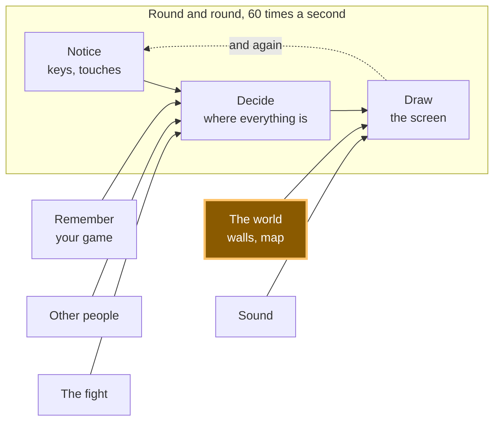

# A15: 壁

今までのあなたの四角形は、何でもすり抜けていました。このステップが終わると、画面に岩があり、そこは通り抜けられなくなります。そして岩に体を押しつけると、引っかかるのではなく、岩に沿ってすべります。
{: .lesson-intro }

**必要なもの:** [A10](a10.html)。**得られるもの:** データとして書かれた、プレイヤーを止める固いもの。

## ゲーム全体と今日の部分



今日つくるのは**世界**です。世界は「描画」に材料をわたします。岩が画面に出てこないといけないからです。それに「決定」にも制限をかけます。これからは、四角形が行ける場所は「キャンバスのどこでも」ではなくなります。

## ブロックに分割する

「岩は通り抜けられない」は1つのことのように聞こえますが、中身は3つです。

1. **書き表す** — 固いものがどこにあるかを言う
2. **調べる** — 立とうとしている場所が、その中に入っていないかたずねる
3. **止める** — ふちまでは行き、その先へは行かない

**なぜわざわざ分けるのでしょう。** もし1つのかたまりにしてしまうと、うまく動かないときにどこが悪いのか分からなくなるからです。岩は、あなたが思っている場所にありますか。重なりの判定が、まちがった答えを返していませんか。それとも判定は正しくて、それでも動いてしまっているだけですか。これは3つの別々のバグで、直し方も3つ別々です。でも外から見ると、どれもまったく同じに見えます。四角形が岩をすり抜けるのです。

それに、ブロック1はあとで効いてきます。今はまだ見えない形で。

## ブロック1: 書き表す

```
const walls = [
  { x: 160, y: 40,  w: 40,  h: 200 },
  { x: 160, y: 240, w: 220, h: 40 },
  { x: 300, y: 60,  w: 120, h: 40 },
];
```

これでブロックはおしまいです。ここに*ない*ものを見てください。コードが1行もありません。壁とは4つの数字（左から何ピクセル、上から何ピクセル、幅、高さ）がリストに並んでいるだけのものです。

これは見た目より大事です。壁が**データ**だから、コードを増やさずに壁を増やせるのです。[A16](a16.html)では、地図まるごとがファイルからこの配列に読み込まれますが、このファイルの残りの部分は1行も変わりません。もしそのかわりに、岩1つごとに`if (player.x > 160 && player.x < 200) ...`と書いていたら、岩を1つ増やすたびにコードを書くことになり、地図なんて作れなくなります。

*大人のプログラマーは「コードではなくデータにしておけ」と言います。その意味がこれです。*

## ブロック2: 調べる

2つの四角形が重なるのは、**左右で**重なっていて、*しかも*、**上下でも**重なっているときです。どちらか片方でも重なっていなければ、2つはまったく当たりません。

テーブルの上の2枚の窓わくを思いうかべてください。片方がもう片方の完全に左側にあるなら、上下がどう並んでいても、ぶつかることはありません。片方が完全に上にあるなら、これも同じです。ぶつかるのは、*両方の*向きで同時にじゃまし合っているときだけです。

```
function overlaps(a, b) {
  return a.x < b.x + b.w && a.x + a.w > b.x &&
         a.y < b.y + b.h && a.y + a.h > b.y;
}
```

ゆっくり読んでみましょう。`a.x < b.x + b.w`は「aはbが終わる前に始まる」という意味です。`a.x + a.w > b.x`は「aはbが始まったあとに終わる」という意味です。両方が正しければ、左右で重なっています。次の行は、同じことを上下について言っているだけです。

このブロックは、質問に答えるだけで、何も変えません。プレイヤーを動かしません。プレイヤーが何なのかも知りません。四角形を2つわたすと、「はい」か「いいえ」を返します。

*大人のプログラマーはこれをAABB衝突判定と呼びます。「軸に沿った境界ボックス」の略で、「かたむいていない四角形」という意味です。実用的な当たり判定の中で、いちばん速い方法です。これであなたも、この言葉を知りました。*

## ブロック3: 止める

ここが、あなたのゲームが気持ちよく感じられるか、壊れているように感じられるかを決める部分です。

**1つの向きずつ動かして**、それぞれについて、行く*前に*たずねます。

```
function moveX(amount) {
  let x = player.x + amount;
  for (const wall of walls) {
    if (!overlaps({ x, y: player.y, w: SIZE, h: SIZE }, wall)) continue;
    x = amount > 0 ? wall.x - SIZE : wall.x + wall.w;
  }
  player.x = Math.max(0, Math.min(canvas.width - SIZE, x));
}
```

`x`は、立とうと*思っている*場所です。まだそこには行っていません。その場所が壁の中に入っていたら、その場にとどまるのではなく、壁のふちのちょうどそこまで進みます。右に動いているなら、行ける限界は壁の左側から自分の幅を引いた場所です。左に動いているなら、壁の右側です。

`moveY`は、`x`と`y`を入れかえて、`wall.w`のかわりに`wall.h`を使うだけの、同じ関数です。

そして`update`の中では、2つの別々の手順にします。

```
if (dx !== 0) moveX(dx * SPEED * dt);
if (dy !== 0) moveY(dy * SPEED * dt);
```

**なぜ分けるのでしょう。** 岩に向かって右を押しながら、下も押してみてください。横の動きは断られます。そこに岩があるからです。下の動きは、それとは別の質問としてたずねられます。下には何もないので、そちらは通ります。あなたは岩の面をすべり下りていきます。

これを1つの手順でやったらどうなるか、想像してみてください。「この新しいxで、*しかも*この新しいyに、いてもいい？」とたずねて、答えは「いいえ」なので、両方とも断ります。あなたは岩にはりついて、岩に向かっている向きのキーをはなすまで、まったく動けなくなります。プレイヤーはみんな、このゲームは壊れていると思うでしょう。

すべるのは、気のきいたおまけではありません。質問を2つに分けてたずねたら、自然にそうなるのです。ブロックをこう書いている理由は、それだけです。

## なぜこの方法にしたのか

決め手になった制約は、地図を読み込む[A16](a16.html)です。ここにあるものは全部、このファイルが見たこともない壁のリストに耐えられないといけませんでした。岩は3つではなく30個、しかもファイルからやってきます。だから`walls`は、ふつうのオブジェクトが入ったふつうの配列なのです。だから`overlaps`は「プレイヤーと壁」ではなく、どんな四角形2つでも受け取るのです。そして`moveX`は、特定の岩の名前を書かずにリストをぐるっと回すのです。それは今日は何の手間にもなりません。そして、そのおかげで地図がただで手に入ります。

## 代わりにできたこと

| この代わりに | その代償 |
|---|---|
| 岩1つごとに`if`を手で書く | 岩3つならこれで十分です。でも地図には無理です。それに岩を増やすたびに、データではなくコードに打ちまちがいを作るチャンスが生まれます |
| まず動かして、それから壁の外に押し戻す | ほとんどの場合はうまくいって、そしてひどく失敗します。速く動くと岩の奥深くに入ってしまい、「外に押し戻す」ではどちら側から来たのか分かりません。反対側に押し出されてしまいます |
| xとyを1つの手順でまとめて調べる | 2行短くなり、四角形はさわった壁すべてにはりつきます。プレイヤーはこれをバグと呼ぶでしょう。そしてそれは正しいのです |
| 四角形のかわりに円を使う | 中心と中心の距離を使えば、判定はもっと短く書けます。でも岩や床やドアは四角形です。円が四角形のふりをすると、角のところにすき間ができます |

## プロンプト

```
I have a canvas game in plain JavaScript with a player object { x, y } of size
SIZE, moved in update(dt) by dx and dy. Add solid walls: an array of
{ x, y, w, h } objects, a general rectangle-overlap function, and movement that
checks the new position before committing to it. Resolve the x axis and the y
axis in separate steps so the player slides along a wall instead of sticking,
and snap the player exactly to the wall's edge rather than just refusing the
move. Draw the walls. Do not write a special case for any individual wall.
```

**出力を確認すること:** 2つの向きを別々に調べていますか。それとも新しいxとyをまとめて調べていますか。ためしてみてください。壁に向かう向きと、それと直角の向きを同時に押して、すべるか、はりつくかを見ます。壁のふちにぴったり止まりましたか。それとも動きを取り消しただけで、数ピクセル手前にすき間ができていませんか。そして重なりを調べる関数が、どんな四角形2つでも受け取るのではなく、プレイヤーのことを知る作りになっていませんか。もしそうなっていたら、A16の地図はそこを通れません。

## 動作を確認する


Live Serverでページを開いて、次をやってみましょう。

1. 右矢印を押しっぱなしにします。四角形は`x: 60`から出発し、すき間をわたって、止まります。位置を読み取ってみると`x: 128`でした。岩の左のふちは`160`、四角形の幅は`32`、そして`160 - 32 = 128`です。すき間も重なりもなく、ふちのちょうどそこで止まりました。
2. 好きなだけ右を押しつづけてください。`128`のままです。決して通り抜けません。
3. では、岩に向かって押したまま、右**と**下を同時に押します。読み取ると`x: 128, y: 225`でした。横の数はまったく動かず、上下の数は165だけ変わりました。それがすべるということで、このステップの目的です。
4. こんどは右と**上**を押します。逆向きに同じことが起きます。`x: 128`のままで、`y`は`225`から`115`に戻りました。
5. 下に歩いて長い床の岩に乗り、そこでも止まることを確認してください。計算は、どの岩かを気にしません。

四角形がまっすぐすり抜けてしまうときは、まずブロック1を見てください。岩は、あなたが思っている場所にありますか。重なりの判定を疑う前に、岩を描いて目で見てください。

## ゲームに組み込む

[A10](a10.html)のゲームを用意します。`walls`の配列、`overlaps`、`moveX`、`moveY`を足します。そして`update`の中のこの2行を

```
player.x += dx * SPEED * dt;
player.y += dy * SPEED * dt;
```

この2行に置きかえます。

```
if (dx !== 0) moveX(dx * SPEED * dt);
if (dy !== 0) moveY(dy * SPEED * dt);
```

A10の「画面の中にとどめる」処理は、`moveX`と`moveY`の中に移します。位置が変わるのは、もうそこだけだからです。`draw`にループを1つ足して、岩が見えるようにしましょう。見えない壁は直せません。

<div class="takeaways">
<h2>主なポイント</h2>
<ul>
<li>壁はコードではなくデータです。リストに並んだ4つの数字。だからあとで地図まるごとが作れます</li>
<li>2つの四角形が重なるのは、左右で重なっていて、かつ上下でも重なっているときだけです</li>
<li>動いたあとではなく、動く前に「そこに立てる？」とたずねましょう</li>
<li>1つの向きずつ処理すれば、壁に沿ってすべる動きはただで手に入ります</li>
<li>数ピクセル手前ではなく、ふちのちょうどそこで止めましょう。そうすれば謎のすき間ができません</li>
</ul>
</div>

## あなたの番

岩の1つを**ドア**にしてみましょう。`open: false`という項目を足して、開いているときはプレイヤーが通れるようにします。調べるループに1行足して、`draw`で色を1つ変えるだけです。次に、どうやって開けるかを考えてみてください。となりに立ってキーを押す、というのがかんたんな方法です。あなたの世界に、ただ固いだけではないものが入るのは、これが初めてです。そしてそれは全部、ブロック1のデータの中にあります。
