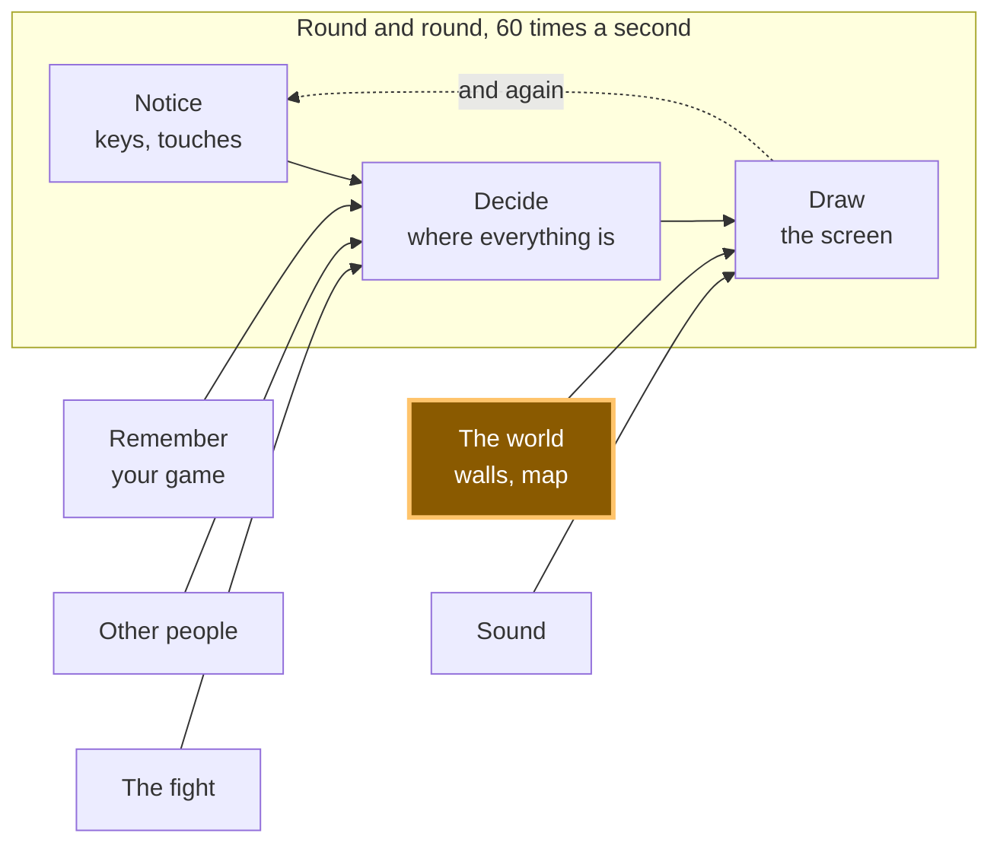

# A15: Walls

Until now your square walks through everything. By the end of this step there are rocks on the screen, you cannot walk through them, and when you push against one you slide along it instead of getting stuck.
{: .lesson-intro }

**Needs:** [A10](a10.html). **Gives you:** solid things, described as data, that stop the player.

## The whole game, and today's piece



Today you build **The world**. It feeds "Draw" — the rocks have to appear — and it also puts a limit on "Decide": from now on, where the square is allowed to go is not just "anywhere on the canvas".

## Cutting it into blocks

"You cannot walk through rocks" sounds like one thing. It is three:

1. **Describe** — say where the solid things are
2. **Check** — ask whether a place you are thinking of standing is inside one
3. **Stop** — go as far as the edge and no further

**Why bother splitting it?** Because if it were one lump and it went wrong, you could not tell which part was wrong. Is the rock in the place you think it is? Is the overlap test giving the wrong answer? Or is the test right and you are just moving anyway? Those are three different bugs with three different fixes, and from the outside they all look identical: the square goes through the rock.

Block 1 is also the one that pays off later, in a way you cannot see yet.

## Block 1: Describe

```
const walls = [
  { x: 160, y: 40,  w: 40,  h: 200 },
  { x: 160, y: 240, w: 220, h: 40 },
  { x: 300, y: 60,  w: 120, h: 40 },
];
```

That is the whole block. Look at what it is *not*: there is no code here. A wall is four numbers — how far from the left, how far from the top, how wide, how tall — sitting in a list.

This matters more than it looks. Because a wall is **data**, you can make more walls without writing more code. In [A16](a16.html) a whole map gets loaded into that array from a file, and not one line of the rest of this file changes. If instead you had written `if (player.x > 160 && player.x < 200) ...` for each rock, every new rock would mean new code, and a map would be impossible.

*Grown-up programmers say "keep it data, not code". This is what they mean.*

## Block 2: Check

Two rectangles overlap when they overlap **left-to-right** *and* **top-to-bottom**. If either one of those is false, they miss each other completely.

Think about two windows on a table. If one is entirely to the left of the other, they cannot touch, no matter how their tops and bottoms line up. If one is entirely above the other, same thing. They only touch if they are in each other's way on *both* directions at once.

```
function overlaps(a, b) {
  return a.x < b.x + b.w && a.x + a.w > b.x &&
         a.y < b.y + b.h && a.y + a.h > b.y;
}
```

Read it slowly. `a.x < b.x + b.w` means "a starts before b ends". `a.x + a.w > b.x` means "a ends after b starts". Both true means they overlap left-to-right. The next line is the same sentence for up and down.

This block answers a question and changes nothing. It does not move the player. It does not know what a player is. You hand it two rectangles and it says yes or no.

*Grown-up programmers call this AABB collision — axis-aligned bounding box. It means "boxes that are not tilted", and it is the fastest useful collision test there is. Now you know the word.*

## Block 3: Stop

Here is the part that decides whether your game feels good or feels broken.

**Move one direction at a time**, and for each one, ask *before* you go.

```
function moveX(amount) {
  let x = player.x + amount;
  for (const wall of walls) {
    if (!overlaps({ x, y: player.y, w: SIZE, h: SIZE }, wall)) continue;
    x = amount > 0 ? wall.x - SIZE : wall.x + wall.w;
  }
  player.x = Math.max(0, Math.min(canvas.width - SIZE, x));
}
```

`x` is where you are *thinking of* standing. You have not gone there yet. If that spot is inside a wall, you do not stay put — you go exactly as far as the wall's edge. Moving right, the furthest you can be is the wall's left side minus your own width. Moving left, it is the wall's right side.

`moveY` is the same function with `x` and `y` swapped, and `wall.h` instead of `wall.w`.

Then in `update`, two separate steps:

```
if (dx !== 0) moveX(dx * SPEED * dt);
if (dy !== 0) moveY(dy * SPEED * dt);
```

**Why separate?** Push right into a rock while also pushing down. The sideways step is refused — the rock is there. The downward step is asked as its own question, and there is nothing below you, so it happens. You slide down the face of the rock.

Now imagine doing it in one step instead: you ask "can I be at this new x *and* this new y?", the answer is no, and you refuse both. You would be glued to the rock, unable to move at all until you let go of the direction pointing into it. Every player would think your game was broken.

Sliding is not a clever extra. It falls out of asking the two questions separately. That is the whole reason the block is written this way.

## Why we did it this way

The forcing constraint is [A16](a16.html), which loads a map. Everything here had to survive a wall list that this file has never seen — thirty rocks instead of three, arriving from a file. That is why `walls` is a plain array of plain objects, why `overlaps` takes any two rectangles rather than "the player and a wall", and why `moveX` loops over the list instead of naming any particular rock. None of that costs anything today, and it means the map arrives for free.

## What we could have done instead

| Instead of this | What it would cost |
|---|---|
| An `if` for each rock, written by hand | Fine for three rocks. Impossible for a map, and every rock you add is a chance to make a typo in code instead of in data |
| Moving first, then pushing back out of the wall | It works most of the time, then fails badly: move fast enough and you land deep inside a rock, and "push back out" cannot tell which side you came from. You get shoved out the far side |
| Checking x and y together in one step | Two lines shorter, and the square sticks to every wall it touches. Players will call this a bug, and they will be right |
| Circles instead of rectangles | Distance between centres is a shorter test. But rocks, floors and doors are rectangles, and a circle pretending to be a rectangle leaves gaps at the corners |

## The prompt

```
I have a canvas game in plain JavaScript with a player object { x, y } of size
SIZE, moved in update(dt) by dx and dy. Add solid walls: an array of
{ x, y, w, h } objects, a general rectangle-overlap function, and movement that
checks the new position before committing to it. Resolve the x axis and the y
axis in separate steps so the player slides along a wall instead of sticking,
and snap the player exactly to the wall's edge rather than just refusing the
move. Draw the walls. Do not write a special case for any individual wall.
```

**Check the output for:** did it check the two axes separately, or did it test the new x and y together? Test it — hold a direction into a wall plus a perpendicular direction, and see whether you slide or stick. Did it snap to the wall's edge, or just cancel the move so you stop a few pixels short with a visible gap? And did the overlap function end up knowing about the player, instead of taking any two rectangles? If it does, the map in A16 will not fit through it.

## See it work


Open the page with Live Server and:

1. Hold the right arrow. The square starts at `x: 60`, crosses the gap, and stops. We read its position back: `x: 128`. The rock's left edge is at `160`, the square is `32` wide, and `160 - 32 = 128`. It stopped exactly on the edge, with no gap and no overlap.
2. Keep holding right, as long as you like. It stays at `128`. It never gets through.
3. Now hold right **and** down together, still pushing into the rock. We read back `x: 128, y: 225` — the sideways number did not move at all, and the up-down number changed by 165. That is sliding, and it is the point of this step.
4. Hold right and **up** instead. Same thing the other way: `x: 128`, and `y` went back from `225` to `115`.
5. Walk down onto the long floor rock and check it stops there too. The maths does not care which rock it is.

If the square goes straight through, check Block 1 first — is the rock where you think it is? Draw it and look, before you suspect the overlap test.

## Put it in the game

Take the game from [A10](a10.html). Add the `walls` array, `overlaps`, `moveX` and `moveY`. Then replace these two lines in `update`:

```
player.x += dx * SPEED * dt;
player.y += dy * SPEED * dt;
```

with these two:

```
if (dx !== 0) moveX(dx * SPEED * dt);
if (dy !== 0) moveY(dy * SPEED * dt);
```

The "stay on screen" clamping from A10 moves inside `moveX` and `moveY`, because that is now the only place the position changes. Add one loop to `draw` so the rocks are visible — you cannot debug a wall you cannot see.

<div class="takeaways">
<h2>Key Takeaways</h2>
<ul>
<li>A wall is data — four numbers in a list — not code. That is what makes a whole map possible later</li>
<li>Two rectangles overlap only if they overlap left-to-right AND top-to-bottom</li>
<li>Ask "can I stand there?" before you move, not after</li>
<li>Resolve one direction at a time, and sliding along walls comes free</li>
<li>Stop exactly at the edge, not a few pixels short, so there is no mysterious gap</li>
</ul>
</div>

## Your turn

Make one rock a **door**: give it an extra field, `open: false`, and let the player pass through it when it is open. You need one new line in the checking loop and one colour change in `draw`. Then work out how to open it — pressing a key while standing next to it is the easy version. This is the first time your world has something in it that is not simply solid, and it is all in Block 1's data.
