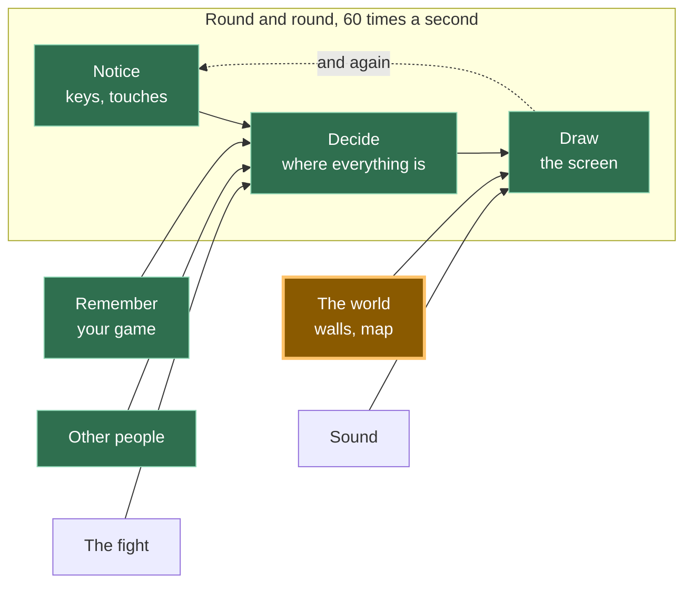

# A15: Paredes

Até agora seu quadrado atravessa tudo. No fim desta etapa há rochas na tela, você não consegue atravessá-las, e quando você empurra contra uma delas você desliza pela lateral em vez de ficar preso.
{: .lesson-intro }

**Precisa de:** [A10](a10.html). **Oferece:** coisas sólidas, descritas como dados, que param o jogador.

## O jogo completo, e a parte de hoje



Hoje você constrói **O mundo**. Ele alimenta o "Desenhar" — as rochas precisam aparecer — e também coloca um limite no "Decidir": de agora em diante, o lugar onde o quadrado pode ir não é mais "qualquer ponto do canvas".

## Dividindo em blocos

"Você não atravessa rochas" parece uma coisa só. São três:

1. **Descrever** — dizer onde estão as coisas sólidas
2. **Verificar** — perguntar se o lugar onde você pensa em ficar está dentro de uma delas
3. **Parar** — ir até a borda e nem um passo além

**Por que dividir?** Porque se fosse tudo um bloco só e desse errado, você não saberia qual parte está errada. A rocha está no lugar onde você acha que está? O teste de sobreposição está dando a resposta errada? Ou o teste está certo e você simplesmente se move de qualquer jeito? São três erros diferentes com três correções diferentes, e de fora todos parecem idênticos: o quadrado atravessa a rocha.

O bloco 1 também é o que compensa mais tarde, de um jeito que você ainda não consegue ver.

## Bloco 1: Descrever

```
const walls = [
  { x: 160, y: 40,  w: 40,  h: 200 },
  { x: 160, y: 240, w: 220, h: 40 },
  { x: 300, y: 60,  w: 120, h: 40 },
];
```

Esse é o bloco inteiro. Olhe o que ele *não* tem: não há código nenhum aqui. Uma parede são quatro números — a que distância da esquerda, a que distância do topo, que largura, que altura — dentro de uma lista.

Isso importa mais do que parece. Como uma parede é **dado**, você pode criar mais paredes sem escrever mais código. Em [A16](a16.html) um mapa inteiro é carregado de um arquivo para dentro desse array, e nenhuma linha do resto deste arquivo muda. Se em vez disso você tivesse escrito `if (player.x > 160 && player.x < 200) ...` para cada rocha, cada rocha nova significaria código novo, e um mapa seria impossível.

*Programadores adultos dizem "mantenha como dado, não como código". É isso que eles querem dizer.*

## Bloco 2: Verificar

Dois retângulos se sobrepõem quando se sobrepõem **da esquerda para a direita** *e* **de cima para baixo**. Se qualquer um dos dois for falso, eles passam completamente longe um do outro.

Pense em duas janelas sobre uma mesa. Se uma está inteiramente à esquerda da outra, elas não podem se tocar, não importa como o topo e a base estejam alinhados. Se uma está inteiramente acima da outra, a mesma coisa. Elas só se tocam se estiverem no caminho uma da outra nas *duas* direções ao mesmo tempo.

```
function overlaps(a, b) {
  return a.x < b.x + b.w && a.x + a.w > b.x &&
         a.y < b.y + b.h && a.y + a.h > b.y;
}
```

Leia devagar. `a.x < b.x + b.w` quer dizer "a começa antes de b terminar". `a.x + a.w > b.x` quer dizer "a termina depois de b começar". Os dois verdadeiros significa que eles se sobrepõem da esquerda para a direita. A linha seguinte é a mesma frase, agora para cima e para baixo.

Este bloco responde a uma pergunta e não muda nada. Ele não move o jogador. Ele não sabe o que é um jogador. Você entrega dois retângulos e ele diz sim ou não.

*Programadores adultos chamam isso de colisão AABB — "axis-aligned bounding box", ou caixa alinhada aos eixos. Quer dizer "caixas que não estão inclinadas", e é o teste de colisão útil mais rápido que existe. Agora você conhece a palavra.*

## Bloco 3: Parar

Aqui está a parte que decide se o seu jogo parece bom ou parece quebrado.

**Mova uma direção por vez** e, para cada uma, pergunte *antes* de ir.

```
function moveX(amount) {
  let x = player.x + amount;
  for (const wall of walls) {
    if (!overlaps({ x, y: player.y, w: SIZE, h: SIZE }, wall)) continue;
    x = amount > 0 ? wall.x - SIZE : wall.x + wall.w;
  }
  player.x = Math.max(0, Math.min(canvas.width - SIZE, x));
}
```

`x` é onde você está *pensando* em ficar. Você ainda não foi para lá. Se aquele ponto está dentro de uma parede, você não fica parado onde estava — você vai exatamente até a borda da parede. Indo para a direita, o mais longe que você pode estar é o lado esquerdo da parede menos a sua própria largura. Indo para a esquerda, é o lado direito da parede.

`moveY` é a mesma função com `x` e `y` trocados, e `wall.h` em vez de `wall.w`.

Então, no `update`, dois passos separados:

```
if (dx !== 0) moveX(dx * SPEED * dt);
if (dy !== 0) moveY(dy * SPEED * dt);
```

**Por que separados?** Empurre para a direita contra uma rocha e, ao mesmo tempo, empurre para baixo. O passo lateral é recusado — a rocha está ali. O passo para baixo é perguntado como uma pergunta própria, e não há nada abaixo de você, então ele acontece. Você desliza pela face da rocha.

Agora imagine fazer isso em um passo só: você pergunta "posso estar neste novo x *e* neste novo y?", a resposta é não, e você recusa os dois. Você ficaria colado na rocha, sem conseguir se mover, até soltar a direção que aponta para dentro dela. Todo jogador acharia que o seu jogo está quebrado.

Deslizar não é um extra inteligente. Ele aparece sozinho quando você faz as duas perguntas separadamente. Essa é a única razão pela qual o bloco é escrito assim.

## Por que fizemos isso desta forma

A restrição que obriga isso é [A16](a16.html), que carrega um mapa. Tudo aqui tinha que sobreviver a uma lista de paredes que este arquivo nunca viu — trinta rochas em vez de três, chegando de um arquivo. É por isso que `walls` é um array comum de objetos comuns, por isso que `overlaps` recebe quaisquer dois retângulos em vez de "o jogador e uma parede", e por isso que `moveX` percorre a lista em vez de citar uma rocha específica. Nada disso custa nada hoje, e faz com que o mapa chegue de graça.

## O que poderíamos ter feito em vez disso

| Em vez disso | O que custaria |
|---|---|
| Um `if` para cada rocha, escrito à mão | Serve para três rochas. É impossível para um mapa, e cada rocha que você adiciona é uma chance de errar de digitação no código em vez de nos dados |
| Mover primeiro e depois empurrar para fora da parede | Funciona na maior parte do tempo e depois falha feio: mova rápido o bastante e você aterrissa bem dentro da rocha, e "empurrar para fora" não sabe de que lado você veio. Você é jogado para o lado oposto |
| Verificar x e y juntos, em um passo só | Duas linhas mais curto, e o quadrado gruda em toda parede que toca. Os jogadores vão chamar isso de bug, e vão estar certos |
| Círculos em vez de retângulos | A distância entre os centros é um teste mais curto. Mas rochas, chãos e portas são retângulos, e um círculo se fingindo de retângulo deixa vãos nos cantos |

## O prompt

```
I have a canvas game in plain JavaScript with a player object { x, y } of size
SIZE, moved in update(dt) by dx and dy. Add solid walls: an array of
{ x, y, w, h } objects, a general rectangle-overlap function, and movement that
checks the new position before committing to it. Resolve the x axis and the y
axis in separate steps so the player slides along a wall instead of sticking,
and snap the player exactly to the wall's edge rather than just refusing the
move. Draw the walls. Do not write a special case for any individual wall.
```

**Verifique na resposta:** ele verificou os dois eixos separadamente, ou testou o novo x e o novo y juntos? Teste — segure uma direção contra a parede mais uma direção perpendicular e veja se você desliza ou gruda. Ele encaixou o jogador exatamente na borda da parede, ou só cancelou o movimento, deixando você parar alguns pixels antes, com um vão visível? E a função de sobreposição acabou conhecendo o jogador, em vez de receber quaisquer dois retângulos? Se sim, o mapa de A16 não vai passar por ela.

## Veja funcionar


Abra a página com o Live Server e:

1. Segure a seta para a direita. O quadrado começa em `x: 60`, atravessa o vão e para. Lemos a posição de volta: `x: 128`. A borda esquerda da rocha está em `160`, o quadrado tem `32` de largura, e `160 - 32 = 128`. Ele parou exatamente na borda, sem vão e sem sobreposição.
2. Continue segurando a direita o quanto quiser. Ele fica em `128`. Nunca passa.
3. Agora segure direita **e** baixo juntas, ainda empurrando contra a rocha. Lemos de volta `x: 128, y: 225` — o número lateral não mudou nada, e o número de cima para baixo mudou 165. Isso é deslizar, e é o ponto desta etapa.
4. Segure direita e **cima** em vez disso. A mesma coisa ao contrário: `x: 128`, e `y` voltou de `225` para `115`.
5. Ande para baixo até a rocha comprida do chão e confira se ele para ali também. A conta não se importa com qual rocha é.

Se o quadrado atravessar direto, olhe o bloco 1 primeiro — a rocha está onde você acha que está? Desenhe e olhe, antes de desconfiar do teste de sobreposição.

## Coloque no jogo

Pegue o jogo de [A10](a10.html). Adicione o array `walls`, `overlaps`, `moveX` e `moveY`. Depois troque estas duas linhas no `update`:

```
player.x += dx * SPEED * dt;
player.y += dy * SPEED * dt;
```

por estas duas:

```
if (dx !== 0) moveX(dx * SPEED * dt);
if (dy !== 0) moveY(dy * SPEED * dt);
```

O limite de "continuar na tela" de A10 passa para dentro de `moveX` e `moveY`, porque agora esse é o único lugar onde a posição muda. Adicione um laço ao `draw` para que as rochas apareçam — não se conserta uma parede que não se vê.

<div class="takeaways">
<h2>Principais Pontos</h2>
<ul>
<li>Uma parede é dado — quatro números em uma lista — não código. É isso que torna um mapa inteiro possível mais tarde</li>
<li>Dois retângulos só se sobrepõem se se sobrepõem da esquerda para a direita E de cima para baixo</li>
<li>Pergunte "posso ficar ali?" antes de se mover, não depois</li>
<li>Resolva uma direção por vez, e deslizar pelas paredes vem de graça</li>
<li>Pare exatamente na borda, não alguns pixels antes, para não sobrar um vão misterioso</li>
</ul>
</div>

## Sua vez

Transforme uma das rochas em uma **porta**: dê a ela um campo extra, `open: false`, e deixe o jogador passar por ela quando estiver aberta. Você precisa de uma linha nova no laço de verificação e de uma mudança de cor no `draw`. Depois descubra como abri-la — apertar uma tecla enquanto está ao lado dela é a versão fácil. É a primeira vez que o seu mundo tem algo que não é simplesmente sólido, e está tudo nos dados do bloco 1.
