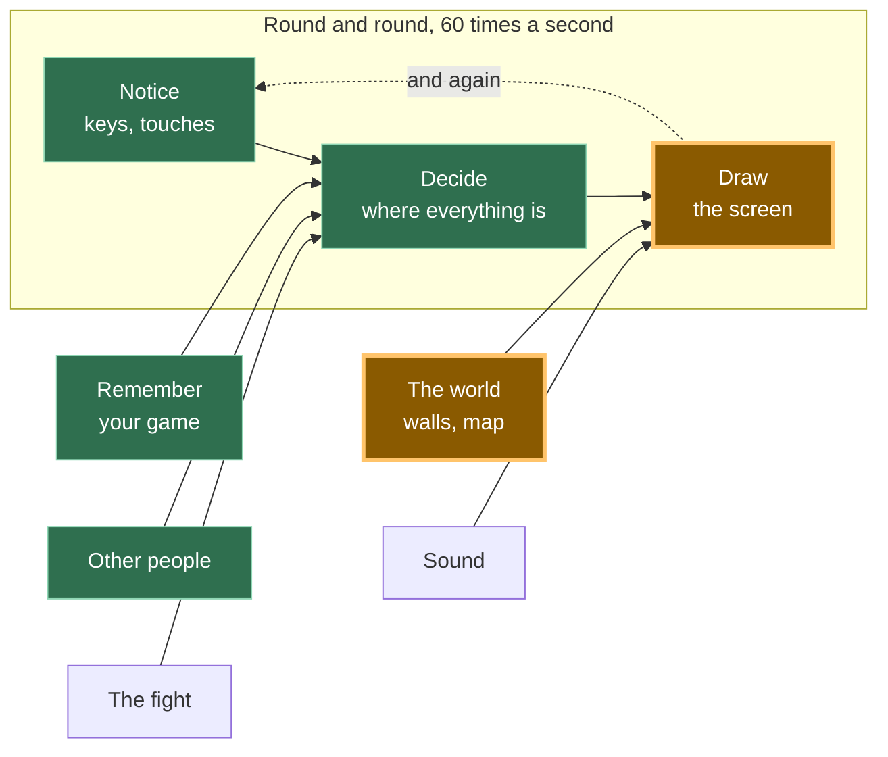

# A16: 地図

今まで、あなたの世界は画面1つ分でした。このステップが終わると、世界は画面の2倍以上の広さと高さになり、歩くとその世界が横を流れていきます。
{: .lesson-intro }

**必要なもの:** [A15](a15.html)。**得られるもの:** 数字として保存され、タイルとして描かれる世界と、あなたを追いかけるカメラ。

## ゲーム全体と今日の部分



**世界**が大きくなります。[A15](a15.html)では岩が3つでした。今回は地図まるごとです。そして地図はキャンバスより大きいので、「描画」はどこを見ればいいかを覚えないといけません。

## ブロックに分割する

「画面より広くてスクロールする世界」は1つのことのように聞こえますが、中身は3つです。

1. **保存する** — 世界は数字のリスト
2. **描く** — 見えているタイルを画面に置く
3. **追いかける** — プレイヤーが真ん中にいるように、カメラを動かす

**なぜわざわざ分けるのでしょう。** もし1つのかたまりにしてしまうと、うまく動かないときにどこが悪いのか分からなくなるからです。画面が真っ白なら、保存の問題です。タイルの場所がおかしいなら、描画の問題です。タイルはきれいに描けているのに、景色がまったく動かない、または逆向きに動く（これは誰にでも起きます）なら、追いかけの問題です。3つのブロック、3つの探す場所です。

## ブロック1: 保存する

```
const MAP_W = 24;
const MAP_H = 16;
const map = [
  40,40,40,40,40,40,40,40,40,40,40,40,40,40,40,40,40,40,40,40,40,40,40,40,
  40,48,48,48,48,49,48,48,48,48,40,48,48,48,48,48,48,48,49,48,48,48,48,40,
  40,48,49,48,48,40,48,48,48,48,40,48,48,40,40,40,40,48,48,48,48,48,49,40,
  ...
];
```

これが世界です。1マスに数字が1つ。`48`は砂の床、`49`は同じ床にぽつぽつ模様がついたもの、`40`は石の壁です。これはシートの中の絵の番号で、[A14](a14.html)で1つのファイルから絵を切り出したのとまったく同じしくみです。

ここに*ない*ものを見てください。コードがありません。`if`もありません。世界を変えるとは、数字を変えることです。目を細めて見れば、数字の中に部屋のかたちが見えます。`40`が壁を描いているのです。

これは[A15](a15.html)と同じ考え方が、大きくなったものです。あそこでは壁はリストに入った4つの数字で、コードを増やさずに岩を増やせるのがポイントでした。ここでその約束が回収されます。世界のマスは384個。それでも、描画のコードはそのどれ1つについても何も知りません。

*大人のプログラマーはこれをデータ駆動設計と呼びます。世界はデータ。コードは、それを読む機械です。*

**1マスに数字1つ**ということは、地図が**グリッド**（ます目）だということでもあります。そして、まっすぐ1列に並んだリストにグリッドを入れると、どうしても覚えないといけない計算が1つ出てきます。

```
map[row * MAP_W + col]
```

3行目にたどり着くには、3行分をまるごと飛ばします。それが`3 * 24`個の数字です。そこから`col`の分だけ数えて進みます。この行は、だれでも一度はこんがらがります。紙に3×3のます目を描いてみてください。もう二度とこんがらがりません。

> 本物のゲームでは、この配列はファイルに直接書きこまれていません。別の地図ファイルから読み込まれます。つまり、プログラムにまったくふれずに新しいステージを作れるということです。ファイルを読み込むには`fetch`が必要で、それはそれで1つの大きな話題なので、ここでは数字を`main.js`の中に置いて、目で見えるようにしています。

## ブロック2: 描く

```
function drawMap() {
  const firstCol = Math.floor(camera.x / T);
  const lastCol = Math.floor((camera.x + canvas.width) / T);
  const firstRow = Math.floor(camera.y / T);
  const lastRow = Math.floor((camera.y + canvas.height) / T);

  for (let row = firstRow; row <= lastRow; row++) {
    for (let col = firstCol; col <= lastCol; col++) {
      const n = map[row * MAP_W + col];
      ctx.drawImage(sheet,
        (n % SHEET_COLS) * CELL, Math.floor(n / SHEET_COLS) * CELL, CELL, CELL,
        col * T - camera.x, row * T - camera.y, T, T);
    }
  }
}
```

`T`は、タイル1枚が画面上でどれくらいの大きさかです。絵は16ピクセルで、それを3倍で描くので48です。

上の4行は、描く価値のあるタイルはどれかを計算しています。キャンバスの幅は480なので、24列のうち、同時に見えるのはせいぜい11列です。この小さな地図でも、仕事の3分の2くらいが省けます。200×200マスの本物の地図なら、全部描くと1コマで40,000枚のタイルになり、それを1秒に60回です。しかもそのほとんどは画面の外で、だれにも見えません。ゲームはのろのろになり、しかものろのろしながら、役に立つことは何もしていないのです。

*大人のプログラマーはこれをカリングと呼びます。だれにも見えないと言い切れる仕事を、捨ててしまうことです。*

## ブロック3: 追いかける

```
const camera = { x: 0, y: 0 };

function follow() {
  camera.x = player.x + SIZE / 2 - canvas.width / 2;
  camera.y = player.y + SIZE / 2 - canvas.height / 2;
  camera.x = Math.max(0, Math.min(MAP_W * T - canvas.width, camera.x));
  camera.y = Math.max(0, Math.min(MAP_H * T - canvas.height, camera.y));
}
```

ここは、むずかしいと思われがちなところです。でも、むずかしくありません。

**カメラとは、引き算です。** ほんとうに、それだけです。`camera`は、世界がどれだけずれたかを表す2つの数字です。画面に描くものはすべて、自分の位置からその数字を引きます。ブロック2で`col * T - camera.x`として出てきましたね。プレイヤーも`player.x - camera.x`の位置に描かれます。キャンバスの中にカメラという物があるわけではなく、動いているのは数字だけです。画面のすべてが左に200ずれたら、それはあなたが右に200歩いたのとまったく同じに見えます。

はじめの2行は、プレイヤーを真ん中に置きます。プレイヤーの中心を取り、そこから画面の半分だけ後ろに下がります。

おもしろいのは、あとの2行です。この2行が、地図のふちでカメラを止めます。これがないと、左上のすみまで歩いたときカメラはそのまま進んでしまい、世界の外の真っ黒な空間が見えてしまいます。この2行があると、カメラは止まり、**プレイヤーは真ん中にいなくなります**。それは、あなたが今までにやったすべてのゲームがやっていることです。気づいていなかっただけです。自然に感じるからです。

## なぜこの方法にしたのか

決め手になった制約は、地図がファイルから読み込まれても平気でないといけない、ということです。ここにあるものは全部、`map`、`MAP_W`、`MAP_H`がよそからやってきても何も変えなくていいように書かれています。`drawMap`はマスの名前を1つも書きません。`follow`は世界の大きさを教えてもらうのではなく、かけ算で計算します。そして絵の番号は、データの中以外のどこにも出てきません。だからこのステップは、あとで手間がほとんどかかりません。そしてそれは、[A15](a15.html)がまだ気にする理由もないうちに、壁をデータにすると言い張った理由でもあります。

## 代わりにできたこと

| この代わりに | その代償 |
|---|---|
| 世界ぜんぶを1枚の大きな絵にする | かんたんですし、世界がスマホのメモリより大きくなるまではうまくいきます。この大きさのタイル地図なら、何メガバイトもある1枚の画像になり、1マス変えるだけで全体を描き直すことになります |
| プレイヤーが歩いたら、世界のもの全部を動かす | 毎コマ、全部を動かすのを忘れないようにしないといけません。1つ忘れたとたんに、それだけがずれていきます。描くときにカメラを引く方法なら、何にもふれません |
| まっすぐなグリッドではなく、`{ x, y, tile }`のオブジェクトのリストにする | 自由度は上がりますが、「3列目の7行目には何がある？」に答えるのがずっと遅くなります。リストをぜんぶ探さないといけません。グリッドなら、かけ算1回で答えます |
| 毎コマ地図ぜんぶを描く | 今日は2行短くなり、地図が大きくなったとたんに使えなくなります。まだ答えを目で確かめられるくらい小さな地図のうちに、この4行を覚えておくほうがいいです |

## プロンプト

```
I have a plain JavaScript canvas game, 480x320, with a player { x, y } moved in
update(dt). Add a tile map: a flat array of tile numbers with MAP_W and MAP_H,
drawn from the 16x16 sprite sheet at ../../vendor/kenney/tiny-dungeon.png
(12 cells per row, no gaps), at 3x with smoothing off. Add a camera object that
keeps the player centred, clamped so it never shows past the edges of the map.
Draw only the tiles inside the camera's view, not the whole map. Keep storing,
drawing and camera-following as three separate pieces.
```

**出力を確認すること:** 毎コマ地図ぜんぶを描いていますか。それとも見えている部分だけですか。ほとんどのアシスタントは、まず全部の行と列をまわすかんたんな二重ループを書きます。そのほうが短く、小さな地図では問題なさそうに見えるからです。カメラはふちで止まっていますか。それともすみまで歩くと、世界の外の真っ黒な何もない場所が見えてしまいますか。そして、右に歩いて引き算の向きを確かめてください。世界が*逆向き*に流れたら、だれかがカメラを引かずに足しています。このステップ全体で、いちばんよくあるまちがいです。

## 動作を確認する


Live Serverでページを開いて、次をやってみましょう。

1. 地図が出てきて、タイルがキャンバスのふちで切れています。世界は画面に収まりません。それがねらいです。
2. 右矢印を1秒間押しっぱなしにします。数字を読み取ってみると、プレイヤーは`x: 120`から`x: 323.32`へ、カメラは`x: 0`から`x: 99.32`へ動いていました。カメラが動いたということは、動いているのは四角形ではなく世界のほうだということです。
3. これ以上進めなくなるまで、右を押しつづけます。プレイヤーは世界のいちばん端`x: 1120`で止まり、カメラは`x: 672`で止まります。地図の幅は1152ピクセル、キャンバスは480、そして1152 − 480 = 672でぴったりです。カメラは、世界だけが見えている最後の位置で止まったのです。
4. 右のふちにいるあいだ、プレイヤーはもう真ん中に**いません**。画面のふちまで歩いていきました。それが、止める処理が働いているしるしです。
5. 地図のいちばん上まで歩いてみましょう。どれだけ上を押しても、`camera.y`は`0`のままで、マイナスにはなりません。

## ゲームに組み込む

[A15](a15.html)のゲームを用意します。`map`、`MAP_W`、`MAP_H`、`sheet`の画像、`drawMap`、`camera`、`follow`を足します。`update`の最後で`follow()`を呼びます。そして`draw`の中で、「キャンバス全体を1色でぬる」行があった場所に`drawMap()`を置きます。地図が全部のピクセルをおおうので、消す作業はもう必要ありません。

ほかに描くものにも、同じ2つの引き算が必要です。

```
ctx.fillRect(player.x - camera.x, player.y - camera.y, SIZE, SIZE);
```

`update`の中で位置を止めている処理は、キャンバスの大きさではなく地図の大きさに変えてください。そうしないと、プレイヤーは最初の1画面から出られません。

<div class="takeaways">
<h2>主なポイント</h2>
<ul>
<li>数字でできた世界は、コードを変えずに変えられます。それがデータ駆動設計です</li>
<li>まっすぐなリストの中のグリッドは<code>map[row * width + col]</code>。この行は、一度紙に描いてみる価値があります</li>
<li>カメラとは引き算です。何も動いていません。全部が、ずらして描かれているだけです</li>
<li>画面に入るものだけを描きましょう。そうしないと、大きな地図では仕事のほとんどがむだになります</li>
<li>ふちでカメラを止めて、プレイヤーが真ん中から外れるのを許しましょう。本物のゲームはそうしています</li>
</ul>
</div>

## あなたの番

このデモでは、石の壁をまっすぐすり抜けられてしまいます。直すための材料はもうそろっています。[A15](a15.html)は動く前にその場所を調べますし、地図はどのマスが壁かをもう知っています。

世界のピクセル単位の`x`と`y`を受け取り、それがどのマスなのかを計算して（`Math.floor(x / T)`）、そこの数字が`40`かどうかを答える関数を書いてみましょう。そして`moveX`と`moveY`で、`walls`のリストのかわりにそれを使います。1つ気をつけることがあります。あなたのプレイヤーは幅32ピクセルなので、一度に2マス以上にまたがります。だから1か所ではなく、4つの角ぜんぶを調べないといけません。
