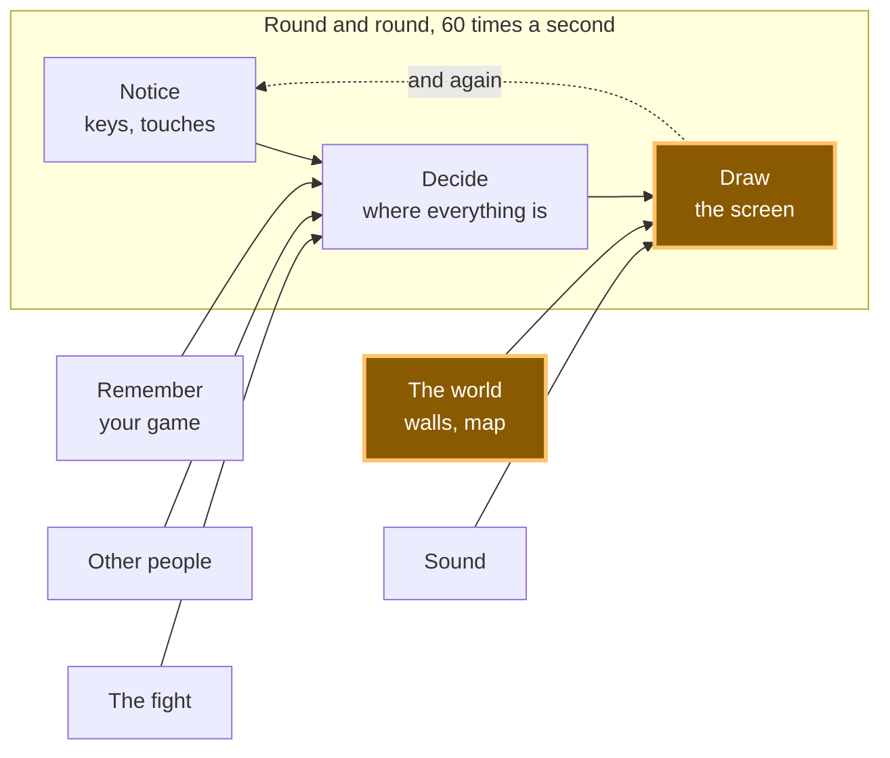

# A16: The Map

Until now your whole world has been one screen. By the end of this step the world is more than twice as wide and twice as tall as the screen, and it slides past you as you walk.
{: .lesson-intro }

**Needs:** [A15](a15.html). **Gives you:** a world stored as numbers, drawn as tiles, with a camera that follows you.

## The whole game, and today's piece



**The world** grows up. In [A15](a15.html) it was three rocks. Now it is a whole map, and because the map is bigger than the canvas, "Draw" has to learn where to look.

## Cutting it into blocks

"A world bigger than the screen that scrolls" sounds like one thing. It is three:

1. **Store** — the world is a list of numbers
2. **Draw** — put the tiles you can see on the screen
3. **Follow** — move a camera so the player stays in the middle

**Why bother splitting it?** Because if it were one lump and it went wrong, you could not tell which part was wrong. A blank screen is a storing problem. Tiles in the wrong places is a drawing problem. Tiles drawn perfectly but the view never moving — or moving the wrong way, which happens to everyone — is a following problem. Three blocks, three places to look.

## Block 1: Store

```
const MAP_W = 24;
const MAP_H = 16;
const map = [
  40,40,40,40,40,40,40,40,40,40,40,40,40,40,40,40,40,40,40,40,40,40,40,40,
  40,48,48,48,48,49,48,48,48,48,40,48,48,48,48,48,48,48,49,48,48,48,48,40,
  40,48,49,48,48,40,48,48,48,48,40,48,48,40,40,40,40,48,48,48,48,48,49,40,
  ...
];
```

That is the world. One number per square. `48` is a sandy floor, `49` is the same floor with a few specks on it, `40` is a stone wall — those are picture numbers in the sheet, exactly the way [A14](a14.html) cut pictures out of one file.

Look at what is *not* here. There is no code. There is no `if`. Changing the world means changing numbers, and you can see the shape of the rooms in the numbers if you squint — the `40`s draw the walls.

This is the same idea as [A15](a15.html), grown up. There, a wall was four numbers in a list, and the point was that you could add rocks without adding code. Here that promise gets collected: 384 squares of world, and not one line of drawing code knows anything about any of them.

*Grown-up programmers call this data-driven design. The world is data. The code is a machine that reads it.*

**One number, one square** also means the map is a **grid**, and a grid stored in a flat list has one piece of arithmetic you must know:

```
map[row * MAP_W + col]
```

To get to row 3, skip 3 whole rows — that is `3 * 24` numbers — then count along `col`. This line confuses everyone once. Draw it on paper with a 3-by-3 grid and it will never confuse you again.

> In the real game this array is not typed into the file. It is loaded from a separate map file, which means someone can make new levels without touching the program at all. Loading a file needs `fetch`, which is a whole idea of its own, so here the numbers sit in `main.js` where you can see them.

## Block 2: Draw

```
function drawMap() {
  const firstCol = Math.floor(camera.x / T);
  const lastCol = Math.floor((camera.x + canvas.width) / T);
  const firstRow = Math.floor(camera.y / T);
  const lastRow = Math.floor((camera.y + canvas.height) / T);

  for (let row = firstRow; row <= lastRow; row++) {
    for (let col = firstCol; col <= lastCol; col++) {
      const n = map[row * MAP_W + col];
      ctx.drawImage(sheet,
        (n % SHEET_COLS) * CELL, Math.floor(n / SHEET_COLS) * CELL, CELL, CELL,
        col * T - camera.x, row * T - camera.y, T, T);
    }
  }
}
```

`T` is how big one tile is on screen: 16 pixels of picture, drawn at 3 times the size, so 48.

The four lines at the top work out which tiles are worth drawing. The canvas is 480 wide, so at most eleven columns can be visible at once, out of 24. On this small map that saves you about two thirds of the work. On a real map of 200 by 200 squares, drawing everything would mean 40,000 tiles every frame, sixty times a second, and almost all of them off the screen where nobody can see them. Your game would crawl, and it would be doing nothing useful while it crawled.

*Grown-up programmers call this culling — throwing away work you can prove nobody will see.*

## Block 3: Follow

```
const camera = { x: 0, y: 0 };

function follow() {
  camera.x = player.x + SIZE / 2 - canvas.width / 2;
  camera.y = player.y + SIZE / 2 - canvas.height / 2;
  camera.x = Math.max(0, Math.min(MAP_W * T - canvas.width, camera.x));
  camera.y = Math.max(0, Math.min(MAP_H * T - canvas.height, camera.y));
}
```

Here is the part people expect to be hard, and it is not.

**A camera is a subtraction.** That is genuinely all of it. `camera` is a pair of numbers saying how far the world has slid. Every single thing you draw takes those numbers away from its own position — you saw it in Block 2 as `col * T - camera.x`, and the player is drawn at `player.x - camera.x`. There is no camera object in the canvas, nothing is really moving except numbers. If everything on screen shifts left by 200, that looks exactly like you walking 200 to the right.

The first two lines put the player in the middle: take the player's centre, then step back by half a screen.

The last two lines are the interesting ones. They stop the camera at the edges of the map. Without them, when you walk into the top-left corner the camera would keep going and you would see empty black space past the end of the world. With them, the camera stops and **the player stops being in the middle** — which is exactly what every game you have ever played does. You just never noticed, because it feels right.

## Why we did it this way

The forcing constraint is that the map has to survive being loaded from a file. Everything here is written so that `map`, `MAP_W` and `MAP_H` could arrive from somewhere else and nothing would change: `drawMap` never names a square, `follow` works out the world's size by multiplying instead of being told, and no picture number appears anywhere except in the data. That is why this step costs almost nothing later — and it is also why [A15](a15.html) insisted on walls being data before you had any reason to care.

## What we could have done instead

| Instead of this | What it would cost |
|---|---|
| One huge picture of the whole world | Simple, and it works until the world is bigger than a phone's memory. A map of tiles this size would be a single image of many megabytes, and you could not change one square without redrawing the whole thing |
| Moving every object in the world when the player walks | You have to remember to move everything, every frame, and the moment you forget one thing it drifts. Subtracting a camera at drawing time touches nothing |
| A list of `{ x, y, tile }` objects instead of a flat grid | More flexible, and much slower to answer "what is at row 7, column 3?" — you would have to search the whole list. A grid answers with one multiplication |
| Drawing the whole map every frame | Two lines shorter today, and unusable as soon as the map is big. Better to learn the four lines now, on a map small enough that you can still check the answer by eye |

## The prompt

```
I have a plain JavaScript canvas game, 480x320, with a player { x, y } moved in
update(dt). Add a tile map: a flat array of tile numbers with MAP_W and MAP_H,
drawn from the 16x16 sprite sheet at ../../vendor/kenney/tiny-dungeon.png
(12 cells per row, no gaps), at 3x with smoothing off. Add a camera object that
keeps the player centred, clamped so it never shows past the edges of the map.
Draw only the tiles inside the camera's view, not the whole map. Keep storing,
drawing and camera-following as three separate pieces.
```

**Check the output for:** does it draw the whole map every frame, or only the visible part? Almost every assistant writes the simple double loop over all rows and columns first, because it is shorter and looks fine on a tiny map. Is the camera clamped at the edges, or can you walk to the corner and see black nothing outside the world? And check the sign of the subtraction by walking right — if the world slides the *wrong* way, someone added the camera instead of subtracting it, which is the single most common mistake in this whole step.

## See it work


Open the page with Live Server and:

1. The map appears, and tiles are cut off by the edges of the canvas. The world does not fit, which is the point.
2. Hold the right arrow for one second. We read the numbers back: the player went from `x: 120` to `x: 323.32`, and the camera went from `x: 0` to `x: 99.32`. The camera moved, so the world really is sliding, not the square.
3. Keep holding right until you cannot go further. The player stops at `x: 1120`, the very edge of the world, and the camera stops at `x: 672`. The map is 1152 pixels wide and the canvas is 480, and 1152 − 480 = 672 exactly. The camera stopped at the last position that still shows only world.
4. While you were at the right-hand edge, the player was **not** in the middle any more — it walked across to the edge of the screen. That is the clamp doing its job.
5. Walk to the top of the map. `camera.y` stays at `0` and refuses to go negative, no matter how far up you press.

## Put it in the game

Take the game from [A15](a15.html). Add `map`, `MAP_W`, `MAP_H`, the `sheet` image, `drawMap`, `camera` and `follow`. Call `follow()` at the end of `update`. Then, in `draw`, put `drawMap()` where the "paint the whole canvas one colour" lines used to be — the map covers every pixel, so there is nothing left to clear.

Everything else you draw needs the same two subtractions:

```
ctx.fillRect(player.x - camera.x, player.y - camera.y, SIZE, SIZE);
```

Change the clamping in `update` from the canvas size to the map size, or your player will not be able to leave the first screen.

<div class="takeaways">
<h2>Key Takeaways</h2>
<ul>
<li>A world made of numbers can be changed without changing any code — that is data-driven design</li>
<li>A grid in a flat list is <code>map[row * width + col]</code>, and that line is worth drawing on paper once</li>
<li>A camera is a subtraction. Nothing moves; everything is drawn shifted</li>
<li>Only draw what fits on the screen, or a big map wastes almost all of its work</li>
<li>Stop the camera at the edges, and let the player leave the centre — that is what real games do</li>
</ul>
</div>

## Your turn

In this demo you can walk straight through the stone walls. All the pieces to fix it already exist: [A15](a15.html) checks a place before moving into it, and the map already says which squares are walls.

Write a function that takes an `x` and a `y` in world pixels, works out which square that is (`Math.floor(x / T)`), and answers whether the number there is `40`. Then use it in `moveX` and `moveY` instead of the `walls` list. Watch out for one thing: your player is 32 pixels wide, so it covers more than one square at a time — you have to check all four of its corners, not just one.
