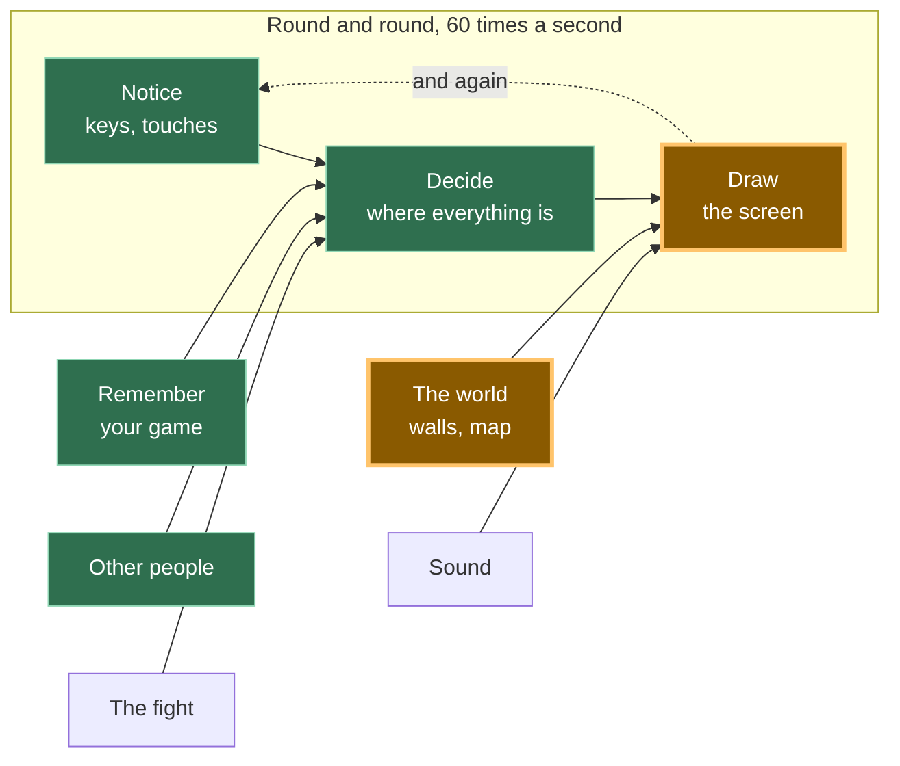

# A16: O Mapa

Até agora, seu mundo inteiro tem sido uma única tela. Ao final desta etapa, o mundo é mais que o dobro da largura e o dobro da altura da tela, e ele desliza por você enquanto caminha.
{: .lesson-intro }

**Pré-requisitos:** [A15](a15.html). **Você ganha:** um mundo armazenado como números, desenhado como tiles, com uma câmera que te segue.

## O jogo completo e a peça de hoje



**O mundo** cresce. Em [A15](a15.html) eram três rochas. Agora é um mapa inteiro, e como o mapa é maior que o canvas, "Desenhar" precisa aprender onde olhar.

## Dividindo em blocos

"Um mundo maior que a tela que rola" parece uma coisa só. São três:

1. **Armazenar** — o mundo é uma lista de números
2. **Desenhar** — colocar os tiles que você pode ver na tela
3. **Seguir** — mover uma câmera para que o jogador permaneça no centro

**Por que se dar ao trabalho de dividir?** Porque se fosse um bloco único e algo desse errado, você não saberia qual parte estava com problema. Uma tela em branco é um problema de armazenamento. Tiles nos lugares errados é um problema de desenho. Tiles desenhados perfeitamente, mas a visão nunca se movendo — ou movendo-se na direção errada, o que acontece com todo mundo — é um problema de seguir (câmera). Três blocos, três lugares para procurar.

## Bloco 1: Armazenamento

```
const MAP_W = 24;
const MAP_H = 16;
const map = [
  40,40,40,40,40,40,40,40,40,40,40,40,40,40,40,40,40,40,40,40,40,40,40,40,
  40,48,48,48,48,49,48,48,48,48,40,48,48,48,48,48,48,48,49,48,48,48,48,40,
  40,48,49,48,48,40,48,48,48,48,40,48,48,40,40,40,40,48,48,48,48,48,49,40,
  ...
];
```

Esse é o mundo. Um número por quadrado. `48` é um chão arenoso, `49` é o mesmo chão com algumas manchas, `40` é uma parede de pedra — esses são números de imagem na folha, exatamente da mesma forma que [A14](a14.html) recortou imagens de um único arquivo.

Olhe o que *não* está aqui. Não há código. Não há `if`. Mudar o mundo significa mudar números, e você pode ver a forma dos cômodos nos números se você apertar os olhos — os `40`s desenham as paredes.

Esta é a mesma ideia de [A15](a15.html), amadurecida. Lá, uma parede eram quatro números em uma lista, e o objetivo era que você pudesse adicionar rochas sem adicionar código. Aqui essa promessa é cumprida: 384 quadrados de mundo, e nenhuma linha de código de desenho sabe nada sobre nenhum deles.

*Programadores experientes chamam isso de design orientado a dados. O mundo é dados. O código é uma máquina que os lê.*

**Um número, um quadrado** também significa que o mapa é uma **grade**, e uma grade armazenada em uma lista plana tem uma peça de aritmética que você deve conhecer:

```
map[row * MAP_W + col]
```

Para chegar à linha 3, pule 3 linhas completas — isso é `3 * 24` números — então conte ao longo da coluna (`col`). Esta linha confunde todo mundo uma vez. Desenhe-a no papel com uma grade 3 por 3 e ela nunca mais o confundirá.

> No jogo real, este array não é digitado no arquivo. Ele é carregado de um arquivo de mapa separado, o que significa que alguém pode criar novos níveis sem tocar no programa. Carregar um arquivo requer `fetch`, que é uma ideia à parte, então aqui os números ficam em `main.js` onde você pode vê-los.

## Bloco 2: Desenho

```
function drawMap() {
  const firstCol = Math.floor(camera.x / T);
  const lastCol = Math.floor((camera.x + canvas.width) / T);
  const firstRow = Math.floor(camera.y / T);
  const lastRow = Math.floor((camera.y + canvas.height) / T);

  for (let row = firstRow; row <= lastRow; row++) {
    for (let col = firstCol; col <= lastCol; col++) {
      const n = map[row * MAP_W + col];
      ctx.drawImage(sheet,
        (n % SHEET_COLS) * CELL, Math.floor(n / SHEET_COLS) * CELL, CELL, CELL,
        col * T - camera.x, row * T - camera.y, T, T);
    }
  }
}
```

`T` é o tamanho de um tile na tela: 16 pixels de imagem, desenhados 3 vezes o tamanho, ou seja, 48.

As quatro linhas no topo calculam quais tiles valem a pena desenhar. O canvas tem 480 de largura, então no máximo onze colunas podem estar visíveis de uma vez, de um total de 24. Neste mapa pequeno, isso economiza cerca de dois terços do trabalho. Em um mapa real de 200 por 200 quadrados, desenhar tudo significaria 40.000 tiles a cada quadro, sessenta vezes por segundo, e quase todos fora da tela onde ninguém pode vê-los. Seu jogo ficaria lento, e estaria fazendo nada de útil enquanto estivesse lento.

*Programadores experientes chamam isso de culling — descartar trabalho que você pode provar que ninguém verá.*

## Bloco 3: Seguir

```
const camera = { x: 0, y: 0 };

function follow() {
  camera.x = player.x + SIZE / 2 - canvas.width / 2;
  camera.y = player.y + SIZE / 2 - canvas.height / 2;
  camera.x = Math.max(0, Math.min(MAP_W * T - canvas.width, camera.x));
  camera.y = Math.max(0, Math.min(MAP_H * T - canvas.height, camera.y));
}
```

Aqui está a parte que as pessoas esperam ser difícil, e não é.

**Uma câmera é uma subtração.** Isso é literalmente tudo. `camera` é um par de números que diz o quanto o mundo deslizou. Cada coisa que você desenha subtrai esses números de sua própria posição — você viu isso no Bloco 2 como `col * T - camera.x`, e o jogador é desenhado em `player.x - camera.x`. Não há objeto de câmera no canvas, nada está realmente se movendo, exceto números. Se tudo na tela se desloca 200 para a esquerda, isso parece exatamente com você andando 200 para a direita.

As duas primeiras linhas colocam o jogador no meio: pegue o centro do jogador, então recue metade de uma tela.

As duas últimas linhas são as interessantes. Elas param a câmera nas bordas do mapa. Sem elas, quando você anda para o canto superior esquerdo, a câmera continuaria e você veria um espaço preto vazio além do fim do mundo. Com elas, a câmera para e **o jogador deixa de estar no meio** — o que é exatamente o que todo jogo que você já jogou faz. Você simplesmente nunca percebeu, porque parece certo.

## Por que fizemos assim

A restrição imperativa é que o mapa precisa sobreviver ao carregamento de um arquivo. Tudo aqui está escrito para que `map`, `MAP_W` e `MAP_H` pudessem vir de outro lugar e nada mudaria: `drawMap` nunca nomeia um quadrado, `follow` calcula o tamanho do mundo multiplicando em vez de ser informado, e nenhum número de imagem aparece em nenhum lugar, exceto nos dados. É por isso que esta etapa custa quase nada mais tarde — e é também por isso que [A15](a15.html) insistiu que as paredes fossem dados antes que você tivesse qualquer motivo para se importar.

## O que poderíamos ter feito em vez disso

| Em vez disso | Qual seria o custo |
|---|---|
| Uma imagem enorme do mundo inteiro | Simples, e funciona até que o mundo seja maior que a memória de um telefone. Um mapa de tiles deste tamanho seria uma única imagem de muitos megabytes, e você não poderia mudar um quadrado sem redesenhar tudo |
| Mover cada objeto no mundo quando o jogador anda | Você precisa lembrar de mover tudo, a cada quadro, e no momento em que você esquece uma coisa, ela se desloca. Subtrair uma câmera no momento do desenho não afeta nada |
| Uma lista de objetos `{ x, y, tile }` em vez de uma grade plana | Mais flexível, e muito mais lento para responder "o que está na linha 7, coluna 3?" — você teria que procurar na lista inteira. Uma grade responde com uma multiplicação |
| Desenhar o mapa inteiro a cada quadro | Duas linhas mais curto hoje, e inutilizável assim que o mapa for grande. Melhor aprender as quatro linhas agora, em um mapa pequeno o suficiente para que você ainda possa verificar a resposta a olho nu |

## O prompt

```
I have a plain JavaScript canvas game, 480x320, with a player { x, y } moved in
update(dt). Add a tile map: a flat array of tile numbers with MAP_W and MAP_H,
drawn from the 16x16 sprite sheet at ../../vendor/kenney/tiny-dungeon.png
(12 cells per row, no gaps), at 3x with smoothing off. Add a camera object that
keeps the player centred, clamped so it never shows past the edges of the map.
Draw only the tiles inside the camera's view, not the whole map. Keep storing,
drawing and camera-following as three separate pieces.
```

**Verifique a saída para:** ele desenha o mapa inteiro a cada quadro, ou apenas a parte visível? Quase todo assistente escreve primeiro o loop duplo simples sobre todas as linhas e colunas, porque é mais curto e parece bom em um mapa pequeno. A câmera está presa nas bordas, ou você pode andar até o canto e ver o nada preto fora do mundo? E verifique o sinal da subtração andando para a direita — se o mundo desliza para o lado *errado*, alguém adicionou a câmera em vez de subtrair, que é o erro mais comum em toda esta etapa.

## Veja funcionar


Abra a página com Live Server e:

1. O mapa aparece, e os tiles são cortados pelas bordas do canvas. O mundo não cabe, o que é o objetivo.
2. Segure a seta para a direita por um segundo. Lemos os números de volta: o jogador foi de `x: 120` para `x: 323.32`, e a câmera foi de `x: 0` para `x: 99.32`. A câmera se moveu, então o mundo está realmente deslizando, não o quadrado.
3. Continue segurando para a direita até não poder mais ir. O jogador para em `x: 1120`, na borda do mundo, e a câmera para em `x: 672`. O mapa tem 1152 pixels de largura e o canvas tem 480, e 1152 − 480 = 672 exatamente. A câmera parou na última posição que ainda mostra apenas o mundo.
4. Enquanto você estava na borda direita, o jogador **não** estava mais no meio — ele caminhou até a borda da tela. Isso é o 'clamp' fazendo seu trabalho.
5. Caminhe até o topo do mapa. `camera.y` permanece em `0` e se recusa a ficar negativo, não importa o quanto você pressione para cima.

## Coloque no jogo

Pegue o jogo de [A15](a15.html). Adicione `map`, `MAP_W`, `MAP_H`, a imagem `sheet`, `drawMap`, `camera` e `follow`. Chame `follow()` no final de `update`. Então, em `draw`, coloque `drawMap()` onde as linhas de "pintar o canvas inteiro com uma cor" costumavam estar — o mapa cobre cada pixel, então não há mais nada para limpar.

Todo o resto que você desenhar precisa das mesmas duas subtrações:

```
ctx.fillRect(player.x - camera.x, player.y - camera.y, SIZE, SIZE);
```

Altere a fixação (clamping) em `update` do tamanho do canvas para o tamanho do mapa, ou seu jogador não conseguirá sair da primeira tela.

<div class="takeaways">
<h2>Principais Conclusões</h2>
<ul>
<li>Um mundo feito de números pode ser alterado sem mudar nenhum código — isso é design orientado a dados</li>
<li>Uma grade em uma lista plana é <code>map[row * width + col]</code>, e essa linha vale a pena desenhar no papel uma vez</li>
<li>Uma câmera é uma subtração. Nada se move; tudo é desenhado deslocado</li>
<li>Desenhe apenas o que cabe na tela, ou um mapa grande desperdiça quase todo o seu trabalho</li>
<li>Pare a câmera nas bordas e deixe o jogador sair do centro — é isso que os jogos reais fazem</li>
</ul>
</div>

## Sua vez

Nesta demonstração, você pode atravessar diretamente as paredes de pedra. Todas as peças para corrigir isso já existem: [A15](a15.html) verifica um lugar antes de se mover para ele, e o mapa já diz quais quadrados são paredes.

Escreva uma função que receba um `x` e um `y` em pixels do mundo, calcule qual quadrado é esse (`Math.floor(x / T)`), e responda se o número lá é `40`. Então use-a em `moveX` e `moveY` em vez da lista `walls`. Cuidado com uma coisa: seu jogador tem 32 pixels de largura, então ele cobre mais de um quadrado por vez — você precisa verificar todos os seus quatro cantos, não apenas um.
