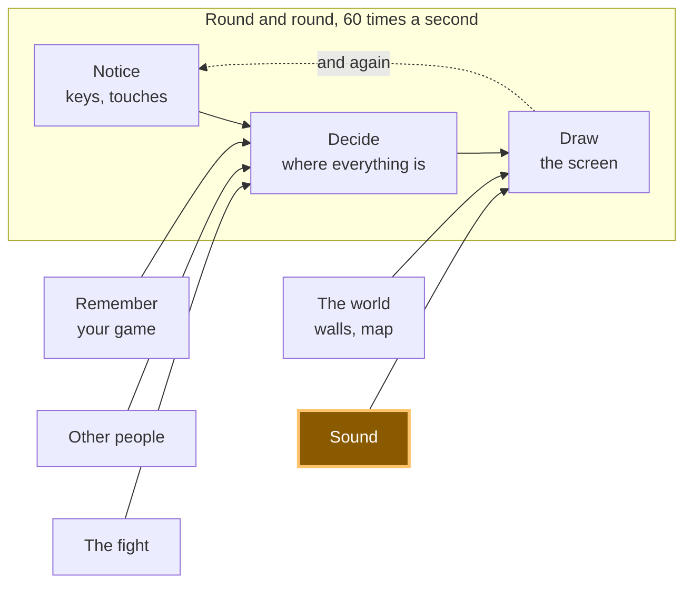

# A17: 音

歩くと足音が聞こえます。ボタンを押すと音楽が再生されます。そして、ラップトップが一斉に騒音を立てる部屋はひどいので、音はオフの状態で開始されます。
{: .lesson-intro }

**必要:** [A10](a10.html)。**得られるもの:** 動いたときの足音、要求したときの音楽、そしてすべてを静かにする1つのボタン。

## ゲーム全体と今日の部分



今日は「音」のボックスを作ります。描画の隣に配置されるのは、同じ役割を果たすからです。つまり、すでに変化した数値を人が気づくことができるものに変えます。

## ブロックに分割する

`ゲームが音を出す`ことは3つの要素からなります。

1. **ロード** — 必要な前にファイルを準備する
2. **再生** — 何かが起こったときに音を鳴らす
3. **オフにする** — すべてを静かにする1つのコントロール

**なぜ分割する必要があるのか？** なぜなら、もしそれが一つの塊で問題が発生した場合、どの部分が悪いのかを判断できないからです。ここでは、サイレンスには少なくとも3つの異なる原因があり、それぞれに3つの異なる修正が必要です。ファイルが届かなかった。ファイルは届いたが、ブラウザが再生を拒否した。あるいは完璧に再生されたが、音はオフになっている。3つのブロック、3つの独立した問題。

## 誰もが驚くルール

**ユーザーがページ上で何らかのアクションを起こすまで、ブラウザは音を再生しません。** クリック。キープレス。タップ。それまでは、再生の試みはすべて拒否されます。

これはバグではなく、あなたのコードの問題でもありません。ページを開いた瞬間に騒音で奇襲されないように存在するルールです。これまでに音量を上げたまま夜中に開いたすべてのウェブサイトを思い出してください。

私たちのデモでは、意図的にロード時に音楽を再生するように要求しているので、拒否を見ることができます。

```
NotAllowedError: play() failed because the user didn't interact with the document first.
```

それが私たちが受け取った正確なメッセージです。さて、ここが人々が引っかかる部分です。`play()`はあなたがつまづくようなエラーをスローしません。それは**プロミス**を返します — 「*後で答えが来る*」という意味のオブジェクトです。もしそれを無視すると、拒否は捨て去られ、クリーンなコンソールと何も見るものがない沈黙だけが残ります。

したがって、**常に`play()`に`.catch`を付けてください。** そうすれば通知されます。

## ブロック1: ロード

```
const step = new Audio('../../audio/step.wav');
const music = new Audio('../../audio/music-loop.mp3');
music.loop = true;
music.volume = 0.4;

step.addEventListener('canplaythrough', () => loaded('step.wav loaded.'), { once: true });
step.addEventListener('error', () => loaded('step.wav did NOT load.'));
```

`new Audio(path)`はコントロール可能なサウンドを作成します。これを作成しても再生されず、取得も完了しません。

`canplaythrough`は「中断せずに最後まで再生できるだけのデータが到着した」という意味です。`error`はファイルが全く到着しなかったことを意味します — 通常はパスが間違っています。

`{ once: true }`は「最初の1回だけ教えて」という意味です。これがないと、サウンドが巻き戻されるたびにこのメッセージが再び発生し、ページが言っていた他のすべてを上書きしてしまいます。これはこれを構築しているときに実際に起こりました。

`music.loop = true`は、終了時に再び開始させます。`volume`は0から1までで、0.4はゲームの上で聞こえるのに十分な静かさです。

**意図的に2種類のファイルを使用。** 短い効果音は`.wav`、音楽は`.mp3`です。これらはどちらもすべてのブラウザで再生されます。Ogg Vorbisはファイルサイズを小さくしますが、Safariでのサポートは不安定です — そのため、一部の生徒は何も表示されずにサイレンスになってしまいます。静かに失敗するファイルタイプよりも、騒々しく失敗するファイルタイプの方が良いです。ここではWAVが理にかなっています。なぜなら、これらの効果音は非常に小さく、足音は0.049秒で4kBだからです。

## ブロック2: 再生

```
let walked = 0;

function footstep() {
  if (!soundOn) return;
  step.currentTime = 0;
  step.play().catch((err) => say('Footstep refused — ' + err.name));
}
```

そして、正方形が移動した後、`update`の中に:

```
walked += Math.hypot(dx, dy) * SPEED * dt;
if (walked > 26) { walked = 0; footstep(); }
```

毎フレームではなく、26ピクセルごとに足音。音を時間ではなく移動距離に結びつけることで、無料で速度に合わせて速くなったり遅くなったりします。

**`step.currentTime = 0`がすべてのトリックです。** 既に再生中の`Audio`は`play()`を無視します。素早く2回要求すると、2回目の要求は何もしません — 2つの足音ではなく1つの足音しか聞こえません。最初に最初に戻すと再開されます。これは音楽で証明しました。すでに15秒再生されているトラックで`play()`を呼び出すと、15秒のままで再生が続きました。

## ブロック3: オフにする

```
let soundOn = false;

soundBtn.addEventListener('click', () => {
  soundOn = !soundOn;
  soundBtn.textContent = 'Sound: ' + (soundOn ? 'on' : 'off');
  if (!soundOn) { music.pause(); say('Sound off. Everything is silent.'); }
  else say('Sound on. Walk around.');
});
```

`soundOn`は`false`で始まります。ゲーム内のすべての音は最初にこれをチェックします。

これは、追加のコードなしで拒否の問題も解決することに注意してください。ユーザーは音をオンにするためにボタンをクリックする必要があり、そのクリックこそがブラウザが待っていたインタラクションなのです。最初に聞こえる音は常にあなたが要求した音です。

## このようにした理由

**デフォルトで音をオフにし、オンにする明確な方法を提供する。** ラップトップが一斉に騒音を立てる教室は、部屋にいるすべての人にとって悲惨であり、誰かが意図的に別のものを聞いているかもしれません。静かに始まり、オンにできるゲームは何も失いません。大音量で始まるゲームは閉じられます。

## 代わりにできたこと

| これの代わりに | コスト |
|---|---|
| デフォルトで音をオンにする | ページが開いた瞬間に部屋中のすべてのラップトップが一斉に音を立て、最初に覚えることはミュートボタンの場所になるでしょう |
| 歩いている間、毎フレーム音を再生する | 1秒間に60回の足音は足音ではなくブザー音です。足音は何らかの間隔で鳴らす必要があり、距離が正直な選択です |
| 効果音ごとに1つのAudio、巻き戻さない | 2つの足音が近くに落ちるまでは問題ないが、その場合1つが静かに失われる。巻き戻しは1行のコスト |
| `Audio`の代わりにWeb Audio API | 真のコントロール — ミキシング、エフェクト、完璧なサウンドの重複。ただしコードも何倍も増え、このステップで聞こえるものにはどれも必要ありません |
| Ogg Vorbisファイル（より小さい） | ダウンロードは小さくなるが、一部のSafariマシンでは画面に何も表示されずにサイレンスになる。静かな失敗は最悪の類 |

## プロンプト

```
I have a canvas game in plain JavaScript. main.js has update(dt) which moves
the player, and draw() which paints. Add sound in three separate blocks with a
comment above each: LOAD (an Audio for audio/step.wav and one for
audio/music-loop.mp3, music looping at volume 0.4), PLAY (a footstep every 26
pixels walked, restarting the sound if it is already playing), TURN IT OFF (a
boolean that starts false, and a button that toggles it and pauses the music).
Every play() must have a .catch. Plain JavaScript, no build step, no npm.
```

**出力の確認点:** すべての`play()`に`.catch`が付いているか？アシスタントは常にそれを省略し、結果としてどこにもメッセージなしで音が失敗します。足音を再び再生する前に`currentTime = 0`で巻き戻されたか、それとも2番目の素早いステップが飲み込まれるか？そして、サウンドフラグは本当に`false`で始まるか、それとも静かにノイズ付きでゲームが開始されたか？

## 動作を見る


Live Serverでページを開き、次を実行します。

1. 何も操作しない。2行目には既に`Refused before any click — NotAllowedError`と表示されています。これはブラウザのルールであり、動作しています。
2. コンソールを開き、`firstPlayError`と入力します。`NotAllowedError`という単語を含む完全な文章が表示されます。
3. 矢印キーを押して歩き回る。何も起こらない。サウンドはオフで、正方形はそれを表す鈍い緑色です。
4. **Sound: off**をクリックします。**Sound: on**になり、正方形が明るくなります。
5. 再び歩く。数歩ごとに足音がします。1.2秒の歩行で9つの足音を数え、サウンドは毎回0.049秒の終わりまで再生されました。
6. **Play music**をクリックします。行には`Music playing.`と表示されます。コンソールでは、`music.currentTime`が0を超えて上昇し続けます。
7. **Sound: on**をクリックして再びオフにします。音楽は同じ瞬間に停止し、歩行は再び静かになります — 1秒以上歩きましたが、足音は一つも始まりませんでした。
8. サウンドがオフの状態で**Play music**をクリックします。何も再生されず、ページはその理由を伝えます: `Turn the sound on first.` (`まずサウンドをオンにしてください。`)

## ゲームに組み込む

[A15](a15.html)からゲームを取り出し、3つのブロックを貼り付けます。既存のコード内に含まれるのは1行だけです。それは`update`の最後に歩行距離を数える2行です。その他はすべて新しく、独立しています。

<div class="takeaways">
<h2>Key Takeaways</h2>
<ul>
<li>ユーザーがクリックまたはキーを押すまで、ブラウザは音を再生しません — これはルールであり、バグではありません</li>
<li><code>play()</code>はプロミスを返すため、<code>.catch</code>がないと拒否が捨て去られ、説明なしにサイレンスになります</li>
<li>ファイルのロードと再生は2つの異なる作業であり、それぞれ独自の方法で失敗します</li>
<li>すでに再生中のサウンドは<code>play()</code>を無視します。まず0に戻してください</li>
<li>サウンドはオフから始め、オンにする方法を明確にする — あなたがいる部屋には他の人がいます</li>
</ul>
</div>

## あなたの番です

現時点では足音は毎回同じサウンドであり、1分後には歩行音ではなく機械音のように聞こえ始めます。2〜3個のサウンドを配列にロードし（`audio/`フォルダーにはさらに多くのファイルがあります）、各ステップでランダムに1つ選択してください。次に、同じアイデアを音量で試してください。各ステップで小さなランダムな変更（上げたり下げたり）を加えます。*大人になったプログラマーはこれをバリエーションと呼び、ゲームサウンドを生き生きと感じさせるほとんどの要素です。*
