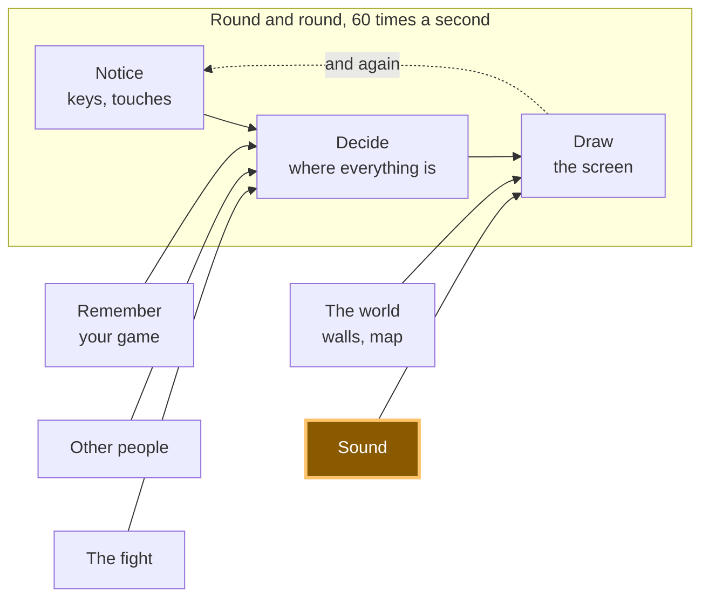

# A17: Sound

Walk, and you hear a footstep. Press a button, and music plays. And because a room full of laptops all making noise at once is horrible, sound starts switched off.
{: .lesson-intro }

**Needs:** [A10](a10.html). **Gives you:** a footstep when you move, music when you ask for it, and one button that silences everything.

## The whole game, and today's piece



Today you build the "sound" box. It sits next to drawing, because it does the same job: it turns numbers that already changed into something a person can notice.

## Cutting it into blocks

"The game makes sounds" is three things:

1. **Load** — get the files ready before you need them
2. **Play** — start a sound when something happens
3. **Turn it off** — one control that silences everything

**Why bother splitting it?** Because if it were one lump and it went wrong, you could not tell which part was wrong. Silence has at least three different causes here, and they need three different repairs. The file never arrived. The file arrived but the browser refused to play it. Or it played perfectly and the sound is switched off. Three blocks, three separate questions.

## The rule that surprises everyone

**A browser will not play sound until the person has done something on the page.** A click. A key press. A tap. Until then, every attempt to play is refused.

This is not a bug and it is not your code. It is a rule that exists so a page cannot ambush you with noise the moment you open it. Think of every website you have ever opened at night with the volume up.

Our demo asks to play music on load, on purpose, so you can see the refusal:

```
NotAllowedError: play() failed because the user didn't interact with the document first.
```

That is the exact message we got. Now here is the part that catches people. `play()` does not throw an error you trip over. It hands back a **promise** — an object that means *"an answer is coming later"*. If you ignore it, the refusal is thrown away, and all you get is silence with a clean console and nothing to look at.

So: **always put a `.catch` on `play()`**. Then you get told.

## Block 1: Load

```
const step = new Audio('../../audio/step.wav');
const music = new Audio('../../audio/music-loop.mp3');
music.loop = true;
music.volume = 0.4;

step.addEventListener('canplaythrough', () => loaded('step.wav loaded.'), { once: true });
step.addEventListener('error', () => loaded('step.wav did NOT load.'));
```

`new Audio(path)` makes a sound you can control. Making it does not play it and does not even finish fetching it.

`canplaythrough` means "enough of this has arrived to play it to the end without stopping". `error` means the file did not arrive at all — a wrong path, usually.

`{ once: true }` says "tell me the first time only". Without it this message fires again every time the sound is rewound, and stamps over whatever else the page was saying. That really happened to us while building this.

`music.loop = true` makes it start again when it ends. `volume` runs from 0 to 1, and 0.4 is quiet enough to hear the game over it.

**Two file types, on purpose.** The short effects are `.wav` and the music is `.mp3`. Both of those play in every browser. Ogg Vorbis makes smaller files, but Safari's support for it is patchy — so some students would get silence with nothing on screen to explain it. A file type that fails loudly is better than one that fails quietly. WAV is only sensible here because these effects are tiny: the footstep lasts 0.049 seconds and weighs 4 kB.

## Block 2: Play

```
let walked = 0;

function footstep() {
  if (!soundOn) return;
  step.currentTime = 0;
  step.play().catch((err) => say('Footstep refused — ' + err.name));
}
```

And inside `update`, after the square has moved:

```
walked += Math.hypot(dx, dy) * SPEED * dt;
if (walked > 26) { walked = 0; footstep(); }
```

A footstep every 26 pixels, not every frame. Tie the sound to the distance travelled, not to time, and it speeds up and slows down with you for free.

**`step.currentTime = 0` is the whole trick.** An `Audio` that is already playing ignores `play()`. Ask it twice quickly and the second ask does nothing — you hear one footstep instead of two. Winding it back to the start first makes it restart. We proved this on the music: calling `play()` on a track already 15 seconds in left it at 15 seconds and carried on.

## Block 3: Turn it off

```
let soundOn = false;

soundBtn.addEventListener('click', () => {
  soundOn = !soundOn;
  soundBtn.textContent = 'Sound: ' + (soundOn ? 'on' : 'off');
  if (!soundOn) { music.pause(); say('Sound off. Everything is silent.'); }
  else say('Sound on. Walk around.');
});
```

`soundOn` starts as `false`. Every sound in the game asks it first.

Notice this also solves the refusal problem without any extra code. The person has to click the button to turn sound on — and that click *is* the interaction the browser was waiting for. The first sound you hear is always one you asked for.

## Why we did it this way

**Sound off by default, with an obvious way to turn it on.** A classroom of laptops all making noise at once is miserable for everyone in the room, and somebody may be listening to something else on purpose. A game that starts silent and can be switched on loses nothing. A game that starts loud gets closed.

## What we could have done instead

| Instead of this | What it would cost |
|---|---|
| Sound on by default | Every laptop in the room shouts at once the moment the page opens, and the first thing a person learns is where the mute button is |
| Playing the sound every frame while walking | Sixty footsteps a second is a buzz, not a footstep. The step has to be spaced out by something, and distance is the honest choice |
| One `Audio` per effect, never rewound | Fine until two footsteps land close together, then you silently lose one. Rewinding costs one line |
| Web Audio API instead of `Audio` | Real control — mixing, effects, sounds overlapping perfectly. Also many times more code, and everything you can hear in this step needs none of it |
| Ogg Vorbis files, which are smaller | Smaller downloads, and silence on some Safari machines with nothing on screen explaining why. A quiet failure is the worst kind |

## The prompt

```
I have a canvas game in plain JavaScript. main.js has update(dt) which moves
the player, and draw() which paints. Add sound in three separate blocks with a
comment above each: LOAD (an Audio for audio/step.wav and one for
audio/music-loop.mp3, music looping at volume 0.4), PLAY (a footstep every 26
pixels walked, restarting the sound if it is already playing), TURN IT OFF (a
boolean that starts false, and a button that toggles it and pauses the music).
Every play() must have a .catch. Plain JavaScript, no build step, no npm.
```

**Check the output for:** did every `play()` get a `.catch`? Assistants leave them off constantly, and the result is sound that fails with no message anywhere. Did it rewind with `currentTime = 0` before playing the footstep again, or will the second quick step be swallowed? And does the sound flag really start at `false`, or did it quietly start your game with the noise on?

## See it work


Open the page with Live Server and:

1. Do nothing at all. The second line already says `Refused before any click — NotAllowedError`. That is the browser's rule, working.
2. Open the console and type `firstPlayError`. You get the full sentence, including the word `NotAllowedError`.
3. Press an arrow key and walk about. Nothing. Sound is off, and the square is a dull green to show it.
4. Click **Sound: off**. It becomes **Sound: on** and the square brightens.
5. Walk again. Footsteps, one every few steps. We counted nine footsteps in 1.2 seconds of walking, and the sound reached the end of its 0.049 seconds every time.
6. Click **Play music**. The line says `Music playing.` In the console, `music.currentTime` climbs past 0 and keeps going.
7. Click **Sound: on** to turn it back off. The music stops in the same instant, and walking is silent again — we walked for over a second and not one footstep started.
8. Click **Play music** while sound is off. Nothing plays, and the page tells you why: `Turn the sound on first.`

## Put it in the game

Take your game from [A15](a15.html) and paste in the three blocks. Only one line goes inside code you already had: the two lines at the end of `update` that count how far you walked. Everything else is new and sits on its own.

<div class="takeaways">
<h2>Key Takeaways</h2>
<ul>
<li>A browser refuses to play sound until the person has clicked or pressed a key — this is a rule, not a bug</li>
<li><code>play()</code> answers with a promise, so without a <code>.catch</code> a refusal is thrown away and you get silence with no explanation</li>
<li>Loading a file and playing it are two different jobs, and each one fails in its own way</li>
<li>A sound that is already playing ignores <code>play()</code>; wind it back to 0 first</li>
<li>Start with the sound off and make turning it on obvious — the room you are sitting in has other people in it</li>
</ul>
</div>

## Your turn

Right now the footstep is the same sound every time, which after a minute stops sounding like walking and starts sounding like a machine. Load two or three sounds into an array — there are more files in the `audio/` folder — and pick one at random each step. Then try the same idea with the volume: a small random change, up or down, on every step. *Grown-up programmers call this variation, and it is most of what makes game sound feel alive.*
