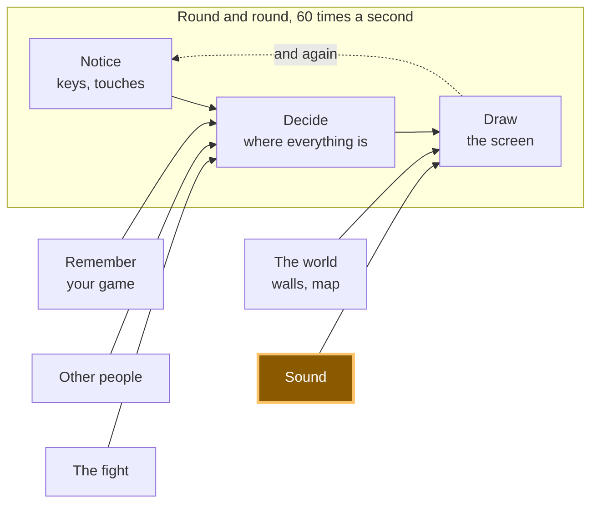

# A17: Som

Ande, e você ouve um passo. Aperte um botão, e a música toca. E como uma sala cheia de notebooks fazendo barulho ao mesmo tempo é horrível, o som começa desligado.
{: .lesson-intro }

**Precisa de:** [A10](a10.html). **Oferece:** um passo quando você se move, música quando você pede, e um botão que silencia tudo.

## O jogo completo, e a parte de hoje



Hoje você constrói a caixa "som". Ela fica ao lado do desenho, porque faz o mesmo trabalho: transforma números que já mudaram em algo que uma pessoa pode perceber.

## Dividindo em blocos

"O jogo faz sons" são três coisas:

1. **Carregar** — deixar os arquivos prontos antes de precisar deles
2. **Tocar** — começar um som quando algo acontece
3. **Desligar** — um controle que silencia tudo

**Por que dividir?** Porque se fosse tudo um bloco só e desse errado, você não saberia qual parte está errada. O silêncio tem pelo menos três causas diferentes aqui, e elas pedem três consertos diferentes. O arquivo nunca chegou. O arquivo chegou, mas o navegador se recusou a tocá-lo. Ou ele tocou perfeitamente e o som está desligado. Três blocos, três perguntas separadas.

## A regra que surpreende todo mundo

**Um navegador não toca som até a pessoa ter feito algo na página.** Um clique. Uma tecla. Um toque. Antes disso, toda tentativa de tocar é recusada.

Isso não é um bug e não é o seu código. É uma regra que existe para que uma página não possa te atacar de surpresa com barulho no instante em que você a abre. Pense em todos os sites que você já abriu de noite com o volume alto.

Nossa demonstração pede para tocar música ao carregar, de propósito, para você poder ver a recusa:

```
NotAllowedError: play() failed because the user didn't interact with the document first.
```

Essa é exatamente a mensagem que recebemos. E agora vem a parte que pega as pessoas. `play()` não lança um erro no qual você tropeça. Ele devolve uma **promise** — um objeto que quer dizer *"uma resposta vem depois"*. Se você a ignorar, a recusa é jogada fora, e tudo o que você recebe é silêncio, com o console limpo e nada para olhar.

Então: **sempre coloque um `.catch` no `play()`**. Aí você fica sabendo.

## Bloco 1: Carregar

```
const step = new Audio('../../audio/step.wav');
const music = new Audio('../../audio/music-loop.mp3');
music.loop = true;
music.volume = 0.4;

step.addEventListener('canplaythrough', () => loaded('step.wav loaded.'), { once: true });
step.addEventListener('error', () => loaded('step.wav did NOT load.'));
```

`new Audio(caminho)` cria um som que você pode controlar. Criá-lo não o toca e nem termina de baixá-lo.

`canplaythrough` quer dizer "já chegou o bastante para tocar até o fim sem parar". `error` quer dizer que o arquivo não chegou de jeito nenhum — em geral, um caminho errado.

`{ once: true }` diz "me avise só na primeira vez". Sem isso, essa mensagem aparece de novo cada vez que o som é rebobinado, e passa por cima do que a página estava dizendo. Isso aconteceu de verdade com a gente enquanto construíamos isto.

`music.loop = true` faz o som começar de novo quando termina. `volume` vai de 0 a 1, e 0.4 é baixo o bastante para você ouvir o jogo por cima dele.

**Dois tipos de arquivo, de propósito.** Os efeitos curtos são `.wav` e a música é `.mp3`. Os dois tocam em todos os navegadores. O Ogg Vorbis gera arquivos menores, mas o suporte do Safari a ele é irregular — então alguns estudantes teriam silêncio, sem nada na tela explicando o motivo. Um tipo de arquivo que falha em voz alta é melhor do que um que falha calado. O WAV só faz sentido aqui porque esses efeitos são minúsculos: o passo dura 0,049 segundo e pesa 4 kB.

## Bloco 2: Tocar

```
let walked = 0;

function footstep() {
  if (!soundOn) return;
  step.currentTime = 0;
  step.play().catch((err) => say('Footstep refused — ' + err.name));
}
```

E dentro do `update`, depois de o quadrado ter se movido:

```
walked += Math.hypot(dx, dy) * SPEED * dt;
if (walked > 26) { walked = 0; footstep(); }
```

Um passo a cada 26 pixels, não a cada frame. Amarre o som à distância percorrida, e não ao tempo, e ele acelera e desacelera junto com você de graça.

**`step.currentTime = 0` é todo o truque.** Um `Audio` que já está tocando ignora o `play()`. Peça duas vezes rápido e o segundo pedido não faz nada — você ouve um passo em vez de dois. Rebobinar até o começo antes faz o som reiniciar. Provamos isso na música: chamar `play()` numa faixa que já estava nos 15 segundos deixou ela nos 15 segundos e seguiu em frente.

## Bloco 3: Desligar

```
let soundOn = false;

soundBtn.addEventListener('click', () => {
  soundOn = !soundOn;
  soundBtn.textContent = 'Sound: ' + (soundOn ? 'on' : 'off');
  if (!soundOn) { music.pause(); say('Sound off. Everything is silent.'); }
  else say('Sound on. Walk around.');
});
```

`soundOn` começa como `false`. Todo som do jogo pergunta a ele primeiro.

Note que isso também resolve o problema da recusa, sem nenhuma linha a mais. A pessoa precisa clicar no botão para ligar o som — e esse clique *é* a interação que o navegador estava esperando. O primeiro som que você ouve é sempre um que você pediu.

## Por que fizemos isso desta forma

**Som desligado por padrão, com um jeito óbvio de ligar.** Uma sala de aula de notebooks todos fazendo barulho ao mesmo tempo é péssima para todo mundo ali dentro, e pode ser que alguém esteja ouvindo outra coisa de propósito. Um jogo que começa em silêncio e pode ser ligado não perde nada. Um jogo que começa alto é fechado.

## O que poderíamos ter feito em vez disso

| Em vez disso | O que custaria |
|---|---|
| Som ligado por padrão | Todo notebook da sala grita ao mesmo tempo no instante em que a página abre, e a primeira coisa que a pessoa aprende é onde fica o botão de silenciar |
| Tocar o som a cada frame enquanto anda | Sessenta passos por segundo é um zumbido, não um passo. O passo precisa ser espaçado por alguma coisa, e a distância é a escolha honesta |
| Um `Audio` por efeito, nunca rebobinado | Serve até dois passos caírem muito perto um do outro, e aí você perde um, calado. Rebobinar custa uma linha |
| A Web Audio API em vez de `Audio` | Controle de verdade — mixagem, efeitos, sons se sobrepondo perfeitamente. Também muitas vezes mais código, e nada do que você ouve nesta etapa precisa disso |
| Arquivos Ogg Vorbis, que são menores | Downloads menores, e silêncio em algumas máquinas com Safari, sem nada na tela explicando por quê. Uma falha calada é o pior tipo |

## O prompt

```
I have a canvas game in plain JavaScript. main.js has update(dt) which moves
the player, and draw() which paints. Add sound in three separate blocks with a
comment above each: LOAD (an Audio for audio/step.wav and one for
audio/music-loop.mp3, music looping at volume 0.4), PLAY (a footstep every 26
pixels walked, restarting the sound if it is already playing), TURN IT OFF (a
boolean that starts false, and a button that toggles it and pauses the music).
Every play() must have a .catch. Plain JavaScript, no build step, no npm.
```

**Verifique na resposta:** todo `play()` recebeu um `.catch`? Os assistentes esquecem disso o tempo todo, e o resultado é um som que falha sem mensagem em lugar nenhum. Ele rebobinou com `currentTime = 0` antes de tocar o passo de novo, ou o segundo passo rápido vai ser engolido? E a variável do som realmente começa em `false`, ou ele começou seu jogo com o barulho ligado, sem avisar?

## Veja funcionar


Abra a página com o Live Server e:

1. Não faça nada. A segunda linha já diz `Refused before any click — NotAllowedError`. É a regra do navegador, funcionando.
2. Abra o console e digite `firstPlayError`. Você recebe a frase completa, incluindo a palavra `NotAllowedError`.
3. Aperte uma tecla de seta e ande por aí. Nada. O som está desligado, e o quadrado está de um verde apagado para mostrar isso.
4. Clique em **Sound: off**. Ele vira **Sound: on** e o quadrado fica mais claro.
5. Ande de novo. Passos, um a cada poucos passos. Contamos nove passos em 1,2 segundo andando, e o som chegou ao fim dos seus 0,049 segundo todas as vezes.
6. Clique em **Play music**. A linha diz `Music playing.` No console, `music.currentTime` passa de 0 e continua subindo.
7. Clique em **Sound: on** para desligar de novo. A música para no mesmo instante, e andar volta a ser silencioso — andamos por mais de um segundo e nenhum passo começou.
8. Clique em **Play music** com o som desligado. Nada toca, e a página diz por quê: `Turn the sound on first.`

## Coloque no jogo

Pegue o seu jogo de [A15](a15.html) e cole os três blocos. Só uma coisa entra dentro de código que você já tinha: as duas linhas no fim do `update` que contam quanto você andou. Todo o resto é novo e fica por conta própria.

<div class="takeaways">
<h2>Principais Pontos</h2>
<ul>
<li>Um navegador se recusa a tocar som até a pessoa ter clicado ou apertado uma tecla — isso é uma regra, não um bug</li>
<li><code>play()</code> responde com uma promise, então sem um <code>.catch</code> a recusa é jogada fora e você fica com silêncio sem explicação</li>
<li>Carregar um arquivo e tocá-lo são dois trabalhos diferentes, e cada um falha do seu próprio jeito</li>
<li>Um som que já está tocando ignora o <code>play()</code>; rebobine para 0 primeiro</li>
<li>Comece com o som desligado e deixe óbvio como ligar — a sala onde você está tem outras pessoas dentro</li>
</ul>
</div>

## Sua vez

Agora o passo é sempre o mesmo som, o que depois de um minuto para de soar como andar e começa a soar como uma máquina. Carregue dois ou três sons em um array — há mais arquivos na pasta `audio/` — e sorteie um em cada passo. Depois tente a mesma ideia com o volume: uma pequena mudança aleatória, para cima ou para baixo, em cada passo. *Programadores adultos chamam isso de variação, e é a maior parte do que faz o som de um jogo parecer vivo.*
