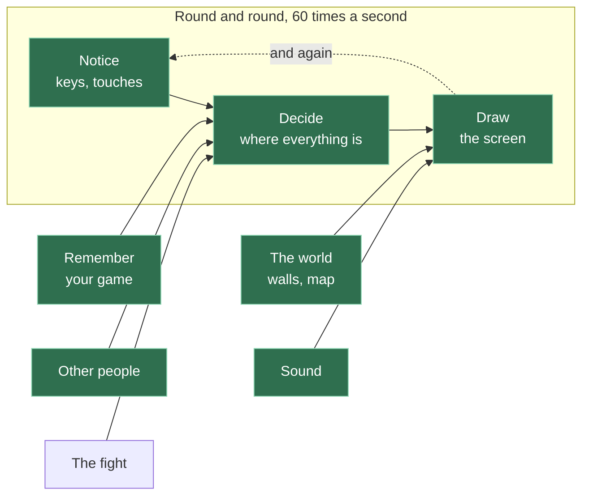

# A18: インターネットに公開する

今のあなたのゲームは、自分のパソコンの中にしかありません。このステップが終わると、世界中のだれでも開ける住所を持ちます。それに、元に戻したいときのために、フォルダをコピーするよりずっといいものが手に入ります。
{: .lesson-intro }

**必要なもの:** [A09](a09.html)と、人に見られてもいいと思えるゲーム。**得られるもの:** だれにでも送れるリンク。

> このステップは、ほかより大きめです。中身は3つの別々のことで、1つ終わるごとに休みたくなるかもしれません。それでだいじょうぶです。急ぐ必要はありませんし、あとのステップは、これを一気に終わらせることを前提にしていません。

## ゲーム全体と今日の部分



今回はどのボックスも変わりません。このステップの話は、ゲームそのものではなく、ゲームが入っている*フォルダ*のことです。

## ブロックに分割する

1. **記録を残す** — 自分の作業のすべてのバージョンを取っておいて、いつでも戻れるようにする
2. **アカウントを作る** — インターネット上に、置き場所を用意する
3. **公開をオンにする** — フォルダをウェブサイトに変える
4. **インストールできるようにする** — スマホに、本物のアプリのように置けるようにする

なぜ4つでしょう。それぞれが単独で失敗しうるし、失敗し方がまったくちがうからです。最後にリンクが動かないとき、ファイルがそもそもパソコンから出ていないのか、届いてはいるけれど公開されていないのかを知る必要があります。片方の端から1つずつ確かめるのがコツで、それはいつもと同じコツです。

## ブロック1: 記録を残す

[A09](a09.html)からずっと、あなたは大きな変更の前にフォルダをコピーしてきました。これは動きます。そして、ひどいやり方です。最後には`kakkoi-online-2`、`kakkoi-online-final`、`kakkoi-online-final-2`が並び、どれに何が入っているのか分からなくなります。

**Git**は、これをちゃんとやってくれるプログラムです。フォルダのすべてのバージョンを、何を変えたかというメモつきで取っておいてくれます。

まだ入っていなければ入れてください。ターミナルで`git --version`と打つと確認できます。そのあと、プロジェクトのフォルダの中で次を実行します。

```
git init
git add .
git commit -m "My game so far"
```

- `init`は「このフォルダの記録を取り始めて」という意味です
- `add .`は「このファイルたち全部のことだよ」という意味です
- `commit`は、あなたのメモつきでバージョンを保存します

これが**セーブポイント**です。何かがうまく動いたら、そのたびに作りましょう。これからは、大きな変更をアシスタントにまかせる前に、フォルダをコピーするのではなくコミットします。うまくいかなかったら、`git restore .`で最後のセーブポイントまで全部戻ります。

あなたはA09からずっとこれをほしがっていました。だからこれはA09ではなく、ここにあります。あなたはもう問題を体で感じたので、この答えに意味があるのです。

## ブロック2: アカウントを作る

[github.com](https://github.com)に行って、登録します。無料です。

> **GitHubのアカウントを持つには13歳以上でないといけません。** これはGitHubのルールで、私たちのルールではありません。まだ13歳になっていない人は、おうちの人に相談してください。アカウントを作ってもらって、いっしょに使うことができます。このステップより前は、アカウントが必要な場面は1つもありませんでした。だから待っていて損したことは何もありません。

新しいリポジトリを作ります。**リポジトリ**とは、GitHubの上にあるフォルダのことです。名前は`kakkoi-online`にしましょう。**public（公開）**にします。

> publicとは、だれでもあなたのコードを読めるということです。これはふつうのことで、学ぶ人のほとんどはこうしています。でも、こういう意味でもあります。**このフォルダには、人に見せられないものを何も入れないこと。** パスワードもだめ、住所もだめ、電話番号もだめ。ポスターに書けないものは、何も入れてはいけません。

そうするとGitHubが、あなたのフォルダをつなぐためのコマンドを見せてくれます。こんな見た目です。

```
git remote add origin https://github.com/YOUR-NAME/kakkoi-online.git
git branch -M main
git push -u origin main
```

`push`は「保存した記録をGitHubに送って」という意味です。ページを再読み込みすると、あなたのファイルがそこにあります。

## ブロック3: 公開をオンにする

コードはGitHubにありますが、まだウェブサイトではありません。だれかが読めるファイルが置いてあるだけです。

リポジトリのページで、**Settings → Pages** を開きます。*Build and deployment* の下で、**Source** を **Deploy from a branch** に、ブランチを **main**、フォルダを **/ (root)** にします。保存します。

1〜2分待って、これを開きます。

```
https://YOUR-NAME.github.io/kakkoi-online/
```

**それがあなたのゲームです。インターネット上に、あなた自身の住所で、無料で。** だれかにリンクを送ってみましょう。

これからは、`git push`が公開になります。何かを変えて、コミットして、プッシュすれば、公開されているページが自分で新しくなります。

## ブロック4: インストールできるようにする

あなたのゲームはウェブページです。小さなファイル2つで、それが「インストールできるもの」になります。ホーム画面にアイコンが出て、ブラウザのバーなしで開きます。ゲームは同じものです。スマホが、たまたま見に来たページとしてあつかうのをやめるだけです。

**マニフェスト**は、あなたのゲームをスマホに説明する小さなファイルです。`manifest.webmanifest`という名前にします。

```
{
  "name": "Kakkoi Online",
  "short_name": "Kakkoi",
  "start_url": "./",
  "display": "standalone",
  "theme_color": "#0c0c12",
  "background_color": "#0c0c12",
  "icons": [
    { "src": "./icons/icon-192.png", "sizes": "192x192", "type": "image/png" },
    { "src": "./icons/icon-512.png", "sizes": "512x512", "type": "image/png" }
  ]
}
```

これを`index.html`から読み込みます。

```
<link rel="manifest" href="./manifest.webmanifest">
```

ブラウザのバーを消しているのは`display: standalone`の行です。アイコンはただのPNGです。私たちのはゲームに出てくる動物の1匹を大きくしたもので、アイコンとゲームが同じものだと一目で分かるようにしています。

**サービスワーカー**は、ブラウザがあなたのページのそばに置いておく小さなプログラムです。ページがファイルをほしがるたびに、ワーカーがその要求を先に見ます。だから、ネットワークではなく、前に保存しておいたコピーから返事ができます。インターネットがまったくないときでもゲームが開けるのは、これのおかげです。

ここでのワーカーの仕事は1つ、そしてそれについてくるルールは3つです。

1. **ゲームに必要なファイルの一覧を保存する。** だれかが初めて来たときに。
2. **そのコピーから返事をする。** ちょうどそれらのファイルについてだけ。
3. **保存したコピーにバージョン番号をつけ、古いバージョンを消す。**

> **ルール3は、きれいにしておくための話ではありません。わなです。** ワーカーが古いコピーから返事をつづけると、バグを直して公開しても、だれ1人それを受け取れません。永遠に、古いコピーが返事をするからです。一覧の中のファイルを変えたときは、バージョンの名前も変えてください。これは作っているときに私たちが引っかかりました。しかも症状の原因を見つけるのがとてもやりにくいのです。ページは新しいのに見た目は古い、しかも自分では再現できない壊れ方をしている、という形で出てきます。

インターネットがどうしても必要なのは、他のプレイヤーです。彼らは別のパソコンにいるので、ファイルをどれだけローカルに保存しても、彼らを呼び出すことはできません。オフラインで遊べるのは、世界、自分のキャラクター、コンピューターの対戦相手です。私たちのゲームは、壊れているように見せるのではなく、そのことを画面に書いています。

## なぜこの方法にしたのか

ここにあるものはすべて無料で、カードは何も必要ありません。インターネット上のコンピューターを借りて、自分のサーバーを動かすこともできますし、いつかそうする日が来るかもしれません。でも、ただのファイルでできたゲームには、それは必要ありません。GitHubはもうあなたのファイルを持っているので、それをウェブサイトとして配るのにほとんど費用がかかりません。だから無料で提供しているのです。

## 代わりにできたこと

| この代わりに | その代償 |
|---|---|
| まだ何も動いていない[A09](a09.html)の時点でこれをやる | 四角形を1つも動かせていないうちに、年齢のルールと3つの新しい考え方が出てきます。今まで住所が必要な場面は1つもありませんでした。マルチプレイヤーだって、ウェブサイトなしでパソコン2台のあいだでちゃんと動きます |
| フォルダをzipにして送る | 相手は開けますが、送ったものだけが手に入り、そのあとの変更は届きません。リンクなら、いつでもいちばん新しいものです |
| サーバーを借りる | 毎月ゲーム1本くらいのお金が、ずっとかかります。それに動かしつづける手間も。しかも、それで買えるのは、このプロジェクトがわざと使わないことにした機能です |
| フォルダをコピーしてバックアップを取りつづける | 本当に動きます。ただ、コピーが数個を超えるとやっていけなくなり、2つのあいだで*何が*変わったのかを教えてはくれません |

## プロンプト

```
My project folder is a git repository connected to GitHub, published with
GitHub Pages. I want to understand what I just did. Explain, in plain
language: what git commit actually saves, what git push sends, and what
GitHub Pages does with the files. Then tell me what happens if I edit a
file and forget to commit before I push.
```

**出力を確認すること:** 最後の答えが、**何も起きない**とはっきり言っていますか。コミットしていない変更は送られないので、ウェブサイトは変わりません。これはいちばんよくある勘ちがいで、ここをあいまいにするアシスタントは、あなたの役に立っていません。

## 動作を確認する

**別の機械**で、公開されたリンクを開いてみましょう。モバイル通信のスマホがいちばんいいテストです。自分のパソコンやネットワークがまったく関わっていないことが証明できます。

1. ページが読み込まれます。
2. エディタを閉じて、Live Serverを止めます。リンクはまだ動きます。
3. 何か1つ変えて、`git add .`、`git commit -m "..."`、`git push`。1分待って、公開されているリンクを再読み込みします。変更が反映されています。
4. スマホで、ブラウザのメニューからホーム画面に追加します。あなたのアイコンがつき、ブラウザのバーなしで開きます。
5. **スマホのインターネットを完全にオフにして**、ホーム画面から開きます。世界も、自分のキャラクターも、コンピューターの対戦相手も、ちゃんとそこにあります。

## これを行ったときに何がうまくいかなかったか

どちらも、このプロジェクトの私たち自身のコピーを[online.kakkoi.dev](https://online.kakkoi.dev)に公開したときの実話です。

**設定ファイルのように見えたファイル。** サイトの住所を決めるためだけにあるファイルが、リポジトリの中にありました。それはまったく何もしていませんでした。あのファイルが効くのは、私たちが使っていたのとは別の公開方法のときだけなのです。住所はずっと空っぽで、ファイルはそこに正しそうな顔をして置かれていました。*教訓: 公開されているはずのものが公開されていないときは、両端を別々に確かめること。ファイルはそこにありますか。置き場所はこの名前を待っていますか。真ん中をじっと見つめてはいけません。*

**一度も動かなかった公開ロボット。** そのあと自動で公開するしくみを作りましたが、それは`master`という名前のブランチの変更を見張っていて、私たちのコードは`main`にありました。エラーなし。警告なし。何も起きず、静かなままでした。*教訓: 一度も動いていないロボットは、ちゃんと働いているロボットとまったく同じに見えます。実行の記録を、自分で見に行きましょう。*

## ゲームに組み込む

これがあなたのゲームです。フォルダは同じで、そこに記録と住所がついただけです。移すものは何もありません。

<div class="takeaways">
<h2>主なポイント</h2>
<ul>
<li>コミットはメモつきのセーブポイントで、フォルダのコピーの代わりになります</li>
<li>プッシュは保存した記録をGitHubに送ります。コミットしていないものは、置いていかれます</li>
<li>GitHub Pagesは、ただのファイルが入ったフォルダを、無料でウェブサイトに変えます</li>
<li>publicは本当にpublicです。人に見せられないものは、フォルダに入れません</li>
<li>リンクが動かないときは、真ん中をあてずっぽうで探るのではなく、両端を別々に確かめます</li>
<li>マニフェストとサービスワーカーがあれば、ウェブページはインストールできるものになり、インターネットなしでも開きます</li>
<li>保存したコピーにバージョンをつけましょう。そうしないと、だれにも届かない修正を公開しつづけることになります</li>
</ul>
</div>

## あなたの番

わざと壊して、それから直しましょう。ページを、見ればすぐ分かるくらいちがう内容に書きかえて、**コミットせずに**プッシュし、公開されているページが変わらないのを見てください。そのあと、きちんとコミットしてプッシュします。一度わざとやっておけば、うっかり同じことをした日に、すぐそれだと気づけます。
