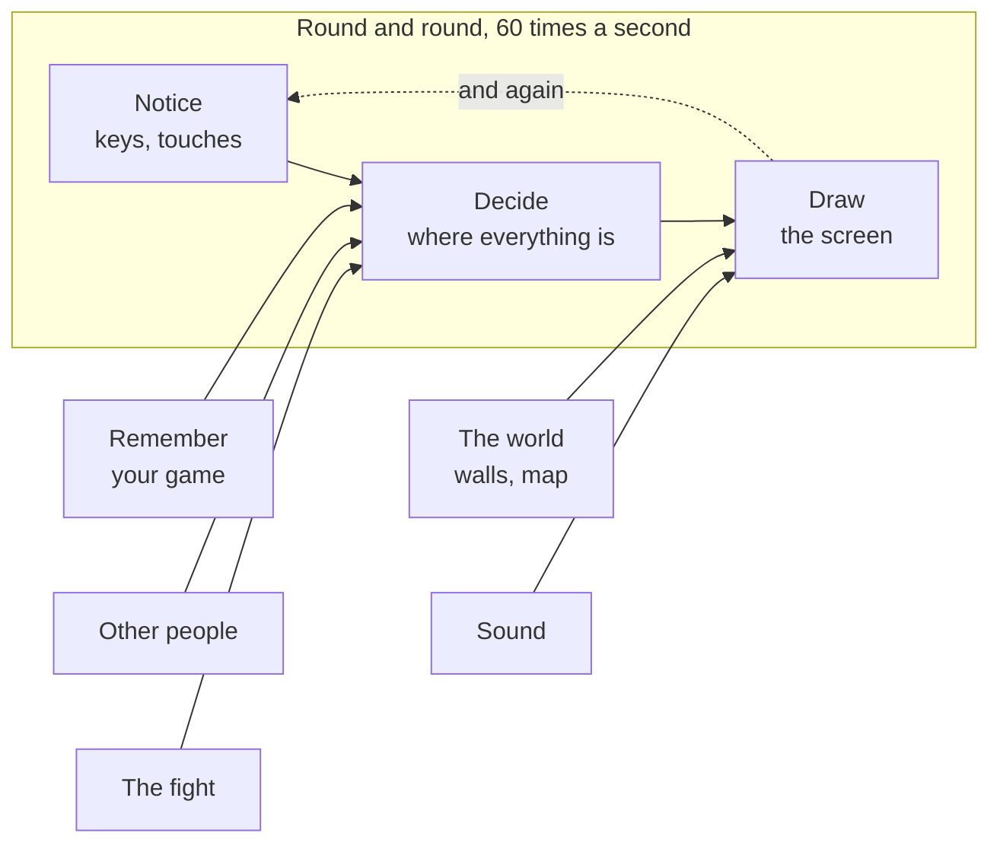

# A18: Put It Online

Right now your game only exists on your computer. By the end of this step it has an address anyone in the world can open, and you have something far better than copying folders when you want to undo.
{: .lesson-intro }

**Needs:** [A09](a09.html), and a game you would not mind someone seeing. **Gives you:** a link you can send to anyone.

> This step is bigger than the others. It is three separate things, and you may want to stop after each one. That is fine — there is no rush, and nothing later depends on finishing it all at once.

## The whole game, and today's piece



None of the boxes change here. This step is about the *folder* your game lives in, not the game.

## Cutting it into blocks

1. **Save your history** — keep every version of your work, so you can go back
2. **Make an account** — somewhere on the internet to put it
3. **Switch on the hosting** — turn your folder into a website
4. **Make it installable** — so it lands on a phone like a real app

Why four? Because each one can fail on its own, and they fail in completely different ways. If your link does not work at the end, you need to know whether your files never left your computer, or arrived but were not published. Checking one end at a time is the whole trick, and it is the same trick as always.

## Block 1: Save your history

Since [A09](a09.html) you have been copying your folder before big changes. That works, and it is horrible. You end up with `kakkoi-online-2`, `kakkoi-online-final`, `kakkoi-online-final-2`, and no idea what is in any of them.

**Git** is a program that does this properly. It keeps every version of your folder, with a note on each one saying what changed.

Install it if you do not have it — type `git --version` in a terminal to check. Then, inside your project folder:

```
git init
git add .
git commit -m "My game so far"
```

- `init` says "start keeping history for this folder"
- `add .` says "I mean all these files"
- `commit` saves a version, with your note

That is a **save point**. Make one whenever something works. From now on, before you let the assistant loose on a big change, you make a commit instead of copying the folder. If it goes wrong, `git restore .` puts everything back to your last save point.

You have wanted this since A09. That is why it is here and not there: you have felt the problem, so the answer means something.

## Block 2: Make an account

Go to [github.com](https://github.com) and sign up. It is free.

> **You must be at least 13 to have a GitHub account.** That is their rule, not ours. If you are younger, ask a parent — they can make the account and you can use it together. Nothing before this step needed an account, so you have lost nothing by waiting.

Make a new repository — a **repository** is just a folder that lives on GitHub. Name it `kakkoi-online`. Make it **public**.

> Public means anyone can read your code. That is normal and it is how most learning happens. But it also means: **do not put anything private in this folder.** No passwords, no addresses, no phone numbers, nothing you would not put on a poster.

GitHub then shows you the commands to connect your folder to it. They look like this:

```
git remote add origin https://github.com/YOUR-NAME/kakkoi-online.git
git branch -M main
git push -u origin main
```

`push` means "send my saved history to GitHub". Refresh the page — your files are there.

## Block 3: Switch on the hosting

Your code is on GitHub, but it is not a website yet. It is just files someone can read.

On your repository page: **Settings → Pages**. Under *Build and deployment*, set **Source** to **Deploy from a branch**, branch **main**, folder **/ (root)**. Save.

Wait a minute or two, then open:

```
https://YOUR-NAME.github.io/kakkoi-online/
```

**That is your game, on the internet, at your own address, for free.** Send the link to someone.

From now on, `git push` publishes. Change something, commit, push, and the live page updates by itself.

## Block 4: Make it installable

Your game is a web page. With two small files it becomes something a person can install — an icon on their home screen, opening with no browser bar around it. It is the same game; the phone just stops treating it like a page it happened to visit.

**A manifest** is a small file describing your game to the phone. Call it `manifest.webmanifest`:

```
{
  "name": "Kakkoi Online",
  "short_name": "Kakkoi",
  "start_url": "./",
  "display": "standalone",
  "theme_color": "#0c0c12",
  "background_color": "#0c0c12",
  "icons": [
    { "src": "./icons/icon-192.png", "sizes": "192x192", "type": "image/png" },
    { "src": "./icons/icon-512.png", "sizes": "512x512", "type": "image/png" }
  ]
}
```

Link it from `index.html`:

```
<link rel="manifest" href="./manifest.webmanifest">
```

`display: standalone` is the line that removes the browser bar. The icons are just PNGs — ours are one of the animals from the game, blown up big, so the icon and the game are obviously the same thing.

**A service worker** is a small program the browser keeps beside your page. Every time the page asks for a file, the worker sees the request first — so it can answer from a copy it saved earlier, instead of the network. That is what lets the game open when there is no internet at all.

It has one job here, and three rules that go with it:

1. **Save the list of files the game needs**, the first time somebody visits.
2. **Answer from that copy** for exactly those files.
3. **Give the saved copy a version number, and delete the old versions.**

> **Rule 3 is not tidiness — it is the trap.** A worker that keeps answering from an old copy means you can fix a bug, publish the fix, and nobody ever gets it: the stale copy is what answers, forever. When you change any file in the list, change the version name too. This caught us while building it, and the symptom is horrible to diagnose: new page, old styling, a layout that looks broken in a way you cannot reproduce.

What still needs the internet is other players — they are on other computers, so no amount of saving files locally will conjure them up. Offline you get the world, your own character, and the computer opponent. Our game says so on screen rather than looking broken.

## Why we did it this way

Everything here is free and nothing needs a card. You could rent a computer on the internet and run your own server, and one day you might — but a game made of plain files does not need one. GitHub already has your files, so serving them as a website costs it almost nothing, which is why it gives it away.

## What we could have done instead

| Instead of this | What it would cost |
|---|---|
| Doing this in [A09](a09.html), before anything worked | An account rule and three new ideas before you had made a single square move. Nothing needed an address until now — even the multiplayer works fine between two computers with no website at all |
| Sending someone a zip of your folder | They can open it, but they get whatever you sent and nothing after. A link is always the newest version |
| Renting a server | About the price of a game every month, forever, plus keeping it running. It buys you things this project deliberately does not use |
| Keeping backups by copying folders | It genuinely works. It just does not scale past a few copies, and it cannot tell you *what* changed between two of them |

## The prompt

```
My project folder is a git repository connected to GitHub, published with
GitHub Pages. I want to understand what I just did. Explain, in plain
language: what git commit actually saves, what git push sends, and what
GitHub Pages does with the files. Then tell me what happens if I edit a
file and forget to commit before I push.
```

**Check the output for:** does the last answer say plainly that **nothing happens** — an uncommitted change is not sent, so the website will not change? That is the single most common confusion, and an assistant that waffles about it has not helped you.

## See it work

Open your live link on a **different device** — a phone on mobile data is the best test, because it proves nothing on your own computer or network is involved.

1. The page loads.
2. Close your editor and stop Live Server. The link still works.
3. Change one thing, `git add .`, `git commit -m "..."`, `git push`. Wait a minute and refresh the live link. Your change is there.
4. On the phone, use the browser's menu to add it to your home screen. It gets your icon and opens with no browser bar.
5. **Turn the phone's internet off completely**, then open it from the home screen. The world, your character and the computer opponent are all still there.

## What went wrong when we did this

Both of these are real, from publishing our own copy of this project at [online.kakkoi.dev](https://online.kakkoi.dev).

**A file that looked like configuration.** We had a file in the repository whose whole job was to set the site's address. It did nothing at all — that file only works for a different way of publishing than the one we were using. The address was empty the whole time, and the file sat there looking correct. *Lesson: when something should be live and is not, check each end separately. Are the files there? Is the host expecting this name? Do not stare at the middle.*

**A publishing robot that never ran.** We later set up automatic publishing, and it was watching for changes on a branch called `master` while our code was on `main`. No error. No warning. Nothing happened, quietly. *Lesson: a robot that never runs looks exactly like a robot that works. Go and look at the run.*

## Put it in the game

This is your game — same folder, now with a history and an address. Nothing to move.

<div class="takeaways">
<h2>Key Takeaways</h2>
<ul>
<li>A commit is a save point with a note, and it replaces copying folders</li>
<li>Push sends your saved history to GitHub; anything you did not commit stays behind</li>
<li>GitHub Pages turns a folder of plain files into a website, for free</li>
<li>Public means public — nothing private goes in the folder</li>
<li>When a link does not work, check each end on its own instead of guessing at the middle</li>
<li>A manifest and a service worker turn a web page into something installable that opens with no internet</li>
<li>Version the saved copy, or you will publish fixes nobody ever receives</li>
</ul>
</div>

## Your turn

Break it on purpose, then fix it. Edit your page so it says something obviously different, push **without committing first**, and watch the live page not change. Then commit and push properly. Doing this deliberately once means you will recognise it instantly the day it happens by accident.
