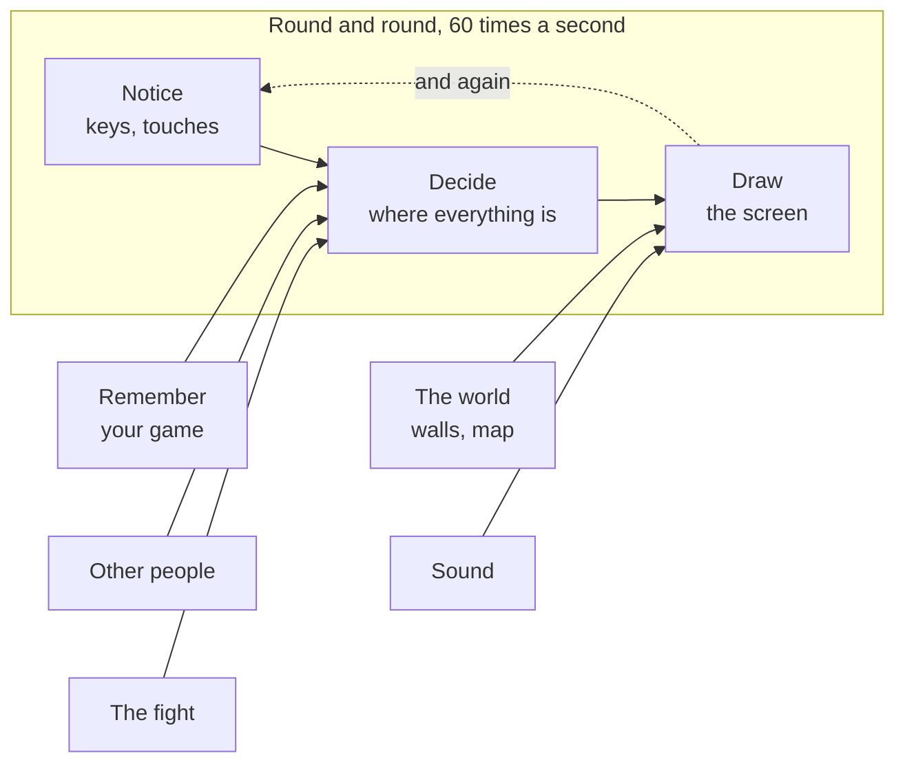

# A18: Coloque na Internet

Neste momento o seu jogo só existe no seu computador. No fim desta etapa ele tem um endereço que qualquer pessoa do mundo pode abrir, e você tem algo muito melhor do que copiar pastas quando quiser desfazer.
{: .lesson-intro }

**Precisa de:** [A09](a09.html), e um jogo que você não se incomode que alguém veja. **Oferece:** um link que você pode mandar para qualquer pessoa.

> Esta etapa é maior que as outras. São três coisas separadas, e você pode querer parar depois de cada uma. Tudo bem — não há pressa, e nada mais adiante depende de terminar tudo de uma vez.

## O jogo completo, e a parte de hoje



Nenhuma das caixas muda aqui. Esta etapa é sobre a *pasta* onde o seu jogo mora, não sobre o jogo.

## Dividindo em blocos

1. **Guardar o seu histórico** — manter toda versão do seu trabalho, para poder voltar
2. **Criar uma conta** — algum lugar na internet para colocá-lo
3. **Ligar a hospedagem** — transformar a sua pasta em um site
4. **Deixá-lo instalável** — para ele entrar no celular como um aplicativo de verdade

Por que quatro? Porque cada um pode falhar por conta própria, e eles falham de formas completamente diferentes. Se no fim o seu link não funcionar, você precisa saber se os seus arquivos nunca saíram do seu computador, ou se chegaram mas não foram publicados. Conferir uma ponta por vez é todo o truque, e é o mesmo truque de sempre.

## Bloco 1: Guardar o seu histórico

Desde [A09](a09.html) você vem copiando a sua pasta antes de mudanças grandes. Isso funciona, e é horrível. Você acaba com `kakkoi-online-2`, `kakkoi-online-final`, `kakkoi-online-final-2`, e nenhuma ideia do que tem dentro de cada uma.

O **Git** é um programa que faz isso do jeito certo. Ele guarda toda versão da sua pasta, com uma anotação em cada uma dizendo o que mudou.

Instale-o se você ainda não tiver — digite `git --version` em um terminal para conferir. Depois, dentro da pasta do seu projeto:

```
git init
git add .
git commit -m "My game so far"
```

- `init` diz "comece a guardar o histórico desta pasta"
- `add .` diz "estou falando de todos estes arquivos"
- `commit` salva uma versão, com a sua anotação

Esse é um **ponto de salvamento**. Faça um sempre que algo funcionar. De agora em diante, antes de soltar o assistente numa mudança grande, você faz um commit em vez de copiar a pasta. Se der errado, `git restore .` devolve tudo ao seu último ponto de salvamento.

Você queria isso desde A09. É por isso que está aqui e não lá: você sentiu o problema, então a resposta significa algo.

## Bloco 2: Criar uma conta

Vá em [github.com](https://github.com) e cadastre-se. É de graça.

> **Você precisa ter no mínimo 13 anos para ter uma conta no GitHub.** Essa é a regra deles, não a nossa. Se você for mais novo, peça a um responsável — ele pode criar a conta e vocês podem usá-la juntos. Nada antes desta etapa precisava de uma conta, então você não perdeu nada esperando.

Crie um novo repositório — um **repositório** é só uma pasta que mora no GitHub. Dê a ele o nome `kakkoi-online`. Deixe-o **público**.

> Público quer dizer que qualquer pessoa pode ler o seu código. Isso é normal e é assim que a maior parte do aprendizado acontece. Mas também quer dizer: **não coloque nada particular nesta pasta.** Nenhuma senha, nenhum endereço, nenhum telefone, nada que você não colocaria em um cartaz.

O GitHub então mostra os comandos para conectar a sua pasta a ele. Eles se parecem com isto:

```
git remote add origin https://github.com/YOUR-NAME/kakkoi-online.git
git branch -M main
git push -u origin main
```

`push` quer dizer "mande o meu histórico salvo para o GitHub". Atualize a página — os seus arquivos estão lá.

## Bloco 3: Ligar a hospedagem

O seu código está no GitHub, mas ainda não é um site. São só arquivos que alguém pode ler.

Na página do seu repositório: **Settings → Pages**. Em *Build and deployment*, coloque **Source** como **Deploy from a branch**, branch **main**, pasta **/ (root)**. Salve.

Espere um ou dois minutos e abra:

```
https://YOUR-NAME.github.io/kakkoi-online/
```

**Esse é o seu jogo, na internet, no seu próprio endereço, de graça.** Mande o link para alguém.

De agora em diante, `git push` publica. Mude algo, faça o commit, faça o push, e a página no ar se atualiza sozinha.

## Bloco 4: Deixá-lo instalável

O seu jogo é uma página web. Com dois arquivos pequenos ele se torna algo que uma pessoa pode instalar — um ícone na tela inicial, abrindo sem nenhuma barra de navegador em volta. É o mesmo jogo; o celular só para de tratá-lo como uma página que ele visitou por acaso.

**Um manifest** é um arquivinho que descreve o seu jogo para o celular. Chame-o de `manifest.webmanifest`:

```
{
  "name": "Kakkoi Online",
  "short_name": "Kakkoi",
  "start_url": "./",
  "display": "standalone",
  "theme_color": "#0c0c12",
  "background_color": "#0c0c12",
  "icons": [
    { "src": "./icons/icon-192.png", "sizes": "192x192", "type": "image/png" },
    { "src": "./icons/icon-512.png", "sizes": "512x512", "type": "image/png" }
  ]
}
```

Aponte para ele no `index.html`:

```
<link rel="manifest" href="./manifest.webmanifest">
```

`display: standalone` é a linha que remove a barra do navegador. Os ícones são só PNGs — os nossos são um dos animais do jogo, ampliado, para que o ícone e o jogo sejam obviamente a mesma coisa.

**Um service worker** é um programinha que o navegador mantém ao lado da sua página. Cada vez que a página pede um arquivo, o worker vê o pedido primeiro — então ele pode responder com uma cópia que guardou antes, em vez de ir à rede. É isso que permite o jogo abrir quando não há internet nenhuma.

Ele tem um trabalho aqui, e três regras que vêm com ele:

1. **Guardar a lista de arquivos de que o jogo precisa**, na primeira vez que alguém visita.
2. **Responder com aquela cópia** exatamente para aqueles arquivos.
3. **Dar um número de versão à cópia guardada, e apagar as versões antigas.**

> **A regra 3 não é organização — é a armadilha.** Um worker que continua respondendo com uma cópia velha significa que você pode consertar um bug, publicar o conserto, e ninguém nunca recebê-lo: a cópia velha é quem responde, para sempre. Quando você mudar qualquer arquivo da lista, mude também o nome da versão. Isso nos pegou enquanto construíamos, e o sintoma é horrível de diagnosticar: página nova, estilo velho, um layout que parece quebrado de um jeito que você não consegue reproduzir.

O que ainda precisa de internet são os outros jogadores — eles estão em outros computadores, então nenhuma quantidade de arquivos guardados localmente vai fazê-los aparecer. Offline você tem o mundo, o seu próprio personagem e o oponente do computador. O nosso jogo diz isso na tela em vez de parecer quebrado.

## Por que fizemos isso desta forma

Tudo aqui é de graça e nada precisa de cartão. Você poderia alugar um computador na internet e rodar o seu próprio servidor, e um dia talvez você faça isso — mas um jogo feito de arquivos comuns não precisa de um. O GitHub já tem os seus arquivos, então servi-los como um site custa quase nada para ele, e é por isso que ele dá isso de graça.

## O que poderíamos ter feito em vez disso

| Em vez disso | O que custaria |
|---|---|
| Fazer isso em [A09](a09.html), antes de qualquer coisa funcionar | Uma regra de idade e três ideias novas antes de você ter feito um único quadrado se mover. Nada precisou de endereço até agora — até o multijogador funciona bem entre dois computadores sem site nenhum |
| Mandar para alguém um zip da sua pasta | A pessoa consegue abrir, mas recebe o que você mandou e nada depois disso. Um link é sempre a versão mais nova |
| Alugar um servidor | Mais ou menos o preço de um jogo por mês, para sempre, mais o trabalho de mantê-lo rodando. E compra coisas que este projeto deliberadamente não usa |
| Continuar com backups copiando pastas | Funciona de verdade. Só não escala além de umas poucas cópias, e não consegue te dizer *o que* mudou entre duas delas |

## O prompt

```
My project folder is a git repository connected to GitHub, published with
GitHub Pages. I want to understand what I just did. Explain, in plain
language: what git commit actually saves, what git push sends, and what
GitHub Pages does with the files. Then tell me what happens if I edit a
file and forget to commit before I push.
```

**Verifique na resposta:** a última parte diz claramente que **nada acontece** — uma mudança sem commit não é enviada, então o site não vai mudar? Essa é a confusão mais comum de todas, e um assistente que enrola nisso não te ajudou.

## Veja funcionar

Abra o seu link no ar em um **aparelho diferente** — um celular no dado móvel é o melhor teste, porque prova que nada no seu computador ou na sua rede está envolvido.

1. A página carrega.
2. Feche o seu editor e pare o Live Server. O link continua funcionando.
3. Mude uma coisa, `git add .`, `git commit -m "..."`, `git push`. Espere um minuto e atualize o link no ar. A sua mudança está lá.
4. No celular, use o menu do navegador para adicioná-lo à tela inicial. Ele recebe o seu ícone e abre sem barra de navegador.
5. **Desligue a internet do celular por completo** e abra-o pela tela inicial. O mundo, o seu personagem e o oponente do computador continuam todos lá.

## O que deu errado quando fizemos isso

Os dois casos são reais, de quando publicamos a nossa própria cópia deste projeto em [online.kakkoi.dev](https://online.kakkoi.dev).

**Um arquivo que parecia configuração.** Tínhamos um arquivo no repositório cuja única função era definir o endereço do site. Ele não fazia absolutamente nada — aquele arquivo só funciona para uma forma de publicar diferente da que estávamos usando. O endereço ficou vazio todo o tempo, e o arquivo estava ali parecendo correto. *Lição: quando algo deveria estar no ar e não está, confira cada ponta separadamente. Os arquivos estão lá? O serviço está esperando este nome? Não fique olhando o meio.*

**Um robô de publicação que nunca rodou.** Depois montamos a publicação automática, e ela ficava vigiando mudanças em um branch chamado `master` enquanto o nosso código estava no `main`. Nenhum erro. Nenhum aviso. Nada aconteceu, silenciosamente. *Lição: um robô que nunca roda parece exatamente igual a um robô que funciona. Vá lá e olhe a execução.*

## Coloque no jogo

Este é o seu jogo — a mesma pasta, agora com um histórico e um endereço. Não há nada para mover.

<div class="takeaways">
<h2>Principais Pontos</h2>
<ul>
<li>Um commit é um ponto de salvamento com uma anotação, e substitui copiar pastas</li>
<li>O push manda o seu histórico salvo para o GitHub; o que você não deu commit fica para trás</li>
<li>O GitHub Pages transforma uma pasta de arquivos comuns em um site, de graça</li>
<li>Público quer dizer público — nada particular entra na pasta</li>
<li>Quando um link não funciona, confira cada ponta por si em vez de adivinhar o que há no meio</li>
<li>Um manifest e um service worker transformam uma página web em algo instalável que abre sem internet</li>
<li>Versione a cópia guardada, ou você vai publicar consertos que ninguém nunca recebe</li>
</ul>
</div>

## Sua vez

Quebre de propósito e depois conserte. Edite a sua página para dizer algo claramente diferente, faça o push **sem dar commit primeiro**, e veja a página no ar não mudar. Depois faça o commit e o push do jeito certo. Fazer isso de propósito uma vez significa que você vai reconhecer na hora o dia em que acontecer por acidente.
