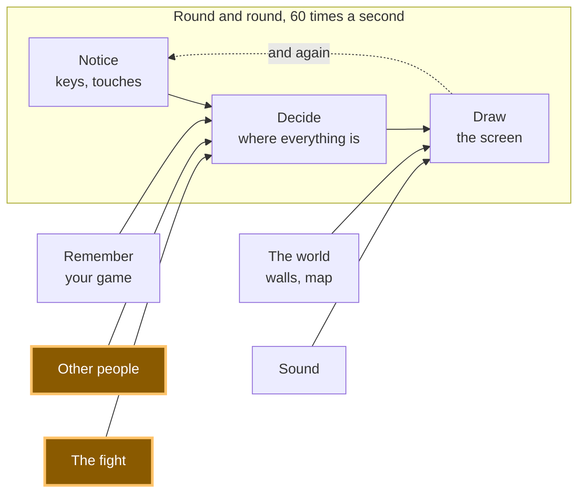
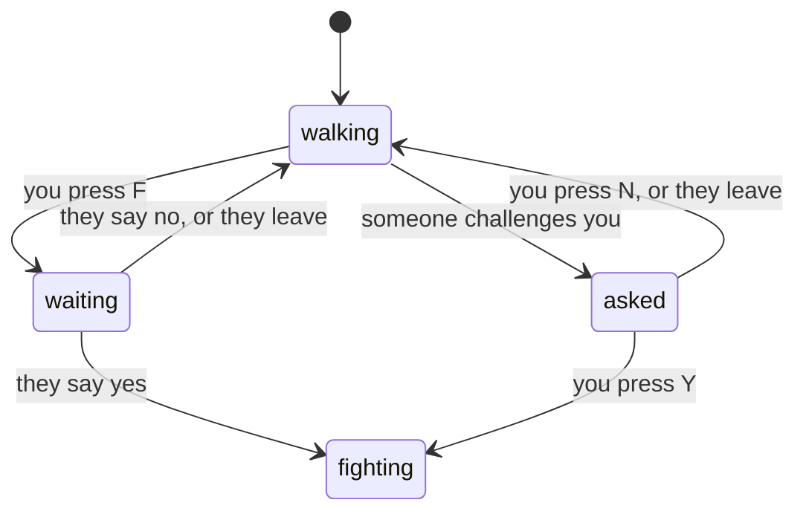

# A19: だれかに勝負を申しこむ

あなたは他のプレイヤーのとなりに立って、Fを押します。相手の画面には、質問が出ます。相手がYを押すと、2人とも対戦画面を見ています。その中ではまだ何も起きません。2人でいっしょに開くことが、今日の仕事のすべてです。
{: .lesson-intro }

**必要なもの:** [A12](a12.html)。**得られるもの:** 片方のプレイヤーが送れる申しこみ、もう片方が受けるか断れるしくみ、そして2人同時に切りかわる画面。

## ゲーム全体と今日の部分



今日つくるのは、「他のプレイヤー」と「対戦」のあいだのドアです。対戦そのものは[A20](a20.html)です。

## このステップのたった1つの考え方

あなたのゲームは、いつでも**1つ**の状態にしかいません。2つではありません。決して2つにはなりません。



状態は4つ。矢印はどれも、起きうることの1つです。声に出して読んでみましょう。*walking（歩いている）から、Fを押すとwaiting（返事待ち）になる。* これがこの機能のすべてです。

**バグはとてもよく、2つの状態に同時にいることが原因です。** 歩いていて、*しかも*返事を待っている。申しこまれていて、*しかも*もう戦っている。1つの言葉を持つ1つの変数として書けば、それは起こりえません。変数は1つのものしか持てないからです。

コードでは、ちょうどこうなります。

```
let state = 'walking';   // walking | waiting | asked | fighting
let them = null;         // who this conversation is with

function go(next, id) { state = next; them = id; }
```

## ブロックに分割する

「だれかに勝負を申しこむ」は3つのことです。

1. **たずねる** — いちばん近いプレイヤーに申しこみを送る
2. **合意する** — 申しこみに答え、気まずい場合それぞれが何を意味するかを決める
3. **画面を切りかえる** — 状態におうじてちがう絵を描く

**なぜわざわざ分けるのでしょう。** もし1つのかたまりにしてしまうと、うまく動かないときにどこが悪いのか分からなくなるからです。相手の画面で何も起きないなら「たずねる」の問題です。何かは起きるのに、2人が今どの状態なのかで食いちがっているなら「合意する」の問題です。状態は両方正しいのに絵がおかしいなら「画面を切りかえる」の問題です。3つのブロック、3つの別々の質問。そして、その答えを読み取るために見るのが、状態の変数です。

## ブロック1: たずねる

```
addEventListener('keydown', (e) => {
  held.add(e.key);
  const k = e.key.toLowerCase();
  if (k === 'f' && state === 'walking') {
    const id = nearest();
    if (id) { sendAsk({}, id); go('waiting', id); }
  }
  if (k === 'y' && state === 'asked') { sendReply({ yes: true }, them); go('fighting', them); }
  if (k === 'n' && state === 'asked') { sendReply({ yes: false }, them); go('walking', null); }
});
```

どの行も見てください。**キーはどれも、自分が働く状態の名前を言っています。** Fは歩いているあいだだけ効きます。YとNは申しこまれているあいだだけ効きます。まちがった状態で押されたキーは、何もしません。しかもそれは、あなたが覚えておかないといけないうっかりではなく、コードに書いてあることです。

`sendAsk`と`sendReply`は、[A12](a12.html)の`sendMove`と同じ部屋から来ています。

```
const [sendAsk, onAsk] = room.makeAction('ask');
const [sendReply, onReply] = room.makeAction('reply');
```

2つめの引数をわたして`sendAsk({}, id)`とすると、全員ではなく**その1人**に送られます。部屋についてのそれ以外のことは、A12から何も変わっていません。

```
function nearest() {
  let best = null, bestDistance = REACH;
  for (const id in others) {
    const d = Math.hypot(others[id].x - player.x, others[id].y - player.y);
    if (d < bestDistance) { bestDistance = d; best = id; }
  }
  return best;
}
```

`REACH`は90ピクセル、四角形3つ分より少し短いくらいです。申しこむには相手のところまで歩いていかないといけません。それがねらいです。

## ブロック2: 合意する

これがブロックの全部です。気まずい場合はどれも1行で、その1行はどれも、だれかが考えて決めたことです。

```
onAsk((_, id) => {
  if (state === 'waiting' && id === them) return go('fighting', id); // asked at once
  if (state !== 'walking') return sendReply({ yes: false }, id);     // busy: no
  go('asked', id);
});

onReply((answer, id) => {
  if (state !== 'waiting' || id !== them) return;                    // not for me
  if (answer.yes) go('fighting', id); else go('walking', null);
});
```

**2人が同時にFを押した。** それぞれが申しこみを送り、その申しこみは、もう返事を待っている相手に届きます。これは合意とみなします。2人とも同じ対戦にYesと言ったのだから、2人ともまっすぐ対戦に進みます。1行で書けて、両方のプレイヤーに公平です。もう1つのやり方（どちらが「先に」たずねたかを決める方法）だと、どちらの時計を信じるかというルールが必要になります。そして2台のパソコンの時計は、ぴったり合いません。

**あなたが忙しいときに、だれかが申しこんできた。** 歩いている以外の状態は、話しかけの途中か、もう戦っている最中です。すぐに、自動で「いいえ」を返します。相手はむだに待たされず、はっきりした答えをもらえます。

**待っていない返事が届いた。** 無視します。これが`state !== 'waiting' || id !== them`の行で、持っていて損はありません。遅れて届くメッセージは起こるものです。

**あなたが待っているあいだに、相手がタブを閉じた。** これは部屋のコードの側で、1行で片づけます。

```
room.onPeerLeave((id) => { delete others[id]; if (id === them) go('walking', null); });
```

いなくなった人が、あなたが話していた相手だったなら、話すのをやめてまた歩きます。これは申しこんだ側のタブを閉じてためしました。もう片方のプレイヤーは7秒くらい「申しこまれている」ままでいて（接続が静けさに気づくまでの時間です）、そのあと自分で歩く状態に戻りました。すぐではありませんが、固まったままにはなりません。

## ブロック3: 画面を切りかえる

```
function update(dt) {
  if (state !== 'walking') return;
  ...
}
```

移動のコードの先頭に1行。これで、歩いている状態でないときは、あなたの四角形は動かなくなります。質問の途中でふらふら歩いていくことはできません。それは、状態のしくみがあなたの代わりに働いてくれているということです。

```
function draw() {
  ctx.fillStyle = state === 'fighting' ? '#3a1420' : '#1b1b22';
  ctx.fillRect(0, 0, canvas.width, canvas.height);

  if (state === 'fighting') {
    ctx.fillText('FIGHT!   you  vs  ' + short(them), canvas.width / 2, canvas.height / 2);
    return;
  }

  if (state === 'waiting') ctx.fillText('Waiting for ' + short(them) + ' to answer…', ...);
  if (state === 'asked') ctx.fillText(short(them) + ' challenges you.   Y = yes,   N = no', ...);
  ... the squares, exactly as in A12 ...
}
```

とちゅうの`return`が大事です。戦っているときは、描画はそこで止まり、歩く世界は一度も描かれません。1つの状態に、1つの絵。[A20](a20.html)では、その`return`のあとの3行が、対戦そのものになります。

## なぜこの方法にしたのか

1つの変数が1つの言葉を持つ形にしたのは、2つの場所で同時に起きていることについて、2人のプレイヤーが同じ考えを持たないといけないからです。もし「戦っている？」と「待っている？」が別々の「はい／いいえ」だったら、組み合わせは4つになり、そのうち2つは意味をなさず、しかもコードがそこにたどり着くのを止める方法がありません。言葉が1つなら、そろえておくものが何もありません。両方のパソコンで`state`を読むことが、そのまま確認になります。実際に私たちがやった確認も、それです。

## 代わりにできたこと

| この代わりに | その代償 |
|---|---|
| `isWaiting`、`isFighting`、`isAsked`という別々の目印にする | 組み合わせが8つになり、そのほとんどはありえない状態です。しかも新しい機能を作るたびに、その全部を消すのを忘れないようにしないといけません。「2つの状態に同時にいる」バグは、ここから生まれます |
| 質問なしで、すぐ対戦を始める | コードは半分になります。そのかわり、あなたが何か別のことをしている最中でも、だれでもあなたを対戦に引きずりこめます。友達とのゲームが終わるのは、そういうことがきっかけです |
| 時刻をくらべて、どちらが「先に」たずねたかを決める | 2台のパソコンは時刻について同じ答えを持ちませんし、そのずれは2人の押した差より大きいことがよくあります。どのパソコンにたずねるかで答えが変わるルールを、書いてしまうことになります |
| 相手の返事を、いつまでも待ちつづける | だれかがノートパソコンを閉じるまでは問題ありません。そのあとあなたは、出る方法も説明もない画面に取りのこされます |

## プロンプト

```
I have a plain-JavaScript canvas game with trystero multiplayer: a room, a
'move' action, an others object of peer positions, and update(dt)/draw().
Add challenging in three blocks with a comment above each: ASK (press F to
challenge the nearest peer within 90px), AGREE (handle the answer), SCREEN
(draw a different screen per state). Use ONE variable `state` holding
'walking' | 'waiting' | 'asked' | 'fighting', and one `them` for who you are
talking to. Handle: both players challenging at once, a refusal, and the other
player leaving. Do not change the movement code except to stop it when state
is not 'walking'. No build step, no npm.
```

**出力を確認すること:** `state`という変数1つを使っていますか。それともいつのまにか`isWaiting`と`isFighting`という別々の目印になっていませんか。話が終わったときに`them`を空にしているところはありますか。それとも古い名前が残っていて、次の申しこみのときに出てきてしまいませんか。そして`onPeerLeave`の行はありますか。友達が質問の途中でノートパソコンを閉じるまで、だれも思い出さない場合です。

## 動作を確認する


ページを2つのタブで並べて開き、それぞれにもう片方の四角形が出るのを待ちます。

1. タブAのコンソールで`getState()`と打ちます。`{state: 'walking', them: '', me: 'boVn', ...}`と返ってきます。タブBでも同じことをします。
2. タブAの四角形をタブBの四角形のとなりまで歩かせて、Fを押します。タブAには*Waiting for … to answer*と出て、タブBの上にはオレンジ色の質問が出ます。
3. 両方のコンソールで状態を読みます。私たちの場合、Aは`{state: 'waiting', them: 'QgQL'}`、Bは`{state: 'asked', them: 'boVn'}`でした。おたがいの名前を言っています。
4. タブBでYを押します。両方の画面が暗い赤になり、**FIGHT!**と出ます。`getState()`はどちらも`fighting`で、それぞれ相手の名前が入っています。
5. 両方を再読み込みしてもう一度やり、こんどはNを押します。両方ともまっすぐ`walking`に戻り、`them`は空になります。
6. もう一度やって、こんどはタブBに質問が出ているあいだにタブAを閉じます。7秒くらいたつと、タブBは自分で歩く状態に戻ります。コンソールに赤い`RTCErrorEvent … User-Initiated Abort, reason=Close called`が出るかもしれません。それは、相手側が接続を閉じたことを報告しているだけで、ゲームは正しく処理しています。コンソールにエラーが出ることと、ゲームが壊れていることは、同じではありません。

自分の画面に質問が出ているあいだにFを押してみてください。何も起きません。Fは歩いているあいだだけ効きます。

## ゲームに組み込む

[A18](a18.html)のゲームを用意して、3つのブロックを足します。もとからあったコードへの変更は、`update`の先頭に入れる`if (state !== 'walking') return;`の1行だけです。移動も、壁も、他のプレイヤーもそのままです。あなたは、それらの上にスイッチを1つ足しているだけで、書き直してはいません。

<div class="takeaways">
<h2>主なポイント</h2>
<ul>
<li>短いリストの中の1つの言葉を持つ変数1つ。それが<strong>状態機械</strong>です。これであなたも、この言葉を知りました</li>
<li>多くのバグは、ただ2つの状態に同時にいるだけです。変数を1つにすれば、それは起こりえません</li>
<li>キーを押す処理はどれも、自分がどの状態で働くかを言うべきです。そうすれば、まちがった状態で意外なことは起きません</li>
<li>気まずい場合（同時に申しこむ、断られる、だれかがいなくなる）は、おまけではなく機能そのものです</li>
<li>いつ来るか分からないものを、プレイヤーにいつまでも待たせてはいけません</li>
</ul>
</div>

## あなたの番

今は、申しこみは答えが来るまで待ちつづけます。制限時間を足してみましょう。10秒たってもだれも答えなかったら、申しこんだ側は歩く状態に戻り、たずねられていた側の質問は消えます。残りの秒数を描いて、2人とも見えるようにします。1つ気をつけることがあります。時間切れとちょうど同じ瞬間に答えが届いたときも、両方が同じ状態にたどり着かないといけません。
