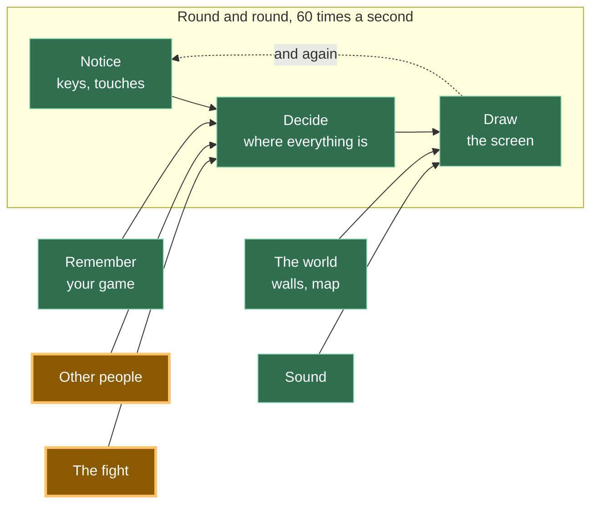
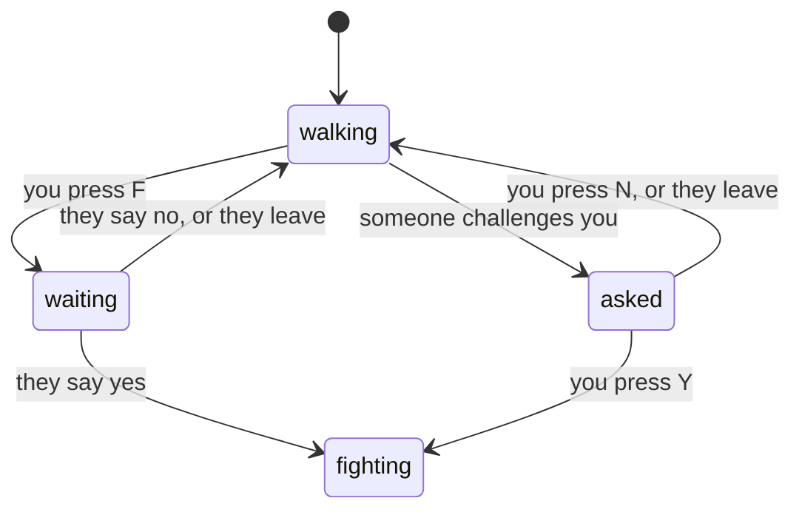

# A19: Challenge Someone

You stand next to another player and press F. On their screen, a question appears. They press Y, and both of you are looking at a fight screen. Nothing happens inside it yet — opening it together is today's whole job.
{: .lesson-intro }

**Needs:** [A12](a12.html). **Gives you:** a challenge one player can send, another can accept or refuse, and a screen that changes for both of them at once.

## The whole game, and today's piece



Today you build the door between "other people" and "the fight". The fight itself is [A20](a20.html).

## The one idea in this step

Your game is in exactly **one** state at a time. Not two. Never two.



Four states, and every arrow is one thing that can happen. Read it out loud: *from walking, pressing F takes you to waiting.* That is the whole feature.

**A bug is very often just being in two states at once.** You are walking *and* waiting for an answer. You are being asked *and* already fighting. When you write it as one variable that holds one word, that cannot happen, because a variable holds one thing.

In the code it is exactly this:

```
let state = 'walking';   // walking | waiting | asked | fighting
let them = null;         // who this conversation is with

function go(next, id) { state = next; them = id; }
```

## Cutting it into blocks

"Challenge somebody" is three things:

1. **Ask** — send a challenge to the nearest player
2. **Agree** — answer one, and decide what every awkward case means
3. **Change screen** — draw a different picture depending on the state

**Why bother splitting it?** Because if it were one lump and it went wrong, you could not tell which part was wrong. Nothing happening on their screen means ask. Something happening but the two of you disagreeing about what state you are in means agree. Both states right but the picture wrong means change screen. Three blocks, three separate questions — and the state variable is the thing you read to answer them.

## Block 1: Ask

```
addEventListener('keydown', (e) => {
  held.add(e.key);
  const k = e.key.toLowerCase();
  if (k === 'f' && state === 'walking') {
    const id = nearest();
    if (id) { sendAsk({}, id); go('waiting', id); }
  }
  if (k === 'y' && state === 'asked') { sendReply({ yes: true }, them); go('fighting', them); }
  if (k === 'n' && state === 'asked') { sendReply({ yes: false }, them); go('walking', null); }
});
```

Look at every line: **each key names the state it works in.** F only does something while walking. Y and N only do something while being asked. A key pressed in the wrong state does nothing at all, and that is not an accident you have to remember — it is written down.

`sendAsk` and `sendReply` come from the same room as [A12](a12.html)'s `sendMove`:

```
const [sendAsk, onAsk] = room.makeAction('ask');
const [sendReply, onReply] = room.makeAction('reply');
```

Passing a second argument, `sendAsk({}, id)`, sends it to **that one player** instead of everybody. Everything else about the room is unchanged from A12.

```
function nearest() {
  let best = null, bestDistance = REACH;
  for (const id in others) {
    const d = Math.hypot(others[id].x - player.x, others[id].y - player.y);
    if (d < bestDistance) { bestDistance = d; best = id; }
  }
  return best;
}
```

`REACH` is 90 pixels — under three squares' width. You have to walk over to somebody to challenge them, which is the point.

## Block 2: Agree

Here is the whole block. Every awkward case is one line, and every line is a decision somebody made on purpose.

```
onAsk((_, id) => {
  if (state === 'waiting' && id === them) return go('fighting', id); // asked at once
  if (state !== 'walking') return sendReply({ yes: false }, id);     // busy: no
  go('asked', id);
});

onReply((answer, id) => {
  if (state !== 'waiting' || id !== them) return;                    // not for me
  if (answer.yes) go('fighting', id); else go('walking', null);
});
```

**You both press F at the same moment.** Each of you sent a challenge, and each challenge arrives at somebody who is already waiting for an answer. We treat that as agreement: you both said yes to the same fight, so both of you go straight to fighting. It is one line, and it is fair to both players. The alternative — deciding one of you asked "first" — needs a rule about whose clock to believe, and clocks on two computers do not agree.

**Somebody challenges you while you are busy.** Any state that is not walking means you are mid-conversation or already fighting. Send back a no, immediately and automatically. They get a clear answer instead of waiting for nothing.

**A reply arrives that you were not waiting for.** Ignore it. This is the `state !== 'waiting' || id !== them` line, and it costs nothing to have. Late messages happen.

**The other player closes their tab while you wait.** That one is handled in the room code, in a single line:

```
room.onPeerLeave((id) => { delete others[id]; if (id === them) go('walking', null); });
```

If the person who disappeared was the person you were talking to, stop talking and walk again. We tested this by closing the challenger's tab, and the other player sat in "being asked" for about seven seconds — the time the connection takes to notice a silence — and then went back to walking on their own. Not instant, but never stuck.

## Block 3: Change screen

```
function update(dt) {
  if (state !== 'walking') return;
  ...
}
```

One line at the top of the movement code, and your square stops moving whenever you are not walking. You cannot wander off mid-question. That is the state machine doing work for you.

```
function draw() {
  ctx.fillStyle = state === 'fighting' ? '#3a1420' : '#1b1b22';
  ctx.fillRect(0, 0, canvas.width, canvas.height);

  if (state === 'fighting') {
    ctx.fillText('FIGHT!   you  vs  ' + short(them), canvas.width / 2, canvas.height / 2);
    return;
  }

  if (state === 'waiting') ctx.fillText('Waiting for ' + short(them) + ' to answer…', ...);
  if (state === 'asked') ctx.fillText(short(them) + ' challenges you.   Y = yes,   N = no', ...);
  ... the squares, exactly as in A12 ...
}
```

The `return` in the middle matters: when you are fighting, drawing stops there and the walking world is never painted. One state, one picture. In [A20](a20.html) the three lines after that `return` become the whole fight.

## Why we did it this way

One variable holding one word, because two players have to agree about something that is happening in two places at once. If "am I fighting?" and "am I waiting?" were separate true-or-false values, there would be four combinations, two of them nonsense, and no way to stop your code reaching them. With one word there is nothing to keep in step: reading `state` on both computers is the whole check, and it is the check we ran.

## What we could have done instead

| Instead of this | What it would cost |
|---|---|
| Separate flags: `isWaiting`, `isFighting`, `isAsked` | Eight combinations, most of them impossible, and every new feature has to remember to clear all of them. This is where "two states at once" bugs come from |
| Start the fight immediately, with no question | Half the code. Also anyone can drag you into a fight while you are doing something else, which is the kind of thing that ends a game with friends |
| Deciding who asked "first" by comparing times | Two computers do not agree about the time, and the gap is often smaller than the disagreement. You would have written a rule that gives a different answer depending on which computer you ask |
| Waiting for the other player to answer forever | Feels fine until somebody closes their laptop, and then you are stuck on a screen with no way out and no explanation |

## The prompt

```
I have a plain-JavaScript canvas game with trystero multiplayer: a room, a
'move' action, an others object of peer positions, and update(dt)/draw().
Add challenging in three blocks with a comment above each: ASK (press F to
challenge the nearest peer within 90px), AGREE (handle the answer), SCREEN
(draw a different screen per state). Use ONE variable `state` holding
'walking' | 'waiting' | 'asked' | 'fighting', and one `them` for who you are
talking to. Handle: both players challenging at once, a refusal, and the other
player leaving. Do not change the movement code except to stop it when state
is not 'walking'. No build step, no npm.
```

**Check the output for:** did it use one `state` variable, or did it quietly give you `isWaiting` and `isFighting` as separate flags? Does anything clear `them` when the conversation ends, or does a stale name hang around and show up in the next challenge? And is there a line for `onPeerLeave` — the case nobody remembers until a friend closes a laptop mid-question?

## See it work


Open the page in two tabs, side by side, and wait for each to show the other's square:

1. In tab A, type `getState()` in the console. You get `{state: 'walking', them: '', me: 'boVn', ...}`. Do the same in tab B.
2. Walk tab A's square up next to tab B's square, then press F. Tab A now says *Waiting for … to answer*, and tab B shows the orange question at the top.
3. Read the state in both consoles. We got `{state: 'waiting', them: 'QgQL'}` in A and `{state: 'asked', them: 'boVn'}` in B — each one naming the other.
4. Press Y in tab B. Both screens turn dark red and say **FIGHT!**. `getState()` says `fighting` in both, each with the other's name.
5. Reload both, do it again, and press N instead. Both go straight back to `walking` with `them` empty.
6. Do it once more, and this time close tab A while tab B still has the question on screen. About seven seconds later tab B returns to walking by itself. You may see a red `RTCErrorEvent … User-Initiated Abort, reason=Close called` in the console — that is the connection reporting that the other side closed it, and the game handled it correctly. An error in the console is not the same as a broken game.

Try pressing F while a question is on your screen. Nothing happens — F only works while walking.

## Put it in the game

Take your game from [A18](a18.html) and add the three blocks. The only edit to code you already had is the single `if (state !== 'walking') return;` at the top of `update`. Your movement, your walls and your other players are untouched — you are adding a switch above them, not rewriting them.

<div class="takeaways">
<h2>Key Takeaways</h2>
<ul>
<li>One variable holding one word out of a short list is a <strong>state machine</strong>, and now you know that phrase too</li>
<li>Many bugs are just being in two states at once; one variable makes that impossible</li>
<li>Every key press should say which state it works in, so nothing surprising happens in the wrong one</li>
<li>The awkward cases — both at once, a refusal, somebody leaving — are the feature, not extras</li>
<li>Never leave a player waiting forever on something that may never arrive</li>
</ul>
</div>

## Your turn

Right now a challenge waits until it is answered. Add a time limit: if nobody answers within ten seconds, the challenger goes back to walking and the person who was asked has the question disappear. Draw the seconds counting down so both players can see it. Watch out for one thing — when the answer arrives just as the clock runs out, both sides must still end up in the same state.
