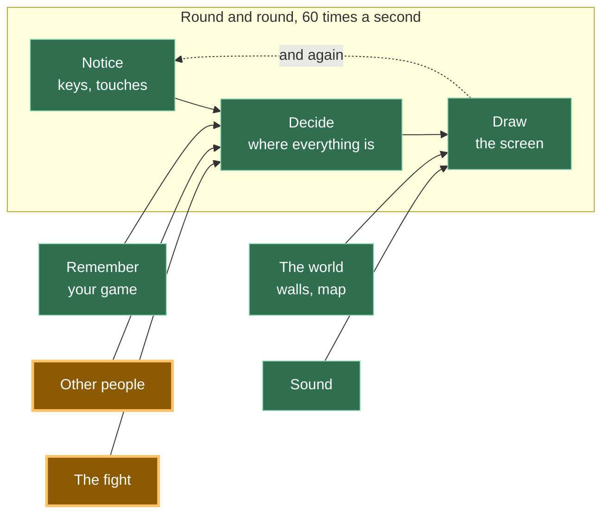
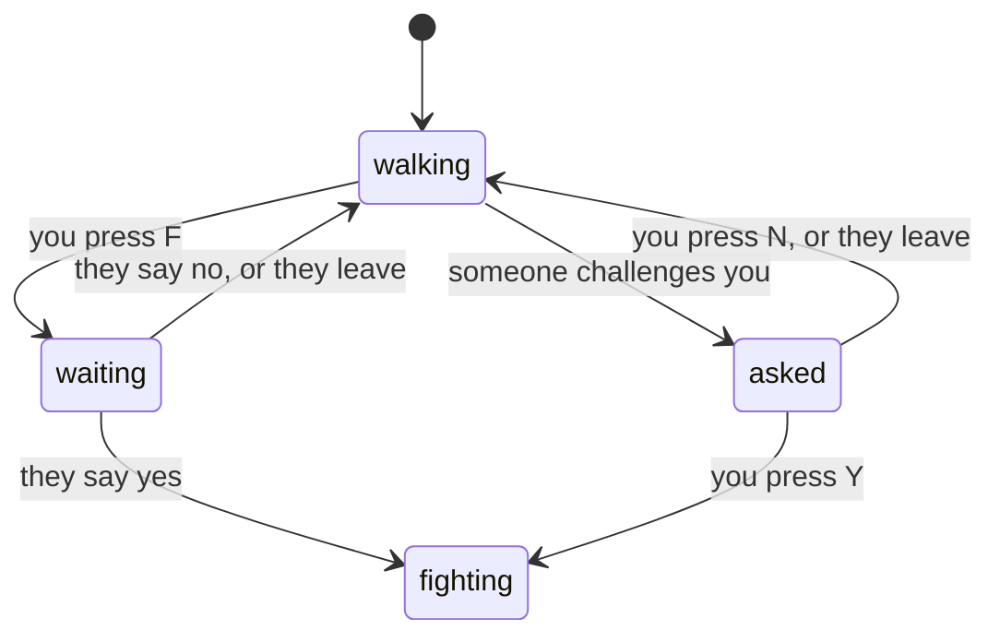

# A19: Desafie Alguém

Você fica ao lado de outro jogador e aperta F. Na tela dele aparece uma pergunta. Ele aperta Y, e os dois estão olhando para uma tela de luta. Nada acontece dentro dela ainda — abri-la juntos é todo o trabalho de hoje.
{: .lesson-intro }

**Precisa de:** [A12](a12.html). **Oferece:** um desafio que um jogador pode enviar, que outro pode aceitar ou recusar, e uma tela que muda para os dois ao mesmo tempo.

## O jogo completo, e a parte de hoje



Hoje você constrói a porta entre "outras pessoas" e "a luta". A luta em si é [A20](a20.html).

## A única ideia desta etapa

O seu jogo está em exatamente **um** estado por vez. Não dois. Nunca dois.



Quatro estados, e cada flecha é uma coisa que pode acontecer. Leia em voz alta: *de walking (andando), apertar F te leva para waiting (esperando resposta).* Essa é a funcionalidade inteira.

**Um bug é, muitas vezes, só estar em dois estados ao mesmo tempo.** Você está andando *e* esperando uma resposta. Você está sendo desafiado *e* já lutando. Quando você escreve isso como uma variável que guarda uma palavra, isso não pode acontecer, porque uma variável guarda uma coisa.

No código é exatamente isto:

```
let state = 'walking';   // walking | waiting | asked | fighting
let them = null;         // who this conversation is with

function go(next, id) { state = next; them = id; }
```

## Dividindo em blocos

"Desafiar alguém" são três coisas:

1. **Perguntar** — enviar um desafio ao jogador mais próximo
2. **Combinar** — responder a um desafio e decidir o que cada caso estranho significa
3. **Trocar de tela** — desenhar uma imagem diferente conforme o estado

**Por que dividir?** Porque se fosse tudo um bloco só e desse errado, você não saberia qual parte está errada. Nada acontecer na tela do outro é perguntar. Algo acontecer, mas vocês dois discordarem sobre em que estado estão, é combinar. Os dois estados certos mas a imagem errada é trocar de tela. Três blocos, três perguntas separadas — e a variável de estado é o que você lê para respondê-las.

## Bloco 1: Perguntar

```
addEventListener('keydown', (e) => {
  held.add(e.key);
  const k = e.key.toLowerCase();
  if (k === 'f' && state === 'walking') {
    const id = nearest();
    if (id) { sendAsk({}, id); go('waiting', id); }
  }
  if (k === 'y' && state === 'asked') { sendReply({ yes: true }, them); go('fighting', them); }
  if (k === 'n' && state === 'asked') { sendReply({ yes: false }, them); go('walking', null); }
});
```

Olhe cada linha: **cada tecla diz em que estado ela funciona.** F só faz algo enquanto você anda. Y e N só fazem algo enquanto você está sendo desafiado. Uma tecla apertada no estado errado não faz nada, e isso não é um acidente que você precisa lembrar — está escrito.

`sendAsk` e `sendReply` vêm da mesma sala que o `sendMove` de [A12](a12.html):

```
const [sendAsk, onAsk] = room.makeAction('ask');
const [sendReply, onReply] = room.makeAction('reply');
```

Passar um segundo argumento, `sendAsk({}, id)`, envia para **aquele jogador só**, em vez de para todos. Todo o resto sobre a sala continua igual a A12.

```
function nearest() {
  let best = null, bestDistance = REACH;
  for (const id in others) {
    const d = Math.hypot(others[id].x - player.x, others[id].y - player.y);
    if (d < bestDistance) { bestDistance = d; best = id; }
  }
  return best;
}
```

`REACH` é 90 pixels — menos que a largura de três quadrados. Você tem que ir andando até a pessoa para desafiá-la, e isso é de propósito.

## Bloco 2: Combinar

Aqui está o bloco inteiro. Cada caso estranho é uma linha, e cada linha é uma decisão que alguém tomou de propósito.

```
onAsk((_, id) => {
  if (state === 'waiting' && id === them) return go('fighting', id); // asked at once
  if (state !== 'walking') return sendReply({ yes: false }, id);     // busy: no
  go('asked', id);
});

onReply((answer, id) => {
  if (state !== 'waiting' || id !== them) return;                    // not for me
  if (answer.yes) go('fighting', id); else go('walking', null);
});
```

**Vocês dois apertam F no mesmo instante.** Cada um enviou um desafio, e cada desafio chega a alguém que já está esperando uma resposta. Tratamos isso como um acordo: os dois disseram sim para a mesma luta, então os dois vão direto para a luta. É uma linha, e é justo com os dois jogadores. A alternativa — decidir qual de vocês perguntou "primeiro" — precisa de uma regra sobre em qual relógio confiar, e relógios de dois computadores não concordam entre si.

**Alguém te desafia enquanto você está ocupado.** Qualquer estado que não seja andando quer dizer que você está no meio de uma conversa ou já lutando. Devolva um não, na hora e automaticamente. A pessoa recebe uma resposta clara em vez de esperar por nada.

**Chega uma resposta que você não estava esperando.** Ignore. É a linha `state !== 'waiting' || id !== them`, e ela não custa nada. Mensagens atrasadas acontecem.

**O outro jogador fecha a aba enquanto você espera.** Esse caso é resolvido no código da sala, em uma única linha:

```
room.onPeerLeave((id) => { delete others[id]; if (id === them) go('walking', null); });
```

Se a pessoa que desapareceu era a pessoa com quem você estava falando, pare de falar e volte a andar. Testamos isso fechando a aba de quem desafiou, e o outro jogador ficou em "sendo desafiado" por cerca de sete segundos — o tempo que a conexão leva para notar o silêncio — e depois voltou a andar por conta própria. Não é instantâneo, mas nunca fica travado.

## Bloco 3: Trocar de tela

```
function update(dt) {
  if (state !== 'walking') return;
  ...
}
```

Uma linha no topo do código de movimento, e o seu quadrado para de andar sempre que você não está no estado de andar. Você não consegue sair andando no meio de uma pergunta. Essa é a máquina de estados trabalhando por você.

```
function draw() {
  ctx.fillStyle = state === 'fighting' ? '#3a1420' : '#1b1b22';
  ctx.fillRect(0, 0, canvas.width, canvas.height);

  if (state === 'fighting') {
    ctx.fillText('FIGHT!   you  vs  ' + short(them), canvas.width / 2, canvas.height / 2);
    return;
  }

  if (state === 'waiting') ctx.fillText('Waiting for ' + short(them) + ' to answer…', ...);
  if (state === 'asked') ctx.fillText(short(them) + ' challenges you.   Y = yes,   N = no', ...);
  ... the squares, exactly as in A12 ...
}
```

O `return` do meio importa: quando você está lutando, o desenho para ali e o mundo de andar nunca é pintado. Um estado, uma imagem. Em [A20](a20.html) as três linhas depois daquele `return` se tornam a luta inteira.

## Por que fizemos isso desta forma

Uma variável guardando uma palavra, porque dois jogadores precisam concordar sobre algo que está acontecendo em dois lugares ao mesmo tempo. Se "estou lutando?" e "estou esperando?" fossem valores separados de verdadeiro ou falso, haveria quatro combinações, duas delas sem sentido, e nenhuma forma de impedir o seu código de chegar a elas. Com uma palavra só não há nada para manter em sincronia: ler `state` nos dois computadores é toda a verificação, e foi a verificação que fizemos.

## O que poderíamos ter feito em vez disso

| Em vez disso | O que custaria |
|---|---|
| Marcadores separados: `isWaiting`, `isFighting`, `isAsked` | Oito combinações, a maioria impossível, e toda funcionalidade nova tem que lembrar de limpar todas elas. É daqui que vêm os bugs de "dois estados ao mesmo tempo" |
| Começar a luta na hora, sem pergunta | Metade do código. E também qualquer pessoa pode te arrastar para uma luta enquanto você está fazendo outra coisa, que é o tipo de coisa que acaba com um jogo entre amigos |
| Decidir quem perguntou "primeiro" comparando horários | Dois computadores não concordam sobre a hora, e a diferença entre eles costuma ser maior do que o intervalo entre os dois pedidos. Você teria escrito uma regra que dá uma resposta diferente conforme o computador a que você pergunta |
| Esperar a resposta do outro jogador para sempre | Parece tudo bem até alguém fechar o notebook, e então você fica preso numa tela sem saída e sem explicação |

## O prompt

```
I have a plain-JavaScript canvas game with trystero multiplayer: a room, a
'move' action, an others object of peer positions, and update(dt)/draw().
Add challenging in three blocks with a comment above each: ASK (press F to
challenge the nearest peer within 90px), AGREE (handle the answer), SCREEN
(draw a different screen per state). Use ONE variable `state` holding
'walking' | 'waiting' | 'asked' | 'fighting', and one `them` for who you are
talking to. Handle: both players challenging at once, a refusal, and the other
player leaving. Do not change the movement code except to stop it when state
is not 'walking'. No build step, no npm.
```

**Verifique na resposta:** ele usou uma variável `state`, ou te deu `isWaiting` e `isFighting` como marcadores separados, sem avisar? Alguma coisa limpa o `them` quando a conversa termina, ou um nome velho fica pendurado ali e aparece no próximo desafio? E existe uma linha para `onPeerLeave` — o caso de que ninguém se lembra até um amigo fechar o notebook no meio da pergunta?

## Veja funcionar


Abra a página em duas abas, lado a lado, e espere cada uma mostrar o quadrado da outra:

1. Na aba A, digite `getState()` no console. Você recebe `{state: 'walking', them: '', me: 'boVn', ...}`. Faça o mesmo na aba B.
2. Ande com o quadrado da aba A até ficar ao lado do quadrado da aba B e aperte F. A aba A agora diz *Waiting for … to answer*, e a aba B mostra a pergunta laranja no topo.
3. Leia o estado nos dois consoles. Recebemos `{state: 'waiting', them: 'QgQL'}` em A e `{state: 'asked', them: 'boVn'}` em B — cada um nomeando o outro.
4. Aperte Y na aba B. As duas telas ficam vermelho-escuras e dizem **FIGHT!**. `getState()` diz `fighting` nas duas, cada uma com o nome do outro.
5. Recarregue as duas, faça de novo, e aperte N. As duas voltam direto para `walking` com o `them` vazio.
6. Faça mais uma vez, e agora feche a aba A enquanto a aba B ainda tem a pergunta na tela. Cerca de sete segundos depois, a aba B volta a andar por conta própria. Você pode ver um `RTCErrorEvent … User-Initiated Abort, reason=Close called` vermelho no console — é a conexão avisando que o outro lado a fechou, e o jogo lidou com isso corretamente. Um erro no console não é a mesma coisa que um jogo quebrado.

Tente apertar F enquanto uma pergunta está na sua tela. Nada acontece — F só funciona enquanto você anda.

## Coloque no jogo

Pegue o seu jogo de [A18](a18.html) e adicione os três blocos. A única mudança em código que você já tinha é o `if (state !== 'walking') return;` no topo do `update`. O seu movimento, as suas paredes e os seus outros jogadores ficam intactos — você está colocando um interruptor acima deles, não reescrevendo-os.

<div class="takeaways">
<h2>Principais Pontos</h2>
<ul>
<li>Uma variável guardando uma palavra de uma lista curta é uma <strong>máquina de estados</strong>, e agora você conhece essa expressão também</li>
<li>Muitos bugs são só estar em dois estados ao mesmo tempo; uma variável só torna isso impossível</li>
<li>Cada tecla apertada deveria dizer em que estado ela funciona, para nada surpreendente acontecer no estado errado</li>
<li>Os casos estranhos — os dois ao mesmo tempo, uma recusa, alguém saindo — são a funcionalidade, não extras</li>
<li>Nunca deixe um jogador esperando para sempre por algo que pode nunca chegar</li>
</ul>
</div>

## Sua vez

Agora um desafio espera até ser respondido. Adicione um limite de tempo: se ninguém responder em dez segundos, quem desafiou volta a andar e a pergunta desaparece da tela de quem foi desafiado. Desenhe os segundos na contagem regressiva para os dois jogadores poderem ver. Cuidado com uma coisa — quando a resposta chega exatamente na hora em que o tempo acaba, os dois lados ainda precisam terminar no mesmo estado.
