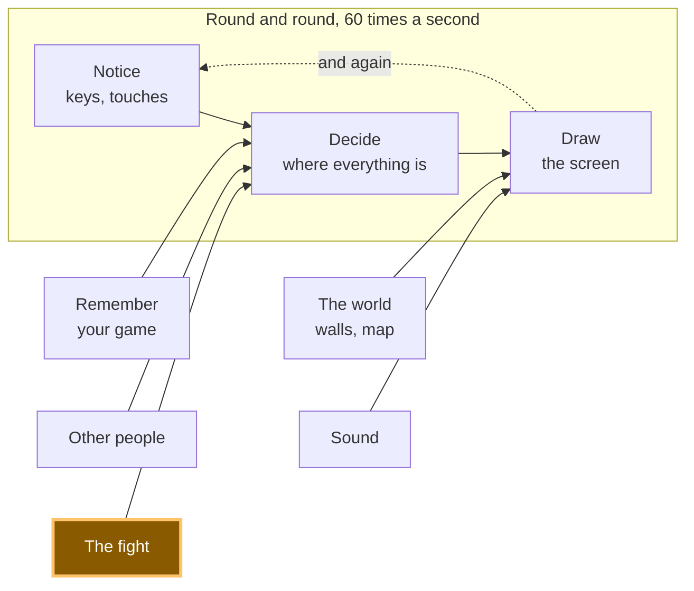

# A20: 3つの手

対戦画面はできました。次に必要なのは、戦うための中身です。ボタン3つ、勝者1人、そして理由を書いた1文です。
{: .lesson-intro }

**必要なもの:** [A19](a19.html)。**得られるもの:** 遊べるラウンド。手を選ぶと、結果とその理由が見られます。

## ゲーム全体と今日の部分



このステップのデモでは、2人のプレイヤーを1つのページの中に置いています。ラウンド全体を一度に見られるようにするためです。本物のゲームでは、この手は[A19](a19.html)で作った接続を通って、線の向こうに送られます。

## ブロックに分割する

「手を選んで、だれが勝ったかを見る」は3つのことです。

1. **選ぶ** — あなたがボタンを押し、相手も手を選ぶ
2. **くらべる** — 2つの手を受け取って、勝者を計算する
3. **見せる** — その答えを、言葉にして画面に出す

**なぜわざわざ分けるのでしょう。** 「くらべる」だけが、遊ばずに確かめられる部分だからです。いしとはさみをわたせば、答えはいつでも同じでないといけません。もし選ぶ・くらべる・見せるが1つのかたまりで、画面にまちがった名前が出たら、質問は1つ（*「なぜまちがっているの？」*）なのに、うたがう相手が3人になります。分けておけば、「くらべる」に直接たずねて、1秒で答えがもらえます。

## ブロック1: 選ぶ

親指で押せるくらい大きなボタンを3つ。

```
<button data-move="scissors">🔥 scissors</button>
<button data-move="rock">💧 rock</button>
<button data-move="paper">🪨 paper</button>
```

`data-move`は、あなたが自分で考えてボタンに貼りつけた札です。ブラウザはこれを無視します。あなたのコードは`button.dataset.move`でそれを読み返すので、そっくりなコードを3つ書くのではなく、1つのコードで3つのボタンをまとめて面倒みられます。

```
const MOVES = ['scissors', 'rock', 'paper'];

function theirChoice() {
  return MOVES[Math.floor(Math.random() * MOVES.length)];
}

for (const button of document.querySelectorAll('#moves button')) {
  button.addEventListener('click', () => playRound(button.dataset.move));
}
```

`Math.random()`は、0以上1より少し下までの数を返します。3をかけて小数を切りすてると、0か1か2になります。3つの手のどれかです。

ここでは、相手はさいころをふっています。本物のゲームでは、相手の手はネットワークを通って届きます。次のブロックは、そのどちらだったかを気にしません。

## ブロック2: くらべる

```
// rock beats scissors, scissors beats paper, paper beats rock.
const BEATS = { rock: 'scissors', scissors: 'paper', paper: 'rock' };

function compare(mine, theirs) {
  if (mine === theirs) return { winner: 'nobody', why: mine + ' does not beat ' + theirs };
  if (BEATS[mine] === theirs) return { winner: 'you', why: mine + ' beats ' + theirs };
  return { winner: 'them', why: theirs + ' beats ' + mine };
}
```

`BEATS`は、このゲームのルール全部を3つの組で書いたものです。`BEATS.rock`は`'scissors'`で、「いしははさみに勝つ」と読めます。あとのことは、全部そこから出てきます。

この関数が*していない*ことを見てください。画面にはふれません。時計にもたずねません。さいころもふりません。同じ2つの手を入れれば、同じ答えが出てきます。今日も、1年後も。**大人のプログラマーはこれを純粋関数と呼びます。これであなたも、この言葉を知りました。**

純粋であることは、テストできるということです。ボタンを1回も押さずに確かめられます。

```
console.assert(compare('rock', 'scissors').winner === 'you', 'rock should beat scissors');
console.assert(compare('scissors', 'rock').winner === 'them', 'scissors should lose to rock');
console.assert(compare('paper', 'paper').winner === 'nobody', 'same move is a draw');
```

`console.assert`は、正しいときは何も言わず、まちがっているときだけブラウザのコンソールで文句を言います。静かなことが合格です。

それに、勝者だけでなく`why`（理由）も返しています。「あなたの負け」と言うだけのゲームは、何も教えてくれません。「いしははさみに勝つ」と言うゲームは、遊びながらルールを教えてくれます。

## ブロック3: 見せる

```
function show(mine, theirs, result) {
  const heading = { you: 'You win!', them: 'You lose.', nobody: 'A draw.' };
  document.querySelector('#who').textContent = heading[result.winner];
  document.querySelector('#why').textContent =
    'You played ' + mine + '. They played ' + theirs + '. ' + result.why + '.';
}
```

このブロックは、考えることを何もしません。答えをわたされて、それを人が読める場所に置くだけです。それが仕事のすべてです。

そして、小さな関数1つが、3つをつなぎます。

```
function playRound(mine) {
  const theirs = theirChoice();
  const result = compare(mine, theirs);
  score[result.winner] += 1;
  show(mine, theirs, result);
}
```

## なぜ3つの手で、「いちばん強い手」がないのか

ここは、コードの話ではなく、本当にゲームの話です。

**あなたはもうこれを知っています。** じゃんけんでいちばん強い手はどれかと聞く人はいません。そんなものがないのは、見ればわかるからです。でも、*なぜ*このゲームがそうなっているのかは、考えたことがないかもしれません。

もし、いしが他の2つの両方に勝つとしたら、どうでしょう。あなたは何を出しますか。いしです。みんなは何を出しますか。いしです。どのラウンドもいし対いしで、それが永遠につづき、決めることは何もなくなります。ゲームは始まる前に終わっています。

もう一度、輪を見てください。いしははさみに勝つ。はさみはかみに勝つ。かみはいしに勝つ。**どの手も、1つに勝ち、1つに負けます。** ただ強いだけの手はないので、「何を出せばいい？」という問いには、それ自体では答えがありません。答える方法は1つだけ、*相手*が何を出しそうかを考えることです。ゲームが本当に生きているのはそこです。そして、小さいころにだれもが覚えるゲームを、今つくる価値があるのもそのためです。

多くのゲームがこういう輪の上に作られているのは、これが理由です。重い鎧は矢に勝ち、矢は騎兵に勝ち、騎兵は重い鎧に勝つ。*大人のプログラマーや数学者は、これを「支配戦略のないゲーム」と呼びます。「支配戦略」とは、ほかのだれが何をしても、いちばんよい選択のことです。あなたのゲームには、わざとそれがありません。*

## なぜこの方法にしたのか

決め手になった制約はこれです。本物のゲームでは、**2人のプレイヤーがそれぞれ自分のパソコンで結果を計算し、その2つの答えはぴったり一致しないといけません。** 審判をするサーバーはありません。あなたのパソコンはあなたの勝ちと言い、相手のパソコンは相手の勝ちと言ったら、その対戦は壊れています。しかも、たずねる相手がいません。

2台のパソコンは、純粋関数の答えについてなら、かんたんに一致します。同じ2つの手を入れれば、同じ答えが出るからです。もし「くらべる」が時計や画面の大きさやさいころも見ていたら、そんなにかんたんには一致しません。だからこの関数は、2つの引数以外の何も見ません。そのたった1つのルールが、対戦の残りの部分を成り立たせています。

## 代わりにできたこと

| この代わりに | その代償 |
|---|---|
| ボタンのクリックのコードの中で勝者を決める | 確かめるたびに、本当にクリックしないといけません。遊ばずにルールをテストすることがまったくできなくなり、しかも[A21](a21.html)のコンピューター対戦相手のために、同じルールがコピーされることになります |
| 組み合わせごとに`if`を長くつなげる | 3つではなく9つの場合分けになり、そのそれぞれが、単語を打ちまちがえるチャンスです。`BEATS`はルールを1回だけ書きます |
| 理由なしで、勝者だけを返す | 長さは半分になります。でもプレイヤーは何も学べませんし、まちがっているときに、コードが*何が何に勝つ*と思っていたのかが見えません |
| 片方のパソコンが決めて、もう片方に伝える | そのほうがかんたんです。相手がメッセージを書きかえるまでは。サーバーがないところでは、「先に言ったほうが正しい」は守れるルールではありません |

## プロンプト

```
I have a rock-paper-scissors style fight in plain JavaScript, in three parts:
click handlers that pick a move, a pure compare(mine, theirs) that returns
{ winner, why }, and a show() that writes to the page. Add a best-of-five
match: keep playing rounds until someone wins three. Keep compare pure — no
DOM, no randomness inside it — and put the match score in its own function
that also does not touch the page. Tell me which lines you added where.
```

**出力を確認すること:** 画面に関わるものが`compare`の中にしのびこんでいませんか。アシスタントは、勝者を計算しているちょうどその場所に、点数の表示を新しくする行を足すのが大好きです。そしてそれは、こっそりこの関数をテストできないものに変えてしまいます。それに、引き分けが3勝のうちに数えられていないかも確かめてください。それは、みんなが忘れる場合です。

## 動作を確認する


Live Serverでページを開いて、次をやってみましょう。

1. **rock**を押します。結果が出て、その下に理由が出ます。
2. 同じボタンを10回くらい押しつづけます。点数は勝ち・負け・引き分けの3方向すべてに動きます。相手が毎回さいころをふっているからです。
3. ブラウザのコンソールを開きます。何も出ていません。その静けさが、3つの`console.assert`が通っているしるしです。
4. コンソールで`compare('paper', 'rock')`と打ちます。ページにふれずに`{ winner: 'you', why: 'paper beats rock' }`が返ってきます。それが、純粋なブロックのねらいです。

私たちも作っているときに最後のをやりました。`compare('scissors', 'rock')`は`{ winner: 'them', why: 'rock beats scissors' }`を返し、ボタンは一度も押していません。

## ゲームに組み込む

[A19](a19.html)の対戦画面は、今は開くだけで何もしません。そこに3つのボタンを置いて、相手プレイヤーの手が届いたら`compare`を呼びます。`compare`は自分だけのファイル（`src/battle/rules.js`）に置いてください。[A21](a21.html)と[A22](a22.html)は、どちらもその中身を1行も変えずに使います。

<div class="takeaways">
<h2>主なポイント</h2>
<ul>
<li>純粋関数は、値を受け取って答えを返すだけで、ほかの何にもふれません。そしてそれは、遊ばずに確かめられるゲームの唯一の部分です</li>
<li>ルールは9つの<code>if</code>にばらまくのではなく、データ（<code>BEATS</code>）として1回だけ書きましょう</li>
<li>勝ったことだけでなく、<em>なぜ</em>勝ったのかをプレイヤーに伝えましょう。そうすれば、ゲームが自分のルールを自分で教えてくれます</li>
<li>3つの手が輪になっていると、いちばん強い手がなくなるので、相手のことを考えないといけません。それが、これをゲームにしているものです</li>
<li>2台のパソコンは、それぞれ自分で同じ結果にたどり着かないといけません。だからこそ、勝敗を決める部分には、さいころも時計も許されないのです</li>
</ul>
</div>

## あなたの番

4つめの手を足してみましょう。ほかの2つに勝ち、1つに負ける手です。10ラウンド遊びます。そのあと、紙の上で、今のいちばんよい手は何かを考えてください。そして、いつでもそれがあることに気づいてください。そうしたら、その手をまた取りのぞきましょう。
