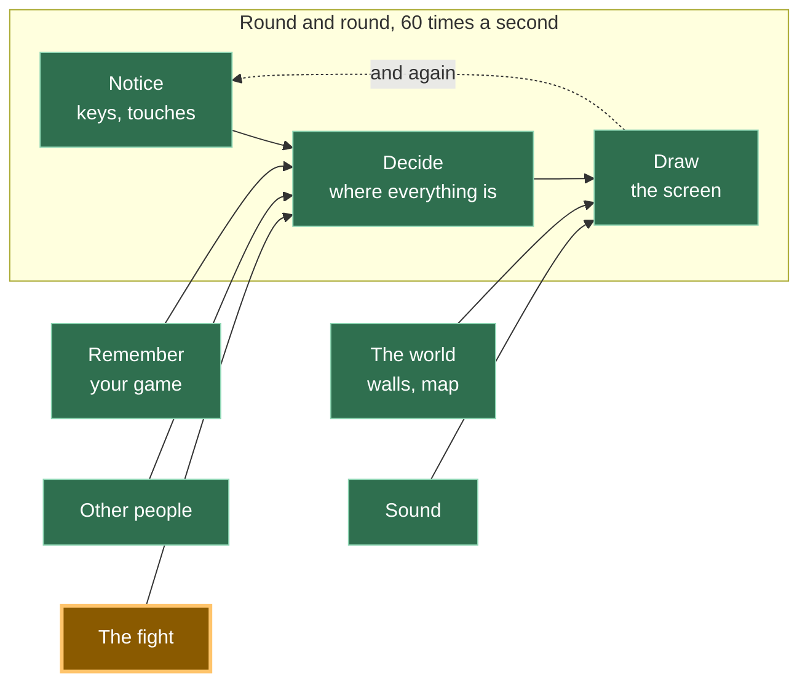

# A20: Three Moves

You have a fight screen. Now you need something to fight with. Three buttons, one winner, and a sentence saying why.
{: .lesson-intro }

**Needs:** [A19](a19.html). **Gives you:** a round you can play — pick a move, see the result and the reason for it.

## The whole game, and today's piece



The demo for this step keeps both players on one page, so you can watch the whole round at once. The real game sends these moves over the wire, using the connection you built in [A19](a19.html).

## Cutting it into blocks

"Pick a move and see who won" is three things:

1. **Choose** — you press a button; the other side picks too
2. **Compare** — take the two moves and work out the winner
3. **Show** — put the answer on the screen in words

**Why bother splitting it?** Because "compare" is the only part you can check without playing. Give it rock and scissors, and the answer must always be the same. If choosing, comparing and showing were one lump and the wrong name appeared on screen, you would have one question — *"why is it wrong?"* — and three suspects. Split, you can ask "compare" directly and get an answer in a second.

## Block 1: Choose

Three buttons, big enough for a thumb.

```
<button data-move="scissors">🔥 scissors</button>
<button data-move="rock">💧 rock</button>
<button data-move="paper">🪨 paper</button>
```

`data-move` is a label you invent and stick on the button. The browser ignores it. Your code reads it back with `button.dataset.move`, so one piece of code serves all three buttons instead of three almost-identical pieces.

```
const MOVES = ['scissors', 'rock', 'paper'];

function theirChoice() {
  return MOVES[Math.floor(Math.random() * MOVES.length)];
}

for (const button of document.querySelectorAll('#moves button')) {
  button.addEventListener('click', () => playRound(button.dataset.move));
}
```

`Math.random()` gives a number from 0 up to just under 1. Multiply by 3 and round down, and you get 0, 1 or 2 — one of the three moves.

Here the other side rolls a dice. In the real game their move arrives over the network. Nothing in the next block cares which of those it was.

## Block 2: Compare

```
// rock beats scissors, scissors beats paper, paper beats rock.
const BEATS = { rock: 'scissors', scissors: 'paper', paper: 'rock' };

function compare(mine, theirs) {
  if (mine === theirs) return { winner: 'nobody', why: mine + ' does not beat ' + theirs };
  if (BEATS[mine] === theirs) return { winner: 'you', why: mine + ' beats ' + theirs };
  return { winner: 'them', why: theirs + ' beats ' + mine };
}
```

`BEATS` is the whole rule of the game written as three pairs. `BEATS.rock` is `'scissors'`, which reads as "rock beats scissors". Everything else falls out of it.

Look at what this function does *not* do. It does not touch the screen. It does not ask the clock. It does not roll a dice. Put the same two moves in and you get the same answer out, today and in a year. **Grown-up programmers call that a pure function, so now you know that phrase too.**

Pure means testable. You can check it without a single button press:

```
console.assert(compare('rock', 'scissors').winner === 'you', 'rock should beat scissors');
console.assert(compare('scissors', 'rock').winner === 'them', 'scissors should lose to rock');
console.assert(compare('paper', 'paper').winner === 'nobody', 'same move is a draw');
```

`console.assert` says nothing when it is right and complains in the browser console when it is wrong. Silence is the pass.

It also returns a `why`, not just a winner. A game that says "you lose" teaches nothing. A game that says "rock beats scissors" teaches the rule while you play.

## Block 3: Show

```
function show(mine, theirs, result) {
  const heading = { you: 'You win!', them: 'You lose.', nobody: 'A draw.' };
  document.querySelector('#who').textContent = heading[result.winner];
  document.querySelector('#why').textContent =
    'You played ' + mine + '. They played ' + theirs + '. ' + result.why + '.';
}
```

This block does no thinking. It is handed an answer and puts it where a person can read it. That is the whole job.

Then one small function joins the three together:

```
function playRound(mine) {
  const theirs = theirChoice();
  const result = compare(mine, theirs);
  score[result.winner] += 1;
  show(mine, theirs, result);
}
```

## Why three moves, and not a "best" one

Here is the part that is really about games, not about code.

**You already know this.** Nobody has ever asked which is the best move in rock, paper, scissors, because there obviously isn't one. What you may not have done is ask *why* the game works that way.

Imagine rock simply beat both of the others. What would you pick? Rock. What would everyone pick? Rock. Every round would be rock against rock, forever, and there would be nothing to decide. The game would be over before it started.

Now look at the circle again. Rock beats scissors. Scissors beats paper. Paper beats rock. **Every move beats one and loses to one.** There is no move that is just better, so "what should I pick?" has no answer on its own. The only way to answer it is to think about what the *other person* is likely to pick. That is where the game actually lives — and it is why a game everyone learns as a small child is still worth building.

This is why so many games are built on a circle like this: heavy armour beats arrows, arrows beat cavalry, cavalry beats heavy armour. *Grown-up programmers and mathematicians call this a game with no dominant strategy — a "dominant strategy" being a choice that is best no matter what anyone else does. Yours has none, on purpose.*

## Why we did it this way

The forcing constraint is this: in the real game, **both players work out the result on their own computers, and the two answers must match exactly.** There is no server to referee. If your computer says you won and theirs says they won, the fight is broken and there is nobody to ask.

Two computers agree easily on the answer to a pure function — same two moves in, same answer out. They would not agree so easily if "compare" also looked at the clock, or the screen size, or a dice. So it looks at nothing but its two arguments. That single rule is what makes the rest of the fight possible.

## What we could have done instead

| Instead of this | What it would cost |
|---|---|
| Deciding the winner inside the button's click code | Every check means a real click. You could not test the rule at all without playing, and the same rule would end up copied for the computer opponent in [A21](a21.html) |
| A long chain of `if` statements, one per pair | Nine cases instead of three, and each one a chance to type the wrong word. `BEATS` states the rule once |
| Returning just a winner, no reason | Half the length. But the player learns nothing, and when it is wrong you cannot see *what* it thought beat what |
| Letting one computer decide and tell the other | Simpler, until the other player edits the message. With no server, "whoever speaks first is right" is not a rule you can defend |

## The prompt

```
I have a rock-paper-scissors style fight in plain JavaScript, in three parts:
click handlers that pick a move, a pure compare(mine, theirs) that returns
{ winner, why }, and a show() that writes to the page. Add a best-of-five
match: keep playing rounds until someone wins three. Keep compare pure — no
DOM, no randomness inside it — and put the match score in its own function
that also does not touch the page. Tell me which lines you added where.
```

**Check the output for:** did anything to do with the screen creep inside `compare`? Assistants love adding a line that updates the score display right where the winner is worked out, and that quietly makes the function untestable. Also check that a draw does not count towards the three — that is the case people forget.

## See it work


Open the page with Live Server and:

1. Press **rock**. A result appears with a reason under it.
2. Keep pressing the same button about ten times. The score changes in all three directions — wins, losses and draws — because the other side is rolling a dice each time.
3. Open the browser console. It is silent. That silence is the three `console.assert` checks passing.
4. In the console, type `compare('paper', 'rock')`. You get `{ winner: 'you', why: 'paper beats rock' }` without touching the page. That is the point of a pure block.

We ran that last one while building this: `compare('scissors', 'rock')` came back `{ winner: 'them', why: 'rock beats scissors' }`, and no button was ever pressed.

## Put it in the game

The fight screen from [A19](a19.html) currently opens and does nothing. Put the three buttons on it, and call `compare` when the other player's move arrives. Keep `compare` in its own file — `src/battle/rules.js` — because [A21](a21.html) and [A22](a22.html) both use it without changing a line of it.

<div class="takeaways">
<h2>Key Takeaways</h2>
<ul>
<li>A pure function takes values in and gives an answer out, touching nothing else — and it is the only part of a game you can check without playing</li>
<li>Write the rule down once, as data (<code>BEATS</code>), instead of spreading it across nine <code>if</code> statements</li>
<li>Tell the player <em>why</em> they won, not only that they won — the game teaches its own rules that way</li>
<li>Three moves in a circle means no move is best, so you have to think about the other person. That is what makes it a game</li>
<li>Both computers must reach the same result on their own, which is exactly why the deciding part is allowed no dice and no clock</li>
</ul>
</div>

## Your turn

Add a fourth move that beats two of the others and loses to one. Play ten rounds. Then work out, on paper, what your best move now is — and notice that you now always have one. Take it out again.
