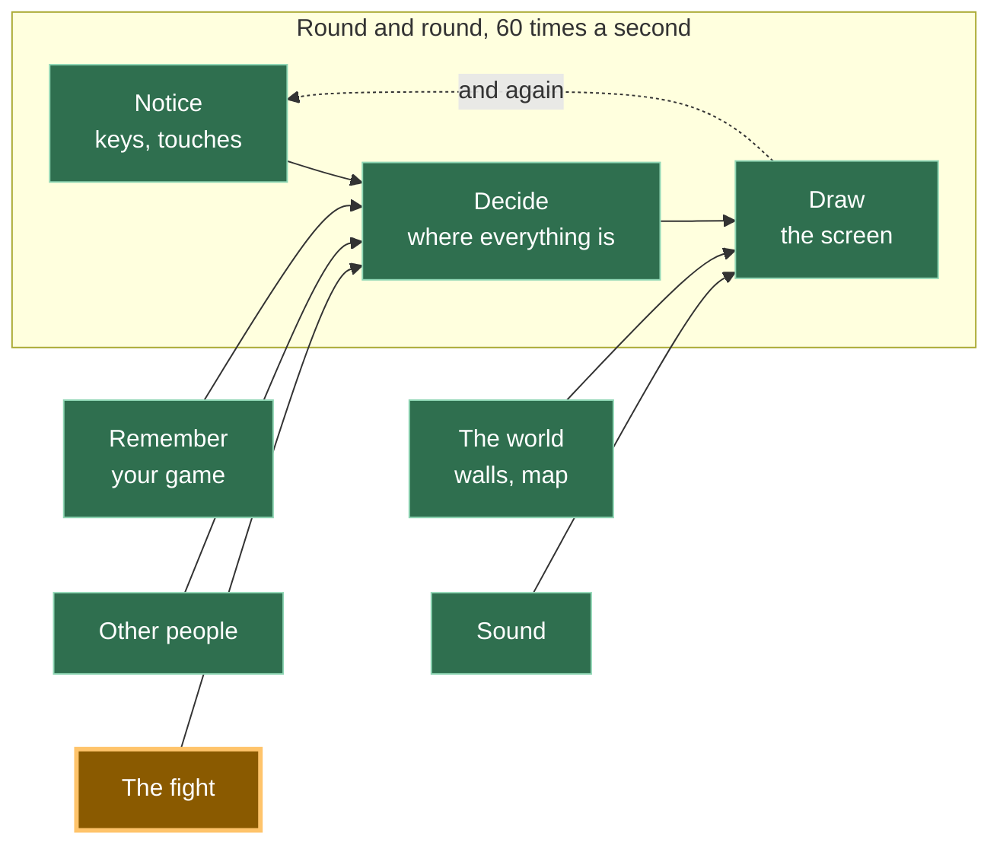

# A20: Três Jogadas

Você tem uma tela de luta. Agora você precisa de algo com que lutar. Três botões, um vencedor e uma frase dizendo por quê.
{: .lesson-intro }

**Precisa de:** [A19](a19.html). **Oferece:** uma rodada que você pode jogar — escolha uma jogada, veja o resultado e a razão dele.

## O jogo completo, e a parte de hoje



A demonstração desta etapa mantém os dois jogadores em uma página só, para você poder ver a rodada inteira de uma vez. O jogo de verdade manda essas jogadas pela rede, usando a conexão que você construiu em [A19](a19.html).

## Dividindo em blocos

"Escolher uma jogada e ver quem ganhou" são três coisas:

1. **Escolher** — você aperta um botão; o outro lado também escolhe
2. **Comparar** — pegar as duas jogadas e calcular o vencedor
3. **Mostrar** — colocar a resposta na tela em palavras

**Por que dividir?** Porque "comparar" é a única parte que você consegue conferir sem jogar. Dê a ela pedra e tesoura, e a resposta tem que ser sempre a mesma. Se escolher, comparar e mostrar fossem um bloco só e o nome errado aparecesse na tela, você teria uma pergunta — *"por que está errado?"* — e três suspeitos. Separados, você pergunta direto ao "comparar" e tem a resposta em um segundo.

## Bloco 1: Escolher

Três botões, grandes o bastante para um dedão.

```
<button data-move="scissors">🔥 scissors</button>
<button data-move="rock">💧 rock</button>
<button data-move="paper">🪨 paper</button>
```

`data-move` é uma etiqueta que você inventa e cola no botão. O navegador a ignora. O seu código a lê de volta com `button.dataset.move`, então um pedaço de código serve os três botões, em vez de três pedaços quase idênticos.

```
const MOVES = ['scissors', 'rock', 'paper'];

function theirChoice() {
  return MOVES[Math.floor(Math.random() * MOVES.length)];
}

for (const button of document.querySelectorAll('#moves button')) {
  button.addEventListener('click', () => playRound(button.dataset.move));
}
```

`Math.random()` dá um número de 0 até um pouquinho abaixo de 1. Multiplique por 3 e arredonde para baixo, e você tem 0, 1 ou 2 — uma das três jogadas.

Aqui o outro lado joga um dado. No jogo de verdade, a jogada dele chega pela rede. Nada no bloco seguinte se importa com qual dos dois casos foi.

## Bloco 2: Comparar

```
// rock beats scissors, scissors beats paper, paper beats rock.
const BEATS = { rock: 'scissors', scissors: 'paper', paper: 'rock' };

function compare(mine, theirs) {
  if (mine === theirs) return { winner: 'nobody', why: mine + ' does not beat ' + theirs };
  if (BEATS[mine] === theirs) return { winner: 'you', why: mine + ' beats ' + theirs };
  return { winner: 'them', why: theirs + ' beats ' + mine };
}
```

`BEATS` é a regra inteira do jogo escrita como três pares. `BEATS.rock` é `'scissors'`, que se lê como "pedra ganha de tesoura". Todo o resto sai daí.

Olhe o que esta função *não* faz. Ela não toca na tela. Não pergunta a hora. Não joga dado. Coloque as mesmas duas jogadas e você recebe a mesma resposta, hoje e dentro de um ano. **Programadores adultos chamam isso de função pura, então agora você conhece essa expressão também.**

Pura quer dizer testável. Você pode conferi-la sem apertar um único botão:

```
console.assert(compare('rock', 'scissors').winner === 'you', 'rock should beat scissors');
console.assert(compare('scissors', 'rock').winner === 'them', 'scissors should lose to rock');
console.assert(compare('paper', 'paper').winner === 'nobody', 'same move is a draw');
```

`console.assert` não diz nada quando está certo e reclama no console do navegador quando está errado. O silêncio é a aprovação.

Ela também devolve um `why`, não só um vencedor. Um jogo que diz "você perdeu" não ensina nada. Um jogo que diz "pedra ganha de tesoura" ensina a regra enquanto você joga.

## Bloco 3: Mostrar

```
function show(mine, theirs, result) {
  const heading = { you: 'You win!', them: 'You lose.', nobody: 'A draw.' };
  document.querySelector('#who').textContent = heading[result.winner];
  document.querySelector('#why').textContent =
    'You played ' + mine + '. They played ' + theirs + '. ' + result.why + '.';
}
```

Este bloco não pensa nada. Ele recebe uma resposta e a coloca onde uma pessoa possa ler. Esse é todo o trabalho.

Depois uma função pequena junta os três:

```
function playRound(mine) {
  const theirs = theirChoice();
  const result = compare(mine, theirs);
  score[result.winner] += 1;
  show(mine, theirs, result);
}
```

## Por que três jogadas, e não uma "melhor"

Aqui está a parte que é realmente sobre jogos, não sobre código.

**Você já sabe disso.** Ninguém nunca perguntou qual é a melhor jogada em pedra, papel e tesoura, porque obviamente não existe uma. O que você talvez nunca tenha feito é perguntar *por que* o jogo funciona assim.

Imagine que pedra simplesmente ganhasse das outras duas. O que você escolheria? Pedra. O que todos escolheriam? Pedra. Toda rodada seria pedra contra pedra, para sempre, e não haveria nada para decidir. O jogo estaria acabado antes de começar.

Agora olhe o círculo de novo. Pedra ganha de tesoura. Tesoura ganha de papel. Papel ganha de pedra. **Cada jogada ganha de uma e perde para uma.** Não existe jogada que seja simplesmente melhor, então "o que eu devo escolher?" não tem resposta por si só. O único jeito de responder é pensar no que a *outra pessoa* provavelmente vai escolher. É ali que o jogo realmente mora — e é por isso que um jogo que todos aprendem quando são pequenos ainda vale a pena ser construído.

É por isso que tantos jogos são construídos sobre um círculo como este: armadura pesada ganha de flechas, flechas ganham da cavalaria, cavalaria ganha da armadura pesada. *Programadores adultos e matemáticos chamam isso de um jogo sem estratégia dominante — uma "estratégia dominante" sendo uma escolha que é a melhor não importa o que os outros façam. O seu não tem nenhuma, de propósito.*

## Por que fizemos isso desta forma

A restrição que obriga isso é esta: no jogo de verdade, **os dois jogadores calculam o resultado nos seus próprios computadores, e as duas respostas precisam bater exatamente.** Não há servidor para apitar. Se o seu computador diz que você ganhou e o dele diz que ele ganhou, a luta está quebrada e não há ninguém para perguntar.

Dois computadores concordam facilmente sobre a resposta de uma função pura — as mesmas duas jogadas entram, a mesma resposta sai. Eles não concordariam tão facilmente se o "comparar" também olhasse a hora, o tamanho da tela ou um dado. Então ele não olha nada além dos seus dois argumentos. Essa única regra é o que torna o resto da luta possível.

## O que poderíamos ter feito em vez disso

| Em vez disso | O que custaria |
|---|---|
| Decidir o vencedor dentro do código do clique do botão | Cada conferência exige um clique de verdade. Você não conseguiria testar a regra de jeito nenhum sem jogar, e a mesma regra acabaria copiada para o oponente do computador em [A21](a21.html) |
| Uma corrente longa de `if`, um por par | Nove casos em vez de três, e cada um é uma chance de digitar a palavra errada. `BEATS` diz a regra uma vez |
| Devolver só um vencedor, sem razão | Metade do tamanho. Mas o jogador não aprende nada, e quando está errado você não consegue ver *o que* o código achou que ganhava de quê |
| Deixar um computador decidir e avisar o outro | Mais simples, até o outro jogador editar a mensagem. Sem servidor, "quem falar primeiro está certo" não é uma regra que você consiga defender |

## O prompt

```
I have a rock-paper-scissors style fight in plain JavaScript, in three parts:
click handlers that pick a move, a pure compare(mine, theirs) that returns
{ winner, why }, and a show() that writes to the page. Add a best-of-five
match: keep playing rounds until someone wins three. Keep compare pure — no
DOM, no randomness inside it — and put the match score in its own function
that also does not touch the page. Tell me which lines you added where.
```

**Verifique na resposta:** alguma coisa ligada à tela se enfiou dentro do `compare`? Os assistentes adoram adicionar uma linha que atualiza o placar exatamente onde o vencedor é calculado, e isso torna a função impossível de testar, sem avisar. Confira também se um empate não conta para as três vitórias — esse é o caso de que as pessoas se esquecem.

## Veja funcionar


Abra a página com o Live Server e:

1. Aperte **rock**. Um resultado aparece, com uma razão embaixo.
2. Continue apertando o mesmo botão umas dez vezes. O placar muda nas três direções — vitórias, derrotas e empates — porque o outro lado está jogando um dado cada vez.
3. Abra o console do navegador. Ele está em silêncio. Esse silêncio são as três verificações `console.assert` passando.
4. No console, digite `compare('paper', 'rock')`. Você recebe `{ winner: 'you', why: 'paper beats rock' }` sem tocar na página. Esse é o ponto de um bloco puro.

Rodamos essa última enquanto construíamos: `compare('scissors', 'rock')` voltou `{ winner: 'them', why: 'rock beats scissors' }`, e nenhum botão foi apertado.

## Coloque no jogo

A tela de luta de [A19](a19.html) hoje abre e não faz nada. Coloque os três botões nela e chame o `compare` quando a jogada do outro jogador chegar. Mantenha o `compare` no seu próprio arquivo — `src/battle/rules.js` — porque [A21](a21.html) e [A22](a22.html) usam os dois sem mudar uma linha dele.

<div class="takeaways">
<h2>Principais Pontos</h2>
<ul>
<li>Uma função pura recebe valores e devolve uma resposta, sem tocar em mais nada — e é a única parte de um jogo que você consegue conferir sem jogar</li>
<li>Escreva a regra uma vez só, como dado (<code>BEATS</code>), em vez de espalhá-la por nove <code>if</code></li>
<li>Diga ao jogador <em>por que</em> ele ganhou, e não só que ganhou — é assim que o jogo ensina as próprias regras</li>
<li>Três jogadas em círculo significa que nenhuma jogada é a melhor, então você tem que pensar na outra pessoa. É isso que faz disso um jogo</li>
<li>Os dois computadores precisam chegar ao mesmo resultado por conta própria, e é exatamente por isso que a parte que decide não pode ter dado nem relógio</li>
</ul>
</div>

## Sua vez

Adicione uma quarta jogada que ganhe de duas das outras e perca para uma. Jogue dez rodadas. Depois descubra, no papel, qual é a sua melhor jogada agora — e note que agora você sempre tem uma. Depois tire a jogada de novo.
