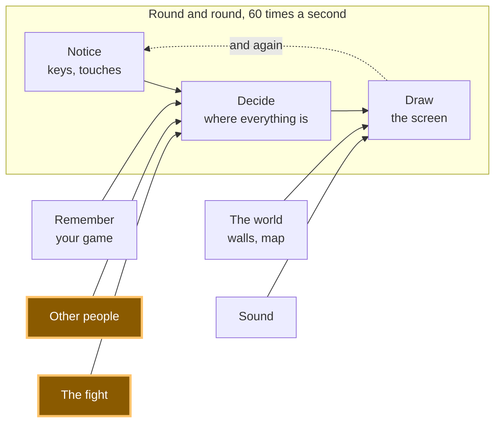

# A21: 戦う相手

あなたのゲームには2人のプレイヤーが必要です。ある晩には1人しかいないこともあります。そこで、あなたは対戦相手を構築します — そして驚くべきことに、対戦コードは全く変更されません。
{: .lesson-intro }

**必要:** [A20](a20.html)。 **得られるもの:** 自分の癖を学習するものを含め、いつでもプレイできるコンピューターの対戦相手。

## ゲーム全体と今日の要素



デモでは両方のファイターを1つのページに表示し、両方がどのように判断するかを見ることができます。実際のゲームでは、[A19](a19.html)からの接続を使用して、人間の対戦相手の動きをネットワーク経由で送信します。コンピューターの対戦相手はネットワークに一切近づきません — それはあなたのコードの中に直接存在します。

## ブロックに分割する

「コンピューターの対戦相手」には2つの側面があり、そのうちの1つだけが興味深いものです。

1.  **選択する方法を与える** — 「あなたの手番は何ですか？」という質問に答える何か。
2.  **対戦コードが誰と戦っているかを気にしないようにする** — コードは質問をし、答えを受け取るだけです。

**なぜ分割するのか？** コンピューターの脳を対戦コードの*内部*に書くと、人間の対戦とコンピューターの対戦という2つの対戦が存在することになります。これらは互いに乖離していくでしょう。一方はバグ修正を受け、もう一方は受けないといったことが起こり、プレイヤーが「コンピューターがズルをしている」と言った日に、2つの異なるルールセットを読まなければならないため、本当にそうなのかどうか分からなくなります。

分離しておけば、1つの対戦と複数のファイターが存在します。そして、対戦を実行することなく、コンピューターの思考を単独で調べることができます。

## ブロック 1: 選択する方法

対戦する誰もが同じ質問に答えます。それを `chooseMove` という関数として記述します。以下に、同じ形をした3つのファイターを示します。

```
// You: your answer is whichever button you last pressed.
const human = { name: 'you', next: null, chooseMove: () => human.next };

// Dice: no memory, no plan, impossible to out-guess.
const dice = {
  name: 'dice',
  chooseMove: () => MOVES[Math.floor(Math.random() * MOVES.length)],
};
```

サイコロの対戦相手は公平ですが、退屈です。何も気づきません。そこで、あなたを観察する対戦相手を紹介します。

```
const watcher = {
  name: 'watcher',
  seen: [],
  remember(move) {
    watcher.seen.push(move);
    if (watcher.seen.length > 5) watcher.seen.shift();
  },
  chooseMove() {
    if (watcher.seen.length === 0 || Math.random() < 0.34) return dice.chooseMove();
    let favourite = watcher.seen[0];
    for (const move of MOVES) {
      const count = (m) => watcher.seen.filter((s) => s === m).length;
      if (count(move) > count(favourite)) favourite = move;
    }
    return MOVES.find((move) => BEATS[move] === favourite);
  },
};
```

ゆっくり読んでください。`seen` はあなたの直近5つの手番です。`push` は末尾に1つ追加し、`shift` は先頭から最も古いものを削除するので、リストは5つより大きく成長することはありません — ウォッチャーはあなたが昔何をしたかを忘れます。そして、どの手番が最も多く出現するかを数え、その手番に勝つものを選択します。

最も重要な行は `Math.random() < 0.34` です。約3ラウンドに1回、ウォッチャーは計画を捨ててサイコロを振ります。**これがないと、ウォッチャーはあなたが操縦できる機械になります。** 数ラウンド後にはそのルールを解明し、毎回勝つことができるでしょう。なぜなら、*そのウォッチャー*がサプライズなしになるからです。ランダム性の下限は、それ自体が予測可能になるのを防ぎます。

それは[A20](a20.html)から別の側面で到達する全体的なアイデアです。最善の手のないゲームでは、読まれることは負けを意味します。

## ブロック 2: 対戦コードは気にしない

```
function playRound(a, b) {
  const mine = a.chooseMove();
  const theirs = b.chooseMove();
  const result = compare(mine, theirs);
  score[result.winner] += 1;
  if (b.remember) b.remember(mine);
  show(mine, theirs, result, b);
}
```

その関数をもう一度読んで、誰と戦っているかを確認する場所を探してください。そのような場所はありません。それは2人のファイターに手番を尋ね、その答えを比較します。`human`、`dice`、`watcher` は内部で完全に異なりますが、`playRound` はそれらを区別できません — なぜなら、決して尋ねないからです。`playRound` が必要とする真実はただ一つ、*そのオブジェクトに対して `chooseMove` を呼び出せること*だけです。

そして、ここに報酬があります。これが[A20](a20.html)からの `compare` です。

```
function compare(mine, theirs) {
  if (mine === theirs) return { winner: 'nobody', why: mine + ' does not beat ' + theirs };
  if (BEATS[mine] === theirs) return { winner: 'you', why: mine + ' beats ' + theirs };
  return { winner: 'them', why: theirs + ' beats ' + mine };
}
```

コンピュータープレイヤーを追加するために、その中の1文字も変更されていません。[A20](a20.html)のバージョンと1行ずつ比較してみてください。それが[A20](a20.html)での分割があなたにもたらしたもの、そして今、あなたは何の作業もせずにそれを受け取っています。

**複数の異なるものがすべて同じ質問に答え、それらを使用するコードがどれがどれであるかを知る必要がない場合、経験豊富なプログラマーはそれを「ポリモーフィズム」（多態性）と呼びます。それは単純な習慣を表す長い言葉です。質問に同意し、それぞれのものが独自のやり方でそれに答えさせる、ということです。**

## このようにした理由

強制的な制約は、ゲーム内の対戦が、ネットワーク経由で手番が届く別のコンピューター上の人物との対戦、またはこのタブで実行されているコードとの対戦である可能性がある、ということです。これら2つは、一方がインターネットに関わり、もう一方が関わらないという点で、可能な限り異なっています。

もし `playRound` がどの種類の相手と対峙しているかを知らなければならないとしたら、タイマー、スコア、アニメーション、[A22](a22.html)の隠蔽など、対戦のあらゆる部分が2つのバージョンを必要とするでしょう。その代わりに、それらすべては `chooseMove` を持つ何かを受け取り、それ以上のことは決して知りません。今日、1つの対戦に3人のファイターがいますが、まだ思いついていない4人目の余地もあります。

## 代わりにできたこと

| これの代わりに | 費用（デメリット） |
|---|---|
| 対戦コード内に `if (opponentIsComputer) { ... } else { ... }` を使う | この `if` は広範囲に及びます。タイマー、スコア、画面にも再度現れます。新しい種類の対戦相手が現れるたびに、それらすべてを修正する必要があることを意味します。 |
| 純粋にランダムなコンピューター対戦相手 | 20行の代わりに4行で済み、完全に公平です。しかし、誰もサイコロを2回はプレイしません — 学ぶことも、打ち負かすことも何もないからです。 |
| 常にあなたの直前の手番に正確に反撃する対戦相手 | 3ラウンドは賢く感じられます。しかし、すぐにそれに気づき、意図的に手番を与えて、その後は毎ラウンド勝ちます。予測可能であることはランダムよりも悪いのです。 |
| あなたがこれまでプレイしたすべての手番を記憶する | ウォッチャーはあなたの過去の平均に固執し、あなたが今していることに反応しなくなります。5回は習慣の変化を追跡するのに十分な短さです。 |

## プロンプト

```
I have a fight in plain JavaScript. Fighters are objects with a chooseMove()
function; playRound(a, b) asks both and calls a pure compare(). I have a
random opponent and one that counts my last five moves. Add a third opponent
that plays the move which would have beaten its own last losing move. Do not
change playRound or compare, and do not add any if-statement about what kind
of opponent it is. Show me only the new object.
```

**出力の確認点:** `playRound` が、追加の引数や新しい対戦相手のチェックで「改善」されて戻ってきていないか？それはあなたがしないようにと求めた唯一のことであり、アシスタントが最もやりがちなことです。また、新しい対戦相手がまだいくらかのランダム性を持っているか確認してください — そうでないと、人間は4ラウンド後には永遠にそれに勝つことができ、それは簡単であるというよりも壊れているように感じられるでしょう。

## 動作を見る


Live Serverでページを開き、以下を実行してください。

1.  ボックスのチェックを**外したまま**、**グー**を24回押します。勝ち、負け、引き分けがほぼ均等に積み重なります。私たちが行ったとき、8勝、7敗、9引き分けという結果でした。そして、サイコロ自身の出した手はグーが9回、パーが7回、チョキが8回で、24回投げる中ではかなり均等な結果となりました。
2.  ボックスにチェックを入れ、ウォッチャーがプレイするようにして、もう一度**グー**を24回押します。結果は厳しいものになります。私たちは**1勝20敗**という結果を得ました — ウォッチャーは私たちが常にグーしか出さないことに気づき、24回中20回パーで応じました。残りの4回は、意図的に保持しているランダム性であり、あなたがしたように予測可能になることはありません。
3.  今度は手番を混ぜてみましょう。スコアは再び拮抗します。ウォッチャーは習慣を罰することしかできません。習慣がなければ、つかむものがありません。
4.  ブラウザのコンソールを開き、`watcher.seen` と入力します。直近5つの手番、つまりウォッチャーの記憶のすべてが表示されます。これは5つの文字列のリストです。私たちの場合、`["rock", "rock", "rock", "rock", "rock"]` と表示され、これはウォッチャーが必要とする情報量と完全に一致しています。

コンソールで分割のポイント2も証明しました。存在しない新しいファイター `{ name: 'stone statue', chooseMove: () => 'paper' }` を作り、それを直接 `playRound` に渡しました。それは完全な1ラウンドをプレイし、画面には「あなたはパーを出しました。サイコロはパーを出しました。」と表示されました。`playRound` は石像が何であるかを一度も知らされませんでした。

## ゲームに組み込む

[A19](a19.html)の対戦画面で、誰もあなたの挑戦を受け入れない場合、代わりに `watcher` とのラウンドを開始してください。タイマー、スコア、画面など、下流のすべては既に機能します。なぜなら、それが誰と戦っているかを一度も尋ねていないからです。

<div class="takeaways">
<h2>重要なポイント</h2>
<ul>
<li>「あなたの手番は何ですか？」という質問に同意し、各ファイターが独自の方法でそれに答えさせること</li>
<li>質問をするコードは、何が答えているのかを知る必要がない。これがポリモーフィズムです</li>
<li>分割する価値があったことの証明は、変更する必要がなかった関数です: `compare` はA20のものと同一です</li>
<li>ルールがあり、ランダム性がない対戦相手は、一度解けば永遠に勝てるパズルです</li>
<li>短い記憶（直近5つの手番）は、これまでの平均ではなく、あなたが今していることに反応します</li>
</ul>
</div>

## あなたの番

ウォッチャーに難易度設定を与えてください。「簡単」では10回中8回サイコロを振り、「難しい」では10回中1回振ります。それぞれの設定で10ラウンドプレイしてください。そして、どの設定が実際に最も倒しにくいかを突き止め — 「難しい」が答えなのか、それともほぼ完璧に予測可能であることが予想よりも簡単にするのかを確認してください。
