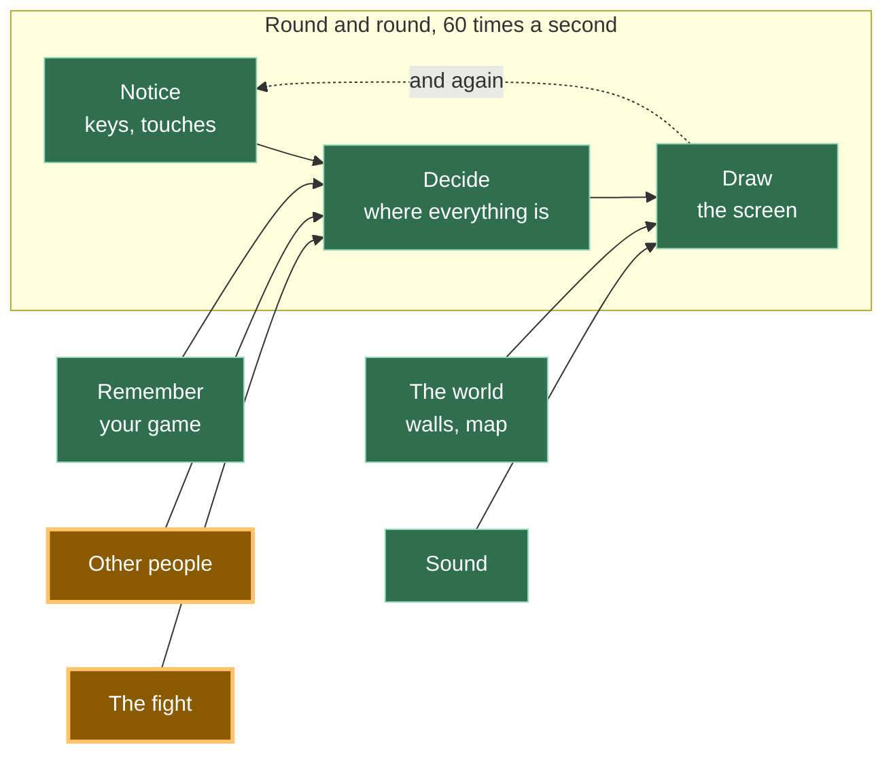

# A21: Someone to Fight

Your game needs two players. Some evenings there is only one. So you build an opponent — and the surprising part is that the fight code does not change at all.
{: .lesson-intro }

**Needs:** [A20](a20.html). **Gives you:** a computer opponent you can play any time, including one that learns your habits.

## The whole game, and today's piece



The demo keeps both fighters on one page, so you can watch both of them decide. The real game sends a human opponent's move over the wire, using the connection from [A19](a19.html). The computer opponent never goes near the network at all — it is sitting right there in your own code.

## Cutting it into blocks

"A computer opponent" is two things, and only one of them is the interesting one:

1. **Give it a way to choose** — something that answers the question "what is your move?"
2. **Make the fight code not care who it is fighting** — it asks the question and takes the answer

**Why bother splitting it?** Because if you write the computer's brain *inside* the fight, you now have two fights: one for humans and one for the computer. They will drift apart. One will get a bug fix the other does not, and the day a player says "the computer cheats", you will not know whether it does, because there are two sets of rules to read.

Kept apart, there is one fight and several fighters. And you can look at the computer's thinking on its own, without a fight running.

## Block 1: A way to choose

Everybody in a fight answers the same question. Write it as a function called `chooseMove`. Here are three fighters, all shaped the same:

```
// You: your answer is whichever button you last pressed.
const human = { name: 'you', next: null, chooseMove: () => human.next };

// Dice: no memory, no plan, impossible to out-guess.
const dice = {
  name: 'dice',
  chooseMove: () => MOVES[Math.floor(Math.random() * MOVES.length)],
};
```

A dice opponent is fair but boring. It never notices anything. So here is one that watches you:

```
const watcher = {
  name: 'watcher',
  seen: [],
  remember(move) {
    watcher.seen.push(move);
    if (watcher.seen.length > 5) watcher.seen.shift();
  },
  chooseMove() {
    if (watcher.seen.length === 0 || Math.random() < 0.34) return dice.chooseMove();
    let favourite = watcher.seen[0];
    for (const move of MOVES) {
      const count = (m) => watcher.seen.filter((s) => s === m).length;
      if (count(move) > count(favourite)) favourite = move;
    }
    return MOVES.find((move) => BEATS[move] === favourite);
  },
};
```

Read it slowly. `seen` is your last five moves. `push` adds one to the end and `shift` drops the oldest off the front, so the list never grows past five — the watcher forgets what you did long ago. Then it counts which move appears most, and picks whichever move beats that one.

The line that matters most is `Math.random() < 0.34`. About one round in three, the watcher throws its plan away and rolls a dice. **Without that, the watcher is a machine you can drive.** You would work out its rule after a few rounds and beat it every single time, because *it* would then be the one with no surprises. A floor of randomness keeps it from becoming predictable itself.

That is the whole idea from [A20](a20.html) arriving from the other side: in a game with no best move, being readable is losing.

## Block 2: The fight code does not care

```
function playRound(a, b) {
  const mine = a.chooseMove();
  const theirs = b.chooseMove();
  const result = compare(mine, theirs);
  score[result.winner] += 1;
  if (b.remember) b.remember(mine);
  show(mine, theirs, result, b);
}
```

Read that function again and look for the place where it checks who it is fighting. There isn't one. It asks two fighters for a move and compares the answers. `human`, `dice` and `watcher` are completely different inside, and `playRound` cannot tell them apart — because it never asks. It only needs one thing to be true: *you can call `chooseMove` on it.*

And here is the reward. This is `compare`, from [A20](a20.html):

```
function compare(mine, theirs) {
  if (mine === theirs) return { winner: 'nobody', why: mine + ' does not beat ' + theirs };
  if (BEATS[mine] === theirs) return { winner: 'you', why: mine + ' beats ' + theirs };
  return { winner: 'them', why: theirs + ' beats ' + mine };
}
```

Not one character of it changed to add a computer player. Compare it with the version in [A20](a20.html), line by line. That is what the split in [A20](a20.html) bought you, and you are collecting it now without doing any work.

**When several different things all answer the same question, and the code using them does not need to know which is which, grown-up programmers call that polymorphism. It is a long word for a simple habit: agree on the question, and let each thing answer it its own way.**

## Why we did it this way

The forcing constraint is that a fight in your game can be against a person on another computer, whose moves arrive over the network, or against code running in this tab. Those two are as different as they could possibly be — one involves the internet, the other does not.

If `playRound` had to know which kind it was facing, every part of the fight — timers, score, animations, [A22](a22.html)'s hiding — would need two versions. Instead, all of them are handed something with a `chooseMove` and never find out more than that. One fight, three fighters today, and room for a fourth you have not thought of.

## What we could have done instead

| Instead of this | What it would cost |
|---|---|
| `if (opponentIsComputer) { ... } else { ... }` inside the fight | That `if` spreads. It appears again in the timer, then the score, then the screen. Every new kind of opponent means hunting all of them down |
| A purely random computer opponent | Four lines instead of twenty, and perfectly fair. But nobody plays a dice twice — there is nothing to learn and nothing to beat |
| An opponent that always counters your last move exactly | Feels clever for three rounds. Then you notice it, feed it a move on purpose, and win every round after that. Predictable is worse than random |
| Remembering every move you have ever played | The watcher would harden into your all-time average and stop reacting to what you are doing now. Five is short enough to follow a change of habit |

## The prompt

```
I have a fight in plain JavaScript. Fighters are objects with a chooseMove()
function; playRound(a, b) asks both and calls a pure compare(). I have a
random opponent and one that counts my last five moves. Add a third opponent
that plays the move which would have beaten its own last losing move. Do not
change playRound or compare, and do not add any if-statement about what kind
of opponent it is. Show me only the new object.
```

**Check the output for:** did `playRound` come back "improved" with an extra argument or a check for the new opponent? That is the one thing you asked it not to do, and it is the thing assistants do most. Also check the new opponent still has some randomness — otherwise a human beats it forever after four rounds, and it will feel broken rather than easy.

## See it work


Open the page with Live Server and:

1. Leave the box **unticked** and press **rock** twenty-four times. Wins, losses and draws all pile up in roughly equal thirds. When we did this we got 8 wins, 7 losses, 9 draws — and the dice's own moves came out rock 9, paper 7, scissors 8, which is about as even as twenty-four throws get.
2. Tick the box, so the watcher is playing, and press **rock** twenty-four times again. It turns brutal. We got **1 win and 20 losses** — the watcher noticed we only ever play rock, and answered with paper 20 times out of 24. The other four are the randomness it keeps on purpose, so it never becomes as predictable as you were.
3. Now mix your moves up. The score gets close again. The watcher can only punish a habit; it has nothing to grip when there is no habit.
4. Open the browser console and type `watcher.seen`. You get your last five moves — the whole of its memory, and it is a list of five strings. Ours read `["rock", "rock", "rock", "rock", "rock"]`, which is exactly as much as it needed to know.

We also proved point 2 of the split in the console. We invented a new fighter that had never existed, `{ name: 'stone statue', chooseMove: () => 'paper' }`, and passed it straight into `playRound`. It played a full round and the screen said "You played paper. The dice played paper." `playRound` was never told what a stone statue is.

## Put it in the game

On the fight screen from [A19](a19.html), when nobody accepts your challenge, start the round against `watcher` instead. Everything downstream — the timer, the score, the screen — already works, because it never asked who it was fighting.

<div class="takeaways">
<h2>Key Takeaways</h2>
<ul>
<li>Agree on the question — "what is your move?" — and let each fighter answer it in its own way</li>
<li>Code that asks a question does not need to know what kind of thing is answering. That is polymorphism</li>
<li>The proof that a split was worth making is a function you did not have to change: <code>compare</code> is identical to A20's</li>
<li>An opponent with a rule and no randomness is a puzzle you solve once and then beat forever</li>
<li>A short memory — the last five moves — reacts to what you are doing now, instead of your all-time average</li>
</ul>
</div>

## Your turn

Give the watcher a difficulty setting. At "easy" it rolls a dice eight times in ten; at "hard", one time in ten. Play ten rounds on each. Then work out which setting is actually hardest to beat — and check whether "hard" is the answer, or whether being nearly perfectly predictable makes it easier than you expected.
