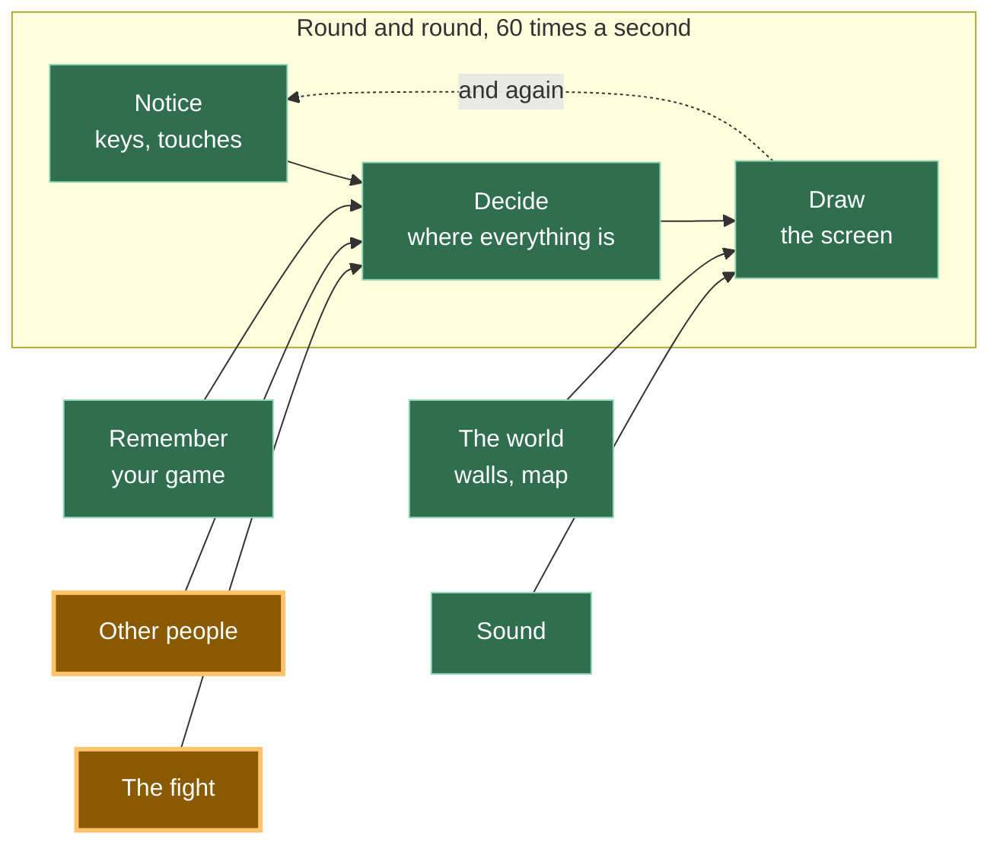

# A21: Alguém para Enfrentar

O seu jogo precisa de dois jogadores. Em algumas noites só tem um. Então você constrói um oponente — e a parte surpreendente é que o código da luta não muda nada.
{: .lesson-intro }

**Precisa de:** [A20](a20.html). **Oferece:** um oponente do computador com quem você pode jogar a qualquer hora, incluindo um que aprende os seus hábitos.

## O jogo completo, e a parte de hoje



A demonstração mantém os dois lutadores em uma página só, para você poder ver os dois decidindo. O jogo de verdade manda a jogada de um oponente humano pela rede, usando a conexão de [A19](a19.html). O oponente do computador nunca chega perto da rede — ele está ali mesmo, dentro do seu próprio código.

## Dividindo em blocos

"Um oponente do computador" são duas coisas, e só uma delas é a interessante:

1. **Dar a ele um jeito de escolher** — algo que responda à pergunta "qual é a sua jogada?"
2. **Fazer o código da luta não se importar com quem ele está enfrentando** — ele faz a pergunta e recebe a resposta

**Por que dividir?** Porque se você escrever o cérebro do computador *dentro* da luta, agora você tem duas lutas: uma para humanos e uma para o computador. Elas vão se separar com o tempo. Uma vai receber um conserto que a outra não recebe, e no dia em que um jogador disser "o computador trapaceia", você não vai saber se ele trapaceia, porque há dois conjuntos de regras para ler.

Mantidos separados, existe uma luta e vários lutadores. E você pode olhar o raciocínio do computador por si só, sem nenhuma luta em andamento.

## Bloco 1: Um jeito de escolher

Todo mundo em uma luta responde à mesma pergunta. Escreva isso como uma função chamada `chooseMove`. Aqui estão três lutadores, todos com a mesma forma:

```
// You: your answer is whichever button you last pressed.
const human = { name: 'you', next: null, chooseMove: () => human.next };

// Dice: no memory, no plan, impossible to out-guess.
const dice = {
  name: 'dice',
  chooseMove: () => MOVES[Math.floor(Math.random() * MOVES.length)],
};
```

Um oponente que joga dado é justo, mas chato. Ele nunca percebe nada. Então aqui está um que fica observando você:

```
const watcher = {
  name: 'watcher',
  seen: [],
  remember(move) {
    watcher.seen.push(move);
    if (watcher.seen.length > 5) watcher.seen.shift();
  },
  chooseMove() {
    if (watcher.seen.length === 0 || Math.random() < 0.34) return dice.chooseMove();
    let favourite = watcher.seen[0];
    for (const move of MOVES) {
      const count = (m) => watcher.seen.filter((s) => s === m).length;
      if (count(move) > count(favourite)) favourite = move;
    }
    return MOVES.find((move) => BEATS[move] === favourite);
  },
};
```

Leia devagar. `seen` são as suas últimas cinco jogadas. `push` acrescenta uma no fim e `shift` joga a mais antiga fora do começo, então a lista nunca passa de cinco — o observador esquece o que você fez muito tempo atrás. Depois ele conta qual jogada aparece mais e escolhe a jogada que ganha daquela.

A linha que mais importa é `Math.random() < 0.34`. Em cerca de uma rodada a cada três, o observador joga o plano dele no lixo e joga um dado. **Sem isso, o observador é uma máquina que você consegue dirigir.** Você descobriria a regra dele depois de algumas rodadas e ganharia todas as vezes, porque então *ele* seria o previsível. Um piso de sorteio impede que ele mesmo fique previsível.

Essa é a ideia inteira de [A20](a20.html) chegando pelo outro lado: em um jogo sem jogada melhor, ser fácil de ler é perder.

## Bloco 2: O código da luta não se importa

```
function playRound(a, b) {
  const mine = a.chooseMove();
  const theirs = b.chooseMove();
  const result = compare(mine, theirs);
  score[result.winner] += 1;
  if (b.remember) b.remember(mine);
  show(mine, theirs, result, b);
}
```

Leia essa função de novo e procure o lugar onde ela confere quem está enfrentando. Não existe. Ela pede uma jogada a dois lutadores e compara as respostas. `human`, `dice` e `watcher` são completamente diferentes por dentro, e o `playRound` não consegue distingui-los — porque nunca pergunta. Ele só precisa que uma coisa seja verdade: *dá para chamar `chooseMove` nele.*

E aqui está a recompensa. Este é o `compare`, de [A20](a20.html):

```
function compare(mine, theirs) {
  if (mine === theirs) return { winner: 'nobody', why: mine + ' does not beat ' + theirs };
  if (BEATS[mine] === theirs) return { winner: 'you', why: mine + ' beats ' + theirs };
  return { winner: 'them', why: theirs + ' beats ' + mine };
}
```

Nenhum caractere dele mudou para adicionar um jogador de computador. Compare com a versão em [A20](a20.html), linha por linha. Foi isso que a divisão de [A20](a20.html) comprou para você, e você está recebendo agora sem fazer trabalho nenhum.

**Quando várias coisas diferentes respondem à mesma pergunta, e o código que as usa não precisa saber qual é qual, programadores adultos chamam isso de polimorfismo. É uma palavra comprida para um hábito simples: combine a pergunta e deixe cada coisa responder do seu próprio jeito.**

## Por que fizemos isso desta forma

A restrição que obriga isso é que uma luta no seu jogo pode ser contra uma pessoa em outro computador, cujas jogadas chegam pela rede, ou contra código rodando nesta aba. Esses dois casos são o mais diferentes que poderiam ser — um envolve a internet, o outro não.

Se o `playRound` tivesse que saber com qual tipo estava lidando, cada parte da luta — cronômetros, placar, animações, o esconder de [A22](a22.html) — precisaria de duas versões. Em vez disso, todas elas recebem algo com um `chooseMove` e nunca descobrem mais nada além disso. Uma luta, três lutadores hoje, e espaço para um quarto em que você ainda não pensou.

## O que poderíamos ter feito em vez disso

| Em vez disso | O que custaria |
|---|---|
| `if (opponentIsComputer) { ... } else { ... }` dentro da luta | Esse `if` se espalha. Ele aparece de novo no cronômetro, depois no placar, depois na tela. Cada tipo novo de oponente significa caçar todos eles |
| Um oponente de computador totalmente aleatório | Quatro linhas em vez de vinte, e perfeitamente justo. Mas ninguém joga contra um dado duas vezes — não há nada para aprender e nada para vencer |
| Um oponente que sempre responde exatamente à sua última jogada | Parece inteligente por três rodadas. Depois você percebe, entrega uma jogada de propósito e ganha todas as rodadas seguintes. Previsível é pior que aleatório |
| Guardar todas as jogadas que você já fez | O observador endureceria na sua média de todos os tempos e pararia de reagir ao que você está fazendo agora. Cinco é curto o bastante para acompanhar uma mudança de hábito |

## O prompt

```
I have a fight in plain JavaScript. Fighters are objects with a chooseMove()
function; playRound(a, b) asks both and calls a pure compare(). I have a
random opponent and one that counts my last five moves. Add a third opponent
that plays the move which would have beaten its own last losing move. Do not
change playRound or compare, and do not add any if-statement about what kind
of opponent it is. Show me only the new object.
```

**Verifique na resposta:** o `playRound` voltou "melhorado", com um argumento extra ou uma verificação para o oponente novo? Essa é a única coisa que você pediu para ele não fazer, e é a que os assistentes mais fazem. Confira também se o oponente novo ainda tem algum sorteio — senão um humano ganha dele para sempre depois de quatro rodadas, e ele vai parecer quebrado em vez de fácil.

## Veja funcionar


Abra a página com o Live Server e:

1. Deixe a caixinha **desmarcada** e aperte **rock** vinte e quatro vezes. Vitórias, derrotas e empates se acumulam em terços mais ou menos iguais. Quando fizemos isso, tivemos 8 vitórias, 7 derrotas e 9 empates — e as jogadas do próprio dado saíram rock 9, paper 7, scissors 8, que é quase tão parelho quanto vinte e quatro lançamentos conseguem ser.
2. Marque a caixinha, para o observador entrar em jogo, e aperte **rock** vinte e quatro vezes de novo. Fica brutal. Tivemos **1 vitória e 20 derrotas** — o observador notou que a gente só joga rock e respondeu com paper 20 das 24 vezes. As outras quatro são o sorteio que ele mantém de propósito, para nunca ficar tão previsível quanto você estava.
3. Agora misture as suas jogadas. O placar volta a ficar equilibrado. O observador só consegue punir um hábito; ele não tem onde se segurar quando não há hábito.
4. Abra o console do navegador e digite `watcher.seen`. Você recebe as suas últimas cinco jogadas — a memória inteira dele, e é uma lista de cinco textos. A nossa dizia `["rock", "rock", "rock", "rock", "rock"]`, que é exatamente tudo o que ele precisava saber.

Também provamos o ponto 2 da divisão no console. Inventamos um lutador novo que nunca havia existido, `{ name: 'stone statue', chooseMove: () => 'paper' }`, e o passamos direto para o `playRound`. Ele jogou uma rodada inteira e a tela disse "You played paper. The dice played paper." Ninguém nunca contou ao `playRound` o que é uma estátua de pedra.

## Coloque no jogo

Na tela de luta de [A19](a19.html), quando ninguém aceitar o seu desafio, comece a rodada contra o `watcher`. Tudo o que vem depois — o cronômetro, o placar, a tela — já funciona, porque nunca perguntou quem estava enfrentando.

<div class="takeaways">
<h2>Principais Pontos</h2>
<ul>
<li>Combine a pergunta — "qual é a sua jogada?" — e deixe cada lutador respondê-la do seu próprio jeito</li>
<li>Código que faz uma pergunta não precisa saber que tipo de coisa está respondendo. Isso é polimorfismo</li>
<li>A prova de que uma divisão valeu a pena é uma função que você não precisou mudar: o <code>compare</code> é idêntico ao de A20</li>
<li>Um oponente com uma regra e sem sorteio é um enigma que você resolve uma vez e depois vence para sempre</li>
<li>Uma memória curta — as últimas cinco jogadas — reage ao que você está fazendo agora, em vez da sua média de todos os tempos</li>
</ul>
</div>

## Sua vez

Dê ao observador um ajuste de dificuldade. No "fácil" ele joga o dado oito vezes em dez; no "difícil", uma vez em dez. Jogue dez rodadas em cada. Depois descubra qual ajuste é de fato o mais difícil de vencer — e confira se "difícil" é a resposta, ou se ser quase perfeitamente previsível o torna mais fácil do que você esperava.
