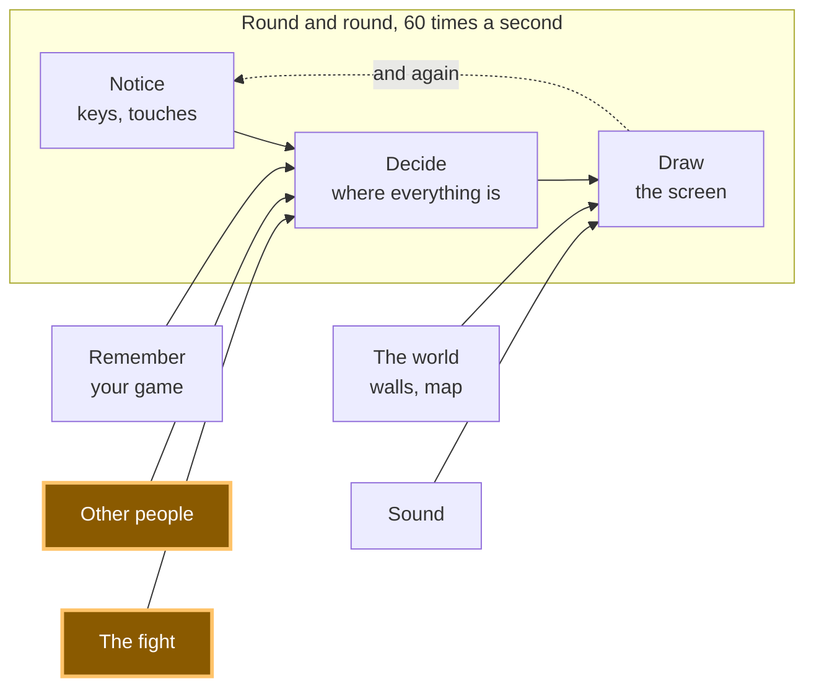

# A22: のぞき見なし

プレイヤーは2人、審判はいません。では、あなたの手を見てから自分の手を決める人を、どうやって止めますか。2人とも紙に書いて、折ってから、そのあとで開くのです。
{: .lesson-intro }

> **このステップは任意です。そして、私たちが作ったゲームはこれをやっていません。**
>
> 私たちのゲームは、あなたの手をそのまま相手に送ります。つまり、先に手が届いたほうは、ある意味で自分の手をさらしているということです。そしてコードを開いて書きかえた人なら、それに答えることができてしまいます。私たちはそれでよいと決めました。これは友達数人で遊ぶゲームですし、ずるをするほうが、勝つより手間がかかるからです。
>
> このステップがここにあるのは、**問題が本物で、解き方が美しいから**です。それに、人がうそをつく理由があるものを作るときには、必ずまたこの問題に出会います。飛ばしても、あとで何も壊れません。気になったときに、また戻ってきてください。

**必要なもの:** [A20](a20.html)。**得られるもの:** のぞき見では勝てないラウンドと、本物の投票のしくみや宝くじで使われている考え方。

## ゲーム全体と今日の部分



本物のゲームでは、これらのメッセージは[A19](a19.html)で作った接続を通って、線の向こうに送られます。ここでは2人のプレイヤーが1つのページの中にいるので、全体を一度に見られます。ずるをするところも含めて。

## まずはテーブルの上での問題

あなたと友達が、テーブルをはさんでじゃんけんをします。もし友達が、自分が出す前にあなたの手を見られるとしたら、友達は毎回勝ちます。だから2人ともグーの形で出して、「3」で開くのです。

では、その友達を別のパソコンに置いてみましょう。あなたの手は、メッセージとして相手まで運ばれないといけません。先に送ったほうは自分の手をさらしていて、もう片方は、それに勝つ手をただ選ぶだけでよくなります。そして、それが起きたことを証明できる人はいません。**このゲームには、2つの手をあずかって同時に開いてくれるサーバーがありません。** それがこの設計のねらいそのもので、だからこの問題は、あなたが解く問題なのです。

折った紙のやり方は、うまくいきます。自分の手を書いて、折って、テーブルに置き、両方の紙が置かれてから開く。必要なのは、文字でできた紙を折る方法です。

## ブロックに分割する

1. **かくす** — 自分の手を、何も証明せず、何も明かさないものに変える
2. **同時に見せる** — 折った紙が両方テーブルに置かれるまで、だれも開かない
3. **確かめる** — だれかが見せた手が、本当にその人が折った手かどうかを確認する

**なぜわざわざ分けるのでしょう。** この3つは、まったくちがう形で失敗しますし、1つのかたまりだったら、どれが失敗したのか分からないからです。かくし方が下手なら、相手はあなたの手を読めます。早く見せてしまえば、相手は当てる必要がありません。確かめなければ、相手は1つの手を折って、別の手を見せられます。デモには最後の1つのためのボタンがあるので、確認が仕事をするところを見られます。

ここは、だれでも最初はこんがらがります。2回読んでください。このコース全体で、いちばん美しい考え方です。

## ブロック1: かくす

ある文字列の**指紋**とは、その文字列から計算された、決まった長さの文字の並びです。同じ文字列は、いつでも同じ指紋になります。そして指紋から元の文字列に、さかのぼる方法はありません。ブラウザには、これがはじめから入っています。

```
async function fingerprint(text) {
  const bytes = new TextEncoder().encode(text);
  const digest = await crypto.subtle.digest('SHA-256', bytes);
  return [...new Uint8Array(digest)].map((b) => b.toString(16).padStart(2, '0')).join('');
}
```

`SHA-256`は、その計算のやり方の名前です。返ってくるのは32個の数字で、最後の行がそれぞれを2文字に変えます。だから、元の文字列がどれだけ長くても、いつでも同じ64文字になります。

`async`と`await`があるのは、これに少し時間がかかり、そのあいだブラウザがページを止めるのをいやがるからです。`fingerprint`を呼ぶものはすべて、`await`もつけないといけません。

さて、ここが大事なところです。**手は3つしかありません。** もし`'rock'`だけの指紋を送ったら、ずるをする人は自分で`'rock'`と`'paper'`と`'scissors'`の指紋を計算して（3回、10秒です）、どれがあなたのと同じか見られてしまいます。折った紙は、すかすかの透明になります。

だから、だれにも当てられない秘密を混ぜます。

```
function randomSecret() {
  const bytes = crypto.getRandomValues(new Uint8Array(8));
  return [...bytes].map((b) => b.toString(16).padStart(2, '0')).join('');
}

async function fold(move) {
  const secret = randomSecret();
  return { move, secret, folded: await fingerprint(move + ':' + secret) };
}
```

`crypto.getRandomValues`は、本当に当てられないでたらめな数でリストを埋めます。これでためすものは3つではなく、100万×100万×100万より多くなります。全部ためすのは、もう作戦になりません。

送るのは`folded`です。`move`と`secret`は、今のところ自分だけが持っています。

> **これには安全なコンテキストが必要です。** `crypto.subtle`は、ブラウザが安全だと考えるページにしか渡されません。`https`の住所か、`http://localhost`です。Live Serverは`localhost`をくれるので、これで動きます。それが[A09](a09.html)でLive Serverを入れてもらった理由の1つです。別のやり方でファイルを開いても同じように動く、とは思わないでください。サーバーで配れば、悩むことがなくなります。

## ブロック2: 同時に見せる

```
let you = null;
let them = null;

async function reveal() {
  const yourShown = { move: you.move, secret: you.secret };
  const theirShown = { move: them.move, secret: them.secret };
  ...
}
```

ルールは1文です。**両方の指紋が届くまで、だれも自分の手を送らない。** デモではクリック1回です。2人のプレイヤーがこのページの中にいるからです。本物のゲームでは、それぞれが自分の指紋を送り、相手の指紋を待って、それからやっと手と秘密を送ります。

その時点では、もう気を変えるには遅すぎます。あなたの指紋はすでに相手の手元にあり、そのあとで別の手だと言っても、指紋と合いません。

## ブロック3: 確かめる

```
async function check(shown, folded) {
  return (await fingerprint(shown.move + ':' + shown.secret)) === folded;
}
```

これで全部です。相手が見せてきた手と秘密を受け取り、本来やるべきだったのとまったく同じやり方でもう一度指紋を計算し、前に送られてきた指紋とくらべます。同じなら正直。ちがえば、あなたの手を見てから自分の手を入れかえた、ということです。

これは[A20](a20.html)の`compare`と同じで、純粋なブロックです。値を入れて、trueかfalseが出てくるだけ。何にもふれません。2人のプレイヤーが両方これを実行して、両方が同じ答えを得ます。うったえる相手がいないときに、まさに必要なものです。

これは、働いているところが見えないブロックです。みんなが正直なら、`check`はいつもtrueを返し、何も起きません。それは、安全のためのコードが仕事をしているときの、ちょうどそのままの見た目です。これが役に立っているところを見るには、わざとうそをつかないといけません。このステップのいちばん下の「あなたの番」がお願いしているのは、それです。

## なぜこの方法にしたのか

決め手になった制約は、**サーバーがない**ことです。ほとんどのゲームでは、会社のコンピューターが両方の手をあずかって同時に開き、あなたはその会社を信じます。あなたのゲームには会社も審判もいません。2台のパソコンが分け合っているのはメッセージだけで、どちらも何についてでもうそをつけます。

だから、信じるのではなく、うそが通らないようにします。さかのぼれない指紋なら、早く送っても何もばれません。にせものを作れない指紋なら、あとで手を変えても、計算によって毎回つかまります。*大人のプログラマーはこれをコミット・リビール方式と呼び、ゲームの外でも、オークションや投票で使われています。*

## 代わりにできたこと

| この代わりに | その代償 |
|---|---|
| 先に送ったほうが、そのまま先に送る | 手間ゼロで、完全に壊れています。2番目のプレイヤーは、1番目の手を読んでそれに答えるだけで、毎回勝ちます |
| 片方のプレイヤーのパソコンが決めて、もう片方に伝える | 自分の試合の審判を、片方のプレイヤーがやることになります。しかも、その人がずるをしたかどうかさえ分かりません |
| 秘密なしで、手の指紋だけを取る | ありうる手は3つだけです。だれでも3つ全部の指紋を計算して、数秒であなたの手を読めます |
| 両方の手をあずかる、小さなサーバーを置く | 動きますし、ほとんどのゲームはそうしています。でもお金がかかり、世話が必要で、それが止まるとゲームも止まります。あなたのゲームは、真ん中に何もなくても動きつづけます |

## プロンプト

```
In plain JavaScript with no libraries, I have a fight where each side picks
rock, paper or scissors. Add commit-reveal with crypto.subtle SHA-256: a fold()
that hashes the move with a random secret, a reveal step that only runs once
both hashes exist, and a pure check(shown, folded) returning true or false.
Then add a button that reveals a move that was never folded, so I can see the
check fail. Keep check() free of DOM code. Warn me about anything that needs
a secure context.
```

**出力を確認すること:** 「ずる」ボタンは、いつも本当に、折った手とちがう手を見せますか。私たちのは最初そうではありませんでした。あなたに勝つ手を見せるようにしていたのですが、それは相手がすでに折っていた手であることもあり、そうなると確認は通ってしまい、3回に1回くらい何もつかまりませんでした。それに`check`が、手*と*秘密を、つなげたときと同じ順番でもう一度指紋にしているかも確かめてください。順番をまちがえると、正直なラウンドが全部ずるとして報告されます。

## 動作を確認する


Live Serverでページを開いて、次をやってみましょう。

1. **scissors**を押します。長い指紋が2つ出ます。どちらも、どちらの手についても何も教えてくれません。それがねらいです。
2. **Unfold both**を押します。両方の手が出て、そのラウンドが数えられます。確認の結果を読み取ると`{ youHonest: true, theyHonest: true }`で、判定は「A draw.」、指紋は両方一致していました。
3. コンソールを開いて`lastCheck`と打ちます。両方の手、両方の秘密、そして`youHonest: true, theyHonest: true`が返ってきます。確認が飛ばされたのではなく、実行されて通ったという証拠です。
4. 同じ手を2回押して、2つの指紋をくらべてください。毎回ちがいます。秘密が毎回新しいからです。ずるをする人には、あなたが同じ手を2回出したのかどうかさえ分かりません。

## ゲームに組み込む

**やりたい場合だけです。** 私たちのゲームはこれをやっていないので、これはコースが必要としている変更ではなく、あなたが自分で選んでする変更です。

[A20](a20.html)の対戦で、手のかわりに`folded`を送ります。相手のを待ちます。それから`{ move, secret }`を送り、返ってきたものに`check`をかけて、それから`compare`に何かを決めさせます。確認がfalseなら、勝者なしです。そのラウンドは捨てられ、だれの点数も入りません。

見た目より手間がかかることは、覚えておいてください。1ラウンドあたりのメッセージが1つではなく2つになり、ラウンドが止まる新しい原因も生まれます。だれかが折ったまま、一度も開かない場合です。だから下の「あなたの番」では、時計をお願いしています。**だれもやりそうにないずると、そのコストをてんびんにかけること。それこそが、このコース全体のテーマです。** そして、口に出して言える理由があって何かを作らないと決めるのは、本物の答えです。

<div class="takeaways">
<h2>主なポイント</h2>
<ul>
<li>だれかが手を見せる前に、自分の手を折っておきましょう。まず指紋を送り、手はそのあとです</li>
<li>指紋は、同じ文字列からはいつでも同じものが出てきて、さかのぼって読むことはできません</li>
<li>ありうる手が3つしかないと、秘密を混ぜていない指紋は、3回で当てられてしまいます</li>
<li>ずるを止めるのに審判は必要ありません。必要なのは、それをつかまえる確認です。計算はどちらの味方もしません</li>
<li><code>crypto.subtle</code>には安全なコンテキストが必要で、Live Serverの<code>http://localhost</code>がそれをくれます</li>
</ul>
</div>

## あなたの番

**わざとうそをついてみましょう。** ラウンドを1回遊んだあと、コンソールで、見せる手を、折った手とはちがうものに変えて、もう一度確認します。

```
const faked = { move: 'rock', secret: lastCheck.theirShown.secret };
await check(faked, lastCheck.theirShown === lastCheck.yourShown ? null : them.folded);
```

`false`が返ってくるはずです。それが、このブロックが役に立っていることそのものです。`false`が返るのを見るまでは、あなたはこのブロックが自分に同意するところしか見ていません。

そのあと、もっとむずかしいものをやりたければ、時計を足しましょう。両方の指紋が置かれてから10秒以内に手を見せない人がいたら、そのラウンドを捨てます。なぜそれが必要なのかを考えてみてください。手を折って、そのまま見せないことで、プレイヤーは何を得るのでしょう。
