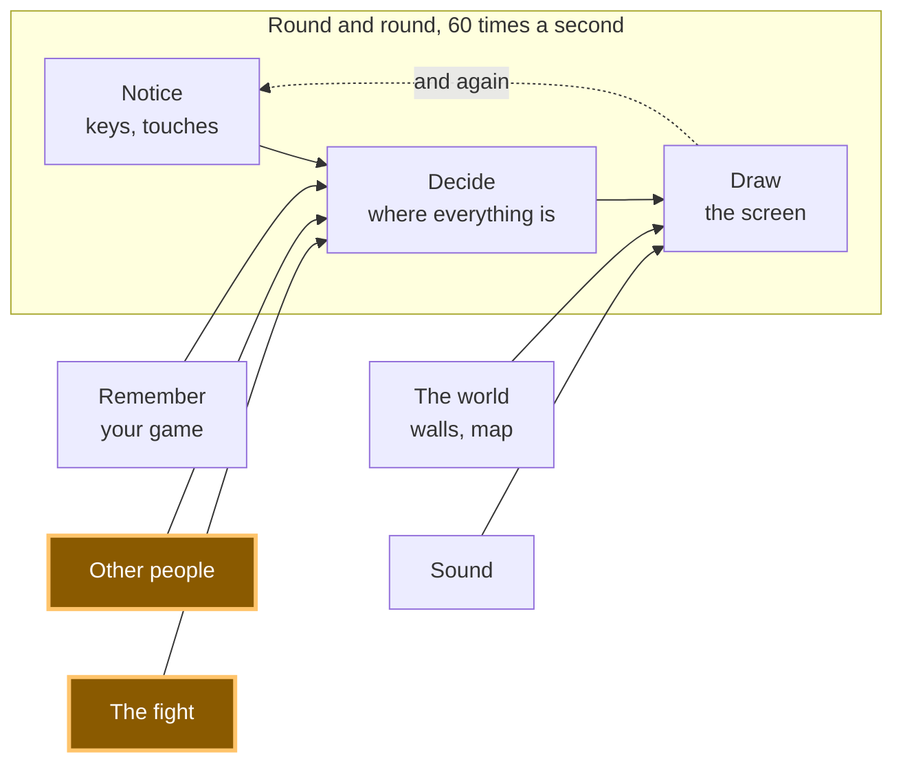

# A22: No Peeking

Two players, no referee. So how do you stop someone waiting to see your move before choosing theirs? You both write it down, fold the paper, and only then unfold.
{: .lesson-intro }

**Needs:** [A20](a20.html). **Gives you:** a round nobody can win by peeking — and a "try to cheat" button that gets caught.

## The whole game, and today's piece



The real game sends these messages over the wire, using the connection from [A19](a19.html). Here both players are on one page so you can see the whole thing at once — including the cheating.

## The problem, on paper first

You and a friend play fire, water, earth across a table. If your friend can see your hand before they move, they win every round. So you both put a fist out and open on three.

Now put your friend on another computer. Your move has to travel to them as a message. Whoever sends first has shown their hand, and the other one can simply pick the move that beats it. Nobody can prove it happened. **There is no server in this game to hold both moves and open them together** — that is the whole point of the design, and it is why this problem is yours to solve.

The paper trick works: write your move down, fold it, put it on the table, and only unfold when both papers are down. What you need is a way to fold a piece of paper made of text.

## Cutting it into blocks

1. **Hide** — turn your move into something that proves nothing and reveals nothing
2. **Show both at once** — nobody unfolds until both folded papers are on the table
3. **Check** — make sure the move someone showed is really the one they folded

**Why bother splitting it?** Because these three fail in completely different ways, and if they were one lump you could not tell which one failed. Hiding badly means the other player can read your move. Showing too early means they never had to guess. Not checking means they can fold one move and show another. The demo has a button for that last one, so you can watch the check do its job.

This part is confusing for everyone the first time. Read it twice. It is the most beautiful idea in the whole track.

## Block 1: Hide

A **fingerprint** of some text is a fixed string of characters worked out from it. The same text always gives the same fingerprint, and there is no way to work backwards from the fingerprint to the text. The browser has this built in:

```
async function fingerprint(text) {
  const bytes = new TextEncoder().encode(text);
  const digest = await crypto.subtle.digest('SHA-256', bytes);
  return [...new Uint8Array(digest)].map((b) => b.toString(16).padStart(2, '0')).join('');
}
```

`SHA-256` is the name of the recipe. It gives back 32 numbers; the last line turns each into two characters, so you always end up with the same 64 characters no matter how long the text was.

`async` and `await` are there because this takes a moment and the browser refuses to freeze the page while it happens. Anything that calls `fingerprint` has to `await` it too.

Now the important part. **Three moves is not many.** If you sent the fingerprint of just `'fire'`, a cheat could fingerprint `'fire'`, `'water'` and `'earth'` themselves — three tries, ten seconds — and see which one matches yours. The fold would be transparent.

So mix in a secret nobody can guess:

```
function randomSecret() {
  const bytes = crypto.getRandomValues(new Uint8Array(8));
  return [...bytes].map((b) => b.toString(16).padStart(2, '0')).join('');
}

async function fold(move) {
  const secret = randomSecret();
  return { move, secret, folded: await fingerprint(move + ':' + secret) };
}
```

`crypto.getRandomValues` fills the list with proper unguessable randomness. Now there are not three things to try — there are more than a million million million. Trying them all is not a plan.

You send `folded`. You keep `move` and `secret` to yourself, for now.

> **This needs a secure context.** `crypto.subtle` is only handed to pages the browser considers safe: an `https` address, or `http://localhost`. Live Server gives you `localhost`, so it works — that is one of the reasons [A09](a09.html) had you install it. Do not assume opening the file some other way will behave the same; serve it and you never have to wonder.

## Block 2: Show both at once

```
let you = null;
let them = null;

async function reveal() {
  const yourShown = { move: you.move, secret: you.secret };
  const theirShown = { move: them.move, secret: them.secret };
  ...
}
```

The rule is one sentence: **nobody sends their move until both fingerprints have arrived.** In the demo that is one click, because both players are on this page. In the real game each side sends its fingerprint, waits for the other one, and only then sends the move and the secret.

By that moment it is too late to change your mind. Your fingerprint is already in their hands, and any other move you now claim will not match it.

## Block 3: Check

```
async function check(shown, folded) {
  return (await fingerprint(shown.move + ':' + shown.secret)) === folded;
}
```

That is the whole thing. Take the move and secret they showed you, fingerprint them again exactly the way they should have, and compare with the fingerprint they sent before. Same, honest. Different, they swapped their move after seeing yours.

Notice this is a pure block, like `compare` in [A20](a20.html): values in, true or false out, nothing touched. Both players run it and both get the same answer, which is exactly what you need when there is nobody to appeal to.

The demo's red button reveals a move that was never folded, so you can watch this line catch it.

## Why we did it this way

The forcing constraint: **there is no server.** In most games a company's computer holds both moves and opens them at the same time, and you trust the company. Your game has no company and no referee. The only thing two computers share is messages, and either one could lie about anything.

So instead of trusting, you make lying not work. A fingerprint you cannot reverse means sending it early gives nothing away; a fingerprint you cannot fake means changing your move afterwards is caught, every time, by arithmetic. *Grown-up programmers call this commit–reveal, and it is used far outside games — in auctions and in voting.*

## What we could have done instead

| Instead of this | What it would cost |
|---|---|
| Whoever sends first, sends first | Free, and completely broken. The second player wins every round by reading the first move and answering it |
| One player's computer decides and tells the other | Now one player is the referee in their own match. You cannot even tell whether they cheated |
| Fingerprint the move with no secret | Only three possible moves. Anyone can fingerprint all three and read yours in seconds |
| A tiny server holding both moves | It works, and it is what most games do. But it costs money, it needs looking after, and the game stops when it does. Yours keeps running with nothing in the middle |

## The prompt

```
In plain JavaScript with no libraries, I have a fight where each side picks
fire, water or earth. Add commit-reveal with crypto.subtle SHA-256: a fold()
that hashes the move with a random secret, a reveal step that only runs once
both hashes exist, and a pure check(shown, folded) returning true or false.
Then add a button that reveals a move that was never folded, so I can see the
check fail. Keep check() free of DOM code. Warn me about anything that needs
a secure context.
```

**Check the output for:** does the "cheat" button always reveal a move that is genuinely different from the folded one? Ours did not at first — it revealed the move that beats yours, which is sometimes the move the opponent had already folded, so the check passed and nothing was caught about one press in three. Also check that `check` refingerprints the move *and* the secret in the same order they were joined; get the order wrong and every honest round is reported as cheating.

## See it work


Open the page with Live Server and:

1. Press **fire**. Two long fingerprints appear. Neither of them tells you anything about either move — that is the point.
2. Press **Unfold both**. Both moves appear and the round counts. We read the checking result back and got `{ youHonest: true, theyHonest: true }`, with the verdict "A draw." and both fingerprints matching.
3. Press a move again, then press **Try to cheat**. The screen says **"Caught cheating!"** We read the same result back and got `{ youHonest: true, theyHonest: false }`: the opponent had folded `earth` and showed `water`.
4. Press the same move twice and look at the two fingerprints. They are different every time, because the secret is new every time. A cheat cannot even tell whether you played the same move twice.

## Put it in the game

In the fight from [A20](a20.html), send `folded` instead of the move. Wait for theirs. Then send `{ move, secret }`, and run `check` on what comes back before you let `compare` decide anything. If the check says false, no winner — the round is thrown away and nobody scores.

<div class="takeaways">
<h2>Key Takeaways</h2>
<ul>
<li>Fold your move before anyone shows theirs: send a fingerprint first, the move second</li>
<li>A fingerprint always comes out the same for the same text, and cannot be read backwards</li>
<li>With only three possible moves, a fingerprint with no secret mixed in can be guessed in three tries</li>
<li>You do not need a referee to stop cheating — you need a check that catches it, and arithmetic does not take sides</li>
<li><code>crypto.subtle</code> needs a secure context, which is what <code>http://localhost</code> from Live Server gives you</li>
</ul>
</div>

## Your turn

Add a clock. If someone does not send their move within ten seconds of both fingerprints being down, the round is thrown away. Then work out why this is needed at all: what does a player gain by folding a move and then never unfolding it, and what would they do it for?
