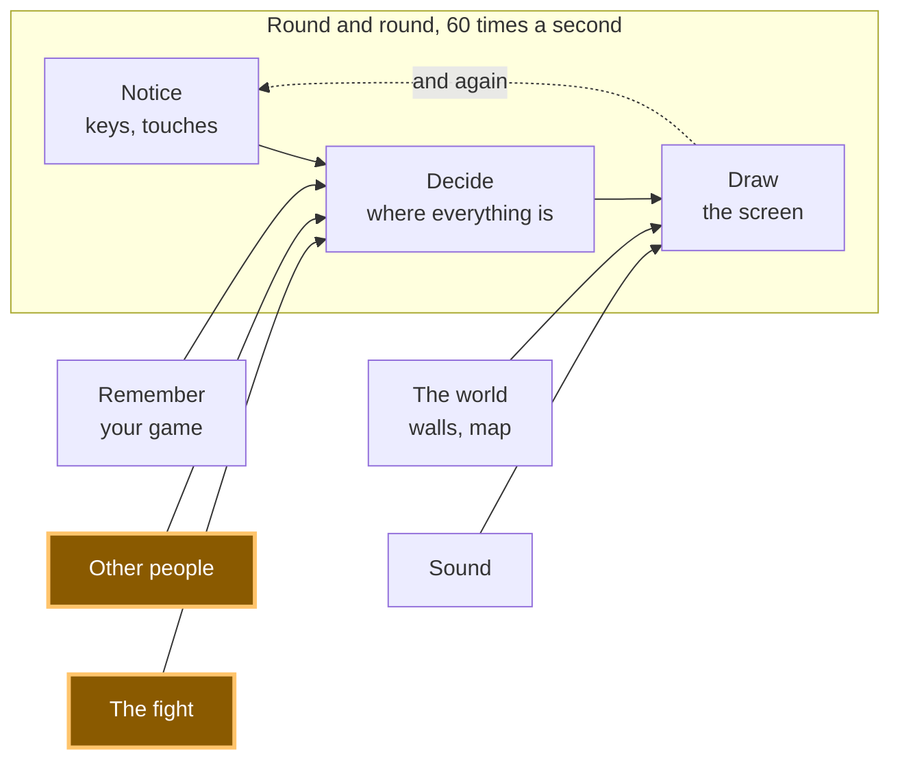

# A22: Sem Espiar

Dois jogadores, sem árbitro. Então, como impedir que alguém espere para ver seu movimento antes de escolher o dele? Ambos escrevem, dobram a nota e só então desdobram.
{: .lesson-intro }

> **Este passo é opcional e o jogo que construímos não o implementa.**
>
> Nosso jogo envia seu movimento diretamente. Isso significa que quem envia o movimento primeiro, de certa forma, revelou sua jogada — e alguém que abrisse o código e o editasse poderia responder a isso. Decidimos que estava tudo bem: é um jogo para alguns amigos, e trapacear exige mais esforço do que vencê-lo.
>
> Este passo está aqui porque **o problema é real e a solução é bonita**, e porque você o encontrará novamente no momento em que construir algo onde as pessoas tenham um motivo para mentir. Pule-o e nada se quebrará depois. Volte a ele quando estiver curioso.

**Requer:** [A20](a20.html). **Oferece:** uma rodada que ninguém pode vencer espiando, e uma ideia usada por sistemas de votação e loterias reais.

## O jogo completo e a peça de hoje



O jogo real envia essas mensagens pela rede, usando a conexão de [A19](a19.html). Aqui, ambos os jogadores estão em uma única página para que você possa ver tudo de uma vez — incluindo a trapaça.

## O problema, primeiro em uma mesa

Você e um amigo jogam pedra, papel, tesoura em uma mesa. Se seu amigo puder ver sua mão antes de jogar, ele ganha todas as rodadas. Então, vocês dois estendem um punho e abrem na contagem de três.

Agora coloque seu amigo em outro computador. Seu movimento precisa viajar até ele como uma mensagem. Quem envia primeiro mostra a mão, e o outro pode simplesmente escolher o movimento que o vence. Ninguém pode provar que isso aconteceu. **Não há um servidor neste jogo para guardar ambos os movimentos e abri-los juntos** — esse é o objetivo de todo o design, e é por isso que este problema é seu para resolver.

O truque da nota dobrada funciona: anote seu movimento, dobre-o, coloque-o na mesa e só desdobre quando ambas as notas estiverem lá. O que você precisa é de uma maneira de dobrar uma nota feita de texto.

## Dividindo em blocos

1. **Esconder** — transformar seu movimento em algo que não prova nada e não revela nada
2. **Mostrar ambos de uma vez** — ninguém desdobra até que ambas as notas dobradas estejam na mesa
3. **Verificar** — certificar-se de que o movimento que alguém mostrou é realmente aquele que dobrou

**Por que se preocupar em dividir?** Porque esses três falham de maneiras completamente diferentes, e se fossem um bloco único, você não conseguiria dizer qual falhou. Esconder mal significa que o outro jogador pode ler seu movimento. Mostrar muito cedo significa que eles nunca tiveram que adivinhar. Não verificar significa que eles podem dobrar um movimento e mostrar outro. A demonstração tem um botão para essa última opção, para que você possa ver a verificação fazer seu trabalho.

Esta parte é confusa para todos na primeira vez. Leia-a duas vezes. É a ideia mais bonita de todo o curso.

## Bloco 1: Esconder

Uma **impressão digital** de um texto é uma string fixa de caracteres derivada dele. O mesmo texto sempre gera a mesma impressão digital, e não há como retroceder da impressão digital para o texto. O navegador já tem isso embutido:

```
async function fingerprint(text) {
  const bytes = new TextEncoder().encode(text);
  const digest = await crypto.subtle.digest('SHA-256', bytes);
  return [...new Uint8Array(digest)].map((b) => b.toString(16).padStart(2, '0')).join('');
}
```

`SHA-256` é o nome da receita. Ele retorna 32 números; a última linha transforma cada um em dois caracteres, então você sempre acaba com os mesmos 64 caracteres, não importa o quão longo seja o texto.

`async` e `await` estão lá porque isso leva um momento e o navegador se recusa a congelar a página enquanto acontece. Qualquer coisa que chame `fingerprint` também precisa `await`á-lo.

Agora a parte importante. **Três movimentos não são muitos.** Se você enviasse a impressão digital apenas de `'rock'`, um trapaceiro poderia gerar as impressões digitais de `'rock'`, `'paper'` e `'scissors'` por conta própria — três tentativas, dez segundos — e ver qual delas corresponde à sua. A dobra seria transparente.

Então, misture um segredo que ninguém pode adivinhar:

```
function randomSecret() {
  const bytes = crypto.getRandomValues(new Uint8Array(8));
  return [...bytes].map((b) => b.toString(16).padStart(2, '0')).join('');
}

async function fold(move) {
  const secret = randomSecret();
  return { move, secret, folded: await fingerprint(move + ':' + secret) };
}
```

`crypto.getRandomValues` preenche a lista com aleatoriedade genuína e imprevisível. Agora não há apenas três coisas para tentar — há mais de um milhão de milhões de milhões. Tentar todas elas não é um plano.

Você envia `folded`. Você mantém `move` e `secret` para si, por enquanto.

> **Isso precisa de um contexto seguro.** `crypto.subtle` é entregue apenas a páginas que o navegador considera seguras: um endereço `https` ou `http://localhost`. O Live Server oferece `localhost`, então funciona — essa é uma das razões pelas quais [A09](a09.html) o fez instalá-lo. Não presuma que abrir o arquivo de outra forma se comportará da mesma maneira; sirva-o e você nunca terá que se perguntar.

## Bloco 2: Mostrar ambos de uma vez

```
let you = null;
let them = null;

async function reveal() {
  const yourShown = { move: you.move, secret: you.secret };
  const theirShown = { move: them.move, secret: them.secret };
  ...
}
```

A regra é uma frase: **ninguém envia seu movimento até que ambas as impressões digitais tenham chegado.** Na demonstração, isso é um clique, porque ambos os jogadores estão nesta página. No jogo real, cada lado envia sua impressão digital, espera pela do outro e só então envia o movimento e o segredo.

Nesse momento, é tarde demais para mudar de ideia. Sua impressão digital já está nas mãos deles, e qualquer outro movimento que você alegar agora não corresponderá a ela.

## Bloco 3: Verificar

```
async function check(shown, folded) {
  return (await fingerprint(shown.move + ':' + shown.secret)) === folded;
}
```

Isso é tudo. Pegue o movimento e o segredo que eles te mostraram, gere novamente a impressão digital deles exatamente como deveria ter sido, e compare com a impressão digital que eles enviaram antes. Igual, honesto. Diferente, eles trocaram o movimento depois de ver o seu.

Note que este é um bloco puro, como `compare` em [A20](a20.html): valores de entrada, verdadeiro ou falso de saída, nada alterado. Ambos os jogadores o executam e ambos obtêm a mesma resposta, que é exatamente o que você precisa quando não há ninguém a quem recorrer.

Este é o bloco que você não pode ver funcionando. Quando todos são honestos, `check` retorna `true` todas as vezes e nada acontece — que é exatamente como um pedaço de código de segurança se parece quando está fazendo seu trabalho. Para vê-lo merecer seu lugar, você precisa mentir para ele de propósito, que é o que "Sua vez" na parte inferior desta etapa pede para você fazer.

## Por que fizemos assim

A restrição forçada: **não há servidor.** Na maioria dos jogos, o computador de uma empresa guarda ambos os movimentos e os abre ao mesmo tempo, e você confia na empresa. Seu jogo não tem empresa nem árbitro. A única coisa que dois computadores compartilham são mensagens, e qualquer um poderia mentir sobre qualquer coisa.

Então, em vez de confiar, você faz com que a mentira não funcione. Uma impressão digital que você não pode reverter significa que enviá-la cedo não revela nada; uma impressão digital que você não pode falsificar significa que mudar seu movimento depois é pego, toda vez, pela aritmética. *Programadores experientes chamam isso de commit–reveal, e é usado muito além dos jogos — em leilões e em votação.*

## O que poderíamos ter feito em vez disso

| Em vez disso | Qual seria o custo |
|---|---|
| Quem envia primeiro, envia primeiro | Grátis, e completamente quebrado. O segundo jogador vence todas as rodadas lendo o primeiro movimento e respondendo a ele |
| O computador de um jogador decide e informa o outro | Agora um jogador é o árbitro de sua própria partida. Você nem consegue dizer se ele trapaceou |
| Gerar impressão digital do movimento sem segredo | Apenas três movimentos possíveis. Qualquer um pode gerar a impressão digital dos três e ler o seu em segundos |
| Um pequeno servidor segurando ambos os movimentos | Funciona, e é o que a maioria dos jogos faz. Mas custa dinheiro, precisa de manutenção, e o jogo para quando ele para. O seu continua funcionando sem nada no meio |

## A solicitação

```
In plain JavaScript with no libraries, I have a fight where each side picks
rock, paper or scissors. Add commit-reveal with crypto.subtle SHA-256: a fold()
that hashes the move with a random secret, a reveal step that only runs once
both hashes exist, and a pure check(shown, folded) returning true or false.
Then add a button that reveals a move that was never folded, so I can see the
check fail. Keep check() free of DOM code. Warn me about anything that needs
a secure context.
```

**Verifique a saída para:** o botão "trapacear" sempre revela um movimento genuinamente diferente do que foi dobrado? O nosso não fazia isso no início — ele revelava o movimento que vencia o seu, que às vezes era o movimento que o oponente já havia dobrado, então a verificação passava e nada era pego em uma em cada três vezes. Verifique também se `check` gera novamente a impressão digital do movimento *e* do segredo na mesma ordem em que foram unidos; se a ordem estiver errada, toda rodada honesta será relatada como trapaça.

## Veja funcionar


Abra a página com o Live Server e:

1. Pressione **tesoura**. Duas longas impressões digitais aparecem. Nenhuma delas diz algo sobre qualquer movimento — esse é o ponto.
2. Pressione **Desdobrar ambos**. Ambos os movimentos aparecem e a rodada conta. Lemos o resultado da verificação e obtivemos `{ youHonest: true, theyHonest: true }`, com o veredito "Um empate." e ambas as impressões digitais correspondendo.
3. Abra o console e digite `lastCheck`. Você obtém ambos os movimentos, ambos os segredos, e `youHonest: true, theyHonest: true` — a prova de que a verificação foi executada e passou, em vez de ter sido ignorada.
4. Pressione o mesmo movimento duas vezes e observe as duas impressões digitais. Elas são diferentes a cada vez, porque o segredo é novo a cada vez. Um trapaceiro nem consegue dizer se você jogou o mesmo movimento duas vezes.

## Coloque no jogo

**Somente se você quiser.** Nosso jogo não faz isso, então esta é uma mudança que você está escolhendo fazer, em vez de uma que o curso exige.

Na luta de [A20](a20.html), envie `folded` em vez do movimento. Espere pelo deles. Em seguida, envie `{ move, secret }` e execute `check` no que retorna antes de deixar `compare` decidir qualquer coisa. Se a verificação retornar falso, não há vencedor — a rodada é descartada e ninguém pontua.

Esteja avisado de que custa mais do que parece. Você agora tem duas mensagens por rodada em vez de uma, e uma nova maneira para uma rodada ficar travada: alguém dobra e nunca desdobra. É por isso que o "Sua vez" abaixo pede um relógio. **Ponderar isso contra uma trapaça que ninguém provavelmente tentará é exatamente o tipo de julgamento sobre o qual todo este curso se trata** — e decidir não construir algo, por uma razão que você pode expressar em voz alta, é uma resposta real.

<div class="takeaways">
<h2>Principais Pontos</h2>
<ul>
<li>Dobre seu movimento antes que alguém mostre o dele: envie uma impressão digital primeiro, o movimento em segundo lugar</li>
<li>Uma impressão digital sempre resulta no mesmo para o mesmo texto, e não pode ser lida inversamente</li>
<li>Com apenas três movimentos possíveis, uma impressão digital sem um segredo misturado pode ser adivinhada em três tentativas</li>
<li>Você não precisa de um árbitro para impedir a trapaça — você precisa de uma verificação que a detecte, e a aritmética não toma partido</li>
<li>`crypto.subtle` precisa de um contexto seguro, que é o que `http://localhost` do Live Server fornece a você</li>
</ul>
</div>

## Sua vez

**Minta para ele de propósito.** Jogue uma rodada, então no console mude o movimento que é mostrado para que não seja o que foi dobrado, e verifique novamente:

```
const faked = { move: 'rock', secret: lastCheck.theirShown.secret };
await check(faked, lastCheck.theirShown === lastCheck.yourShown ? null : them.folded);
```

Você deve obter `false`. Isso é todo o bloco ganhando seu lugar, e até que você o tenha visto retornar `false`, você só o viu concordar com você.

Então, se você quiser um desafio maior: adicione um relógio. Se alguém não mostrar seu movimento dentro de dez segundos após ambas as impressões digitais estarem prontas, descarte a rodada. Descubra por que isso é necessário — o que um jogador ganha dobrando um movimento e nunca o mostrando?
