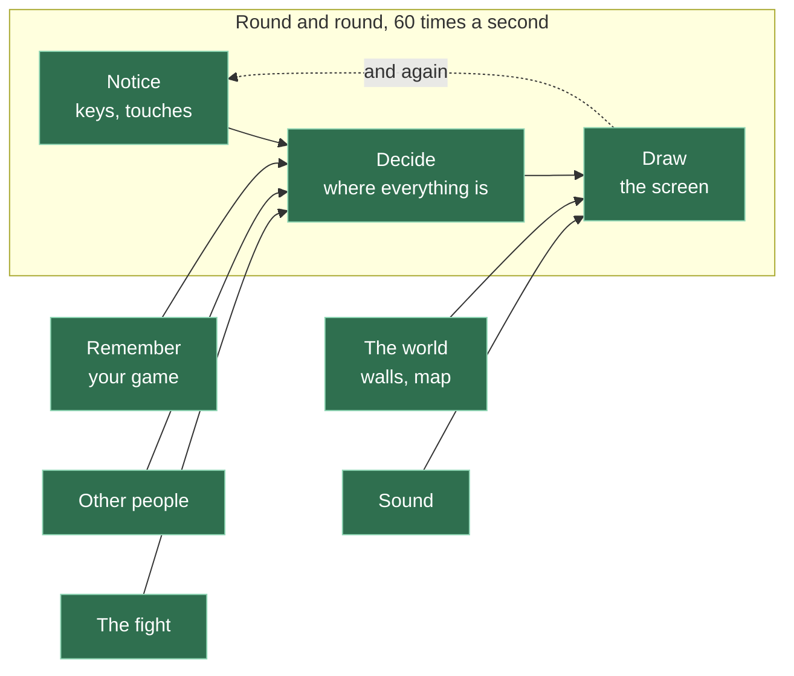

# A23: 作らなかったもの

ゲームができました。アカウントはなく、だれかが確かめられる点数もなく、責任者もおらず、本気のずるを止める方法もありません。そのどれもが選択でした。このステップでは、そのそれぞれが、あなたに何をもたらしたのかを話します。
{: .lesson-intro }

**必要なもの:** それを作りおえていること。**得られるもの:** 「なんでもっと大きくしないの？」と聞いてきた人に、自分の設計を説明できる力。

## ゲーム全体、完成



ボックスが全部緑になりました。[A09](a09.html)をふり返ってみてください。あのときは1つも緑ではありませんでした。あなたは大きなものを作ったのではありません。小さなものを8つ、1つずつ作りました。そのどれもが、画面1つに収まる大きさでした。

このコース全体で、本当の学びはそれだけです。あとのことは全部、それを練習するための口実でした。

## 唯一持っていないもの: 責任者

このゲームに足りないものは、ほとんどすべてが1つの決定から来ています。**サーバーがないこと。** 真ん中に座って、何が本当かを決めるコンピューターがないのです。

そのたった1つの「ない」が、以下のすべてを説明します。

| 持っていないもの | なぜないのか | それにかかったはずのもの |
|---|---|---|
| **アカウントとパスワード** | あなたがだれなのかを確かめるものはありません。名前を打てば、それがあなたの名前です。他の人が同じ名前を打つこともできます | パスワードを保管するサーバー。しかも他人のパスワードを安全に保管することは、レッスンではなく、本気の仕事です |
| **だれもが信じられる点数** | あなたの勝ち数は、あなた自身のパソコンで数えられています。100万に書きかえることもできます | プレイヤーが手を出せない場所に、本当の数字を置くこと。つまりサーバーが必要で、つまりずっとお金を払いつづけることになります |
| **ずるを止めるしくみ** | 何も止めません。先に手が届いたほうは自分の手をさらしていますし、自分の位置を書きかえる人を止めるものもありません。[A22](a22.html)は任意のステップで、その1つめをどう直すか、そしてそれにいくらかかるかを見せています | 2人のプレイヤーの言うことをすべて計算し直す審判。ゲームサーバーが実際にやっていることの、ほとんどはそれです |
| **だれかを報告するしくみ** | 報告する相手がいません。だからこそ、チャットは決まったフレーズのリストなのです（[A13](a13.html)）。取りしまることができないので、問題そのものを設計で消しました | モデレーター。本物の人が、毎日、報告を読むのです |
| **あなたがいなくても続く世界** | タブを閉じれば、あなたのマスは消えます。何も続きません | いつも起きていて、世界をあずかっているコンピューター |
| **遊ぶ相手を探すしくみ** | 今そこにいる人と遊びます。マッチメイキングはありません | だれが待っているかのリストを持っているサーバー |
| **同時に何百人ものプレイヤー** | 全員が全員につながっています。1人増えると、*全員*にもう1本ずつ接続が必要になります。けっこう早くこわれます | 世界をいくつかに分けること。そして、だれがどこにいるかを決めるサーバー |

## では、サーバーなしはまちがった選択だったのでしょうか

いいえ。そして、その理由を言えることが大事なのです。

サーバーがあれば、上のもの全部が手に入ったでしょう。そのかわり、ゲームが存在するかぎり毎月お金がかかり、動かしつづける人が必要になり、そして、ここがいちばん大事なのですが、**あなたが学んだことのほとんどが、かくれてしまったでしょう。** おもしろい部分は、あなたには見えない場所で、あなたが書いていないコードの中で起きていたはずです。

そのかわり、今は全部が、あなたが読めるフォルダの中にあります。

そして、「ない」ことが*くれた*ものを見てください。あなたのゲームは動かすのにお金がかからず、だれも手入れしなくても何年も動きつづけます。2人のプレイヤーは直接つながるので、速いです。朝の3時にこわれるものがありません。そして、だれのデータも漏らすことができません。もともと1つも持っていないからです。

**それは本物のエンジニアリングの取引で、あなたはそれを自分でやりました。** 「むずかしいほうができなかった」のではありません。むずかしいほうは*ちがう*だけで、より良いわけではなく、この目的にはむしろ向いていないのです。

## 持っていってほしいこと

あなたがこれから作るどのプロジェクトにも、上の表のようなリストがあります。大人のプログラマーはそれを**スコープ**と呼びます。これであなたも、この言葉を知りました。

まちがいは、何かを省くことではありません。まちがいは、うっかり省いて、その理由を言えないことです。わざと作らなかったもののリストと、そのそれぞれの理由。それは、自分が何をしているか分かっている人のしるしの1つです。

あなたは今それを持っています。本物のものについて、本物の人が遊んだものについて。

## もっと続けたいなら

どれも本物のプロジェクトで、どれも見た目より大きいものです。

- **公平にする。** 審判を足しましょう。対戦について2人のプレイヤーが言うことを確かめる、小さなサーバーです。オンラインゲームがみんな審判を持っている理由に、すぐ出会います。
- **生き残るようにする。** 全員が出ていったあとも、世界を残しておきましょう。
- **自分がだれかを証明できるようにする。** パスワードをまったく使わずに、自分が昨日と同じ人だと証明する方法があります。鍵のペアを使います。コンピューターの世界でいちばん美しい考え方の1つです。
- **もっと大きくする。** 20人入れてみましょう。こわれるのを見て、それからどこでこわれたのかを調べます。
- **ゲームエンジンで作り直す。** ループ、入力、壁、カメラを自分で書いたあとなら、それを全部用意してくれる道具で、もう一度作ってみましょう。何が消えるかを数えてください。そして、もっとおもしろいのは、何を自分では説明できなくなったかを数えることです。

## 代わりにできたこと（コース全体について）

| この代わりに | その代償 |
|---|---|
| 最初からゲームエンジンを使う | もっと早く終わって、もっと分からないままだったでしょう。[A10](a10.html)も[A15](a15.html)も[A16](a16.html)も、まったく書けませんでした。エンジンがやってしまうからです |
| 最初からサーバーを使う | 動くゲームは手に入り、[A12](a12.html)も[A22](a22.html)もなく、こういうことを考える理由も1つもありませんでした |
| 15の小さなレッスンではなく、1つの大きなレッスンにする | 最後まで見るものが何もなく、動かなかったときにどこがこわれているのか調べる方法もありません |
| ゲームを1つのふくらんでいくコードの山として作る | 最初にコードがこわれた生徒は、そこでずっと止まってしまいました。小さな別々のデモにしたので、うまくいかない夜のコストは、その1晩だけで済みます |

## プロンプト

```
I built a small multiplayer browser game with no server. Players connect
directly to each other, positions and moves are sent peer to peer, and every
player's own browser stores their own data. Ask me five questions that would
find the weakest points in this design. Do not suggest fixes yet — just the
questions.
```

**出力を確認すること:** 信頼について聞いてきましたか。プレイヤーが本当のことを言っているかを、だれが確かめているのか、という質問です。もし速さや見た目の話にまっすぐ行ったら、押し返してください。責任者がいない設計でおもしろい弱点は、いつでも信頼についてのものです。

そのあと、他のものを読む前に、5つの質問に自分で答えてみてください。あなたが作ったのです。あなたは知っています。

<div class="takeaways">
<h2>主なポイント</h2>
<ul>
<li>あなたは8つの小さなものから、1つの大きなものを作りました。そしてそれが、どこにでも持っていける力です</li>
<li>このゲームに足りないもののほとんどは、1つの決定から来ています。サーバーがないことです</li>
<li>サーバーなしは、信頼と永続性を失うかわりに、お金がかからないこと、手入れがいらないこと、そして何もかくれていないことをくれます</li>
<li>「そうしないことを選んだ」は、「できなかった」とはまったくちがう文です</li>
<li>省いたものを理由つきで挙げられることは、自分が何をしているか分かっているしるしです</li>
</ul>
</div>

## あなたの番

このステップの上のほうにある表を、自分のゲームについて、自分の言葉で書いてみましょう。自分が足さないと決めたものも入れてください。それをコードのとなりの`DESIGN.md`というファイルに置いて、コミットします。

だれかに「なんでこのゲームにアカウントがないの？」と聞かれたとき、あなたには書きとめた答えがあります。しかもそれは、私たちのものではなく、あなたのものです。
