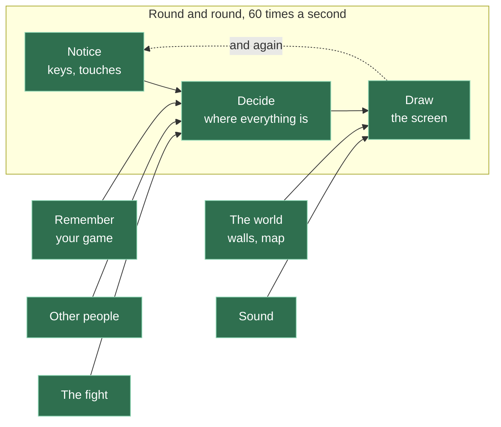

# A23: What We Didn't Build

You have a game. It has no accounts, no scores that anyone can check, nobody in charge, and no way to stop a determined cheat. Every one of those was a choice, and this step is where we say what each one bought you.
{: .lesson-intro }

**Needs:** having built the thing. **Gives you:** the ability to explain your own design to someone who asks why it is not bigger.

## The whole game, finished



Every box is green. Look back at [A09](a09.html), where none of them were. You did not build a big thing. You built eight small things, one at a time, and each one fitted on a screen.

That is the only real lesson in this whole course. Everything else was an excuse to practise it.

## The one thing you do not have: somebody in charge

Almost everything missing from this game comes from a single decision: **there is no server.** No computer sits in the middle, deciding what is true.

That one absence explains all of the following.

| What we do not have | Why not | What it would have cost |
|---|---|---|
| **Accounts and passwords** | Nothing checks who you are. You type a name and that is your name. Someone else can type the same name | A server that stores passwords — and storing other people's passwords safely is a serious job, not a lesson |
| **Scores anyone can trust** | Your wins are counted on your own computer. You could set them to a million | Somewhere to keep the real number that players cannot reach, which means a server, which means paying for it forever |
| **Stopping cheats** | Nothing stops them. Whoever's move arrives first has shown their hand, and nothing stops someone editing their own position either. [A22](a22.html) is an optional step showing how you would fix the first of those, and what it costs | A referee that recalculates everything both players claim. That is most of what a game server actually does |
| **Reporting someone** | There is nobody to report them to. This is exactly why the chat is a fixed list of phrases ([A13](a13.html)) — the problem is designed out, because it could not be policed | Moderators. Real people, reading reports, every day |
| **The world carrying on without you** | Close the tab and your square is gone. Nothing continues | A computer that is always awake, holding the world |
| **Finding people to play with** | You play with whoever is there right now. There is no matchmaking | A server that keeps a list of who is waiting |
| **Hundreds of players at once** | Everyone is connected to everyone. Add one person and *everybody* needs another connection. It falls apart quite quickly | Splitting the world into pieces, and a server to decide who is in which piece |

## So was no server the wrong choice?

No — and being able to say why is the point.

A server would have bought all of the above. It would also have cost money every month for as long as the game exists, needed someone to keep it running, and — this is the part that matters here — **it would have hidden almost everything you learned.** The interesting parts would have happened somewhere you could not see, in code you did not write.

Instead the whole thing is in a folder you can read.

And look at what the absence *gave* you. Your game costs nothing to run and will keep working for years with nobody maintaining it. Two players connect directly, so it is fast. There is nothing to break at three in the morning. Nothing about it can leak anybody's data, because it never had any.

**That is a real engineering trade, and you made it.** Not "we could not do the hard version" — the hard version is *different*, not better, and it is worse for this.

## The thing to take with you

Every project you ever build will have a list like the table above. Grown-up programmers call it **scope**, so now you know that word too.

The mistake is not leaving things out. The mistake is leaving them out by accident, and not being able to say why. A list of what you deliberately did not build, with a reason for each, is one of the signs of somebody who knows what they are doing.

You now have one, for a real thing, that real people have played.

## If you want to keep going

Each of these is a real project, and each one is bigger than it looks:

- **Make it fair.** Add a referee — a small server that checks both players' claims about a fight. You will immediately meet the reason every online game has one.
- **Make it survive.** Keep the world when everyone leaves.
- **Make it prove who you are.** There is a way to prove you are the same person as yesterday without any password at all, using a pair of keys. It is one of the most beautiful ideas in computing.
- **Make it bigger.** Try to get twenty people in. Watch it fail, then work out where.
- **Rebuild it with a game engine.** Now that you have written the loop, the input, the walls and the camera yourself, do it again with a tool that provides all of them. Count what disappears — and, more interestingly, count what you can no longer explain.

## What we could have done instead — the whole course

| Instead of this | What it would cost |
|---|---|
| A game engine from the start | You would have finished sooner and understood less. You could not have written [A10](a10.html), [A15](a15.html) or [A16](a16.html) at all, because the engine would have done them |
| A server from the start | A working game, and no [A12](a12.html), no [A22](a22.html), and no reason to think about any of this |
| One big lesson instead of fifteen small ones | Nothing to look at until the end, and no way to tell which part was broken when it did not work |
| Building the game as one growing pile of code | The first student whose code broke would have been stuck forever. Small separate demos meant a bad evening cost you an evening |

## The prompt

```
I built a small multiplayer browser game with no server. Players connect
directly to each other, positions and moves are sent peer to peer, and every
player's own browser stores their own data. Ask me five questions that would
find the weakest points in this design. Do not suggest fixes yet — just the
questions.
```

**Check the output for:** did it ask about trust — who checks that a player is telling the truth? If it went straight to performance or graphics, push it: the interesting weaknesses in a design with nobody in charge are always about trust.

Then answer the five questions yourself, before reading anything else. You built it. You know.

<div class="takeaways">
<h2>Key Takeaways</h2>
<ul>
<li>You built one big thing out of eight small ones, and that is the transferable skill</li>
<li>Almost everything this game lacks comes from one decision: there is no server</li>
<li>No server costs you trust and permanence; it buys you no cost, no maintenance, and nothing hidden</li>
<li>"We chose not to" is a completely different sentence from "we could not"</li>
<li>Being able to list what you left out, with reasons, is a sign you know what you are doing</li>
</ul>
</div>

## Your turn

Write your own version of the table near the top of this step, for your own game, in your own words. Include anything you personally decided not to add. Put it in a file called `DESIGN.md` next to your code, and commit it.

When someone asks why your game does not have accounts, you will have the answer written down — and it will be yours, not ours.
