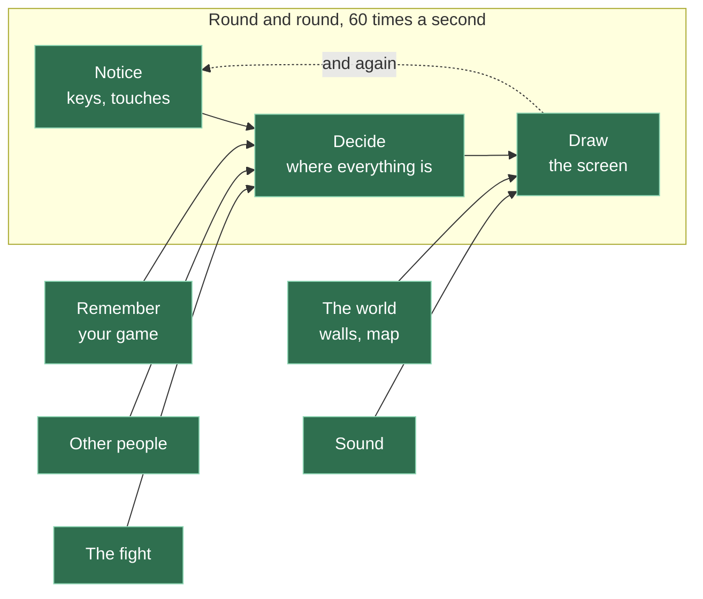

# A23: O Que Não Construímos

Você tem um jogo. Ele não tem contas, não tem pontuações que alguém possa conferir, não tem ninguém no comando e não tem como impedir um trapaceiro determinado. Cada uma dessas coisas foi uma escolha, e nesta etapa dizemos o que cada uma delas comprou para você.
{: .lesson-intro }

**Precisa de:** ter construído a coisa. **Oferece:** a capacidade de explicar o seu próprio projeto para quem perguntar por que ele não é maior.

## O jogo completo, terminado



Todas as caixas estão verdes. Olhe para trás, para [A09](a09.html), onde nenhuma estava. Você não construiu uma coisa grande. Você construiu oito coisas pequenas, uma por vez, e cada uma delas caberia em uma tela.

Essa é a única lição de verdade deste curso inteiro. Todo o resto foi uma desculpa para praticá-la.

## A única coisa que você não tem: alguém no comando

Quase tudo o que falta neste jogo vem de uma única decisão: **não há servidor.** Nenhum computador fica no meio, decidindo o que é verdade.

Essa única ausência explica tudo o que vem abaixo.

| O que não temos | Por que não | O que teria custado |
|---|---|---|
| **Contas e senhas** | Nada confere quem você é. Você digita um nome e é esse o seu nome. Outra pessoa pode digitar o mesmo nome | Um servidor que guarda senhas — e guardar senhas de outras pessoas com segurança é um trabalho sério, não uma lição |
| **Pontuações em que alguém possa confiar** | As suas vitórias são contadas no seu próprio computador. Você poderia colocá-las em um milhão | Algum lugar para guardar o número verdadeiro, fora do alcance dos jogadores, o que significa um servidor, o que significa pagar por ele para sempre |
| **Impedir trapaças** | Nada as impede. Quem tem a jogada chegando primeiro já mostrou a mão, e nada impede alguém de editar a própria posição também. [A22](a22.html) é uma etapa opcional que mostra como você consertaria a primeira dessas coisas, e quanto isso custa | Um juiz que recalcula tudo o que os dois jogadores afirmam. É isso que a maior parte de um servidor de jogo faz de verdade |
| **Denunciar alguém** | Não há ninguém para receber a denúncia. É exatamente por isso que o bate-papo é uma lista fixa de frases ([A13](a13.html)) — o problema é eliminado no projeto, porque não havia como fiscalizá-lo | Moderadores. Pessoas de verdade, lendo denúncias, todos os dias |
| **O mundo continuando sem você** | Feche a aba e o seu quadrado desaparece. Nada continua | Um computador sempre acordado, segurando o mundo |
| **Encontrar gente para jogar** | Você joga com quem estiver ali naquele momento. Não há matchmaking | Um servidor que mantém uma lista de quem está esperando |
| **Centenas de jogadores ao mesmo tempo** | Todo mundo está conectado a todo mundo. Adicione uma pessoa e *todos* precisam de mais uma conexão. Desmonta bem rápido | Dividir o mundo em pedaços, e um servidor para decidir quem está em qual pedaço |

## Então não ter servidor foi a escolha errada?

Não — e conseguir dizer por quê é o ponto.

Um servidor teria comprado tudo o que está acima. Também teria custado dinheiro todo mês pelo tempo que o jogo existir, exigido alguém para mantê-lo rodando e — esta é a parte que importa aqui — **teria escondido quase tudo o que você aprendeu.** As partes interessantes teriam acontecido em algum lugar que você não pode ver, em código que você não escreveu.

Em vez disso, tudo está em uma pasta que você consegue ler.

E veja o que a ausência lhe *deu*. O seu jogo não custa nada para rodar e vai continuar funcionando por anos sem ninguém cuidando dele. Dois jogadores se conectam diretamente, então é rápido. Não há nada para quebrar às três da manhã. Nada nele pode vazar os dados de ninguém, porque ele nunca teve nenhum.

**Essa é uma troca de engenharia de verdade, e você a fez.** Não é "não conseguimos fazer a versão difícil" — a versão difícil é *diferente*, não melhor, e para este caso ela é pior.

## O que levar com você

Todo projeto que você construir vai ter uma lista como a tabela acima. Programadores adultos a chamam de **escopo**, então agora você conhece essa palavra também.

O erro não é deixar coisas de fora. O erro é deixá-las de fora por acidente e não conseguir dizer por quê. Uma lista do que você deliberadamente não construiu, com um motivo para cada item, é um dos sinais de alguém que sabe o que está fazendo.

Você agora tem uma, para uma coisa de verdade, que pessoas de verdade jogaram.

## Se você quiser continuar

Cada um destes é um projeto de verdade, e cada um é maior do que parece:

- **Torne-o justo.** Adicione um juiz — um servidor pequeno que confere o que os dois jogadores afirmam sobre uma luta. Você vai encontrar na hora o motivo pelo qual todo jogo online tem um.
- **Faça-o sobreviver.** Mantenha o mundo quando todos saírem.
- **Faça-o provar quem você é.** Existe uma forma de provar que você é a mesma pessoa de ontem sem senha nenhuma, usando um par de chaves. É uma das ideias mais bonitas da computação.
- **Faça-o maior.** Tente colocar vinte pessoas dentro. Veja quebrar e depois descubra onde.
- **Reconstrua-o com uma engine de jogo.** Agora que você escreveu o laço, a entrada, as paredes e a câmera com as suas próprias mãos, faça de novo com uma ferramenta que já fornece tudo isso. Conte o que desaparece — e, mais interessante, conte o que você já não consegue mais explicar.

## O que poderíamos ter feito em vez disso — o curso inteiro

| Em vez disso | O que custaria |
|---|---|
| Uma engine de jogo desde o começo | Você teria terminado mais cedo e entendido menos. Você não teria conseguido escrever [A10](a10.html), [A15](a15.html) nem [A16](a16.html) de jeito nenhum, porque a engine teria feito por você |
| Um servidor desde o começo | Um jogo funcionando, e nenhum [A12](a12.html), nenhum [A22](a22.html), e nenhum motivo para pensar em nada disso |
| Uma lição grande em vez de quinze pequenas | Nada para olhar até o fim, e nenhuma forma de saber qual parte estava quebrada quando não funcionava |
| Construir o jogo como uma pilha de código que só cresce | O primeiro estudante cujo código quebrasse ficaria travado para sempre. Demonstrações pequenas e separadas fizeram com que uma noite ruim custasse uma noite |

## O prompt

```
I built a small multiplayer browser game with no server. Players connect
directly to each other, positions and moves are sent peer to peer, and every
player's own browser stores their own data. Ask me five questions that would
find the weakest points in this design. Do not suggest fixes yet — just the
questions.
```

**Verifique na resposta:** ele perguntou sobre confiança — quem confere se um jogador está falando a verdade? Se ele foi direto para desempenho ou gráficos, insista: em um projeto sem ninguém no comando, as fraquezas interessantes são sempre sobre confiança.

Depois responda as cinco perguntas você mesmo, antes de ler qualquer outra coisa. Você construiu isso. Você sabe.

<div class="takeaways">
<h2>Principais Pontos</h2>
<ul>
<li>Você construiu uma coisa grande a partir de oito pequenas, e essa é a habilidade que você leva para qualquer lugar</li>
<li>Quase tudo o que falta neste jogo vem de uma decisão: não há servidor</li>
<li>Não ter servidor custa confiança e permanência; em troca dá custo zero, manutenção zero e nada escondido</li>
<li>"Escolhemos não fazer" é uma frase completamente diferente de "não conseguimos fazer"</li>
<li>Conseguir listar o que você deixou de fora, com motivos, é um sinal de que você sabe o que está fazendo</li>
</ul>
</div>

## Sua vez

Escreva a sua própria versão da tabela do começo desta etapa, para o seu jogo, com as suas palavras. Inclua qualquer coisa que você pessoalmente decidiu não adicionar. Coloque isso em um arquivo chamado `DESIGN.md` ao lado do seu código, e faça o commit.

Quando alguém perguntar por que o seu jogo não tem contas, você vai ter a resposta escrita — e ela vai ser sua, não nossa.
