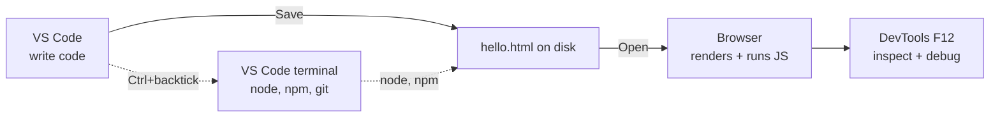

# T01: 環境セットアップ

職人は最初の切削の前に作業台を整える。Web開発には4つのツールが必要: コードを書くエディタ、ブラウザの外でJavaScriptを実行するランタイム、全ての変更を追跡するバージョン管理、結果を見るブラウザ。一度やれば、あとは忘れていい。
{: .lesson-intro }

## インストールするもの

- **Visual Studio Code** - エディタ。無料、Microsoft製、Windows/Mac/Linuxで動く。このコースで触るすべての言語に対応。
- **Node.js** - JavaScriptランタイム。ブラウザなしでターミナルから.jsファイルを実行できる。サードパーティのライブラリをインストールする `npm` も同梱。
- **Git** - バージョン管理。全ての変更を追跡し、GitHubでコードを共有する方法。macOSとほとんどのLinuxに付属。Windowsは [git-scm.com](https://git-scm.com/) から別インストーラーが必要。
- **モダンなブラウザ** - ChromeまたはFirefox。組み込みのdevtoolsでページの検査、JavaScriptのデバッグ、ネットワーク条件のシミュレートができる。

## VS Codeをインストール

[code.visualstudio.com](https://code.visualstudio.com/) からOS用のインストーラをダウンロード。デフォルトで進める。インストール時に **Add to PATH** と **Register as editor for supported file types** にチェック。

インストール後、VS Codeを開いて見回す:

- 左のバー: Explorer(ファイルツリー)、Search、Source Control(git)、Extensions
- **Cmd/Ctrl + P** - クイックファイルオープン。ファイル名の一部を入力
- **Cmd/Ctrl + Shift + P** - コマンドパレット。名前で任意のコマンドを入力
- **Ctrl + `**(バッククォート) - VS Code内蔵のターミナルを開く

## Node.jsをインストール

[nodejs.org](https://nodejs.org/) で **LTS**(Long-Term Support)版をダウンロード。デフォルトで進める。LTSは退屈で信頼できる選択。学習中は「Current」チャネルを避ける。

Macで既にHomebrewを使っているなら `brew install node` でもOK。Linuxはディストロのパッケージマネージャーでいいが、Nodeのバージョンが古い可能性がある。柔軟性のために [nvm](https://github.com/nvm-sh/nvm) を検討。

## Gitをインストール

Gitはすべてのプロのコードベースが使うバージョン管理システムで、GitHubが話すもの。T19以降、毎日使う。

- **Windows**: [git-scm.com](https://git-scm.com/) からインストーラ。デフォルトで進める。Git Bashも付いてくる。Windowsではこれをターミナルにするほうが `cmd.exe` よりずっといい。
- **Mac**: macOSはgitを同梱しているが、初回の `git --version` でXcode Command Line Toolsのインストールを促される場合がある。承諾する。あるいは `brew install git` で新しいバージョンが入る。
- **Linux**: ディストロのパッケージマネージャーで入れる。例: Ubuntu/Debianなら `sudo apt install git`、Fedoraなら `sudo dnf install git`。

インストール後、gitに自分を教える。マシンごとに1回だけ実行し、以後すべてのコミットにラベルが付く。

```
git config --global user.name "Your Name"
git config --global user.email "you@example.com"
```

## 全部動くか検証

VS Codeを開いて、内蔵ターミナルを開く(**Ctrl + `**)。これら4つを実行。各々バージョン番号を出力するはず。

```
node -v      # v20.x.x 以降
npm -v       # 10.x.x 以降
code -v      # VS Code のバージョン
git --version  # どのバージョンでもOK
```

「command not found」が出たら、全てのターミナルを閉じて新しいのを開き直す。インストーラが `PATH` を更新したが、PATHは新しいターミナルにしか反映されない。それでも駄目ならコンピュータを再起動。

## 最初のファイル

全体の連携を確認しよう。

1. VS Codeで **File > Open Folder**。`learning` というフォルダを選ぶか作る。
2. `hello.html` という新しいファイルを作る。
3. これを貼り付けて Cmd/Ctrl + S で保存:

```
<!DOCTYPE html>
<html>
<head><title>Hello</title></head>
<body>
    <h1>It works!</h1>
    <script>
        console.log("Also in the browser console.");
    </script>
</body>
</html>
```

ブラウザでファイルを開く(ダブルクリック、またはブラウザへドラッグ)。**F12** でdevtoolsを開き、Consoleタブに切り替える。ログ行が見えるはず。



## インストールする価値のある拡張機能

VS Codeの拡張機能パネル(左バーの四角アイコン)を開く。以下の4つをインストール:

- **Prettier - Code formatter** - 保存時に自動フォーマット
- **ESLint** - 入力中にJavaScriptのバグやスタイル問題をハイライト
- **Live Server** - .htmlを右クリック -> "Open with Live Server" で保存時に自動リロード
- **GitLens** - git統合強化。各行を最後に変更したのが誰か見える

保存時フォーマットを有効にするには、設定(Cmd/Ctrl + ,)を開き、「format on save」を検索してチェック。

<div class="takeaways">
<h2>まとめ</h2>
<ul>
<li>3つのツール: VS Code(エディタ)、Node.js LTS(ランタイム)、devtools付きのモダンブラウザ</li>
<li>node -v、npm -v、git --version、code -v で検証。4つ全てがバージョンを出力するべき</li>
<li>VS Codeショートカットを早く覚える: Cmd/Ctrl+P(クイックオープン)、Cmd/Ctrl+Shift+P(コマンドパレット)、Ctrl+バッククォート(ターミナル)</li>
<li>Prettier、ESLint、Live Server、GitLensをインストール。保存時フォーマットを有効化</li>
<li>「not found」が出たら新しいターミナルを開く。それでも駄目なら再起動。PATH更新は新しいシェルが必要</li>
</ul>
</div>
