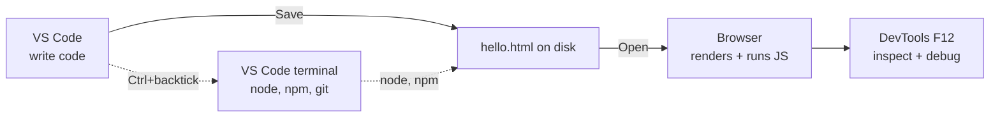

# T01: 環境セットアップ

職人は最初の切削の前に作業台を整えます。Webを作るために、コンピュータには4つの道具が必要です。コードを書くエディタ、ブラウザ外でJavaScriptを実行するランタイム、変更を追跡するバージョン管理、結果を見るブラウザ。午後1回のセットアップが後の千の苛立ちを救います。一度やって永遠に忘れましょう。
{: .lesson-intro }

## 何をインストールするか

- **Visual Studio Code** - エディタ。無料、Microsoft製、Windows/Mac/Linuxで動作。HTML、CSS、JavaScript、このコースで触る全ての言語に対応。
- **Node.js** - JavaScriptランタイム。ブラウザなしでターミナルから.jsファイルを実行できる。サードパーティライブラリをインストールする`npm`が付属。
- **Git** - バージョン管理。全ての変更を追跡し、GitHubでコードを共有する方法です。macOSと大半のLinuxには同梱されています。Windowsは別途インストーラが必要(このレッスン末尾のOSメモを参照)。
- **モダンブラウザ** - ChromeまたはFirefox。組み込みのデベロッパーツールでページを検査、JavaScriptをデバッグ、ネットワーク状況をシミュレートします。

## VS Codeをインストール

[code.visualstudio.com](https://code.visualstudio.com/)に行き、OSのインストーラをダウンロード。デフォルトを受け入れる。インストール中に聞かれたら**Add to PATH**と**Register as editor for supported file types**をチェック。

インストール後、VS Codeを開いて見回します:

- 左バー: エクスプローラ(ファイルツリー)、検索、ソース管理(git)、拡張機能
- **Cmd/Ctrl + P** - クイックファイルオープン。ファイル名の一部を入力
- **Cmd/Ctrl + Shift + P** - コマンドパレット。任意のコマンドを名前で入力
- **Ctrl + `**(バッククォート) - VS Code内の統合ターミナルを開く

## Node.jsをインストール

[nodejs.org](https://nodejs.org/)に行き、**LTS**(長期サポート)版をダウンロード。デフォルトを受け入れる。LTSは退屈で信頼できる選択。学習中は「Current」チャネルは避けましょう。

MacでHomebrewを使っているなら`brew install node`で十分。Linuxではディストリのパッケージマネージャでも良いが、nodeのバージョンが古いかも。後の柔軟性のために[nvm](https://github.com/nvm-sh/nvm)の使用を検討。

## Gitをインストール

Gitはあらゆるプロのコードベースが使うバージョン管理システムで、GitHubが話す言語でもあります。T19以降、毎日使うことになります。

- **Windows**: [git-scm.com](https://git-scm.com/)からインストーラをダウンロード。デフォルトを受け入れる。Git Bashが付いてきますが、これをWindowsのターミナルとして使うのがおすすめです(`cmd.exe`よりずっと快適)。
- **Mac**: macOSにはgitが同梱されていますが、`git --version`を初めて実行するとXcode Command Line Toolsのインストールを促されることがあります。受け入れましょう。別の選択肢として`brew install git`で新しいバージョンが手に入ります。
- **Linux**: ディストリのパッケージマネージャでインストール。例: Ubuntu/Debianなら`sudo apt install git`、Fedoraなら`sudo dnf install git`。

インストール後、自分が誰かをgitに教えます。マシンごとに1回実行すれば、あなたが作る全コミットに名前が付きます。

```
git config --global user.name "Your Name"
git config --global user.email "you@example.com"
```

## 全てが動くか確認

VS Codeを開き、統合ターミナルを開く(**Ctrl + `**)。この4つのコマンドを実行。各々がバージョン番号を表示するはず。

```
node -v      # v20.x.x or newer
npm -v       # 10.x.x or newer
code -v      # VS Code version
git --version  # any version works
```

どれかが「command not found」を出したら、全てのターミナルウィンドウを閉じて新しいのを開き、もう一度試す。インストーラは`PATH`を更新するが、PATHは新しいターミナルにのみ適用される。それでも壊れているなら、コンピュータを再起動。

## 最初のファイル

チェーン全体がエンドtoエンドで動くことを証明しましょう。

1. VS Codeで**File > Open Folder**からフォルダを開く。`learning`というフォルダを作るか選ぶ。
2. `hello.html`という新ファイルを作成。
3. これを貼り付けてCmd/Ctrl + Sで保存:

```
<!DOCTYPE html>
<html>
<head><title>Hello</title></head>
<body>
    <h1>It works!</h1>
    <script>
        console.log("Also in the browser console.");
    </script>
</body>
</html>
```

ファイルをブラウザで開く(ダブルクリックかブラウザにドラッグ)。**F12**でデベロッパーツールを開き、Consoleタブに切り替え。ログ行が見えるはず。



## 入れる価値のある拡張機能

VS Codeの拡張機能パネルを開く(左バーの四角いアイコン)。この4つをインストール:

- **Prettier - Code formatter** - 保存時に自動フォーマット。全ファイルが一貫した見た目に
- **ESLint** - 入力中にJavaScriptのバグとスタイル問題をハイライト
- **Live Server** - 任意の.htmlファイルを右クリック -> 「Open with Live Server」で保存時自動リロード
- **GitLens** - git統合の強化。各行を最後に誰が変えたか見える

保存時フォーマットを有効にするには、設定(Cmd/Ctrl + ,)を開き、「format on save」を検索してチェック。

## OS別の注意

- **Windows**: [git-scm.com](https://git-scm.com/)からGit for Windowsをインストール。デフォルトの「Git Bash」ターミナルがcmd.exeよりこのコースに親切なLinux風シェルを提供。
- **Mac**: まず[Homebrew](https://brew.sh/)をインストール。あとは`brew install git node`でセットアップ完了。
- **Linux**: gitは既にあるはず。`sudo apt install git nodejs npm`(Ubuntu/Debian)、または新しいバージョンには`nvm`。

<div class="takeaways">
<h2>まとめ</h2>
<ul>
<li>3つの道具: VS Code(エディタ)、Node.js LTS(ランタイム)、デベロッパーツール付きモダンブラウザ</li>
<li>node -v、npm -v、git --version、code -vで確認。4つ全てがバージョンを表示するはず</li>
<li>VS Codeのショートカットを早く覚える: Cmd/Ctrl+P(クイック開く)、Cmd/Ctrl+Shift+P(コマンドパレット)、Ctrl+バッククォート(ターミナル)</li>
<li>Prettier、ESLint、Live Server、GitLensをインストール。保存時フォーマットを有効に</li>
<li>コマンドが「not found」なら新しいターミナルを開く。まだ壊れているなら再起動。PATH更新は新シェルが必要</li>
</ul>
</div>
