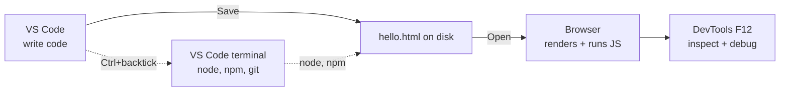

# T01: Environment Setup

Every craftsman sets up the workbench before the first cut. To build for the web you need three tools on your computer: an editor to write code, a runtime to execute JavaScript outside the browser, and a browser to view the result. One afternoon of setup saves a thousand frustrations later. Do it once, forget it forever.
{: .lesson-intro }

## What You Are Installing

- **Visual Studio Code** - the editor. Free, from Microsoft, runs on Windows, Mac, Linux. Works for HTML, CSS, JavaScript, and every language you will touch in this course.
- **Node.js** - a JavaScript runtime. Lets you run .js files from your terminal without a browser. Comes with `npm`, the package manager that installs third-party libraries.
- **A modern browser** - Chrome or Firefox. The built-in browser devtools are how you inspect pages, debug JavaScript, and simulate network conditions.

## Install VS Code

Go to [code.visualstudio.com](https://code.visualstudio.com/) and download the installer for your operating system. Accept the defaults. When prompted during install, check **Add to PATH** and **Register as editor for supported file types**.

After install, open VS Code and look around:

- Left bar: Explorer (file tree), Search, Source Control (git), Extensions
- **Cmd/Ctrl + P** - quick file open. Type a filename fragment
- **Cmd/Ctrl + Shift + P** - command palette. Type any command by name
- **Ctrl + `** (backtick) - open the integrated terminal inside VS Code

## Install Node.js

Go to [nodejs.org](https://nodejs.org/) and download the **LTS** (Long-Term Support) version. Accept defaults. LTS is the boring-reliable choice; avoid the "Current" channel for learning.

On Mac, if you already use Homebrew, `brew install node` works. On Linux, your distro's package manager is fine, but node's version may be old; consider [nvm](https://github.com/nvm-sh/nvm) for flexibility later.

## Verify Everything Works

Open VS Code, then open the integrated terminal (**Ctrl + `**). Run these four commands. Each should print a version number.

```
node -v      # v20.x.x or newer
npm -v       # 10.x.x or newer
code -v      # VS Code version
git --version  # any version works
```

If any command prints "command not found", close all terminal windows, open a new one, and try again. The installer updated your `PATH`, and PATH only applies to new terminals. Still broken? Restart the computer.

## Your First File

Let's prove the whole chain works end to end.

1. In VS Code, open a folder: **File > Open Folder**. Pick or create a folder called `learning`.
2. Create a new file named `hello.html`.
3. Paste this in and save with Cmd/Ctrl + S:

```
<!DOCTYPE html>
<html>
<head><title>Hello</title></head>
<body>
    <h1>It works!</h1>
    <script>
        console.log("Also in the browser console.");
    </script>
</body>
</html>
```

Open the file in your browser (double-click it, or drag it onto the browser). Open devtools with **F12** and switch to the Console tab. You should see the log line.



## Extensions Worth Installing

Open the Extensions panel in VS Code (square icon on the left bar). Install these four:

- **Prettier - Code formatter** - auto-formats on save so every file looks consistent
- **ESLint** - highlights JavaScript bugs and style issues as you type
- **Live Server** - right-click any .html file -> "Open with Live Server" for auto-refresh on save
- **GitLens** - enhanced git integration; see who last changed every line

To enable format-on-save, open settings (Cmd/Ctrl + ,), search "format on save", and check the box.

## Operating System Notes

- **Windows**: install Git for Windows from [git-scm.com](https://git-scm.com/). The default "Git Bash" terminal gives you a Linux-like shell that is much nicer than cmd.exe for this course.
- **Mac**: install [Homebrew](https://brew.sh/) first. Then `brew install git node` is the whole setup.
- **Linux**: you likely have git already. `sudo apt install git nodejs npm` (Ubuntu/Debian) or `nvm` for newer versions.

<div class="takeaways">
<h2>Key Takeaways</h2>
<ul>
<li>Three tools: VS Code (editor), Node.js LTS (runtime), a modern browser with devtools</li>
<li>Verify with node -v, npm -v, git --version, code -v. All four should print versions</li>
<li>Learn VS Code shortcuts early: Cmd/Ctrl+P (quick open), Cmd/Ctrl+Shift+P (command palette), Ctrl+backtick (terminal)</li>
<li>Install Prettier, ESLint, Live Server, GitLens. Enable format-on-save</li>
<li>If a command is "not found", open a fresh terminal. If still broken, restart. PATH updates need a new shell</li>
</ul>
</div>
