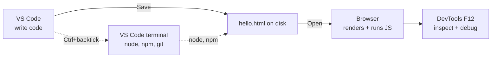

# T01: Configuração do Ambiente

Todo artesão arruma a bancada antes do primeiro corte. Para construir para a web você precisa de três ferramentas no computador: um editor para escrever código, um runtime para executar JavaScript fora do navegador e um navegador para ver o resultado. Uma tarde de configuração poupa mil frustrações depois. Faça uma vez, esqueça para sempre.
{: .lesson-intro }

## O Que Você Vai Instalar

- **Visual Studio Code** - o editor. Gratuito, da Microsoft, roda em Windows, Mac, Linux. Funciona para HTML, CSS, JavaScript e toda linguagem que você vai tocar no curso.
- **Node.js** - um runtime de JavaScript. Deixa você rodar arquivos .js no terminal sem navegador. Vem com o `npm`, o gerenciador de pacotes que instala bibliotecas de terceiros.
- **Um navegador moderno** - Chrome ou Firefox. As devtools embutidas são como você inspeciona páginas, depura JavaScript e simula condições de rede.

## Instalar o VS Code

Vá em [code.visualstudio.com](https://code.visualstudio.com/) e baixe o instalador para o seu sistema operacional. Aceite os padrões. Quando perguntarem durante a instalação, marque **Add to PATH** e **Register as editor for supported file types**.

Depois de instalar, abra o VS Code e olhe ao redor:

- Barra lateral esquerda: Explorer (árvore de arquivos), Search, Source Control (git), Extensions
- **Cmd/Ctrl + P** - abrir arquivo rápido. Digite um pedaço do nome
- **Cmd/Ctrl + Shift + P** - command palette. Digite qualquer comando pelo nome
- **Ctrl + `** (crase) - abre o terminal integrado dentro do VS Code

## Instalar o Node.js

Vá em [nodejs.org](https://nodejs.org/) e baixe a versão **LTS** (Long-Term Support). Aceite os padrões. LTS é a escolha chata e confiável; evite o canal "Current" para aprendizado.

No Mac, se você já usa Homebrew, `brew install node` funciona. No Linux, o gerenciador de pacotes da sua distro serve, mas a versão do node pode ser antiga; considere o [nvm](https://github.com/nvm-sh/nvm) para flexibilidade depois.

## Verificar Se Tudo Funciona

Abra o VS Code, depois abra o terminal integrado (**Ctrl + `**). Rode estes quatro comandos. Cada um deve imprimir um número de versão.

```
node -v      # v20.x.x or newer
npm -v       # 10.x.x or newer
code -v      # VS Code version
git --version  # any version works
```

Se algum comando imprimir "command not found", feche todas as janelas de terminal, abra uma nova e tente de novo. O instalador atualizou seu `PATH`, e o PATH só vale para terminais novos. Ainda quebrado? Reinicie o computador.

## Seu Primeiro Arquivo

Vamos provar que a cadeia inteira funciona de ponta a ponta.

1. No VS Code, abra uma pasta: **File > Open Folder**. Escolha ou crie uma pasta chamada `learning`.
2. Crie um novo arquivo chamado `hello.html`.
3. Cole isso e salve com Cmd/Ctrl + S:

```
<!DOCTYPE html>
<html>
<head><title>Hello</title></head>
<body>
    <h1>It works!</h1>
    <script>
        console.log("Also in the browser console.");
    </script>
</body>
</html>
```

Abra o arquivo no navegador (dê dois cliques ou arraste para o navegador). Abra a devtools com **F12** e vá para a aba Console. Você deve ver a linha do log.



## Extensões Que Valem a Pena

Abra o painel Extensions do VS Code (ícone de quadrado na barra lateral). Instale estas quatro:

- **Prettier - Code formatter** - formata automaticamente ao salvar, deixa todos os arquivos consistentes
- **ESLint** - destaca bugs e problemas de estilo de JavaScript enquanto você digita
- **Live Server** - clique direito em qualquer arquivo .html -> "Open with Live Server" para recarregar ao salvar
- **GitLens** - integração git turbinada; veja quem mexeu em cada linha pela última vez

Para ativar format-on-save, abra as configurações (Cmd/Ctrl + ,), procure "format on save" e marque a caixa.

## Notas por Sistema Operacional

- **Windows**: instale o Git for Windows em [git-scm.com](https://git-scm.com/). O terminal padrão "Git Bash" dá um shell estilo Linux, muito mais agradável que o cmd.exe para este curso.
- **Mac**: instale o [Homebrew](https://brew.sh/) primeiro. Depois `brew install git node` finaliza a configuração.
- **Linux**: você provavelmente já tem git. `sudo apt install git nodejs npm` (Ubuntu/Debian) ou `nvm` para versões novas.

<div class="takeaways">
<h2>Key Takeaways</h2>
<ul>
<li>Três ferramentas: VS Code (editor), Node.js LTS (runtime), um navegador moderno com devtools</li>
<li>Verifique com node -v, npm -v, git --version, code -v. Todos os quatro devem mostrar versões</li>
<li>Aprenda atalhos do VS Code cedo: Cmd/Ctrl+P (abrir rápido), Cmd/Ctrl+Shift+P (command palette), Ctrl+crase (terminal)</li>
<li>Instale Prettier, ESLint, Live Server, GitLens. Ative format-on-save</li>
<li>Se um comando deu "not found", abra um terminal novo. Se ainda quebrar, reinicie. Atualizações de PATH só valem em shell novo</li>
</ul>
</div>
