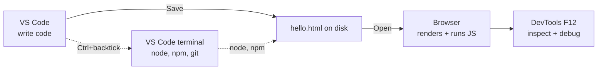

# T01: Configuração do Ambiente

Todo artesão prepara a bancada antes do primeiro corte. Para construir para a web você precisa de quatro ferramentas: um editor para escrever código, um runtime para executar JavaScript fora do navegador, controle de versão para rastrear toda mudança, e um navegador para ver o resultado. Faça uma vez, esqueça para sempre.
{: .lesson-intro }

## O Que Você Vai Instalar

- **Visual Studio Code** - o editor. Grátis, da Microsoft, roda em Windows, Mac, Linux. Funciona para todas as linguagens deste curso.
- **Node.js** - runtime JavaScript. Deixa você rodar arquivos .js do terminal sem navegador. Vem com `npm`, o gerenciador de pacotes.
- **Git** - controle de versão. Rastreia toda mudança e é como você compartilha código no GitHub. Vem no macOS e na maioria dos Linux; no Windows precisa de instalador separado de [git-scm.com](https://git-scm.com/).
- **Um navegador moderno** - Chrome ou Firefox. As devtools embutidas são como você inspeciona páginas, depura JavaScript e simula condições de rede.

## Instalar VS Code

Vá em [code.visualstudio.com](https://code.visualstudio.com/) e baixe o instalador do seu SO. Aceite os padrões. Quando perguntar, marque **Add to PATH** e **Register as editor for supported file types**.

Após instalar, abra o VS Code e olhe ao redor:

- Barra esquerda: Explorer (árvore de arquivos), Search, Source Control (git), Extensions
- **Cmd/Ctrl + P** - abrir arquivo rápido. Digite parte do nome
- **Cmd/Ctrl + Shift + P** - command palette. Digite qualquer comando pelo nome
- **Ctrl + `** (crase) - abre o terminal integrado

## Instalar Node.js

Vá em [nodejs.org](https://nodejs.org/) e baixe a versão **LTS** (Long-Term Support). Aceite os padrões. LTS é a escolha chata e confiável - evite o canal "Current" para aprender.

No Mac, se você já usa Homebrew, `brew install node` funciona. No Linux, o gerenciador de pacotes da distro serve, mas a versão do Node pode estar velha; considere [nvm](https://github.com/nvm-sh/nvm) para flexibilidade.

## Instalar Git

Git é o sistema de controle de versão que toda codebase profissional usa, e o que o GitHub fala. Você vai usar diariamente a partir de T19.

- **Windows**: baixe o instalador de [git-scm.com](https://git-scm.com/). Aceite padrões. Vem com Git Bash, que você vai querer como terminal no Windows (muito melhor que `cmd.exe`).
- **Mac**: macOS inclui git, mas `git --version` pode pedir para instalar as Xcode Command Line Tools na primeira vez. Aceite. Ou `brew install git` para uma versão mais nova.
- **Linux**: instale pelo gerenciador da distro. Exemplo: `sudo apt install git` no Ubuntu/Debian, `sudo dnf install git` no Fedora.

Depois de instalar, diga ao git quem você é. Isso roda uma vez por máquina e etiqueta todo commit que você fizer.

```
git config --global user.name "Seu Nome"
git config --global user.email "voce@example.com"
```

## Verificar Que Tudo Funciona

Abra o VS Code, abra o terminal integrado (**Ctrl + `**). Rode esses quatro. Cada um deve imprimir um número de versão.

```
node -v      # v20.x.x ou mais novo
npm -v       # 10.x.x ou mais novo
code -v      # versão do VS Code
git --version  # qualquer versão serve
```

Se algum disser "command not found", feche todos os terminais, abra um novo e tente de novo. O instalador atualizou seu `PATH`, e PATH só vale para terminais novos. Ainda quebrado? Reinicie o computador.

## Seu Primeiro Arquivo

Vamos provar que a cadeia toda funciona.

1. No VS Code, abra uma pasta: **File > Open Folder**. Escolha ou crie uma pasta chamada `learning`.
2. Crie um novo arquivo chamado `hello.html`.
3. Cole isto e salve com Cmd/Ctrl + S:

```
<!DOCTYPE html>
<html>
<head><title>Hello</title></head>
<body>
    <h1>It works!</h1>
    <script>
        console.log("Also in the browser console.");
    </script>
</body>
</html>
```

Abra o arquivo no navegador (duplo-clique, ou arraste para o navegador). Abra as devtools com **F12** e vá para a aba Console. Você deve ver a linha do log.



## Extensões Que Valem a Pena

Abra o painel de Extensions no VS Code (ícone quadrado na barra esquerda). Instale estes quatro:

- **Prettier - Code formatter** - formata automaticamente ao salvar
- **ESLint** - destaca bugs e problemas de estilo em JavaScript enquanto você digita
- **Live Server** - botão direito em qualquer .html -> "Open with Live Server" para recarga automática ao salvar
- **GitLens** - integração git turbinada; vê quem mudou cada linha por último

Para ligar format-on-save, abra settings (Cmd/Ctrl + ,), busque "format on save" e marque a caixa.

<div class="takeaways">
<h2>Pontos-chave</h2>
<ul>
<li>Três ferramentas: VS Code (editor), Node.js LTS (runtime), um navegador moderno com devtools</li>
<li>Verifique com node -v, npm -v, git --version, code -v. Os quatro devem imprimir versões</li>
<li>Aprenda os atalhos do VS Code cedo: Cmd/Ctrl+P (abrir rápido), Cmd/Ctrl+Shift+P (command palette), Ctrl+crase (terminal)</li>
<li>Instale Prettier, ESLint, Live Server, GitLens. Ligue format-on-save</li>
<li>Se "not found", abra um terminal novo. Se continuar quebrado, reinicie. Atualização de PATH exige shell nova</li>
</ul>
</div>
