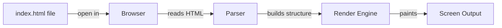

# T04: Hello World - はじめの一歩

全ての旅は一歩から始まります。Web開発では、最初のHTMLファイルを作成してブラウザで表示することがその一歩です。手紙を書いて誰かに渡すようなものです。あなたが書き、ブラウザが読み上げてくれます。 {.lesson-intro}

## 最初のWebページ

`index.html`というファイルを作成します。これはWebサイトのメインページの慣習的な名前です。ブラウザがこのファイルを読み取り、ユーザーに視覚的に表示します。

```
<!DOCTYPE html>
<html lang="en">
<head>
    <meta charset="UTF-8">
    <title>My First Page</title>
</head>
<body>
    <h1>Hello World</h1>
    <p>This is my first web page.</p>
</body>
</html>
```

## 仕組み

ファイルをダブルクリックするかブラウザにドラッグすると、ブラウザがテキストを読み取り、HTMLタグを解釈し、結果を画面に描画します。この段階ではサーバーは不要です。



## DOCTYPE宣言

`<!DOCTYPE html>`はブラウザにHTML5標準を使用するよう指示します。これがないと、ブラウザは古い互換モードで表示する場合があります。

<div class="takeaways">
<h2>まとめ</h2>
<ul>
<li>HTMLファイルは.html拡張子を持つプレーンテキストファイルです</li>
<li>ブラウザはインタプリタです。HTMLを読み取って結果を表示します</li>
<li>DOCTYPE、html、head、bodyタグを必ず含めてください</li>
<li>index.htmlはWebサイトのメインページのデフォルトファイル名です</li>
</ul>
</div>
