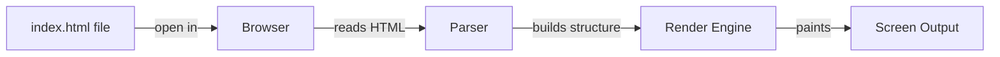

# T04: Hello World

Every journey starts with a single step. In web development, that step is creating your first HTML file and watching it come alive in a browser. Think of it like writing a letter - you write it, then hand it to someone who reads it aloud.
{: .lesson-intro }

## Your First Web Page

Create a file called `index.html`. This is the conventional name for the main page of any website. The browser reads this file and renders it visually for the user.

```
<!DOCTYPE html>
<html lang="en">
<head>
    <meta charset="UTF-8">
    <title>My First Page</title>
</head>
<body>
    <h1>Hello World</h1>
    <p>This is my first web page.</p>
</body>
</html>
```

## How It Works

When you double-click the file or drag it into your browser, the browser reads the raw text, interprets the HTML tags, and paints the result on screen. No server needed for this step.



## The DOCTYPE Declaration

The `<!DOCTYPE html>` line tells the browser to use modern HTML5 standards. Without it, the browser may fall back to older, quirky rendering modes.

<div class="takeaways">
<h2>Key Takeaways</h2>
<ul>
<li>An HTML file is just a plain text file with a .html extension</li>
<li>The browser is your interpreter - it reads HTML and displays the result</li>
<li>Always include DOCTYPE, html, head, and body tags</li>
<li>index.html is the default filename for a website's main page</li>
</ul>
</div>
